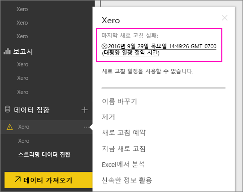
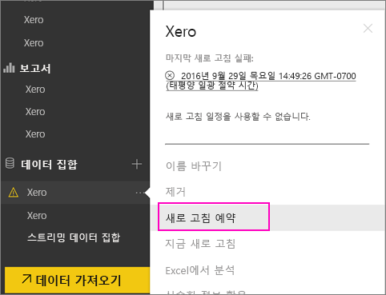
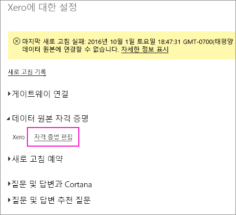
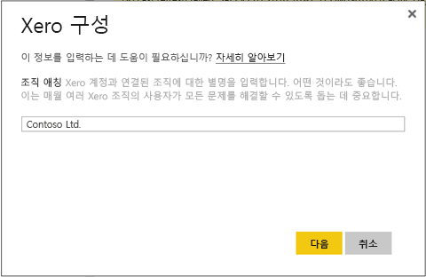
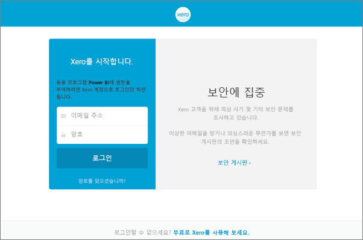
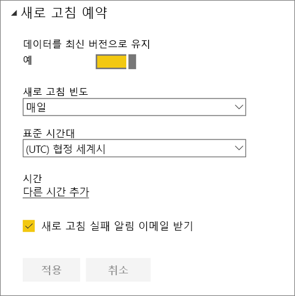
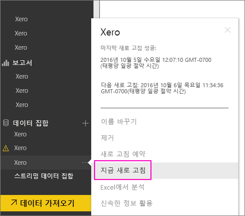

# 새로 고침에 실패한 경우 Xero 콘텐츠 팩 자격 증명을 새로 고치는 방법
Xero Power BI 콘텐츠 팩을 사용하는 경우 최근의 Power BI 서비스 인시던트로 인해 콘텐츠 팩을 매일 새로 고치면서 일부 문제가 발생했을 수 있습니다.

아래 스크린샷에서 보여 주듯이 Xero 데이터 세트의 마지막 새로 고침 상태를 확인하면 콘텐츠 팩이 성공적으로 새로 고쳐졌는지 알 수 있습니다.

위에서 보여 주듯이 새로 고침이 실패한 경우에는 아래 단계를 수행하여 콘텐츠 팩 자격 증명을 갱신합니다.

1. Xero 데이터 세트 옆의 줄임표 (...)를 클릭한 다음, **새로 고침 예약**을 클릭합니다. 그러면 Xero 콘텐츠 팩에 대한 설정 페이지가 열립니다.
   
    
2. **Xero 설정** 페이지에서 **데이터 원본 자격 증명** > **자격 증명 편집**을 선택합니다.
   
    
3. 조직 이름을 입력하고 **다음**을 클릭합니다.
   
    
4. Xero 계정으로 로그인합니다.
   
    
5. 자격 증명을 업데이트했으므로 이제는 새로 고침 일정을 매일 실행으로 설정하도록 하겠습니다. 다시 한 번 Xero 데이터 세트 옆의 줄임표 (...)를 클릭한 다음, **새로 고침 예약**을 클릭합니다.
   
    
6. 데이터 세트도 즉시 새로 고칠 수 있습니다. Xero 데이터 세트 옆의 줄임표 (...)를 클릭한 다음, **지금 새로 고침**을 클릭합니다.
   
    

새로 고침 문제가 여전히 계속되면 Power BI 지원([http://support.powerbi.com](http://support.powerbi.com))으로 문의해 주세요. 

Power BI용 Xero 콘텐츠 팩에 대한 자세한 내용은 [Xero 콘텐츠 팩 도움말 페이지](service-connect-to-xero.md)를 참조하세요.

### 다음 단계
* 궁금한 점이 더 있나요? [Power BI 커뮤니티를 이용하세요.](http://community.powerbi.com/)

