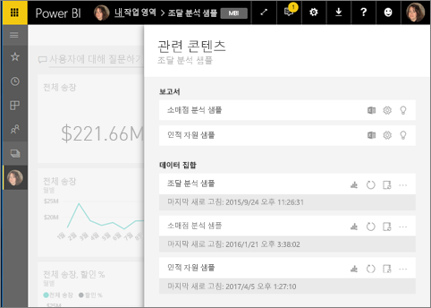
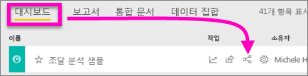
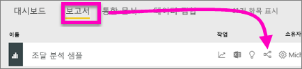
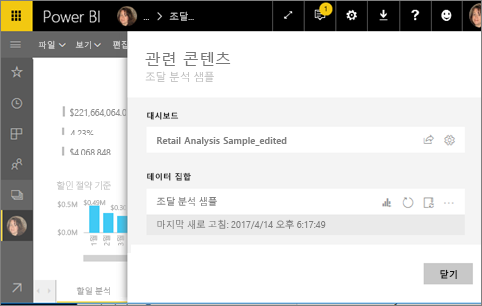
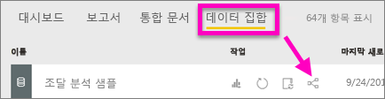
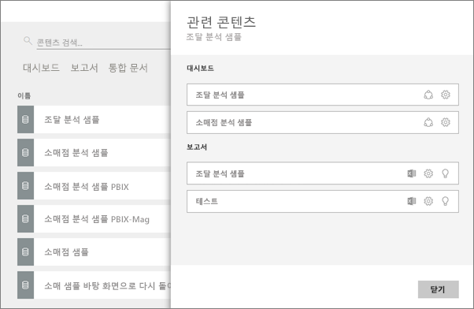

# Power BI 서비스에서 관련 콘텐츠 보기
**관련 콘텐츠** 창은 Power BI 서비스 콘텐츠(대시보드, 보고서 및 데이터 집합)가 서로 어떻게 연결되어 있는지를 보여 줍니다.  그리고 이 창에서 새로 고침, 이름 바꾸기, 정보 생성 등과 같은 일반적인 작업을 수행할 수 있도록 기능이 향상되었습니다. 관련 보고서 또는 대시보드를 선택하면 Power BI 작업 영역에서 열립니다.   

이미 확인한 것처럼 보고서는 데이터 집합을 기반으로 작성되고 보고서 시각화는 대시보드에 고정되며 대시보드 시각화는 다시 보고서로 연결됩니다. 하지만 어떤 대시보드가 마케팅 보고서에서 시각화를 호스팅하는지 어떻게 아나요? 그리고 이러한 대시보드를 어떻게 찾나요? 조달 대시보드가 둘 이상의 데이터 집합에서 시각화를 사용하나요? 그렇다면 이름을 무엇으로 지정하고 어떻게 열고 편집할 수 있나요? HR 데이터 집합이 모든 보고서 또는 대시보드에 사용되나요? 또는 링크 끊김 없이 이동할 수 있나요? 이와 같은 질문에 대한 답변은 모두 **관련 콘텐츠** 창에서 확인할 수 있습니다.  창에 관련 콘텐츠가 표시될 뿐만 아니라 콘텐츠에 대한 작업을 수행하고 관련 콘텐츠 간을 쉽게 탐색할 수 있습니다.

> [!NOTE]
> 스트리밍 데이터 집합에는 관련 콘텐츠 기능이 작동하지 않습니다.
> 
> 

## 대시보드에 대한 관련 콘텐츠 보기
보기는 대시보드에 대한 관련 콘텐츠를 봅니다. 그런 다음 비디오 아래의 단계별 지침에 따라 직접 조달 분석 샘플 데이터 집합을 사용해 봅니다.

<iframe width="560" height="315" src="https://www.youtube.com/embed/B2vd4MQrz4M#t=3m05s" frameborder="0" allowfullscreen></iframe>

**관련 콘텐츠** 창을 열려면 대시보드에 대해 *보기* 이상의 권한이 있어야 합니다. 이 예제에서는 [조달 분석 샘플](sample-procurement.md)을 사용하고 있습니다.

**방법 1**

작업 영역에서 **대시보드** 탭을 선택한 다음, **관련 항목 보기** 아이콘 을 선택합니다.

 

**방법 2**

대시보드 열기를 사용하여    선택합니다.

**관련 콘텐츠** 창이 열립니다. 대시보드에 시각화가 고정되고 관련된 데이터 집합이 있는 모든 보고서가 표시됩니다. 이 대시보드의 경우 3가지 다른 보고서에서 고정된 시각화가 있으며 해당 보고서는 3가지 다른 데이터 집합을 기반으로 합니다.

여기에서 관련 콘텐츠에 대해 직접 작업할 수 있습니다.  예를 들어 보고서 이름을 선택하여 엽니다.  나열된 보고서의 경우 [Excel에서 분석](service-analyze-in-excel.md), [이름 바꾸기](service-rename.md) 또는 [유용한 정보 얻기](service-insights.md)에 대한 아이콘을 선택합니다. 데이터 집합의 경우 [새 보고서 만들기](service-report-create-new.md), [새로 고침](refresh-data.md), 이름 바꾸기, [Excel에서 분석](service-analyze-in-excel.md), [유용한 정보 얻기](service-insights.md) 또는 데이터 집합에 대해 **설정** 창 열기에 대한 아이콘을 선택합니다.  

## 보고서에 대한 관련 콘텐츠 보기
**관련 콘텐츠** 창을 열려면 보고서에 대해 *보기* 이상의 권한이 있어야 합니다. 이 예제에서는 [조달 분석 샘플](sample-procurement.md)을 사용하고 있습니다.

**방법 1**

작업 영역에서 **보고서** 탭을 선택한 다음, **관련 항목 보기** 아이콘 을 선택합니다.

 

**방법 2**

[읽기용 보기](service-reading-view-and-editing-view.md)에서 보고서를 열고 상위 메뉴 모음에서 을 선택합니다.

**관련 콘텐츠** 창이 열립니다. 보고서에서 고정된 타일이 하나 이상 있는 관련 데이터 집합 및 모든 대시보드가 표시됩니다. 이 보고서의 경우 2개의 서로 다른 대시보드에 고정된 시각화가 있습니다.

여기에서 관련 콘텐츠에 대해 직접 작업할 수 있습니다.  예를 들어 대시보드 이름을 선택하여 엽니다.  목록에 있는 모든 대시보드의 경우 [다른 사람과 대시보드 공유](service-share-dashboards.md) 또는 대시보드에 대한 **설정** 창 열기에 대한 아이콘을 선택합니다. 데이터 집합의 경우 [새 보고서 만들기](service-report-create-new.md), [새로 고침](refresh-data.md), 이름 바꾸기, [Excel에서 분석](service-analyze-in-excel.md), [유용한 정보 얻기](service-insights.md) 또는 데이터 집합에 대해 **설정** 창 열기에 대한 아이콘을 선택합니다.  

## 데이터 집합에 대한 관련 콘텐츠 보기
**관련 콘텐츠** 창을 열려면 데이터 집합에 대해 *보기* 이상의 권한이 있어야 합니다. 이 예제에서는 [조달 분석 샘플](sample-procurement.md)을 사용하고 있습니다.

작업 영역에서 **데이터 집합** 탭을 선택한 후 **관련 항목 보기** 아이콘 을 찾습니다.

**관련 콘텐츠** 창을 여는 아이콘을 선택합니다.

여기에서 관련 콘텐츠에 대해 직접 작업할 수 있습니다.  예를 들어 대시보드 또는 보고서 이름을 선택하여 엽니다.  목록에 있는 모든 대시보드의 경우 [다른 사람과 대시보드 공유](service-share-dashboards.md) 또는 대시보드에 대한 **설정** 창 열기에 대한 아이콘을 선택합니다. 보고서의 경우 [Excel에서 분석](service-analyze-in-excel.md), [이름 바꾸기](service-rename.md) 또는 [유용한 정보 얻기](service-insights.md)에 대한 아이콘을 선택합니다.  

## 제한 사항 및 문제 해결
* 브라우저에 충분한 공간이 없는 경우 **관련 항목 보기** 옵션이 표시되지 않지만 관련 항목 보기 아이콘 은 계속 표시됩니다. **관련 콘텐츠** 창을 여는 아이콘을 선택합니다.
* 보고서에 대한 관련 콘텐츠를 열려면 [읽기용 보기](service-reading-view-and-editing-view.md)여야 합니다.
* 관련 콘텐츠는 Power BI Desktop에서 사용할 수 없습니다.
* 스트리밍 데이터 집합에는 관련 콘텐츠 기능이 작동하지 않습니다.

## 다음 단계
* [Power BI 서비스 시작](service-get-started.md)
* 궁금한 점이 더 있나요? [Power BI 커뮤니티를 이용하세요.](http://community.powerbi.com/)

