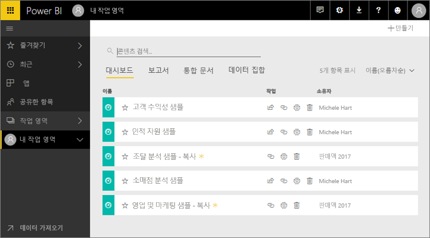
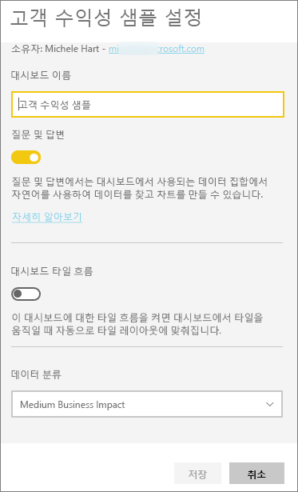
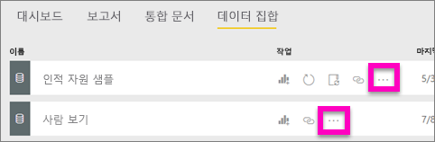
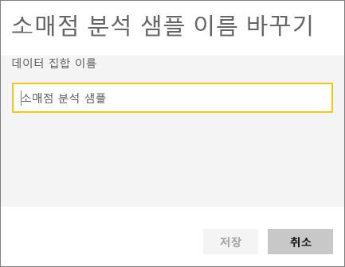
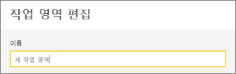

# Power BI 서비스에서 거의 모든 항목의 이름 바꾸기
이 문서에서는 Power BI 서비스에서 대시보드, 보고서, 보고서 페이지, 통합 문서, 데이터 집합, 앱 및 작업 영역의 이름을 변경하는 방법을 안내합니다.

**이름을 변경할 수 있습니까?**

| 콘텐츠 유형 | 본인이 작성자 또는 생성자임 | 공유한 항목 |
| --- | --- | --- |
| 작업 영역의 대시보드 |예 |아니요 |
| 작업 영역의 보고서 |예 |아니요 |
| 작업 영역의 통합 문서 |예 |아니요 |
| 작업 영역의 데이터 집합 |예 |아니요 |
| 앱 작업 영역 |예, 본인에게 소유자 또는 관리자 권한이 있는 경우 |아니요 |
| 게시된 앱 |관리자 권한이 있으면 앱 화면이 아니라 앱 작업 영역에서 앱 이름을 변경하고 다시 새 이름으로 게시할 수 있습니다. |아니요 |
| 앱 콘텐츠(대시보드, 보고서, 통합 문서, 데이터 집합) |관리자 권한이 있으면 앱 화면이 아니라 앱 작업 영역에서 앱 콘텐츠 이름을 변경하고 다시 새 이름으로 게시할 수 있습니다. |아니요 |
| **공유한 항목**의 콘텐츠 |아니요 |아니요 |

## 대시보드, 보고서 또는 통합 문서 이름 바꾸기
1. 작업 영역에서 시작하고 **대시보드**, **보고서** 또는 **통합 문서** 탭을 선택합니다. 이름을 변경할 항목 위에 마우스를 가져가고 기어 아이콘 을 선택합니다. 기어 아이콘이 없을 경우 이름을 변경할 권한이 없는 것입니다.
   
   
2. 설정 페이지에서 새 이름을 입력하고 **저장**을 선택합니다.
   
   

## 데이터 집합 이름 바꾸기
1. 작업 영역에서 시작하고 **데이터 집합** 탭을 선택합니다.
   
   
2. 이름을 변경할 항목 위로 마우스를 가져가고 말줄임표(...)를 선택한 다음 **이름 바꾸기**를 선택합니다.  
   
      
   
   > [!NOTE]
   > 드롭다운의 옵션은 다를 수 있습니다.
   > 
   > 
3. 설정 페이지에서 새 이름을 입력하고 **저장**을 선택합니다.
   
     

## 앱 작업 영역 이름 바꾸기
관리자 권한이 있는 모든 사용자는 앱 작업 영역 이름을 변경할 수 있습니다.

1. 이름을 변경할 작업 영역에서 시작합니다.
2. 오른쪽 위의 모서리에서 줄임표(...)를 선택하고 **작업 영역 편집**을 선택합니다. 이 옵션이 보이지 않을 경우 이 작업 영역에 대한 이름 변경 권한이 없는 것입니다. 
   
    
3. 새 작업 영역 이름을 입력하고 **저장**을 선택합니다.
   
   

## 보고서의 페이지 이름 바꾸기
Power BI 보고서에 페이지의 이름이 마음에 들지 않나요?  한 번의 클릭으로 새 이름을 지정할 수 있습니다. 페이지의 이름은 [보고서 편집용 보기 ](service-interact-with-a-report-in-editing-view.md)에서 변경할 수 있습니다.

1. [편집용 보기](consumer/end-user-reading-view.md)에서 보고서를 엽니다.
2. Power BI 창의 아래쪽에 있는 보고서 페이지 탭을 찾습니다.
   
    
3. 탭을 선택하여 이름을 바꿀 보고서 페이지를 엽니다.
4. 탭에서 이름을 두 번 클릭하여 강조 표시합니다.  
   
    
5. 새 보고서 페이지 이름을 입력하고 Enter 키를 선택합니다.
   
    

## 고려 사항 및 문제 해결
* 이름을 변경할 항목이 나와 공유되었거나 콘텐츠 팩의 일부인 경우 기어 아이콘이 표시되지 않으며 설정에 액세스할 수 없습니다.
* **데이터 집합** 탭에 말줄임표(...)가 없으면 브라우저 창을 확장합니다.

궁금한 점이 더 있나요? [Power BI 커뮤니티를 이용하세요.](http://community.powerbi.com/)

