# 데이터 집합을 가져와 Power BI 서비스에서 새 보고서 만들기
지금까지 [Power BI의 보고서](consumer/end-user-reports.md)에 대해 살펴보았으며 이제 직접 만들려고 합니다. 아주 다양한 방법으로 보고서를 만들 수 있으며 이 문서에서는 Power BI 서비스를 사용하여 Excel 데이터 집합에서 매우 기본적인 보고서를 만드는 것으로 시작하겠습니다. 보고서를 만들기 위한 기본 사항을 이해하고 나면 맨 아래의 **다음 단계**가 더 높은 수준의 보고서 항목으로 안내합니다.  

> **팁**: 기존 보고서를 복사하여 보고서를 만들려면 [보고서 복사](power-bi-report-copy.md)를 참조하세요.
> 
> ### 필수 조건
> - Power BI Desktop을 사용하여 보고서를 만들기 위한 Power BI 서비스는 [Desktop 보고서 보기](desktop-report-view.md)를 참조하세요.  
> - 소매점 분석 샘플 데이터 집합

## 데이터 집합 가져오기
이 방법에서는 데이터 집합과 빈 보고서 캔버스를 사용하여 보고서 만들기를 시작합니다. 과정을 따라 하려면 [소매점 분석 샘플 정보 Excel 데이터 집합](http://go.microsoft.com/fwlink/?LinkId=529778)을 다운로드하여 비즈니스용 OneDrive(기본) 또는 로컬에 저장합니다.

1. Power BI 서비스 작업 영역에서 보고서를 만들 것이므로 기존 작업 영역을 선택하거나 새 작업 영역을 만듭니다.
   
   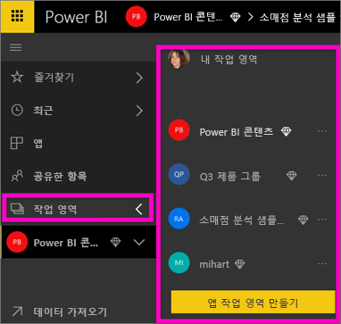
2. 왼쪽 탐색 창의 맨 아래에서 **데이터 가져오기**를 선택합니다.
   
   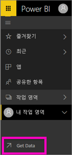
3. **파일**을 선택하고 소매점 분석 샘플을 저장한 위치로 이동합니다.
   
    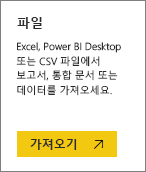
4. 이 연습에서는 **가져오기**를 선택합니다.
   
   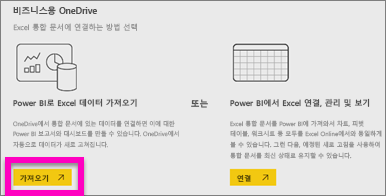
5. 데이터 집합을 가져온 후 선택 **데이터 집합 보기**를 선택합니다.
   
   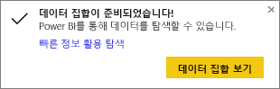
6. 데이터 집합을 볼 때는 실제로 보고서 편집기가 열립니다.  빈 캔버스 및 보고서 편집 도구를 볼 수 있습니다.
   
   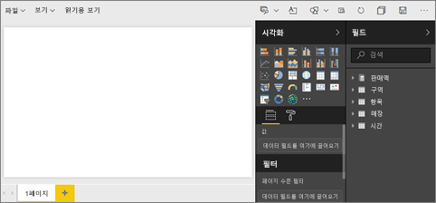

> **팁**: 보고서 편집 캔버스에 익숙하지 않거나 알고 있는 내용을 확인하려면 계속하기 전에 [보고서 편집기 둘러보기](service-the-report-editor-take-a-tour.md)를 확인하세요.
> 
> 

## 보고서에 방사형 계기 추가
이제 데이터 집합을 가져왔으므로 몇 가지 질문에 답해 보겠습니다.  우리의 CMO(최고 마케팅 책임자)는 올해의 영엽 목표를 얼마나 달성했는지 알고 싶어 합니다. 계기는 이런 정보 유형을 표시하기에 [좋은 시각화 선택](visuals/power-bi-report-visualizations.md)입니다.

1. 필드 창에서 **판매액** > **올해 판매액** > **값**을 선택합니다.
   
    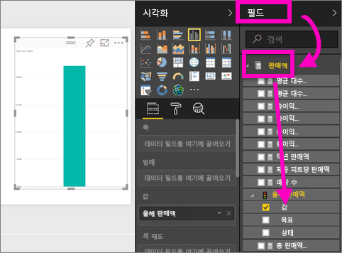
2. **시각화** 창에서 계기 템플릿 을 선택하여 계기에 대한 시각적 개체를 변환합니다.
   
    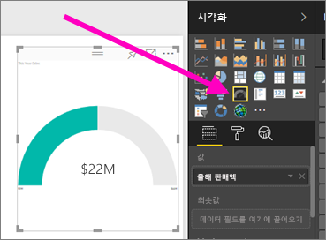
3. **판매액** > **올해 판매액** > **목표**를 **대상 값**으로 끌어서 놓습니다. 목표에 매우 근접해 보입니다.
   
    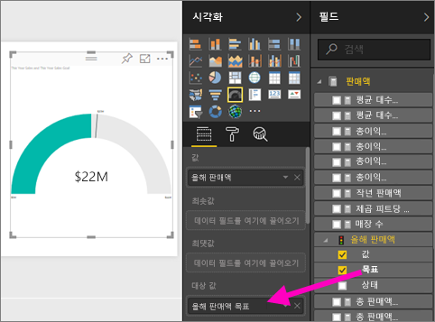
4. 이제 [보고서를 저장](service-report-save.md)할 시점입니다.
   
   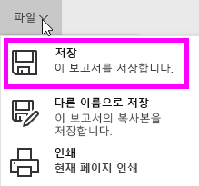

## 보고서에 영역형 차트 및 슬라이서 추가
CMO에게는 몇 가지 추가적인 질문이 있습니다. 올해 영업이 지난 해에 비해 어떤지 알고 싶어합니다. 또한 구역별로 결과를 알고 싶어합니다.

1. 먼저 캔버스에 공간을 만들어 보겠습니다. 계기를 선택하고 오른쪽 위 모서리로 이동합니다. 그런 다음 모서리 중 한 곳을 잡고 끌어 작게 만듭니다.
2. 계기를 선택 취소합니다. 필드 창에서 **판매액** > **올해 판매액** > **값**을 선택하고 **판매액** > **작년 판매액**을 선택합니다.
   
    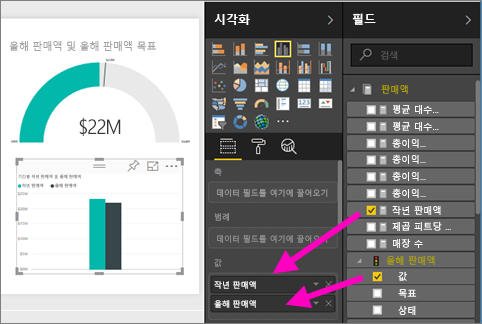
3. **시각화** 창에서 영역 차트 템플릿 을 선택하여 시각적 개체를 영역 차트로 변환합니다.
4. **시간** > **기간**을 선택하여 **축** 웰에 추가합니다.
   
    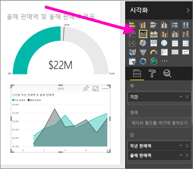
5. 시각화를 기간별로 정렬하려면 줄임표를 선택하고 **기간별 정렬**을 선택합니다.
6. 이제 슬라이서를 추가해 보겠습니다. 캔버스의 빈 영역을 선택하고 슬라이서     템플릿을 선택합니다. 그러면 빈 슬라이서가 캔버스에 추가됩니다.
   
        
7. 필드 창에서 **구역** > **구역**을 선택합니다. 슬라이서를 이동하고 크기를 조정합니다.
   
    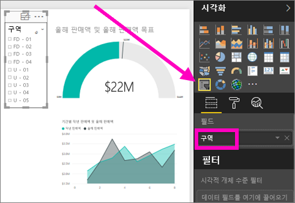  
8. 슬라이서를 사용하여 구역별 패턴과 정보를 파악합니다.
   
     

데이터를 계속 살펴보면서 시각화를 추가합니다. 특히 관심 있는 정보를 찾으면 [대시보드에 고정합니다](service-dashboard-pin-tile-from-report.md).

## 다음 단계
* [보고서에 새 페이지 추가](power-bi-report-add-page.md)  
* [시각화를 대시보드에 고정](service-dashboard-pin-tile-from-report.md)하는 방법 알아보기   
* 궁금한 점이 더 있나요? [Power BI 커뮤니티를 이용하세요.](http://community.powerbi.com/)

