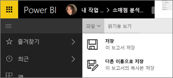
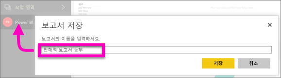

# Power BI 서비스 및 Power BI Desktop에서 보고서 저장
Power BI에서 보고서를 변경한 후에 저장하거나 새 이름으로 저장하거나 변경 내용을 저장하지 않고 닫을 수 있습니다. 보고서를 열고 시각화를 만들며 대시보드에 고정하는 경우를 가정해 보겠습니다. 변경 내용을 저장하지 않고 닫으면 타일은 대시보드에 유지되지만 시각화는 보고서에 저장되지 않습니다. 대시보드에서 해당 타일을 클릭하면 보고서가 열리지만 시각화는 보고서에 존재하지 않습니다.

> [!TIP]
> 저장된 보고서를 찾을 수 있게 어떤 작업 영역이 활성화되었는지 주의를 기울입니다. 보고서는 활성 상태인 작업 영역에 저장됩니다.
> 
> 

### 보고서를 저장하려면
1. 보고서에서 벗어나서 탐색하고 보고서의 내용을 변경하려면 Power BI에서는 메시지를 표시합니다.
   
   
2. 보고서를 저장하는 다른 방법은 **파일** \> **저장** 또는 **다른 이름으로 저장**을 선택하는 것입니다. [읽기용 보기](consumer/end-user-reading-view.md)에 있는 경우 다른 이름으로 저장하는 옵션만 표시됩니다. 
   
   
3. 새 보고서(저장)이거나 기존 보고서의 새 버전(다른 이름으로 저장)인 경우 설명적인 이름을 지정합니다.  **보고서는 활성 상태인 작업 영역에 추가됩니다.**
   
    

### 다음 단계
[Power BI의 보고서](consumer/end-user-reports.md)에 대해 자세히 알아보기

[Power BI 서비스의 디자이너를 위한 기본 개념](service-basic-concepts.md)

궁금한 점이 더 있나요? [Power BI 커뮤니티를 이용하세요.](https://community.powerbi.com/)

