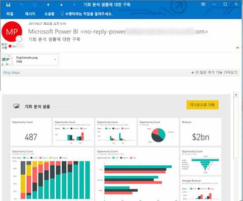
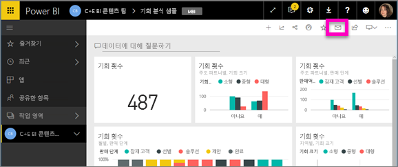
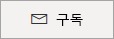
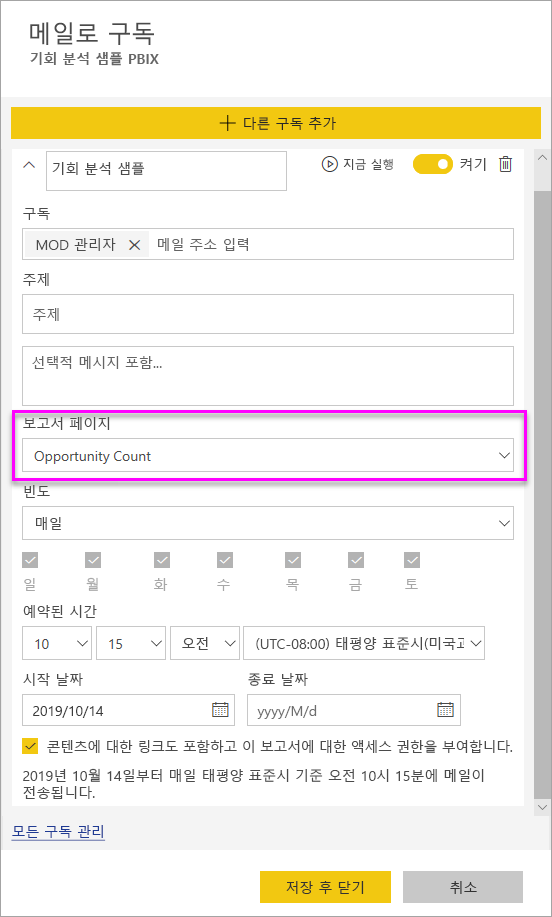
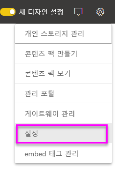
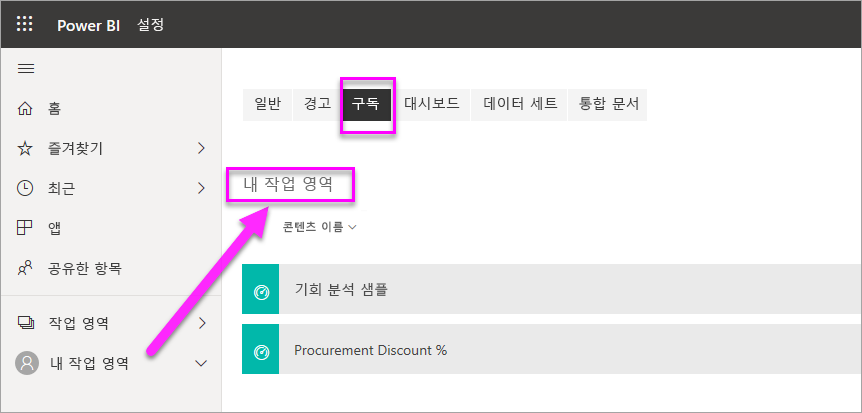

# Power BI 서비스의 보고서 또는 대시보드에 자신과 다른 사용자 구독

자신과 동료가 가장 중요한 보고서 페이지와 대시보드를 구독할 수 있으며 Power BI에서는 스냅숏을 이메일로 받은 편지함에 보냅니다. Power BI에게 이메일 수신 빈도를 매일, 매주 또는 데이터 새로 고침 후 하루에 한 번 알려줍니다.  매일 또는 매주를 선택하면 구독을 실행할 시간을 선택할 수 있습니다.  모든 보고서 페이지 및 대시보드에 대해 하루 최대 24개의 서로 다른 구독을 설정할 수 있습니다.

 

Power BI 서비스에만 구독을 만들 수 있습니다. 보고서 페이지 또는 대시보드의 스냅숏가 함께 보고서 또는 대시보드를 여는 링크가 포함된 이메일을 받습니다. Power BI 앱이 설치된 모바일 디바이스에서 이 링크를 선택하면 Power BI 웹 사이트에서 보고서 또는 대시보드를 여는 대신 Power BI 앱을 시작합니다.

## 요구 사항
- 구독 **만들기**는 Power BI Pro의 기능입니다.
- 직접 구독을 만들려면 콘텐츠(대시보드 또는 보고서)에 대한 편집 권한이 필요하지 않지만 다른 사용자를 위해 구독 권한을 만들려면 편집 권한이 있어야 합니다. 
- 2019년 1월부터 구독을 실행하기 위해 데이터 세트 새로 고침을 더 이상 설정하지 않아도 됩니다.  설정한 모든 예약된 새로 고침과 상관없이 실행됩니다.  

## 대시보드 또는 보고서에 대한 구독 페이지
대시보드 또는 보고서 구독 여부와 관계없이 프로세스는 유사합니다. 동일한 단추를 사용하면 Power BI 서비스 대시보드 및 보고서를 구독할 수 있습니다.
 
.

1. 대시보드 또는 보고서를 엽니다.
2. 상단의 메뉴 모음에서 **구독**을 선택하거나 봉투 아이콘 을 선택합니다.
   
   

3. 노란색 슬라이더를 사용하여 구독을 설정하거나 해제합니다.  슬라이더를 **Off**로 설정해도 구독이 삭제되지 않습니다. 구독을 삭제하려면 휴지통 아이콘을 선택합니다.

4. 이메일은 이미 **구독** 상자에 있습니다. 다른 이메일 주소도 구독에 추가할 수 있지만 동일한 도메인에서만 추가할 수 있습니다. 보고서 또는 대시보드가 [프리미엄 용량](service-premium.md)에서 호스트되는 경우 다른 개별 이메일 주소와 그룹 별칭을 구독할 수 있습니다. 보고서 또는 대시보드가 프리미엄 용량으로 호스트되지 않는 경우 다른 개인이 구독할 수 있지만 마찬가지로 Power BI Pro 라이선스를 가지고 있어야 합니다. 자세한 내용은 아래 [고려 사항 및 문제 해결](#considerations-and-troubleshooting)을 참조하세요. 

5. 이메일 **제목** 및 **메시지** 세부 정보를 입력합니다. 

5. 구독에 대해 **빈도**를 선택합니다. **매일**, **매주** 또는 **데이터 새로 고침 후**. 특정 요일에만 구독 이메일을 받으려면 **매주**를 선택하고 받을 요일을 선택합니다. 예를 들어 평일에만 구독 이메일을 받으려면 **매주**를 선택하고 **토요일** 및 **일요일**의 확인란을 선택 취소합니다.  

6. **매일** 또는 **매주**를 선택한 경우 구독에 대해 **예약 시간**도 선택할 수 있습니다.  매시간 또는 15분, 30분, 45분 전에 실행해야 합니다.  오전(AM) 또는 오후/저녁(PM)을 선택합니다. 표준 시간대를 지정할 수도 있습니다.

7. 기본적으로 구독 시작 날짜는 구독을 만든 날짜입니다. 종료 날짜를 선택할 수 있는 옵션이 있습니다. 종료 날짜를 설정하지 않으면 종료 날짜는 자동으로 시작 날짜로부터 1년 후가 됩니다. 구독이 종료되기 전에 언제든지 미래의 날짜(9999년까지)로 변경할 수 있습니다. 구독이 종료 날짜에 도달하면 다시 활성화될 때까지 중지됩니다. 예정된 종료일 전에 확장 여부를 묻는 알림을 받게 됩니다.    

    아래 스크린샷에서 보고서를 구독할 때 실제 보고서 *페이지*를 구독하는 것을 의미합니다.  보고서에서 여러 페이지를 구독하려면 **다른 구독 추가**를 선택하고, 다른 페이지를 선택합니다. 
      
     

7. **저장 후 닫기**를 선택합니다. 구독한 사용자는 선택한 빈도와 시간에 대한 대시보드 또는 보고서 페이지의 이메일과 스냅숏을 수신합니다. 전체적으로 보고서 또는 대시보드당 최대 24개의 구독을 만들 수 있으며, 각 구독마다 고유한 수신자, 시간 및 빈도를 제공할 수 있습니다. 대시보드 또는 보고서에 대해 **데이터 새로 고침 후**로 설정된 모든 구독은 첫 번째 예약된 새로 고침 후에도 계속 이메일만 보냅니다. 
      
   > [!TIP]
   > 언제든지 즉시 구독 또는 주문형으로 이메일을 보내시겠습니까? 보낼 대시보드 또는 보고서의 구독에 대해 **지금 실행**을 선택합니다. 해당 특정 구독에 대한 모든 사용자에게 이메일이 전송된다는 알림이 표시됩니다.  원하는 만큼 이 작업을 자주 수행할 수 있습니다. 보고서 또는 대시보드당 하루 24회 예약된 구독 실행의 제한에 포함되지 않습니다. 이는 기본 데이터 세트의 데이터 새로 고침을 트리거하지 않습니다. 
   > 
   > 
   
## 이메일 언어

이메일 및 스냅숏은 Power BI 설정에 설정된 언어를 사용합니다([Power BI에 지원되는 언어 및 국가/지역](supported-languages-countries-regions.md) 참조). 언어가 정의되지 않은 경우 Power BI는 현재 브라우저의 로캘 설정에 따른 언어를 사용합니다. 언어 기본 설정을 보거나 설정하려면 기어 아이콘  > **설정 > 일반 > 언어**를 선택합니다. 

## 구독 관리
구독을 만든 사용자만이 해당 구독을 관리할 수 있습니다.  구독 관리를 위한 화면에는 두 가지 경로가 있습니다.  첫 번째는 **이메일 구독** 대화 상자에서 **모든 구독 관리**를 선택하는 것입니다(위에서 4단계의 스크린샷 참조). 두 번째는 맨 위 메뉴 모음에서 Power BI 톱니바퀴 아이콘 을 선택하고 **설정**을 선택하는 것입니다.

표시되는 특정 구독은 현재 어떤 작업 영역이 활성화되었는가에 따라 달라집니다.  모든 작업 영역에 대해 모든 구독을 한 번에 보려면 **내 작업 영역**이 활성화되어 있는지 확인합니다. 작업 영역에 관한 도움말은 [Power BI의 작업 영역](service-create-workspaces.md)을 참조하세요.

Pro 라이선스가 만료되거나 소유자가 대시보드 또는 보고서를 삭제하거나 구독을 만드는 데 사용된 사용자 계정이 삭제되면 구독이 종료됩니다.

## 고려 사항 및 문제 해결
* 25개가 넘는 고정된 타일 또는 4개의 고정된 라이브 보고서 페이지가 있는 대시보드는 사용자에게 전송된 구독 이메일에 완벽하게 렌더링되지 않을 수 있습니다.  하지만 이러한 수의 타일을 통한 대시보드 구독은 차단되지 않지만 문제가 발생하면 지원되지 않는 것으로 간주되므로 지원되는 범주 내에서 적절하게 수정해야 합니다.
* 대시보드 이메일 구독의 경우 타일에 RLS(행 수준 보안)가 적용되면 해당 타일은 표시되지 않습니다.  보고서 이메일 구독의 경우 데이터 세트가 RLS를 사용하면 구독을 만들 수 없습니다.
* 보고서 페이지 구독은 보고서 페이지의 이름과 연결됩니다. 보고서 페이지를 구독한 다음, 이름을 바꾸면 구독을 다시 만들어야 합니다.
* 조직은 Power BI에서 메일 구독을 사용하는 기능을 제한하는 Azure Active Directory에서 특정 설정을 구성할 수 있습니다.  이러한 제한 사항에는 리소스에 액세스할 때 다단계 인증 또는 IP 범위 제한 사항이 포함되지만 이에 국한되지는 않습니다.
* 현재 라이브 연결 데이터 세트를 사용하는 보고서/대시 보드의 이메일 구독은 자신 이외의 사용자를 구독하는 경우 지원되지 않습니다.
* 이메일 구독은 대부분의 [사용자 지정 시각적 개체](power-bi-custom-visuals.md)를 지원하지 않습니다.  한 가지 예외는 [인증](power-bi-custom-visuals-certified.md)된 사용자 지정 시각적 개체입니다.  
* 이메일 구독은 현재 R 지원 사용자 지정 시각적 개체를 지원하지 않습니다.  
* 대시보드 타일에 RLS(행 수준 보안)가 적용되면 해당 타일은 표시되지 않습니다.
* RLS(행 수준 보안)이 적용되는 보고서에 대한 다른 사용자를 구독할 수 없습니다.
* 전자 메일 구독은 보고서의 기본 필터 및 슬라이서 상태와 함께 보내집니다. 구독한 후에 수행된 기본값에 대한 변경 내용은 이메일에 표시되지 않습니다.    
* 특히 대시보드 구독의 경우, 특정 유형의 타일은 아직 지원되지 않습니다.  여기에는 타일, 비디오 타일, 사용자 지정 웹 콘텐츠 타일의 스트리밍이 포함됩니다.     
* 테넌트 외부의 동료와 대시보드를 공유하는 경우 해당 동료를 위해 구독을 만들 수 없습니다. 따라서 사용자가 aaron@xyz.com인 경우 anyone@ABC.com과 공유할 수 있지만 아직 anyone@ABC.com을 구독할 수 없고 공유 콘텐츠를 구독할 수 없습니다.      
* 전자 메일 크기 제한으로 인해 매우 큰 이미지가 있는 대시보드 또는 보고서의 구독은 실패할 수 있습니다.    
* Power BI는 2개월 넘게 방문하지 않은 대시보드 및 보고서와 연결된 데이터 세트에서 자동으로 새로 고침을 일시 중지합니다.  그러나 대시보드 또는 보고서에 구독을 추가하면 방문하지 않았더라도 일시 중지되지 않습니다.    
* 구독 이메일을 받지 못하면 UPN(사용자 계정 이름)이 이메일을 받을 수 있는지 확인합니다. [Power BI 팀이 이 요구 사항을 완화하기 위해 노력하고 있으므로](https://community.powerbi.com/t5/Issues/No-Mail-from-Cloud-Service/idc-p/205918#M10163) 조정된 상태로 유지해 주세요. 
* 대시보드 또는 보고서가 프리미엄 용량인 경우 동료를 한 번에 하나의 메일 주소로 구독하는 대신 구독에 그룹 메일 별칭을 사용할 수 있습니다. 별칭은 현재 활성 디렉터리를 기반으로 합니다. 

## 다음 단계
* 궁금한 점이 더 있나요? [Power BI 커뮤니티에 질문합니다.](http://community.powerbi.com/)    
* [블로그 게시물 읽기](https://powerbi.microsoft.com/blog/introducing-dashboard-email-subscriptions-a-360-degree-view-of-your-business-in-your-inbox-every-day/)

