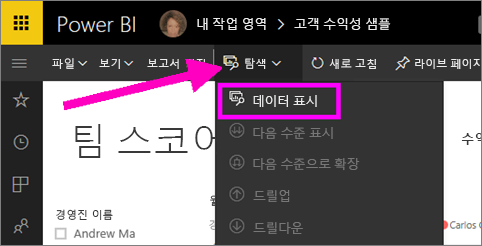
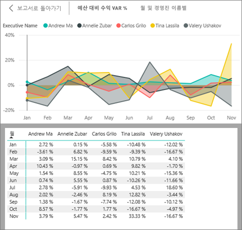
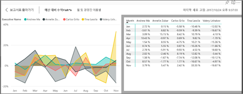
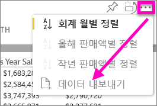

# 시각화를 생성하는 데 사용 된 데이터 표시
## 데이터 표시
Power BI 시각화는 데이터 집합에서 데이터를 사용하여 구성됩니다. 숨은 기능에 관심이 있는 경우 Power BI를 사용하면 시각적 개체를 만드는 데 사용되는 데이터를 *표시*할 수 있습니다. **데이터 표시**를 선택하면 Power BI는 시각화 아래(또는 옆에) 데이터를 표시합니다.

시각화를 만드는 데 사용되는 데이터를 .xlsx 또는 .csv 파일로 내보내고 Excel에서 볼 수도 있습니다. 자세한 내용은 [Power BI 시각화에서 데이터 내보내기](power-bi-visualization-export-data.md)를 참조하세요.

> [!NOTE]
> *데이터 표시* 및 *데이터 내보내기*는 모두 Power BI 서비스 및 Power BI Desktop에서 사용할 수 있습니다. Power BI Desktop은 하나의 추가 세부 정보 계층을 제공합니다. [*레코드 표시*는 데이터 집합에서 실제 행을 표시합니다](desktop-see-data-see-records.md).
> 
> 

## Power BI 서비스에서 *데이터 표시* 사용
1. Power BI 서비스에서 [읽기용 보기 또는 편집용 보기](service-reading-view-and-editing-view.md)로 보고서를 열고 시각적 개체를 선택합니다.  Power BI Desktop에서 보고서 뷰를 엽니다.
2. 시각적 개체 뒤의 데이터를 표시하려면 **탐색** > **데이터 표시**를 선택합니다.
   
   
3. 기본적으로 데이터는 시각적 개체 아래에 표시됩니다.
   
   
4. 방향을 변경하려면 시각화의 오른쪽 맨 위 모서리에서 세로 레이아웃 을 선택합니다.
   
   
5. 데이터를 .csv 파일로 내보내려면 줄임표를 선택하고 **데이터 내보내기**를 선택합니다.
   
    
   
    데이터를 Excel로 내보내기에 대한 자세한 내용은 [Power BI 시각화에서 데이터 내보내기](power-bi-visualization-export-data.md)를 참조하세요.
6. 데이터를 숨기려면 **탐색** > **데이터 표시**를 선택 취소합니다.

### 다음 단계
[Power BI 시각화에서 데이터 내보내기](power-bi-visualization-export-data.md)    
[Power BI 보고서의 시각화](power-bi-report-visualizations.md)    
[Power BI 보고서](service-reports.md)    
[Power BI - 기본 개념](service-basic-concepts.md)    
궁금한 점이 더 있나요? [Power BI 커뮤니티를 이용하세요.](http://community.powerbi.com/)

