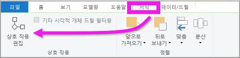
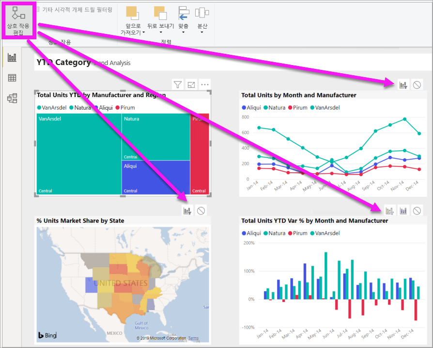
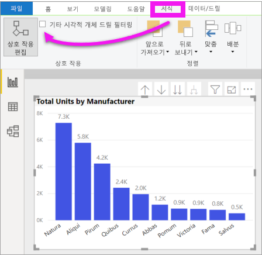

# Power BI 보고서에서 시각적 개체가 조작되는 방식 변경
보고서에 대한 편집 권한이 있는 경우 **시각적 상호 작용**을 사용하여 보고서 페이지의 시각화들이 서로 영향을 주는 방식을 변경할 수 있습니다. 

## 시각적 개체 상호 작용 소개
기본적으로 보고서 페이지의 시각화는 페이지에서 다른 시각화를 교차 필터링 및 교차 강조 표시하는 데 사용할 수 있습니다.
예를 들어 지도 시각화에서 시/도를 선택하면 세로 막대형 차트가 강조 표시되고 해당 시/도에 적용되는 데이터만 표시하도록 꺾은선형 차트가 필터링됩니다.
[필터링 및 강조 표시 정보](power-bi-reports-filters-and-highlighting.md)를 참조하세요. 또한 [드릴링](consumer/end-user-drill.md)을 지원하는 시각화가 있는 경우 기본적으로 하나의 시각화 드릴링이 보고서 페이지의 다른 시각화에 영향을 주지 않습니다. 그러나 이러한 기본 동작 모두를 재정의하고 상호 작용을 시각화 단위로 설정할 수 있습니다.

이 문서에서는 Power BI Desktop에서 **시각적 개체 상호 작용**을 사용하는 방법을 보여줍니다. 이 프로세스는 Power BI 서비스 [편집용 보기](service-interact-with-a-report-in-editing-view.md)에서 동일합니다. 읽기용 보기 액세스만 있거나 보고서를 공유하는 경우에는 시각적 개체 상호 작용 설정을 변경할 수 없습니다.

*교차 필터* 및 *교차 강조 표시*는 여기서 설명하는 동작을 **필터** 창에서 시각화를 *필터링*하고 *강조 표시*할 때 나타나는 결과와 구분하는 데 사용합니다.  

> [!NOTE]
> 이 비디오에서는 이전 버전의 Power BI Desktop 및 Power BI 서비스를 사용합니다. 
>
>

<iframe width="560" height="315" src="https://www.youtube.com/embed/N_xYsCbyHPw?list=PL1N57mwBHtN0JFoKSR0n-tBkUJHeMP2cP" frameborder="0" allowfullscreen></iframe>

## 시각적 개체 상호 작용 컨트롤 사용
보고서에 대한 편집 권한이 있는 경우 시각적 개체 상호 작용 컨트롤을 켜고 보고서 페이지의 시각화가 서로 필터링하고 강조 표시하는 방법을 사용자 지정할 수 있습니다. 

1. 시각화를 선택하여 활성화합니다.  
2. **시각적 상호 작용** 옵션을 표시합니다.
    

    - Power BI Desktop 에서 **서식 > 상호 작용 편집** 을 선택합니다.

        

    - Power BI 서비스의 편집용 보기에서 보고서를 열고 보고서 메뉴 모음에서 드롭다운을 선택합니다.

        

3. 시각화 상호 작용 컨트롤을 표시하려면 **상호 작용 편집**을 선택합니다. Power BI는 보고서 페이지의 다른 모든 시각화에 필터 및 강조 표시 아이콘을 추가합니다. 이제 선택한 시각화가 보고서 페이지의 다른 시각화와 상호 작용하는 방식을 변경할 수 있습니다.
   
    

## 상호 작용 동작 변경
보고서 페이지에서 한 번에 하나씩 시각화를 선택하여 시각화가 상호 작용하는 방법에 대해 알아봅니다.  데이터 요소 또는 막대나 셰이프를 선택하고 다른 시각화에 미치는 영향을 확인합니다. 표시되는 동작이 원하는 결과가 아닌 경우 상호 작용을 변경할 수 있습니다. 이러한 변경 내용은 보고서와 함께 저장되므로 보고서 작성자와 보고서 소비자는 동일한 시각적 상호 작용 환경을 갖습니다.

**선택한 시각화**가 서로 간에 어떤 영향을 미쳐야 하는지 확인합니다.  그리고 필요에 따라 보고서 페이지의 다른 모든 시각화에 대해 이 작업을 반복합니다.
   
   * 시각화를 교차 필터링해야 하는 경우 **필터** 아이콘 을 선택합니다.
   * 시각화를 교차 강조 표시해야 하는 경우 **강조 표시** 아이콘 을 선택합니다.
   * 영향을 미치지 않아야 할 경우 **없음** 아이콘 을 선택합니다.

## 드릴 가능한 시각화의 상호 작용 변경
[일부 Power BI 시각화는 드릴이 가능](consumer/end-user-drill.md)합니다. 기본적으로 시각화를 드릴하면 보고서 페이지의 다른 시각화 요소에는 영향을 주지 않습니다. 그러나 이 동작을 변경할 수 있습니다. 

1. 드릴 가능한 시각적 개체를 선택하여 활성화합니다. 

> [!TIP]
> [인적 자원 샘플 PBIX 파일](https://download.microsoft.com/download/6/9/5/69503155-05A5-483E-829A-F7B5F3DD5D27/Human%20Resources%20Sample%20PBIX.pbix)을 사용하여 직접 시도해 보세요. **새 채용** 탭에 드릴다운을 포함하는 세로 막대형 차트가 있습니다.
>

2. 메뉴 모음에서 **서식** > **기타 시각적 개체 드릴 필터링**을 선택합니다.  이제 시각화에서 드릴다운(및 드릴업)하면 보고서 페이지의 다른 시각화가 현재 드릴링 선택을 반영하도록 변경됩니다. 

    .
    
## 다음 단계
[Power BI 보고서의 필터링 및 강조 표시](power-bi-reports-filters-and-highlighting.md)
