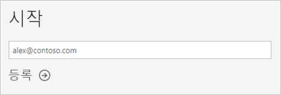
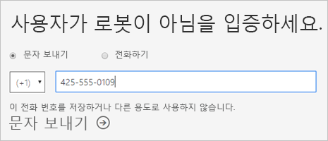
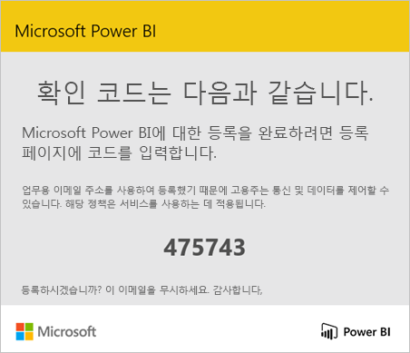
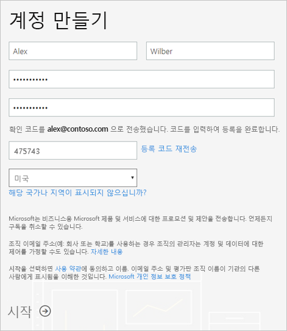
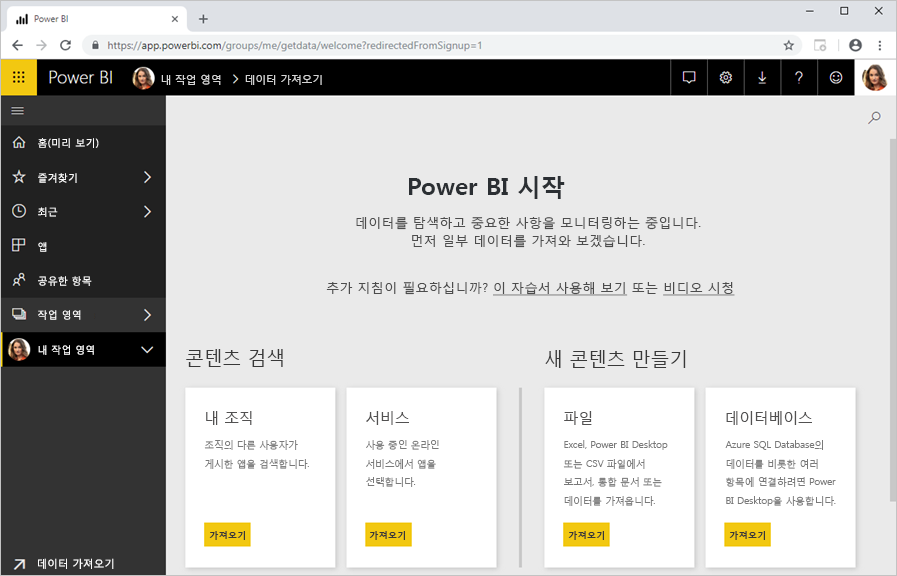

# Power BI에 개별 등록

Power BI는 개인 보고서 및 시각화 도구일 수 있으며, 그룹 프로젝트, 사업부 또는 회사 전체의 분석 및 의사 결정 엔진으로의 역할도 담당할 수 있습니다. 이 문서에서는 개별으로 Power BI Pro 평가판에 등록 하는 방법에 설명 합니다. Power BI 관리자 인 경우 참조 [조직에서 Power BI 라이선스](service-admin-licensing-organization.md)합니다.

## 지원되는 이메일 주소

등록 프로세스를 시작 하기 전에 반드시 어떤 형식의 Power BI에서 사용할 수 있는 전자 메일 주소에 알아봅니다.

* Power BI는 등록할 회사 또는 학교 이메일 주소가 필요합니다. 소비자 메일 서비스나 전자 통신 공급자가 제공 하는 전자 메일 주소를 사용 하 여 서명할 수 없습니다. Outlook.com, hotmail.com, gmail.com 등이 포함 됩니다.

* 등록한 후에는 [게스트 사용자를 초대](https://docs.microsoft.com/azure/active-directory/active-directory-b2b-what-is-azure-ad-b2b)하여 개인 계정을 포함한 모든 이메일 주소로 Power BI 콘텐츠를 볼 수 있습니다.

* .gov 또는 .mil 주소로 Power BI에 등록할 수 있지만 다른 프로세스가 필요합니다. 자세한 내용은 참조 하세요. [Power BI 서비스에서 미국 정부 기관 등록](service-govus-signup.md)합니다.

## 평가판 등록

다음 단계에 따라 Power BI Pro 평가판에 등록합니다. 다음 섹션을 참조 하세요 [평가판 만료](#trial-expiration)를이 평가판이 만료 된 경우에 옵션에 알아봅니다.

1. Power BI의 [등록 페이지](https://signup.microsoft.com/signup?sku=a403ebcc-fae0-4ca2-8c8c-7a907fd6c235)로 이동하세요.

1. 이메일 주소를 입력한 다음, **등록**을 선택합니다.

    

1. 이와 같은 메시지를 받게 되 면 확인 코드를 수신 하 고이 절차에서는 다음 단계를 계속 옵션을 선택 합니다.

    

    이와 같은 메시지를 받게 되 면 로그인 하 고 Power BI를 사용 하는 단계를 완료 합니다.

    

1. 받은 코드를 입력한 다음, **등록**을 선택합니다.

    

1. 다음과 같은 메시지에 대 한 전자 메일을 확인 합니다.

    

1. 다음 화면에서 정보 및 이메일의 확인 코드를 입력합니다. 지역을 선택하고 이 화면에서 연결되는 정책을 검토한 다음, **시작**을 선택합니다.

    

1. 로 이동 하 되 [Power BI 로그인 페이지](https://powerbi.microsoft.com/landing/signin/), Power BI를 사용 하 여 시작할 수 있습니다.

    

## 평가판 만료

Power BI Pro 평가판 만료 될 때 Power BI (무료) 라이선스 사용자 라이선스 변경 합니다. 이러한 상황이 발생 한 후 Power BI Pro 라이선스를 필요로 하는 기능에 대 한 액세스를 더 이상. 자세한 내용은 [라이선스 유형별 기능](service-features-license-type.md)을 참조하세요.

Power BI (무료) 라이선스가 충분 한 경우에 다른 작업을 수행할 필요가 없습니다. Power BI Pro 기능을 활용 하려면 Power BI Pro 라이선스를 구입 하는 방법에 대 한 IT 관리자에 게 문의 합니다.

## 등록 프로세스 문제 해결

대부분의 경우에서 등록할 수 있습니다 Power BI에 대 한 설명 된 프로세스에 따라 합니다. 다음 표에 가능한 해결 방법 사용 하 여 등록 하지 못할 수도 있다는 문제가 설명 되어 있습니다.

| 증상 / 오류 메시지 | 원인 및 해결 방법 |
| ----------------------- | -------------------- |
| <strong>개인 전자 메일 주소 (예를 들어 nancy@gmail.com)</strong> 등록 하는 동안이 이와 유사한 메시지를 받게 됩니다.    ‘개인 메일 주소를 입력했습니다. 귀사의 데이터를 안전하게 저장할 수 있도록 업무용 메일 주소를 입력하세요.’*    또는    *개인 메일 주소인 것 같습니다. 회사의 다른 사람과 연결할 수 있도록 회사 주소를 입력하세요. 걱정하지 마세요. 사용자의 주소를 공유하지 않습니다.* | Power BI는 소비자 메일 서비스나 전자 통신 공급자가 제공 하는 전자 메일 주소를 지원 하지 않습니다.    등록을 완료 하려면 회사 또는 학교에서 할당 전자 메일 주소를 사용 하 여 다시 시도 하세요.    여전히 등록할 수 없고 보다 고급 설치 프로세스를 완료하려면 [새 Office 365 무료 평가판 구독을 등록하고 해당 전자 메일 주소를 사용하여 등록](service-admin-signing-up-for-power-bi-with-a-new-office-365-trial.md)하면 됩니다.    기존 사용자를 [게스트로 초대](service-admin-azure-ad-b2b.md)할 수도 있습니다. |
| **셀프 서비스 등록 비활성**: 등록 하는 동안 다음과 같은 메시지가 나타납니다.    *등록하면 완료할 수 없습니다. IT 부서에서 Microsoft Power BI에 대한 등록을 해제했습니다. 연락하여 등록을 완료합니다.*    또는    *개인 메일 주소인 것 같습니다. 회사의 다른 사람과 연결할 수 있도록 회사 주소를 입력하세요. 걱정하지 마세요. 사용자의 주소를 공유하지 않습니다.* | 조직의 IT 관리자가 Power BI에 대 한 셀프 서비스 등록을 해제 합니다.    등록을 완료 하려면 IT 관리자에 게 문의 하 고 지우도록 [등록을 사용 하려면 지침에 따라](service-admin-licensing-organization.md#enable-or-disable-individual-user-sign-up-in-azure-active-directory)합니다.    [파트너를 통해 Office 365에 등록](service-admin-syndication-partner.md)한 경우에도 이 문제가 발생할 수 있습니다. |
| **전자 메일 주소가 Office 365 ID가 아닌** 등록 중 다음과 같은 메시지가 나타납니다.    *contoso.com에서 사용자를 찾을 수 없습니다.  회사 또는 학교에서 다른 ID를 사용하나요?    로그인을 시도했으나 작동하지 않는 경우 IT 부서에 문의합니다.* | 조직에서 전자 메일 주소와 다른 ID를 사용하여 Office 365 및 기타 Microsoft 서비스에 로그인합니다.  예를 들어 전자 메일 주소는 Nancy.Smith@contoso.com이지만 ID는 nancys@contoso.com입니다.    등록을 완료 하려면 조직에 Office 365 또는 기타 Microsoft 서비스에 로그인 하는 것에 대 한 사용자에 게 할당 하는 ID를 사용 합니다.  이 모르는 경우 IT 관리자에 게 문의    여전히 등록할 수 없고 보다 고급 설치 프로세스를 완료하려면 [새 Office 365 무료 평가판 구독을 등록하고 해당 전자 메일 주소를 사용하여 등록](service-admin-signing-up-for-power-bi-with-a-new-office-365-trial.md)하면 됩니다. |

## 다음 단계

[Power BI Pro 구매](service-admin-purchasing-power-bi-pro.md)  
[개별 사용자에 대한 Power BI 서비스 규약](https://powerbi.microsoft.com/terms-of-service/)  

궁금한 점이 더 있나요? [Power BI 커뮤니티에 질문합니다.](http://community.powerbi.com/)