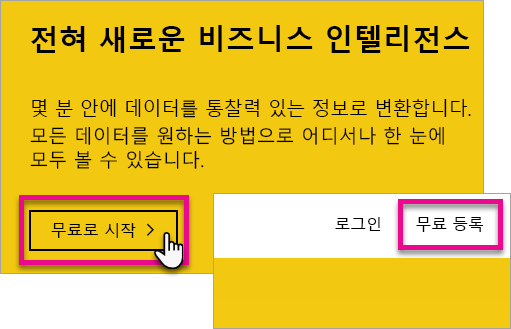

# Power BI에 개별 등록
Power BI에 등록하고 개인 보고서를 시작하는 방법과 시각화 요구 사항에 대해 알아봅니다.

Power BI는 개인 보고서 및 시각화 도구일 수 있으며, 그룹 프로젝트, 사업부 또는 회사 전체의 분석 및 의사 결정 엔진으로의 역할도 담당할 수 있습니다.

이 문서는 Power BI 서비스를 사용하여 등록 및 시작하는 방법에 대한 옵션을 안내합니다. Power BI Pro와 무료 버전 간의 차이점에 대한 자세한 내용은 [Power BI Pro와 무료 버전 비교](service-free-vs-pro.md)를 참조하세요.

## 설정할 몇 가지 옵션이 있습니다.
Power BI를 사용하여 등록 및 시작하기 위해 개별적으로 설정해야 하는 몇 가지 옵션이 있습니다. 무료로 등록하도록 선택하거나 Power BI Pro 구독을 구입할 수 있습니다. 무료 계정에 등록하고 서비스를 사용하면 Power BI Pro의 60일 무료 평가판을 선택할 수 있습니다.

Office 365를 사용하는 기존 조직의 일부인 경우 여전히 무료 계정에 등록할 수 있습니다. IT 관리자는 Power BI Pro를 구매하고 라이선스를 할당할 수 있는 몇 가지 옵션이 있습니다. IT 관리자가 사용할 수 있는 옵션에 관한 자세한 내용은 [Power BI Pro 구매](service-admin-purchasing-power-bi-pro.md)를 참조하세요.

> [!NOTE]
> 조직에 있는 경우 개별 등록은 사용할 수 없습니다. 해제되었음을 나타내는 오류 메시지가 나타나는 경우 자세한 내용은 [개별 등록이 해제되었습니다.](#individual-sign-up-has-been-turned-off)를 참조하세요.
> 
> 

## 등록이 필요한 작업
Power BI에 등록하려면 업무용 메일 주소가 필요합니다. 개인 이메일 주소는 Power BI 서비스와 작동하지 않습니다.

<a name="what-email-address-can-be-used-with-power-bi"/>

### Power BI로 어떤 전자 메일 주소를 사용할 수 있습니까?
Power BI는 등록할 직장 또는 학교 전자 메일 주소가 필요합니다. Power BI는 소비자 메일 서비스나 전자 통신 공급자가 제공하는 메일 주소를 지원하지 않습니다. Outlook.com, hotmail.com, gmail.com 등이 포함됩니다.

개인 전자 메일 주소를 등록하려는 경우 회사 또는 학교 전자 메일 주소를 사용하도록 지시하는 메시지가 표시됩니다.

> [!NOTE]
> 이 시점에서 Power BI는 .gov 또는.mil 주소에 대한 셀프 서비스 등록을 지원하지 않습니다. Office 365 관리자에게 문의하세요.
> 
> 

## 어떤 것이 필요합니까?
각 라이선스 형식에 포함된 항목을 검토하여 무엇이 필요한지 확인할 수 있습니다. 무료 사용자는 공유 및 공동 작업 기능을 제외한 서비스의 기능 대부분을 사용할 수 있습니다. Power BI Pro 사용자는 서비스의 모든 기능을 사용할 수 있으나 무료는 아닙니다. 콘텐츠를 공유할 필요가 없는 경우라면 무료를 사용하는 것이 한 방법입니다. [Power BI 가격 책정 페이지](https://powerbi.microsoft.com//pricing/)에서 자세한 내용을 확인할 수 있습니다.

이 문서의 나머지 부분에서는 각 옵션에 등록하는 방법을 살펴봅니다.

## 개별로 Power BI(무료)에 등록
Power BI(무료) 계정에 등록하면 Power BI에 가장 빠르게 등록할 수 있습니다. 이 계정에 대한 비용은 없으며 서비스에서 다양한 기능을 사용할 수 있습니다.

> [!NOTE]
> 사용자에 대해 이미 알고 있다는 메시지가 나타나면 https://app.powerbi.com으로 이동하여 로그인해 보세요.
> 
> 

Power BI에 등록하려면 다음을 수행할 수 있습니다.

1. [powerbi.com](https://powerbi.microsoft.com)으로 이동합니다.
2. **무료 시작** 또는 **무료로 등록**을 선택합니다.
   
    
3. 시작 페이지에서 Power BI 아래에 있는 **무료 시도 >**를 선택합니다.
   
    
4. 등록할 전자 메일 주소를 입력한 다음 **등록**을 선택합니다. 사용자 전자 메일 주소를 등록에 사용할 수 있어야 합니다. 사용할 수 있는 이메일 주소에 대한 자세한 내용은 [Power BI로 어떤 이메일 주소를 사용할 수 있습니까?](#what-email-address-can-be-used-with-power-bi)를 참조하세요.
   
    
5. 사용자의 전자 메일을 확인하도록 지시하는 메시지를 받게 됩니다.
   
    
6. 전자 메일에 있는 링크를 선택하여 사용자의 이메일 주소를 확인합니다. 이렇게 하면 다시 등록 흐름으로 돌아갑니다. 자신에 대한 몇 가지 추가 정보를 제공해야 합니다.
7. 그런 다음 https://app.powerbi.com에 연결되어 Power BI를 무료 사용자로 사용하여 시작할 수 있습니다.

### 서비스 내에서 모양
서비스를 사용하는 경우 **기어** 아이콘으로 이동하고 **개인 저장소 관리**를 선택하여 무료 계정이 있는지 확인할 수 있습니다.

### 이미 기존 조직에 참여 중인 경우
계정이 기존 조직의 일부이면 해당 계정으로 로그인하라는 메시지가 나타납니다. **계속**을 선택하여 Office 365 로그인으로 로그인합니다.

그러면 **시작**을 선택하라는 메시지가 표시됩니다.

## 서비스 중인 Power BI Pro 60일 평가판
무료 계정에 등록한 후 필요에 따라 Pro를 무료로 60일 동안 사용해 볼 수 있습니다. 평가판 기간 동안 모든 Pro 기능에 대한 액세스 권한이 있습니다. Power BI Pro는 Power BI 무료 버전의 모든 기능과 추가 공유 및 공동 작업 기능을 제공합니다. 자세한 내용은 [Power BI 가격 책정](https://powerbi.microsoft.com/pricing)을 참조하세요. Power BI Pro의 60일 무료 평가판을 사용해 보려면 Power BI에 로그인하고 다음 Power BI Pro 기능 중 하나를 사용해 보세요.

* [앱 작업 영역 만들기](service-create-distribute-apps.md)
* [대시보드 공유](service-share-dashboards.md)

이러한 기능을 사용하고 나면 무료 평가판을 시작하라는 메시지가 표시됩니다. 또한 기어 아이콘을 선택하고 **개인 저장소 관리**를 선택하여 사용하도록 선택할 수 있습니다. 그런 다음 오른쪽에서 **무료로 Pro 사용해 보기**를 선택합니다.

**시작 평가판**을 선택할 수 있습니다.

>[!NOTE]
>이 제품 내 Power BI Pro 평가판을 사용하는 사용자는 Office 365 관리 포털에서 Power BI Pro 평가판 사용자로 표시되지 않고 Power BI 무료 사용자로 표시됩니다. 그러나 Power BI의 **저장소 관리** 페이지에는 Power BI Pro 평가판 사용자로 표시됩니다.

>[!NOTE]
>개별 사용자가 평가판 사용 조건에 개별적으로 동의하지 않고도 Power BI 평가판 라이선스를 획득하여 조직의 여러 사용자에게 배포하려는 IT 관리자의 경우 [Power BI Pro 구독 평가판](https://portal.office.com/Signup/MainSignup15.aspx?OfferId=d59682f3-3e3b-4686-9c00-7c7c1c736085&dl=POWER_BI_PRO)에 등록할 수 있습니다. 관리자 평가판에 등록하려면 Office 365 전역 또는 대금 청구 관리자이거나 새 테넌트를 만들어야 합니다. 자세한 내용은 [Power BI Pro 구매](service-admin-purchasing-power-bi-pro.md)를 참조하세요.
> 
> [!NOTE]
> Power BI 프리미엄 및 2017년 6월 1일에 무료 제공된 Power BI에 대한 변경 내용을 사용하면 Extended Pro 평가판을 이용할 수 있습니다. 자세한 내용은 [Extended Pro 평가판 활성화](service-extended-pro-trial.md)를 참조하세요.
> 
> 

### 서비스 내에서 모양
서비스를 사용하는 경우 **기어* 아이콘으로 이동하고 **개인 저장소 관리**를 선택하여 Pro 평가판 계정이 있는지 확인할 수 있습니다.

## 전체 Power BI Pro를 원하는 경우
개별적으로 Power BI Pro 라이선스를 가져오는 방법은 없습니다. 라이선스를 구입하고 사용자 계정에 할당하려면 IT 관리자에게 문의해야 합니다. 자세한 내용은 [Power BI Pro 구매](service-admin-purchasing-power-bi-pro.md)를 참조하세요.

## 문제 해결
대부분의 경우 Power BI에 대한 등록은 위에 나열된 간단한 셀프 서비스 등록 프로세스에 따라 수행할 수 있습니다. 그러나 여러 가지 이유로 셀프 서비스 등록을 완료할 수 없을 수 있습니다.  다음 표에서는 등록을 완료할 수 없는 가장 일반적인 이유와 이러한 문제를 해결하는 방법을 요약합니다.

| **증상/오류 메시지** | **원인 및 해결 방법** |
| --- | --- |
| **개인 전자 메일 주소(예: nancy@gmail.com)** 등록하는 동안 다음과 같은 메시지가 나타납니다.    *개인 메일 주소를 입력했습니다. 귀사의 데이터를 안전하게 저장할 수 있도록 회사 메일 주소를 입력하세요.*    또는    *개인 메일 주소인 것 같습니다. 회사의 다른 사람과 연결할 수 있도록 회사 주소를 입력하세요. 걱정하지 마세요. 사용자의 주소를 공유하지 않습니다.* |Power BI는 소비자 메일 서비스나 전자 통신 공급자가 제공하는 메일 주소를 지원하지 않습니다.    등록을 완료하려면 회사 또는 학교에서 할당한 전자 메일 주소를 사용하여 다시 시도하세요.    여전히 등록할 수 없고 보다 고급 설치 프로세스를 완료하려면 [새 Office 365 무료 평가판 구독을 등록하고 해당 전자 메일 주소를 사용하여 등록](service-admin-signing-up-for-power-bi-with-a-new-office-365-trial.md)하면 됩니다. |
| **셀프 서비스 등록 사용 안함** 등록하는 동안 다음과 같은 메시지가 나타납니다.    *등록하면 완료할 수 없습니다. IT 부서에서 Microsoft Power BI에 대한 등록을 해제했습니다. 연락하여 등록을 완료합니다.*    또는    *개인 메일 주소인 것 같습니다. 회사의 다른 사람과 연결할 수 있도록 회사 주소를 입력하세요. 걱정하지 마세요. 사용자의 주소를 공유하지 않습니다.* |조직의 IT 관리자가 Power BI에 대한 셀프 서비스 등록을 비활성화했습니다.    등록을 완료하려면 IT 관리자에게 연락하여 아래 페이지의 지침에 따라 기존 사용자의 Power BI 등록을 허용하고 신규 사용자의 기존 테넌트 참가를 허용하도록 하세요.    파트너를 통해 Office 365에 등록한 경우에도 이 문제가 발생할 수 있습니다. [자세히 알아보기](service-admin-syndication-partner.md)    [조직의 Power BI](https://support.office.com/en-ca/article/Power-BI-in-your-Organization-d7941332-8aec-4e5e-87e8-92073ce73dc5#BKMK_HowCanIAllowO365Tenant) |
| **메일 주소는 Office 365 ID가 아님** 등록하는 동안 다음과 같은 메시지가 나타납니다.    *contoso.com에서 사용자를 찾을 수 없습니다.  회사 또는 학교에서 다른 ID를 사용하나요?    로그인을 시도했으나 작동하지 않는 경우 IT 부서에 문의합니다.* |조직에서 전자 메일 주소와 다른 ID를 사용하여 Office 365 및 기타 Microsoft 서비스에 로그인합니다.  예를 들어 전자 메일 주소는 Nancy.Smith@contoso.com이지만 ID는 nancys@contoso.com입니다.    등록을 완료하려면 조직에서 Office 365 또는 기타 Microsoft 서비스 로그인을 위해 할당한 ID를 사용합니다.  이 내용에 대해 잘 모르는 경우 IT 관리자에게 문의합니다.    여전히 등록할 수 없고 보다 고급 설치 프로세스를 완료하려면 [새 Office 365 무료 평가판 구독을 등록하고 해당 전자 메일 주소를 사용하여 등록](service-admin-signing-up-for-power-bi-with-a-new-office-365-trial.md)하면 됩니다. |

## 다음 단계
[조직의 Power BI(무료)](service-admin-service-free-in-your-organization.md)  
[Power BI Pro 구매](service-admin-purchasing-power-bi-pro.md)  
[개별 사용자에 대한 Power BI 서비스 규약](https://powerbi.microsoft.com/terms-of-service/)  
[Power BI 프리미엄이란?](service-premium.md)  
[Power BI 프리미엄 백서](https://aka.ms/pbipremiumwhitepaper)  

궁금한 점이 더 있나요? [Power BI 커뮤니티에 질문합니다.](http://community.powerbi.com/)

