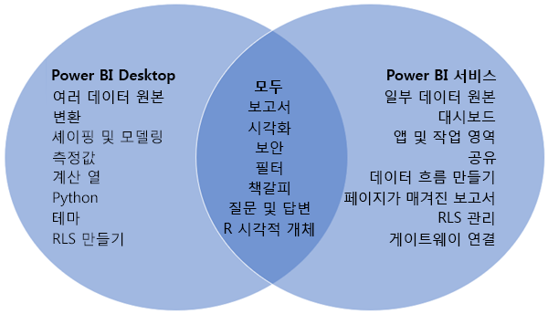
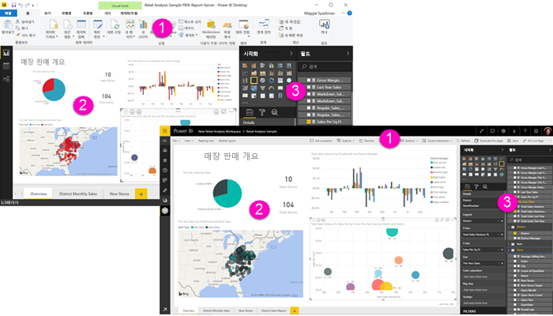

# Power BI Desktop 및 Power BI 서비스 비교

Power BI Desktop과 Power BI 서비스를 비교한 벤 다이어그램에서 중간의 영역은 두 영역이 겹치는 방법을 보여줍니다. Power BI Desktop 또는 서비스에서 수행할 수 있는 몇 가지 작업입니다. 그러나 벤 다이어그램의 두 가지 측면에서 애플리케이션과 서비스는 각 고유한 기능이 있습니다.  

**Power BI Desktop**은 완전한 데이터 분석 및 보고서 작성 도구입니다. 로컬 컴퓨터에 무료 애플리케이션을 설치할 때 다양한 데이터 원본에 연결하여 데이터 모델(모델링이라고도 함)로 결합할 수 있습니다. [Power BI Desktop 시작 가이드](desktop-getting-started.md)가 이 과정을 안내합니다.

**Power BI 서비스**는 팀 및 기업에 대한 간단한 보고서 편집 및 협업을 위한 클라우드 기반의 온라인 서비스입니다. Power BI 서비스의 데이터 원본에도 연결할 수는 있지만 모델링에는 제한이 있습니다. 

비즈니스 인텔리전스 프로젝트에서 작업하는 대부분의 보고서 디자이너는 **Power BI Desktop**을 사용하여 보고서를 만든 다음, **Power BI 서비스**를 사용하여 다른 사용자와 보고서를 공유합니다.

## 보고서 편집

애플리케이션과 서비스 모두에서 *보고서*를 빌드하고 편집할 수 있습니다. 보고서에는 시각적 개체 및 시각적 개체의 컬렉션이 포함된 하나 이상의 페이지가 있을 수 있습니다. 책갈피, 단추, 필터 및 드릴스루를 추가하여 보고서 탐색을 향상시킬 수 있습니다.

Power BI Desktop과 서비스의 보고서 편집기는 유사합니다. 다음 세 가지 섹션으로 구성되어 있습니다.  

1. Power BI Desktop과 서비스에 따라 달라지는 위쪽 탐색 모음    
2. 보고서 캔버스     
3. **필드**, **시각화** 및 **필터** 창

이 비디오는 Power BI Desktop의 보고서 편집기를 보여줍니다. 

<iframe width="560" height="315" src="https://www.youtube.com/embed/IkJda4O7oGs" frameborder="0" allowfullscreen></iframe>

## Power BI 서비스에서 공동 작업

보고서를 만든 후에는 사용자와 동료가 공동 작업을 수행하는 **Power BI 서비스**의 *작업 영역*에 보고서를 저장할 수 있습니다. 해당 보고서 위에 *대시보드*를 빌드합니다. 그런 다음, 해당 대시보드와 보고서를 조직 내외부의 보고서 소비자와 공유합니다. 보고서 소비자는 편집용 보기가 아닌 [읽기용 보기](consumer/end-user-reading-view.md)의 Power BI 서비스에서 봅니다. 보고서 작성자가 사용할 수 있는 모든 기능에 액세스할을 수 있습니다. 

## 다음 단계

[Power BI Desktop이란?](desktop-what-is-desktop.md)

Power BI 서비스에서 [보고서 만들기](service-report-create-new.md)

[보고서 디자이너에 대한 기본 개념](service-basic-concepts.md)

궁금한 점이 더 있나요? [Power BI 커뮤니티를 이용하세요.](http://community.powerbi.com/)

