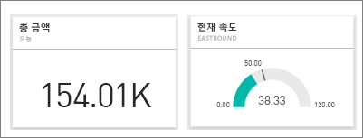
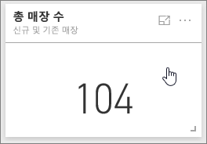
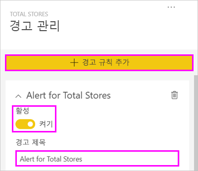
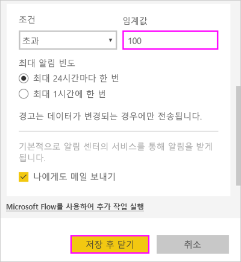
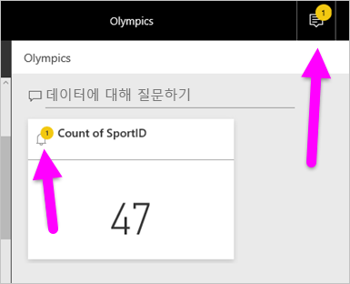
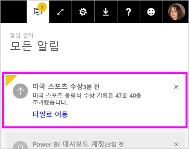
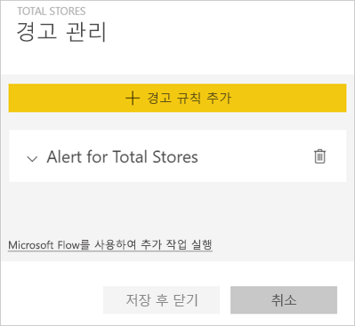
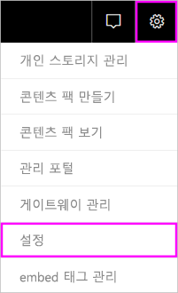
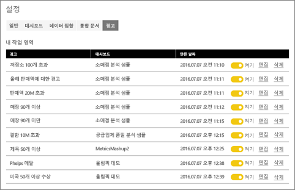

# Power BI 서비스의 데이터 경고
대시보드의 데이터가 설정해 놓은 한도를 넘어 변경되면 알리도록 경고를 설정합니다. 

Power BI Pro 라이선스가 있는 경우 또는 [프리미엄 용량](service-premium.md)의 사용자와 대시보드를 공유하는 경우 타일에서 경고를 설정할 수 있습니다. 경고는 보고서 시각적 개체에서 고정된 타일과 계기, KPI 및 카드에서만 설정할 수 있습니다. 경고는 보고서로부터 대시보드로 고정된 스트리밍 데이터 집합에서 만들어진 시각적 개체에 설정할 수 있으나, **타일 추가** > **사용자 지정 스트리밍 데이터**를 사용하여 대시보드에 직접 만든 스트리밍 타일에는 설정할 수 없습니다. 

대시보드를 공유하더라도 자신이 설정한 경고만 볼 수 있습니다. 데이터 경고는 플랫폼 전반에서 완전히 동기화되며 [Power BI 모바일 앱](consumer/mobile/mobile-set-data-alerts-in-the-mobile-apps.md) 및 Power BI 서비스에서 데이터 경고를 설정하고 봅니다. Power BI Desktop에서 사용할 수 없습니다. 경고는 [Microsoft Flow로 자동화 및 통합될 수도 있습니다.](https://flow.microsoft.com) - [직접 사용해 보세요](service-flow-integration.md).

> [!WARNING]
> 데이터 기반 경고 알림은 데이터에 관한 정보를 제공합니다. 모바일 디바이스에서 Power BI 데이터를 보는 데 그 모바일 디바이스를 잃어버린 경우 Power BI 서비스를 사용하여 모든 데이터 기반 경고 규칙을 해제하는 것이 좋습니다.
> 
> 

## Power BI 서비스에서 데이터 경고 설정
Amanda가 대시보드의 타일에 일부 경고를 추가하는 과정을 시청합니다. 그런 다음 비디오 아래에 있는 단계별 지침을 따라서 직접 시도해 볼 수 있습니다.

<iframe width="560" height="315" src="https://www.youtube.com/embed/JbL2-HJ8clE" frameborder="0" allowfullscreen></iframe>

이 예제는 소매점 분석 샘플 대시보드의 카드 타일을 사용합니다.

1. 대시보드를 시작합니다. 대시보드 계기, KPI 또는 카드 타일에서 줄임표(...)를 선택합니다.
   
   
2. 종 모양 아이콘 을 선택하여 **총 매장**에 대한 하나 이상의 경고를 추가합니다.
   
1. 시작하려면 **+경고 규칙 추가**를 선택하고, 슬라이더가 **켜기**로 설정되어 있는지 확인하고, 경고 제목을 입력합니다. 제목은 경고를 쉽게 인식하는 데 도움이 됩니다.
   
   
4. 아래로 스크롤하여 경고 세부 정보를 입력합니다.  이 예제에서는 총 매장의 수가 100을 넘으면 하루에 한 번 알려주는 경고를 만듭니다. 경고는 알림 센터에 표시됩니다. Power BI에서 전자 메일도 전송됩니다.
   
   
5. **저장**을 선택합니다.

## 경고 수신
추적되는 데이터가 설정해 놓은 임계값 중 하나에 도달하면, 몇 가지 현상이 발생합니다. 먼저, Power BI에서 마지막 경고가 전송된 후 1시간 이상이 경과했는지 또는 24시간 이상이 경과했는지(선택한 옵션에 따라) 확인됩니다. 데이터가 임계값을 넘어서는 동안은, 경고를 수신하게 됩니다.

다음으로, Power BI에서 알림 센터에 경고를 보내고 필요에 따라 전자 메일로 보냅니다. 각 경고에는 데이터에 대한 직접 링크가 포함됩니다. 탐색하고, 공유하고, 자세한 정보를 알아볼 수 있는 관련 타일을 보려면 링크를 선택합니다.  

1. 전자 메일을 보내도록 경고를 설정해 놓으면, 다음과 같은 내용을 받은 편지함에서 찾을 수 있습니다.
   
   
2. Power BI에서 **알림 센터**에 메시지가 추가되고 해당되는 타일에 새로운 경고 아이콘이 추가됩니다.
   
   
3. 알림 센터를 열어서 경고 세부 정보를 봅니다.
   
    
   
   > [!NOTE]
   > 경고는 새로 고쳐지는 데이터에만 적용됩니다. 데이터가 새로 고쳐지면, Power BI에서 해당 데이터에 대해 경고가 설정되어 있는지 확인됩니다. 데이터가 경고 임계값에 도달하면, 경고가 트리거됩니다.
   > 
   > 

## 경고 관리
경고를 관리하는 방식은 여러 가지입니다. 대시보드 타일 자체에서, Power BI 설정 메뉴에서, 그리고 [ iPhone의 Power BI 모바일 앱](consumer/mobile/mobile-set-data-alerts-in-the-mobile-apps.md) 또는 [Windows 10용 Power BI 모바일 앱](consumer/mobile/mobile-set-data-alerts-in-the-mobile-apps.md)에서 관리할 수 있습니다.

### 타일 자체에서
1. 타일에 대한 경고를 변경하거나 제거하려면, 종 모양 아이콘 을 선택하여 **경고 관리** 창을 다시 엽니다. 해당 타일에 설정해 놓은 모든 경고가 표시됩니다.
   
    .
2. 경고를 수정하려면, 경고 이름 왼쪽에 있는 화살표를 선택합니다.
   
    .
3. 경고를 삭제하려면, 경고 이름 오른쪽에 있는 쓰레기통을 선택합니다.
   
      

### Power BI 설정 메뉴에서
1. Power BI 메뉴 모음에서 기어 아이콘을 선택합니다.
   
    .
2. **설정**에서 **경고**를 선택합니다.
   
    
3. 여기에서 경고를 켜거나 끌 수 있으며, **경고 관리** 창을 열어서 내용을 변경하거나, 경고를 삭제할 수 있습니다.

## 팁 및 문제 해결
* 현재 Bing 타일 또는 카드 타일에 대해서는 날짜/시간 측정값에 대한 경고가 지원되지 않습니다.
* 경고는 숫자 데이터 형식에만 적용됩니다.
* 경고는 새로 고쳐지는 데이터에만 적용됩니다. 정적 데이터에 대해서는 적용되지 않습니다.
* 경고는 KPI/카드/계기 보고서 시각적 개체를 빌드한 후 해당 시각적 개체를 대시보드에 고정하는 경우 스트리밍 데이터 집합에서만 작동합니다.

## 다음 단계
[데이터 경고를 포함하는 Microsoft Flow 만들기](service-flow-integration.md)    
[모바일 장치에서 데이터 경고 설정](consumer/mobile/mobile-set-data-alerts-in-the-mobile-apps.md)    
[Power BI란?](power-bi-overview.md)    
궁금한 점이 더 있나요? [Power BI 커뮤니티에 질문합니다.](http://community.powerbi.com/)

