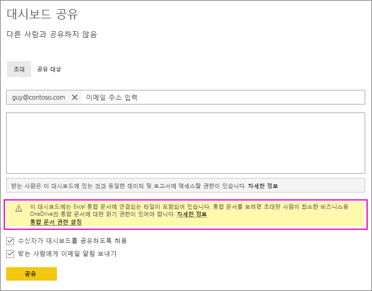
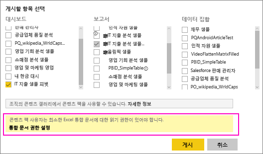
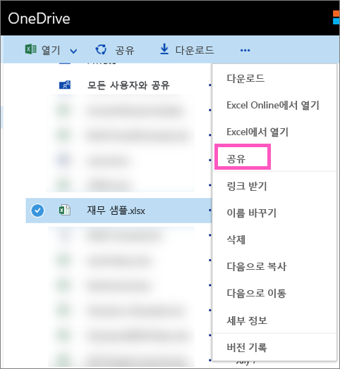

# OneDrive에서 Excel 파일에 연결되는 Power BI 대시보드 공유
Power BI에서 [비즈니스용 OneDrive의 Excel 통합 문서에 연결](service-excel-workbook-files.md)하고 해당 통합 문서에서 대시보드에 타일을 고정할 수 있습니다. 해당 대시보드를 공유하거나 해당 대시보드를 포함하는 콘텐츠 팩을 만들면 다음과 같이 됩니다.

* 동료는 통합 문서 자체에 대한 사용 권한 없이도 타일을 볼 수 있습니다. 따라서 콘텐츠 팩을 만들면 동료가 OneDrive의 Excel 통합 문서에서 만든 타일을 볼 수 있다는 것을 알 수 있습니다.
* 타일을 클릭하면 Power BI 내에서 통합 문서가 열립니다. 동료가 비즈니스용 OneDrive의 통합 문서에 대해 최소한 [읽기 권한](https://support.office.com/en-us/article/Share-documents-or-folders-in-Office-365-1fe37332-0f9a-4719-970e-d2578da4941c)이 있는 경우에만 통합 문서가 열립니다.

## 통합 문서 타일을 포함하는 대시보드 공유
비즈니스용 OneDrive의 Excel 통합 문서에 다시 연결하는 대시보드를 공유하려면 [대시보드 공유](service-share-dashboards.md)를 참조하세요. 차이점은 공유하기 전에 연결된 Excel 통합 문서에 대한 사용 권한을 수정할 수 있다는 것입니다.

  

1. 동료의 메일 주소를 입력합니다.
2. 동료가 Power BI에서 Excel 통합 문서를 볼 수 있게 하려면 **비즈니스용 OneDrive로 이동하여 통합 문서 사용 권한 설정**을 선택합니다.
3. 필요에 따라 OneDrive에서 [사용 권한을 수정](https://support.office.com/en-US/article/Share-files-and-folders-and-change-permissions-9fcc2f7d-de0c-4cec-93b0-a82024800c07)합니다.
4. **공유**를 선택합니다.

>[!NOTE]
>동료는 해당 통합 문서에서 추가 타일을 고정할 수 없으며, Power BI에서 Excel 통합 문서를 변경할 수 없습니다.
> 
> 

## 통합 문서 타일을 포함하는 대시보드로 조직 콘텐츠 팩 만들기
[콘텐츠 팩을 게시](service-organizational-content-pack-create-and-publish.md)하면 개별 동료 또는 그룹이 액세스할 수 있습니다. 통합 문서 링크가 포함된 콘텐츠 팩을 게시하면 게시하기 전에 연결된 Excel 통합 문서의 사용 권한을 수정할 수 있는 옵션이 제공됩니다.

1. **콘텐츠 팩 만들기** 화면에서 메일 주소를 입력하고, 콘텐츠 팩에 제목 및 설명을 지정하고, 이미지를 업로드합니다.
2. 비즈니스용 OneDrive의 Excel 통합 문서에 연결된 대시보드 및/또는 보고서를 선택합니다.
   
    
3. **비즈니스용 OneDrive로 이동하여 통합 문서 사용 권한 설정**을 선택합니다.
4. 필요에 따라 OneDrive에서 [사용 권한을 수정](https://support.office.com/en-US/article/Share-files-and-folders-and-change-permissions-9fcc2f7d-de0c-4cec-93b0-a82024800c07)합니다.
5. **게시**를 선택합니다.

## Power BI 작업 영역에서 대시보드 공유
Power BI 작업 영역에서 대시보드 공유는 파일이 개인 비즈니스용 OneDrive가 아니라 Office 365 작업 영역 사이트에 있다는 점을 제외하고 고유한 작업 영역에서 대시보드를 공유하는 것과 유사합니다. 작업 영역 외부의 사람과 대시보드를 공유하기 전에 Excel 통합 문서에 대한 사용 권한을 수정합니다.

## 다음 단계
* [Excel에서 Power BI 대시보드에 타일 고정](service-dashboard-pin-tile-from-excel.md)
* [Power BI 기본 개념](service-basic-concepts.md)
* 궁금한 점이 더 있나요? [Power BI 커뮤니티를 이용하세요.](http://community.powerbi.com/)

