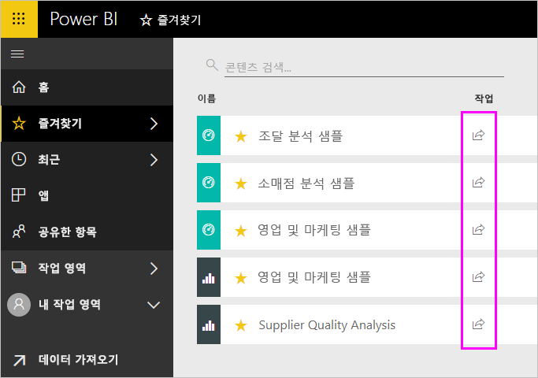
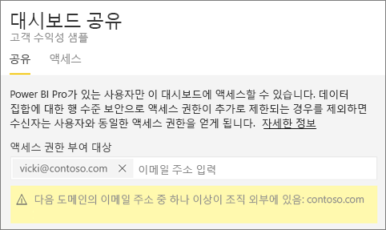
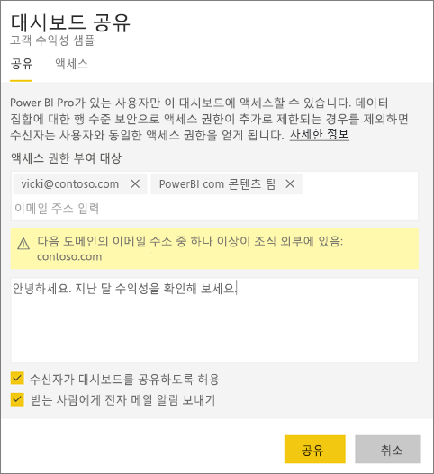
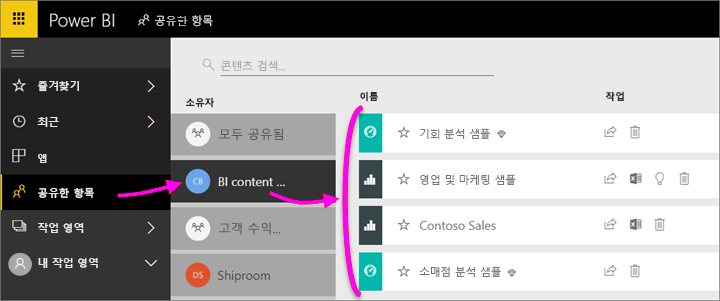
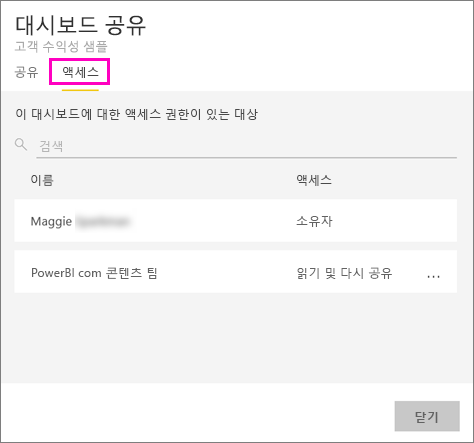
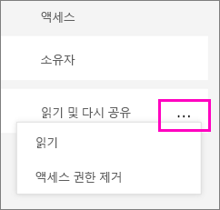
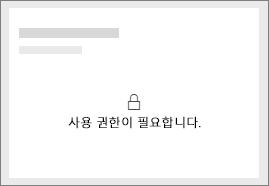
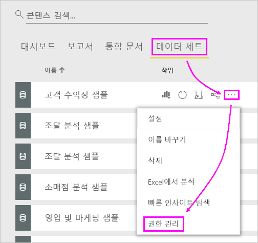
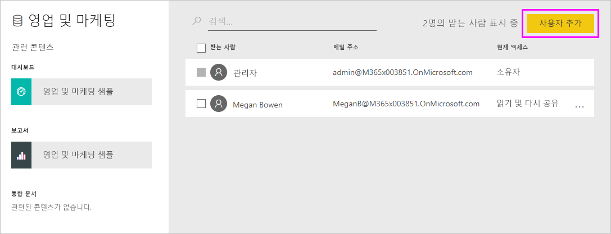
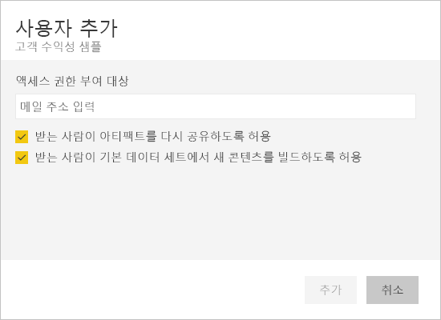

# 동료 및 다른 사용자와 Power BI 대시보드 및 보고서 공유
다른 사람에게 대시보드 및 보고서에 대한 액세스 권한을 부여하려면 *공유*를 사용하는 것이 좋습니다. Power BI는 [대시보드 및 보고서를 공동 작업하고 배포하는 여러 가지 다른 방법](service-how-to-collaborate-distribute-dashboards-reports.md)도 제공합니다.

콘텐츠를 조직 내부와 공유하든 또는 외부와 공유하든, 공유하려면 [Power BI Pro 라이선스](service-free-vs-pro.md)가 필요합니다. 수신자도 Power BI Pro 라이선스가 필요합니다. 또는 콘텐츠가 [프리미엄 용량](service-premium.md)에 있어야 합니다. 

Power BI 서비스의 대부분의 위치(즐겨찾기, 최근 항목, 공유한 항목(소유자가 허용한 경우), 내 작업 영역 또는 기타 작업 영역)에서 대시보드 및 보고서를 공유할 수 있습니다. 대시보드 또는 보고서를 공유할 경우 공유하는 다른 사용자가 대시보드를 보고 조작할 수 있지만 편집은 불가능합니다. [RLS(행 수준 보안)](service-admin-rls.md)를 적용하지 않는 한 다른 사용자는 사용자가 대시보드 또는 보고서에서 확인할 수 있는 동일한 데이터를 봅니다. 허용하는 경우 사용자와 항목을 공유하는 동료는 자신의 동료와도 공유할 수 있습니다. 조직 외부 사람들도 대시보드 또는 보고서를 보고 조작할 수는 있지만 공유할 수는 없습니다. 

또한 [Power BI 모바일 앱에서 대시보드를 공유](mobile-share-dashboard-from-the-mobile-apps.md)할 수 있습니다. Power BI 서비스 또는 Power BI 모바일 앱에서는 대시보드를 공유할 수 있지만 Power BI Desktop에서는 공유할 수 없습니다.

## 동영상: 대시보드 공유
Amanda가 회사 내부 및 외부의 동료와 대시보드를 공유하는 과정을 시청합니다. 그런 다음, 비디오 아래에 있는 단계별 지침을 따라서 직접 시도해 볼 수 있습니다.

<iframe width="560" height="315" src="https://www.youtube.com/embed/0tUwn8DHo3s?list=PL1N57mwBHtN0JFoKSR0n-tBkUJHeMP2cP" frameborder="0" allowfullscreen></iframe>

## 대시보드 또는 보고서 공유

1. 대시보드 또는 보고서 목록이나 열린 대시보드 또는 보고서에서 **공유** 을 선택합니다.

1. 맨 위 상자에서 개인에 대한 전체 메일 주소, 메일 그룹 또는 보안 그룹을 입력합니다. 동적 메일 그룹과 공유할 수 없습니다. 
   
   주소가 조직 외부에 있는 사용자와 공유할 수 있지만 경고가 표시됩니다.
   
    
 
3. 원하는 경우 메시지를 추가합니다. 선택 사항입니다.
4. 동료가 사용자의 콘텐츠를 다른 사람과 공유할 수 있도록 하려면 **Allow recipients to share your dashboard/report**(받는 사람이 대시보드/보고서를 공유하도록 허용)를 선택합니다.
   
   다른 사용자가 공유할 수 있도록 허용하는 작업을 *다시 공유*라고 합니다. 허용하는 경우 해당 사용자는 Power BI 서비스와 모바일 앱에서 다시 공유하거나 조직에서 다른 사용자에게 전자 메일 초대를 전달할 수 있습니다. 이 초대는 한 달 후에 만료됩니다. 조직 외부 사용자는 다시 공유할 수 없습니다. 콘텐츠 소유자는 다시 공유를 끄거나 개인별로 다시 공유를 해지할 수 있습니다. 아래의 [공유 중지 또는 다른 사용자의 공유 중지](service-share-dashboards.md#stop-sharing-or-stop-others-from-sharing)를 참조하세요.

5. **공유**를 선택합니다.
   
     
   
   Power BI에서 공유 콘텐츠에 대한 링크가 포함된 메일 초대를 그룹이 아닌 개인에게 보냅니다. **성공** 알림이 표시됩니다. 
   
   조직에서 받는 사람이 링크를 클릭하는 경우 Power BI에서 대시보드 또는 보고서를 해당 **공유한 항목** 목록 페이지에 추가합니다. 사용자의 이름을 선택하여 공유한 콘텐츠를 모두 볼 수 있습니다. 
   
   
   
   조직 외부의 받는 사람이 링크를 클릭하면 대시보드 또는 보고서가 표지되지만 일반적인 Power BI 포털에는 표시되지 않습니다. 자세한 내용은 아래의 [조직 외부 사용자와 공유](service-share-dashboards.md#share-a-dashboard-with-people-outside-your-organization)를 참조하세요.

## 공유한 대시보드 또는 보고서에 누가 액세스할 수 있나요?
경우에 따라 공유한 사용자를 확인하고 해당 사용자가 공유한 사람을 확인해야 합니다.

1. 대시보드 및 보고서 목록 또는 대시보드나 보고서 자체에서 **공유** 을 선택합니다. 
2. **Share dashboard/report**(대시보드/보고서 공유) 대화 상자에서 **액세스**를 선택합니다.
   
    
   
    조직 외부 사용자는 **게스트**로 표시됩니다.

## 공유 중지 또는 다른 사용자의 공유 중지
대시보드 또는 보고서 소유자만 다시 공유를 켜고 끌 수 있습니다.

### 공유 초대를 아직 보내지 않은 경우
* 보내기 전에 초대장의 아래쪽에 있는 **Allow recipients to share your dashboard/report**(받는 사람이 대시보드/보고서를 공유하도록 허용) 확인란을 선택 취소합니다.

### 대시보드 또는 보고서를 이미 공유한 경우
1. 대시보드 및 보고서 목록 또는 대시보드나 보고서 자체에서 **공유** 을 선택합니다. 
2. **Share dashboard/report**(대시보드/보고서 공유) 대화 상자에서 **액세스**를 선택합니다.
   
    
3. **읽기 및 다시 공유** 옆에 있는 줄임표(**...**)를 선택하고 다음을 선택합니다.
   
   
   
   * **읽기**는 해당 개인이 다른 사람과 공유하지 않도록 합니다.
   * **액세스 권한 제거**는 해당 사용자가 공유된 콘텐츠를 전혀 보지 못하도록 합니다.

4. **액세스 권한 제거** 대화 상자에서 보고서 및 데이터 집합과 같은 관련 콘텐츠에 대한 액세스를 제거할지 여부를 결정합니다. 경고 아이콘 을 사용하여 항목을 제거하는 경우 제대로 표시되지 않으므로 관련 콘텐츠를 제거하는 것이 좋습니다.

## 조직 외부 사용자와 대시보드 또는 보고서 공유
조직 외부 사용자와 공유하는 경우 해당 사용자는 공유 대시보드 또는 보고서에 대한 링크가 포함된 메일을 수신하고 Power BI에 로그인하여 대시보드 또는 보고서를 확인해야 합니다. Power BI Pro 라이선스가 없는 경우 링크를 클릭한 후 라이선스를 등록할 수 있습니다.

로그인하면 일반적인 Power BI 포털이 아닌, 왼쪽 탐색 창이 없는 브라우저 창에 공유 대시보드 또는 보고서가 표시됩니다. 나중에 이 대시보드 또는 보고서에 액세스하려면 링크에 책갈피를 설정해야 합니다.

이 대시보드 또는 보고서의 어떤 내용도 편집할 수 없습니다. 차트를 조작하고 보고서의 필터 또는 슬라이서를 변경할 수 있지만 변경 내용을 저장할 수는 없습니다.

직접적인 수신자만 공유 대시보드 또는 보고서를 볼 수 있습니다. 예를 들어, Vicki@contoso.com으로 전자 메일을 보낸 경우 Vicki만 대시보드를 볼 수 있습니다. 다른 사용자는 링크가 있더라도 대시보드를 볼 수 없으며, Vicki는 동일한 메일 주소를 사용하여 해당 대시보드에 액세스해야 합니다. 다른 메일 주소로 등록한 경우에는 대시보드에 액세스할 수 없습니다.

역할 또는 행 수준 보안이 온-프레미스 Analysis Services 테이블 형식 모델에서 구현된 경우 조직 외부 사용자는 데이터를 전혀 볼 수 없습니다.

Power BI 모바일 앱에서 조직 외부의 사람들에게 링크를 보낼 경우, 링크를 클릭하면 대시보드는 Power BI 모바일 앱이 아닌 브라우저에서 열립니다.

## 제한 사항 및 고려 사항
다음은 대시보드 및 보고서 공유에 관해 주의해야 할 점입니다.

* 일반적으로 사용자와 사용자의 동료는 대시보드 또는 보고서에서 동일한 데이터를 볼 수 있습니다. 따라서 사용자가 타인보다 더 많은 데이터를 볼 수 있는 권한을 가진 경우, 그들도 사용자의 대시보드 또는 보고서의 모든 데이터를 볼 수 있게 됩니다. 그러나 [RLS(행 수준 보안)](service-admin-rls.md)가 대시보드 또는 보고서 바탕이 되는 데이터 집합에 적용된 경우 각 사용자의 자격 증명은 해당 사용자가 액세스할 수 있는 데이터가 무엇인지 결정하는 데 사용됩니다.
* 대시보드를 공유하는 모든 사용자는 대시보드를 보고 [읽기용 보기](service-reading-view-and-editing-view.md)에서 관련 보고서를 조작할 수 있습니다. 보고서를 만들거나 기존 보고서에 변경 내용을 저장할 수는 없습니다.
* 데이터 집합을 다운로드하거나 볼 수는 없습니다.
* 모든 사용자는 수동으로 [데이터를 새로 고칠](refresh-data.md) 수 있습니다.
* Office 365를 메일에 사용하는 경우 메일 그룹과 연결된 메일 주소를 입력하여 메일 그룹의 멤버와 공유할 수 있습니다.
* 사용자와 동일한 메일 도메인을 가진 동료 및 도메인은 다르지만 동일한 테넌트 내에 등록된 동료는 다른 사용자요 대시보드를 다시 공유할 수 있습니다. 예를 들어 contoso.com 및 contoso2.com 도메인이 동일한 테넌트에 등록되어 있다고 가정합니다. 이메일 주소가 konrads@contoso.com인 경우, 사용자가 공유 권한을 부여하기만 하면 ravali@contoso.com 및 gustav@contoso2.com 모두 공유할 수 있습니다.
* 동료가 특정 대시보드 또는 보고서에 이미 액세스할 수 있고 사용자가 해당 대시보드 또는 보고서에 있는 경우 URL을 복사하여 직접 링크를 보낼 수 있습니다. 예를 들어: `https://powerbi.com/dashboards/g12466b5-a452-4e55-8634-xxxxxxxxxxxx`
* 마찬가지로 동료가 특정 대시보드에 대한 액세스 권한을 가진 경우 [기본 보고서에 대한 직접 링크를 전송](service-share-reports.md)할 수 있습니다. 

## 공유 문제 해결

### 내 대시보드 받는 사람은 타일 또는 “사용 권한 필요” 메시지에 잠금 아이콘이 표시됩니다.

사용자가 함께 공유하는 사람이 보고서를 보려고 할 때 대시보드의 잠긴 타일 또는 “사용 권한 필요” 메시지가 표시될 수 있습니다.

이 경우 기본 데이터 집합에 대한 권한을 부여해야 합니다. 방법은 다음과 같습니다.

1. 콘텐츠 목록에 있는 **데이터 집합** 탭으로 이동합니다.

1. 데이터 집합 옆에 있는 줄임표(**...**) > **사용 권한 관리**를 선택합니다.

    

3. **사용자 추가**를 선택합니다.

    

1. 개인에 대한 전체 메일 주소, 메일 그룹 또는 보안 그룹을 입력합니다. 동적 메일 그룹과 공유할 수 없습니다.

    

5. **추가**를 선택합니다.

### 대시보드 또는 보고서를 공유할 수 없음

대시보드 또는 보고서를 공유하려면 기본 콘텐츠(모든 관련 보고서 및 데이터 집합)를 다시 공유할 수 있는 권한이 있어야 합니다. 공유할 수 없다는 메시지가 표시되면 보고서 작성자에게 해당 보고서 및 데이터 집합에 대한 다시 공유 권한을 요청합니다.

## 다음 단계
* 의견이 있으신가요? 제안 사항이 있으시면 [Power BI 커뮤니티 사이트](https://community.powerbi.com/)를 방문하세요.
* [대시보드 및 보고서를 공동 작업 및 공유하는 방법](service-how-to-collaborate-distribute-dashboards-reports.md)
* [필터링된 Power BI 보고서 공유](service-share-reports.md)
* 궁금한 점이 더 있나요? [Power BI 커뮤니티를 이용](http://community.powerbi.com/)하세요.

