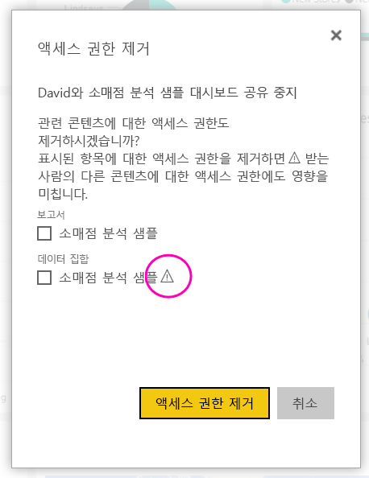
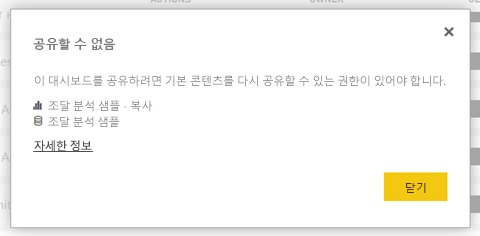

# 동료 및 다른 사용자와 Power BI 대시보드 및 보고서 공유
다른 사람에게 대시보드 및 보고서에 대한 액세스 권한을 부여하려면 *공유*를 사용하는 것이 좋습니다. Power BI는 [대시보드 및 보고서를 공동 작업하고 배포하는 여러 가지 다른 방법](service-how-to-collaborate-distribute-dashboards-reports.md)도 제공합니다.

콘텐츠를 조직 내부와 공유하든 또는 외부와 공유하든, 공유하려면 [Power BI Pro 라이선스](service-features-license-type.md)가 필요합니다. 콘텐츠는 경우를 제외 또한 수신자에 게 Power BI Pro 라이선스가 필요는 [프리미엄 용량](service-premium-what-is.md)합니다. 

Power BI 서비스의 대부분의 위치에서 대시보드 및 보고서를 공유할 수 있습니다. 즐겨찾기, 최근 항목, 공유한 항목 (소유자가 허용한) 하는 경우, 내 작업 영역 또는 다른 작업 영역을 사용 하 여 공유 합니다. 대시보드 또는 보고서를 공유할 경우 공유하는 다른 사용자가 대시보드를 보고 조작할 수 있지만 편집은 불가능합니다. [RLS(행 수준 보안)](service-admin-rls.md)를 적용하지 않는 한 다른 사용자는 사용자가 대시보드 또는 보고서에서 확인할 수 있는 동일한 데이터를 봅니다. 허용하는 경우 사용자와 항목을 공유하는 동료는 자신의 동료와도 공유할 수 있습니다. 조직 수 있으며 외부 사용자도 보고 대시보드 또는 보고서와 상호 작용 있지만 공유할 수는 없습니다. 

또한 [Power BI 모바일 앱에서 대시보드를 공유](consumer/mobile/mobile-share-dashboard-from-the-mobile-apps.md)할 수 있습니다. 그러나 Power BI Desktop에서 대시보드를 공유할 수 없습니다.

## 비디오: 대시보드 공유
Amanda가 회사 내부 및 외부의 동료와 대시보드를 공유하는 과정을 시청합니다. 그런 다음, 비디오 아래에 있는 단계별 지침을 따라서 직접 시도해 볼 수 있습니다.

<iframe width="560" height="315" src="https://www.youtube.com/embed/0tUwn8DHo3s?list=PL1N57mwBHtN0JFoKSR0n-tBkUJHeMP2cP" frameborder="0" allowfullscreen></iframe>

## 대시보드 또는 보고서 공유

1. 대시보드 또는 보고서 목록이나 열린 대시보드 또는 보고서에서 **공유** 을 선택합니다.

2. 맨 위 상자에서 개인에 대한 전체 메일 주소, 메일 그룹 또는 보안 그룹을 입력합니다. 동적 메일 그룹과 공유할 수 없습니다. 
   
   주소가 조직 외부에 있는 사용자와 공유할 수 있지만 경고가 표시됩니다.
   
    
 
   >[!NOTE]
   >입력된 상자에서는 최대 100 개의 사용자 또는 그룹. 다 수의 사용자와 공유 해야 할 경우 작업 영역에서 대시보드 만들기 고려 하 고 [앱으로 배포](service-create-distribute-apps.md)합니다.
   > 
   > 

3. 원하는 경우 메시지를 추가합니다. 선택 사항입니다.
4. 동료가 다른 사용자와 콘텐츠를 공유할 수 있도록, 하려면 체크 **대시보드 (또는 보고서)를 공유 하도록 수신자 허용**합니다.
   
   다른 사용자가 공유할 수 있도록 허용하는 작업을 *다시 공유*라고 합니다. 허용하는 경우 해당 사용자는 Power BI 서비스와 모바일 앱에서 다시 공유하거나 조직에서 다른 사용자에게 전자 메일 초대를 전달할 수 있습니다. 이 초대는 한 달 후에 만료됩니다. 조직 외부 사용자는 다시 공유할 수 없습니다. 콘텐츠 소유자는 다시 공유를 끄거나 개인별로 다시 공유를 해지할 수 있습니다. 참조 [공유 중지 또는 다른 사용자의 공유 중지](#stop-sharing-or-stop-others-from-sharing)합니다.

5. **공유**를 선택합니다.
   
     
   
   Power BI는 개인, 아니라 공유 콘텐츠에 대 한 링크를 사용 하 여 그룹 전자 메일 초대를 보냅니다. **성공** 알림이 표시됩니다. 
   
   조직에서 받는 사람이 링크를 클릭하는 경우 Power BI에서 대시보드 또는 보고서를 해당 **공유한 항목** 목록 페이지에 추가합니다. 사용자의 이름을 선택하여 공유한 콘텐츠를 모두 볼 수 있습니다. 
   
   
   
   조직 외부의 받는 사람이 링크를 클릭하면 대시보드 또는 보고서가 표지되지만 일반적인 Power BI 포털에는 표시되지 않습니다. 자세한 내용은 [조직 외부 사람들과 대시보드 또는 보고서 공유](#share-a-dashboard-or-report-with-people-outside-your-organization)합니다.

## 공유한 대시보드 또는 보고서에 누가 액세스할 수 있나요?
경우에 따라 사용자와 공유 하 고 사용자가 사용 하 여 공유한 사람 참조를 참조 해야 합니다.

1. 대시보드 및 보고서 목록 또는 대시보드나 보고서 자체에서 **공유** 을 선택합니다. 
2. 에 **대시보드 공유** 또는 **보고서를 공유** 대화 상자에서 **액세스**합니다.
   
    

    조직 외부 사용자는 **게스트**로 표시됩니다.

## 공유 중지 또는 다른 사용자의 공유 중지
대시보드 또는 보고서 소유자만 다시 공유를 켜고 끌 수 있습니다.

### 공유 초대를 아직 보내지 않은 경우
* 선택을 취소 합니다 **대시보드 (또는 보고서)를 공유 하도록 수신자 허용** 보내기 전에 초대장의 아래쪽에 있는 확인란입니다.

### 대시보드 또는 보고서를 이미 공유한 경우
1. 대시보드 및 보고서 목록 또는 대시보드나 보고서 자체에서 **공유** 을 선택합니다. 
2. 에 **대시보드 공유** 또는 **보고서를 공유** 대화 상자에서 **액세스**합니다.
   
    
3. **읽기 및 다시 공유** 옆에 있는 줄임표( **...** )를 선택하고 다음을 선택합니다.
   
   
   
   * **읽기**는 해당 개인이 다른 사람과 공유하지 않도록 합니다.
   * **액세스 권한 제거**는 해당 사용자가 공유된 콘텐츠를 전혀 보지 못하도록 합니다.

4. 에 **액세스 권한 제거** 대화 상자, 보고서 및 데이터 집합과 같은 관련된 콘텐츠에 대 한 액세스를 제거 하려는 경우를 결정 합니다. 경고 아이콘을 사용 하 여 항목을 제거 하는 경우 , 또한 제대로 표시 되지 않으므로 관련된 콘텐츠를 제거 하는 것이 좋습니다.

    

## 조직 외부 사용자와 대시보드 또는 보고서 공유
조직 외부 사람들과 공유 하는 경우 공유 대시보드 또는 해야 로그인 할 Power BI로 볼 수 있는 보고서에 대 한 링크를 사용 하 여 전자 메일을 받을 있습니다. Power BI Pro 라이선스가 없는 경우 링크를 클릭한 후 라이선스를 등록할 수 있습니다.

로그인 하면 후 공유 대시보드 또는 보고서의 일반적인 Power BI 포털 아닌 별도 브라우저 창에 표시 됩니다. 이 대시보드 또는 보고서에 나중에 액세스 하려면 링크를 책갈피 해야 있습니다.

이 대시보드 또는 보고서의 어떤 내용도 편집할 수 없습니다. 차트와 상호 작용 하며 필터 또는 슬라이서를 변경할 수 있습니다, 있지만 해당 변경 내용을 저장할 수 없는 합니다. 

직접적인 수신자만 공유 대시보드 또는 보고서를 볼 수 있습니다. 예를 들어, Vicki@contoso.com으로 전자 메일을 보낸 경우 Vicki만 대시보드를 볼 수 있습니다. 링크가 있는 경우에 대시보드를 볼 수 누구도. Vicki 않으면 액세스할 때 동일한 전자 메일 주소를 사용 해야 등록 한 경우 다른 전자 메일 주소를 사용 하 여, 대시보드에 액세스할을 수 없습니다.

역할 또는 행 수준 보안이 온-프레미스 Analysis Services 테이블 형식 모델에서 구현된 경우 조직 외부 사용자는 어떤 데이터도 볼 수 없습니다.

에 보내는 경우 링크를 Power BI 모바일 앱에서 사용자에 게 조직 외부 브라우저에서 Power BI 모바일 앱에 없는 대시보드가 열립니다 링크를 클릭 합니다.

경우 있습니다 [외부 게스트 사용자를 편집 및 관리를 조직에 콘텐츠 허용](service-admin-portal.md#export-and-sharing-settings), 기본 소비 전용 환경에 적용 되지 않습니다. [자세히 알아봅니다](service-admin-azure-ad-b2b.md).

## 제한 사항 및 고려 사항
다음은 대시보드 및 보고서 공유에 관해 주의해야 할 점입니다.

* 일반적으로 사용자와 사용자의 동료는 대시보드 또는 보고서에서 동일한 데이터를 볼 수 있습니다. 따라서 사용자가 타인보다 더 많은 데이터를 볼 수 있는 권한을 가진 경우, 그들도 사용자의 대시보드 또는 보고서의 모든 데이터를 볼 수 있게 됩니다. 그러나 [RLS(행 수준 보안)](service-admin-rls.md)가 대시보드 또는 보고서 바탕이 되는 데이터 세트에 적용된 경우 각 사용자의 자격 증명은 해당 사용자가 액세스할 수 있는 데이터가 무엇인지 결정하는 데 사용됩니다.
* 이 확인 하 고에서 관련된 보고서를 조작할 수 사용 하 여 대시보드를 공유 하는 모든 사용자가 [읽기용 보기](consumer/end-user-reading-view.md#reading-view)합니다. 보고서를 만들거나 기존 보고서에 변경 내용을 저장할 수는 없습니다.
* 참조 또는 데이터 집합 다운로드 수 없습니다, 하지만 데이터 집합 기능 Excel에서에서 분석을 사용 하 여 직접 액세스할 수 있습니다. 관리자 그룹의 모든 사용자에 대 한 Excel에서 분석을 사용 하는 기능을 제한할 수 있습니다. 이때 제한은 해당 그룹이 포함된 모든 작업 영역에서 그룹에 포함된 모든 사용자에게 적용됩니다.
* 모든 사용자는 수동으로 [데이터를 새로 고칠](refresh-data.md) 수 있습니다.
* Office 365를 메일에 사용하는 경우 메일 그룹과 연결된 메일 주소를 입력하여 메일 그룹의 멤버와 공유할 수 있습니다.
* 전자 메일 도메인을 공유 하는 동료 및 해당 도메인은 다르지만 동일한 테 넌 트 내에 등록 된 동료는 다른 사용자와 대시보드를 공유할 수 있습니다. 예를 들어 도메인 contoso.com 및 contoso2.com 전자 메일 주소는 동일한 테 넌 트에 등록 된 경우 konrads@contoso.com, 모두 ravali@contoso.com 고 gustav@contoso2.com 공유할 수 있는 권한을 부여한으로 공유할 수 있습니다.
* 동료가 특정 대시보드 또는 보고서에 대 한 액세스 이미 있으면 대시보드 또는 보고서에 있을 때 URL을 복사 하 여 직접 링크를 보낼 수 있습니다. 예를 들어: `https://powerbi.com/dashboards/g12466b5-a452-4e55-8634-xxxxxxxxxxxx`
* 마찬가지로 동료가 특정 대시보드에 액세스할 이미 있으면 할 수 있습니다 [기본 보고서에 대 한 직접 링크를 보낼](service-share-reports.md)합니다. 
* 최대 100 명의 사용자 또는 그룹에 단일 공유 작업을 사용 하 여 공유할 수 있습니다. 그러나 한 항목에 대한 액세스 권한을 500명이 넘는 사용자에게 부여할 수 있습니다. 이렇게 하려면 사용자를 개별적으로 지정 하 여 여러 번을 공유 하거나 모든 사용자를 포함 하는 사용자 그룹과 공유 합니다.

## 공유 문제 해결

### 내 대시보드 받는 사람은 타일 또는 “사용 권한 필요” 메시지에 잠금 아이콘이 표시됩니다.

사용자가 함께 공유하는 사람이 보고서를 보려고 할 때 대시보드의 잠긴 타일 또는 “사용 권한 필요” 메시지가 표시될 수 있습니다.

그렇다면 해당 기본 데이터 집합에 권한을 부여 해야 합니다.

1. 콘텐츠 목록에 있는 **데이터 세트** 탭으로 이동합니다.

1. 줄임표를 선택 ( **...** ) 데이터 집합 옆에 있는 선택한 **사용 권한을 관리할**합니다.

    

1. **사용자 추가**를 선택합니다.

    

1. 개인에 대한 전체 메일 주소, 메일 그룹 또는 보안 그룹을 입력합니다. 동적 메일 그룹과 공유할 수 없습니다.

    

1. **추가**를 선택합니다.

### 대시보드 또는 보고서를 공유할 수 없음

대시보드 또는 보고서를 공유 하려면 기본 콘텐츠;를 다시 공유할 수 있는 권한이 필요 즉, 모든 관련 보고서 및 데이터 집합입니다. 공유할 수 있도록 보고서 작성자에 게 메시지가 표시 되 면 해당 보고서 및 데이터 집합에 대 한 권한을 다시 공유 합니다.

## 다음 단계
* 의견이 있으신가요? 제안 사항이 있으시면 [Power BI 커뮤니티 사이트](https://community.powerbi.com/)를 방문하세요.
* [대시보드 및 보고서를 공동 작업 및 공유하는 방법](service-how-to-collaborate-distribute-dashboards-reports.md)
* [필터링된 된 Power BI 보고서 공유](service-share-reports.md)합니다.
* 궁금한 점이 더 있나요? [Power BI 커뮤니티를 이용](http://community.powerbi.com/)하세요.

