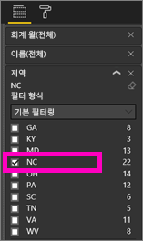
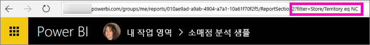
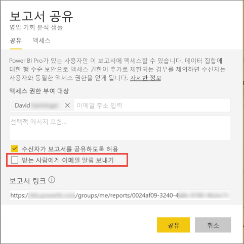

# 동료와 필터링된 Power BI 보고서 공유
다른 사람에게 대시보드 및 보고서에 대한 액세스 권한을 부여하려면 *공유*를 사용하는 것이 좋습니다. 또한 Power BI는 [보고서를 공동 작업하고 배포하는 여러 방법](service-how-to-collaborate-distribute-dashboards-reports.md)을 제공합니다.

공유에서 사용자와 해당 수신자는 [Power BI Pro 라이선스](service-features-license-type.md)가 필요하거나 콘텐츠는 [프리미엄 용량](service-premium.md)에 있어야 합니다. 제안? Power BI 팀은 언제나 사용자의 피드백을 중요하게 생각합니다. 따라서 [Power BI 커뮤니티 사이트](https://community.powerbi.com/)로 이동합니다.

Power BI 서비스의 대부분의 위치(즐겨찾기, 최근 항목, 공유한 항목(소유자가 허용한 경우), 내 작업 영역 또는 기타 작업 영역)에서 사용자와 동일한 메일 도메인을 사용하는 동료와 보고서를 공유할 수 있습니다. 보고서를 공유할 경우 공유하는 다른 사용자가 대시보드를 보고 조작할 수 있지만 편집은 불가능합니다. [RLS(행 수준 보안)](service-admin-rls.md)를 적용하지 않는 한 다른 사용자는 사용자가 보고서에서 확인할 수 있는 동일한 데이터를 봅니다. 

## 보고서 필터링 및 공유
필터링된 버전의 보고서를 공유하려면 어떻게 해야 할까요? 아마도 특정 도시, 판매 직원 또는 연도의 데이터만 보여 주는 보고서일 수도 있습니다. 사용자 지정 URL을 만들어서 이 작업을 수행합니다.

1. [편집용 보기](consumer/end-user-reading-view.md)에서 보고서를 열고, 필터를 적용하고, 보고서를 저장합니다.
   
   이 예에서는 [소매점 분석 샘플](sample-tutorial-connect-to-the-samples.md)을 필터링하여 **지역**이 **NC**인 값만 보여 줍니다.
   
   
2. 보고서 페이지의 URL 끝에 다음과 같이 추가합니다.
   
   ?filter=*tablename*/*fieldname* eq *value*
   
    필드는 **문자열** 형식이어야 하며, *tablename* 또는 *fieldname*에는 모두 공백이 포함될 수 없습니다.
   
   이 예에서 테이블 이름은 **Store**, 필드 이름은 **Territory**, 그리고 필터링하려는 값은 **NC**입니다.
   
    ?filter=Store/Territory eq 'NC'
   
   
   
   브라우저에서 슬래시, 공백 및 아포스트로피를 나타내는 특수 문자를 추가하여 다음과 같이 처리합니다.
   
   app.powerbi.com/groups/me/reports/010ae9ad-a9ab-4904-a7a1-xxxxxxxxxxxx/ReportSection2?filter=Store%252FTerritory%20eq%20%27NC%27

3. [보고서를 공유](service-share-dashboards.md)하되, **받는 사람에게 메일 알림 보내기** 확인란을 선택 취소합니다. 

    

4. 이전에 만든 필터를 사용하여 링크를 보냅니다.

## 다음 단계
* 의견이 있으신가요? 제안 사항이 있으시면 [Power BI 커뮤니티 사이트](https://community.powerbi.com/)를 방문하세요.
* [대시보드 및 보고서를 공동 작업 및 공유하는 방법](service-how-to-collaborate-distribute-dashboards-reports.md)
* [대시보드 공유](service-share-dashboards.md)
* 궁금한 점이 더 있나요? [Power BI 커뮤니티를 이용](http://community.powerbi.com/)하세요.

