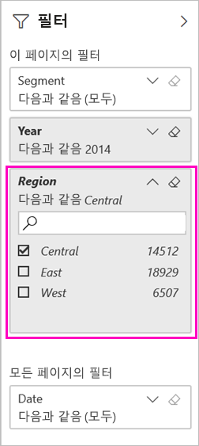
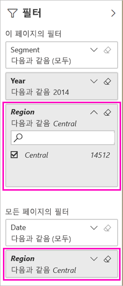

# 필터링된 Power BI 보고서를 공유하는 두 가지 방법
다른 사람에게 대시보드 및 보고서에 대한 액세스 권한을 부여하려면 *공유*를 사용하는 것이 좋습니다. 필터링된 버전의 보고서를 공유하려면 어떻게 해야 할까요? 아마도 특정 도시, 판매 직원 또는 연도의 데이터만 보여 주는 보고서일 수도 있습니다. 보고서를 필터링하고 공유하거나 사용자 지정 URL을 만들어 보세요. 받는 사람이 처음 열 때 보고서가 필터링됩니다. URL을 수정하여 필터를 제거할 수 있습니다. 

또한 Power BI는 [보고서로 공동 작업을 수행하고 보고서를 배포하는 여러 다른 방법](service-how-to-collaborate-distribute-dashboards-reports.md)도 제공합니다. 공유에서 사용자와 해당 수신자는 [Power BI Pro 라이선스](service-features-license-type.md)가 필요하거나 콘텐츠는 [프리미엄 용량](service-premium-what-is.md)에 있어야 합니다. 

## 보고서를 필터링하는 두 가지 방법

두 필터링 기술에서 영업 및 마케팅 샘플 템플릿 앱을 사용합니다. 진행해 볼까요? [ 샘플 템플릿 앱](https://appsource.microsoft.com/product/power-bi/microsoft-retail-analysis-sample.salesandmarketingsample?tab=Overview)을 설치할 수도 있습니다.

### 필터 설정

[편집용 보기](consumer/end-user-reading-view.md)에서 보고서를 열고 필터를 적용합니다.

이 예제에서는 영업 및 마케팅 샘플 템플릿 앱의 YTD Category 페이지를 필터링하여 **Region**이 **Central**인 값만 표시합니다. 
 

보고서를 저장합니다.

### URL에 필터 만들기

보고서 페이지 URL의 끝에 필터를 추가하면 동작이 약간 달라집니다. 필터링된 페이지는 동일하게 보입니다. 그러나 Power BI는 필터를 전체 보고서에 추가하고 필터 창에서 다른 값을 제거합니다.  

보고서 페이지의 URL 끝에 다음과 같이 추가합니다.
   
    ?filter=*tablename*/*fieldname* eq *value*
   
필드는 number, datetime 또는 string 형식이어야 합니다. *tablename* 또는 *fieldname* 값은 공백을 포함할 수 없습니다.
   
이 예제에서 테이블 이름은 **Geo**, 필드 이름은 **Region**, 그리고 필터링하려는 값은 **Central**입니다.
   
    ?filter=Geo/Region eq 'Central'

브라우저에서 슬래시, 공백 및 아포스트로피를 나타내는 특수 문자를 추가하여 다음과 같이 처리합니다.
   
    app.powerbi.com/groups/xxxx/reports/xxxx/ReportSection4d00c3887644123e310e?filter=Geo~2FRegion%20eq%20'Central'

보고서를 저장합니다.

자세한 내용은 [URL에 쿼리 문자열 매개 변수를 사용하여 보고서 필터링](service-url-filters.md) 문서를 참조하세요.

## 필터링된 보고서 공유

1. [보고서를 공유](service-share-dashboards.md)할 때 **받는 사람에게 전자 메일 알림 보내기** 확인란을 선택 취소합니다.

    

4. 이전에 만든 필터를 사용하여 링크를 보냅니다.

## 다음 단계
* [Power BI에서 작업을 공유하는 방법](service-how-to-collaborate-distribute-dashboards-reports.md)
* [대시보드 공유](service-share-dashboards.md)
* 궁금한 점이 더 있나요? [Power BI 커뮤니티를 이용](http://community.powerbi.com/)하세요.
* 의견이 있으신가요? 제안 사항이 있으시면 [Power BI 커뮤니티 사이트](https://community.powerbi.com/)를 방문하세요.

