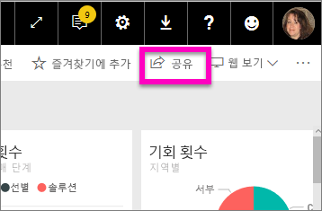
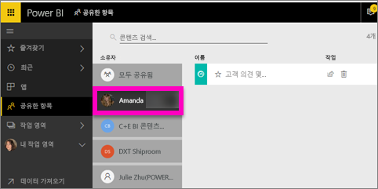

# 나와 공유한 Power BI 대시보드 표시
## 공유한 항목

동료가 나와 대시보드를 공유하고 있는 경우 해당 제목이 **공유한 항목** 목록에 추가됩니다. 대시보드는 **공유한 항목**에서만 사용 가능하며 작업 영역 또는 **앱**에서는 사용할 수 없습니다.

Amanda가 **공유한 항목** 콘텐츠 목록을 설명하고 목록을 탐색하고 필터링하는 방법을 보여 주는 비디오를 시청하세요. 그런 다음 비디오 아래에 있는 단계별 지침을 따라서 직접 시도해 볼 수 있습니다. 공유된 대시보드를 보려면 Power BI Pro 라이선스가 필요합니다. 자세한 내용은 [Power BI 프리미엄이란?](service-premium.md)을 참조하세요.

<iframe width="560" height="315" src="https://www.youtube.com/embed/G26dr2PsEpk" frameborder="0" allowfullscreen></iframe>

소유자가 사용자에게 부여한 권한에 따라, 대시보드 및 기본 보고서와 상호 작용할 수 있는 많은 옵션을 갖게 됩니다. 이러한 옵션에는 대시보드 사본 만들기, [읽기 보기에서](service-reading-view-and-editing-view.md) 보고서 열기, 다른 동료와 다시 공유 등이 있습니다.

## **공유한 항목** 화면에서 사용 가능한 작업
* 별 아이콘을 선택하여 [대시보드를 즐겨찾기에 추가](service-dashboard-favorite.md)합니다.
* [대시보드 제거](service-delete.md) 
* 일부 대시보드는 다시 공유할 수 있습니다.  
* 또한, 대시보드 목록이 길어지면 [검색 필드를 사용하여 정렬한 후 필요한 항목을 찾습니다](service-navigation-search-filter-sort.md).
  
  > [!NOTE]
  > EGRC 분류에 대한 자세한 내용은 분류 단추를 선택하거나 [대시보드 데이터 분류에 방문](service-data-classification.md)합니다.
  > 
  > 
* 대시보드 이름을 선택하여 연 후 탐색합니다. 공유 대시보드를 연 후에는 Q&A를 사용하여 기본 데이터에 대한 질문을 하거나 타일을 선택하여 읽기 보기로 보고서를 열고 상호 작용할 수 있습니다.

## 소유자별로 공유 대시보드 필터링
**공유한 항목** 화면의 콘텐츠는 콘텐츠 소유자별로 더 필터링할 수 있습니다. 예를 들어, **Amanda**를 선택하면 Amanda가 나와 공유한 대시보드만 보입니다.

## 다음 단계
[Power BI - 기본 개념](service-basic-concepts.md)  
[Power BI 프리미엄이란?](service-premium.md)  

궁금한 점이 더 있나요? [Power BI 커뮤니티에 질문합니다.](http://community.powerbi.com/)

