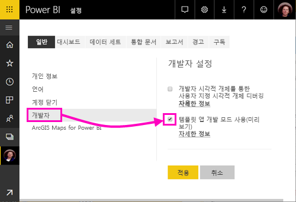
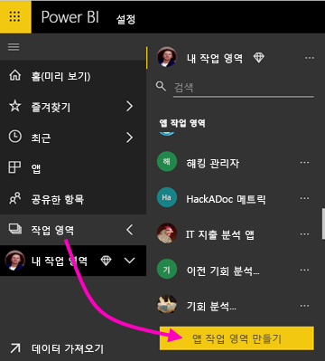
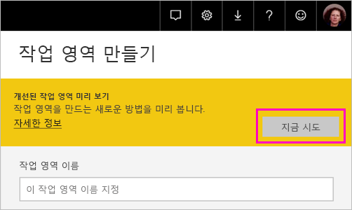
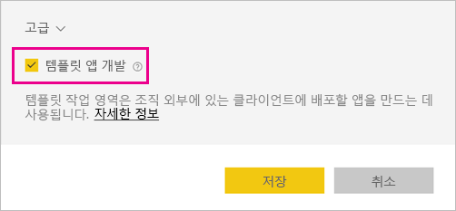
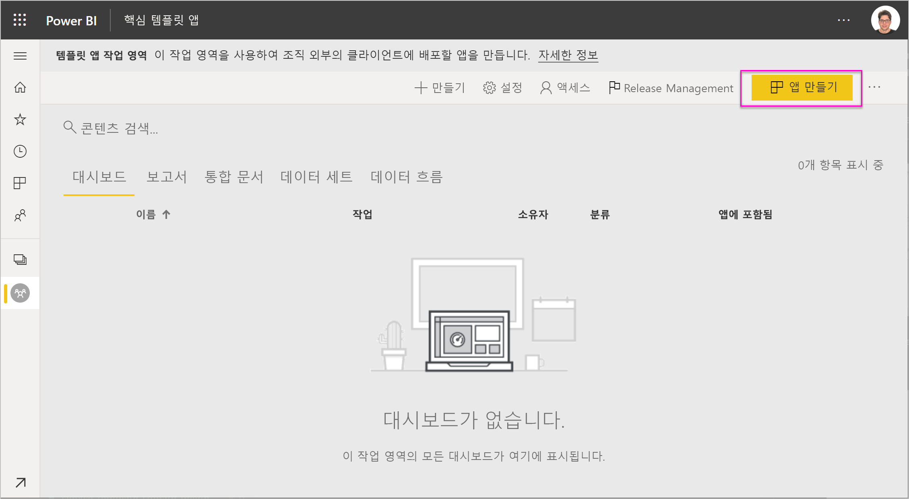
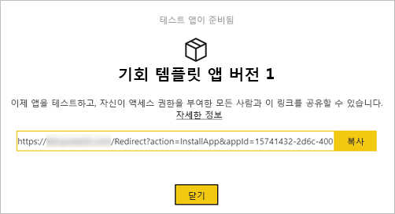
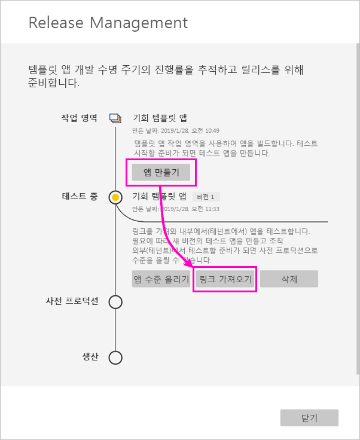
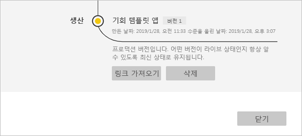
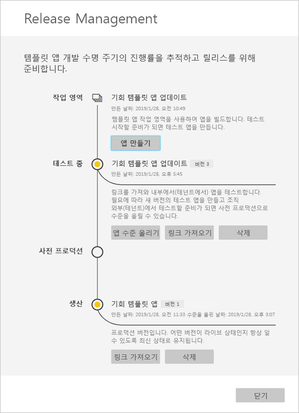

# Power BI(미리 보기)에서 템플릿 앱 만들기

새 Power BI *템플릿 앱*을 사용하면 Power BI 파트너는 코딩이 거의 없거나 전혀 없는 Power BI 앱을 만들고 모든 Power BI 고객에게 배포할 수 있습니다.  이 문서에서 Power BI 템플릿 앱을 만드는 단계별 지침이 포함되어 있습니다. 

Power BI 보고서 및 대시보드를 만들 수 있는 경우, 분석 콘텐츠를 빌드하고 *앱*에 패키징하는 *템플릿 앱 작성기*가 될 수 있습니다. 그런 다음, AppSource와 같은 사용 가능한 플랫폼을 통해 또는 자체 웹 서비스에서 사용하여 다른 Power BI 테넌트에 앱을 배포할 수 있습니다. 작성기는 배포를 위한 보호 분석 패키지를 만들 수 있습니다. 

Power BI 테넌트 관리자는 조직에서 템플릿 앱을 만들 수 있는 사람과 설치할 수 있는 사람을 관리하고 제어합니다. 권한이 있는 사용자는 템플릿 앱을 설치한 다음, 이를 수정하여 조직의 Power BI 소비자에게 배포할 수 있습니다.

## 필수 조건 

템플릿 앱을 빌드하기 위한 요구 사항은 다음과 같습니다.  

- [Power BI pro 라이선스](service-self-service-signup-for-power-bi.md)
- [Power BI Desktop 설치](desktop-get-the-desktop.md)(선택 사항)
- [Power BI의 기본 개념](service-basic-concepts.md) 숙지
- 템플릿 앱을 만들 수 있는 권한입니다. 자세한 내용은 Power BI [관리 포털, 템플릿 앱 설정](service-admin-portal.md#template-apps-settings-preview)을 참조하세요.

## 앱 개발자 모드 사용

다른 Power BI 테넌트에 배포할 수 있는 템플릿 앱을 만들려면 앱 개발자 모드에 있어야 합니다. 그렇지 않으면 자신의 조직에서 Power BI 소비자를 위한 앱을 만들고 있을 뿐입니다.
 
1. 브라우저에서 Power BI 서비스를 엽니다.
2. **설정** > **일반** > **개발자** > **템플릿 앱 개발 모드 사용**으로 이동합니다.

    

    해당 옵션이 표시되지 않으면 Power BI 관리자에게 문의하여 관리 포털에서 [템플릿 앱 개발에 대한 권한](service-admin-portal.md#template-apps-settings-preview)을 부여합니다.

3. **적용**을 선택합니다.

## 템플릿 앱 작업 영역 만들기

다른 Power BI 테넌트에 배포할 수 있는 템플릿 앱을 만들려면 새 앱 작업 영역 중 하나에서 만들어야 합니다. 
 
1. Power BI 서비스에서 **작업 영역** > **앱 작업 영역 만들기**를 선택합니다. 
 
    

3. **앱 작업 영역 만들기**의 **개선된 작업 영역 미리 보기**에서 **지금 사용해 보기**를 선택합니다.

    

5. 앱 작업 영역에 대한 이름, 설명(선택 사항) 및 로고 이미지(선택 사항)를 입력합니다.

4. **템플릿 앱 개발**을 선택합니다.

    

5. **저장**을 선택합니다.

## 템플릿 앱의 콘텐츠 만들기

일반 Power BI 앱 작업 영역과 마찬가지로, 다음 단계는 작업 영역에 콘텐츠를 만드는 것입니다.  템플릿 앱의 이 미리 보기 버전에서는 데이터 세트 한 개, 보고서 한 개, 대시보드 한 개의 각 유형별로 최대 한 개만 지원합니다.

- 앱 작업 영역에서 [Power BI 콘텐츠를 만듭니다](power-bi-creator-landing.md).

파워 쿼리에서 매개 변수를 사용하는 경우, 매개 변수가 잘 정의된 형식(예: 텍스트)인지 확인합니다. Any 및 Binary 형식은 지원되지 않습니다. 

[Power BI(미리 보기)에서 템플릿 앱 작성 팁](service-template-apps-tips.md)에는 템플릿 앱에 대한 보고서와 대시보드를 만들 때 고려해야 할 제안 사항이 있습니다.

## 테스트 템플릿 앱 만들기

이제 작업 영역에 콘텐츠가 있으므로 템플릿 앱에 패키징할 준비가 되었습니다. 첫 번째 단계는 테넌트의 조직 내에서만 액세스할 수 있는 테스트 템플릿 앱을 만드는 것입니다.

1. 템플릿 앱 작업 영역에서 **앱 만들기**를 선택합니다. 

    
 
    여기서는 네 가지 범주로 템플릿 앱에 대한 추가 매개 변수를 입력합니다. 

    **브랜딩**

    - 앱 이름 
    - 설명
    - 앱 로고(선택 사항)
    - 앱 색 

    **콘텐츠** 

    - 앱 방문 페이지(선택 사항): 보고서 또는 대시보드를 앱의 방문 페이지로 정의합니다.  
    
    **컨트롤** 

    애플리케이션 사용자는 애플리케이션의 콘텐츠에 대해 가질 수 있는 몇 제한 사항을 제어합니다. 이 콘텐츠를 사용하여 앱에 포함될 수 있는 특정 지적 재산을 보호할 수 있습니다.

    **액세스 권한**

    - 테스트 단계에서 앱을 설치하고 테스트할 수 있는 조직의 다른 사용자를 결정합니다.

    걱정하지 마세요, 나중에 언제든지 돌아와서 이러한 설정을 변경할 수 있습니다.  

2. **앱 만들기**를 선택합니다. 

    앱 테스터와 복사 및 공유할 수 있는 링크가 있는 테스트 앱이 준비되었다는 메시지가 표시됩니다.

    

    다음 단계인 릴리스 관리 프로세스의 첫 번째 단계도 완료했습니다.

    

## 템플릿 앱 릴리스 관리

이 템플릿 앱을 공개적으로 릴리스하기 전에 이동할 준비가 되었는지 확인하려고 합니다. Power BI는 전체 앱 릴리스 경로를 따라 검사할 수 있는 릴리스 관리 창을 만들었습니다. 단계 간 전환을 트리거할 수도 있습니다. 일반적인 단계는 다음과 같습니다. 

- 조직에서만 테스트하기 위한 앱을 생성합니다. 
- 테스트 패키지를 사전 프로덕션 단계로 승격: 조직 외부에서 테스트합니다.
- 사전 프로덕션 패키지를 프로덕션으로 승격: 프로덕션 버전입니다. 
- 모든 패키지를 삭제하거나 이전 단계에서 다시 시작합니다. 

단계를 진행해 보겠습니다.

1. 템플릿 앱 작업 영역에서 **Release Management**를 선택합니다.

    

2. **앱 만들기**를 선택합니다. 

    위의 **테스트 템플릿 앱 만들기**에서 태스트 앱을 만드는 경우 **테스트** 옆의 노란색 점이 이미 입력되어 있으므로 여기서 **앱 만들기**를 선택할 필요가 없습니다. 이를 선택하면 템플릿 앱 만들기 프로세스로 돌아갑니다.
 
3. **링크 가져오기**를 선택합니다.

    
 
9. 앱 설치 환경을 테스트하려면 알림 창에서 링크를 복사하여 새 브라우저 창에 붙여넣습니다. 

    여기에서 고객이 수행해야 할 동일한 절차를 수행하고 있습니다. 해당 버전에 대한 [조직의 템플릿 앱 설치 및 배포](service-template-apps-install-distribute.md)를 참조하세요.
 
10. 대화 상자에서 **설치**를 선택합니다.

    설치가 성공하면 새 앱이 준비되었다는 알림이 표시됩니다. 
 
11. **앱으로 이동**을 선택합니다.
 
12. **새 앱 시작**에서 고객에게 표시된 것처럼 앱이 표시됩니다. 

    

13. **앱 탐색**을 선택하여 샘플 데이터로 테스트 앱을 확인합니다.

1. 변경하려면 원래 작업 영역의 앱으로 돌아갑니다. 만족할 때까지 테스트 앱을 업데이트하세요.

9. 테넌트 외부 테스트에 대한 사전 프로덕션으로 앱을 승격할 준비가 되었으면 **Release Management** 창으로 돌아가서 **테스트** 옆의 **앱 승격**을 선택합니다.
 
    

11. **승격**을 선택하여 선택 사항을 확인합니다. 

12. 테스트를 위해 이 새 URL을 복사하여 테넌트 외부에서 공유합니다. 이 링크는 또한 AppSource에 앱을 배포하는 프로세스를 시작하기 위해 제출하는 링크입니다.

12. AppSource를 통해 프로덕션 또는 공유할 준비가 되면 **Release Management** 창으로 돌아가서 **사전 프로덕션** 옆의 **앱 승격**을 선택합니다.
 
11. **승격**을 선택하여 선택 사항을 확인합니다. 

    이제 앱이 프로덕션 중이며 배포할 준비가 되었습니다.

    

전 세계 수천 명의 Power BI 사용자가 앱을 널리 이용할 수 있도록 AppSource에 제출하는 것이 좋습니다. 자세한 내용은 [Power BI 애플리케이션 제안](https://docs.microsoft.com/azure/marketplace/cloud-partner-portal/power-bi/cpp-power-bi-offer)을 참조하세요. 

## 앱 업데이트

이제 앱이 프로덕션 중이므로, 프로덕션 중인 앱을 중단하지 않고 테스트 단계에서 다시 시작할 수 있습니다. 

1. **릴리스 관리** 창에서 **앱 만들기**를 선택합니다.

1. 앱 만들기 프로세스로 돌아갑니다. 
2. **브랜딩**, **콘텐츠**, **제어** 및 **액세스**를 설정한 후 **앱 만들기**를 다시 선택합니다.
3. **닫기**를 선택하고 **릴리스 관리**로 돌아갑니다. 

    이제 두 가지 버전이 있습니다. 프로덕션 중인 또는 테스트 중인 버전입니다. 

    

## 다음 단계

[조직의 템플릿 앱 설치, 사용자 지정 및 배포](service-template-apps-install-distribute.md)에서 고객이 템플릿 앱과 상호 작용하는 방법을 참조하세요.

앱 배포에 대한 자세한 내용은 [Power BI 애플리케이션 제안](https://docs.microsoft.com/azure/marketplace/cloud-partner-portal/power-bi/cpp-power-bi-offer)을 참조하세요.

