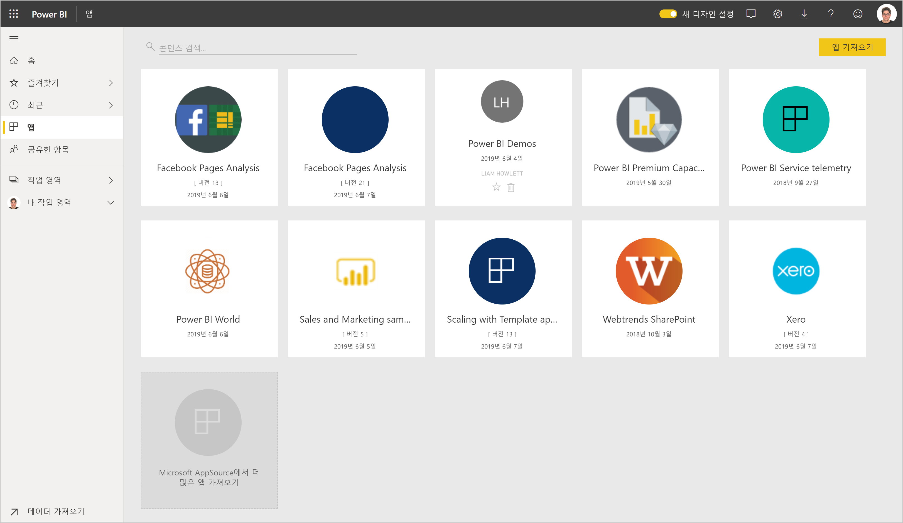
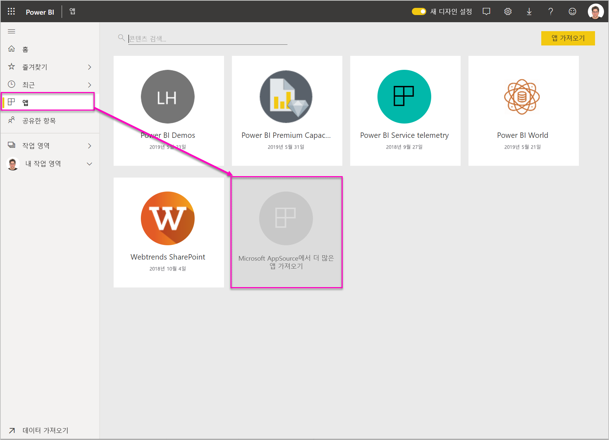
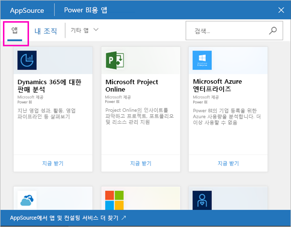
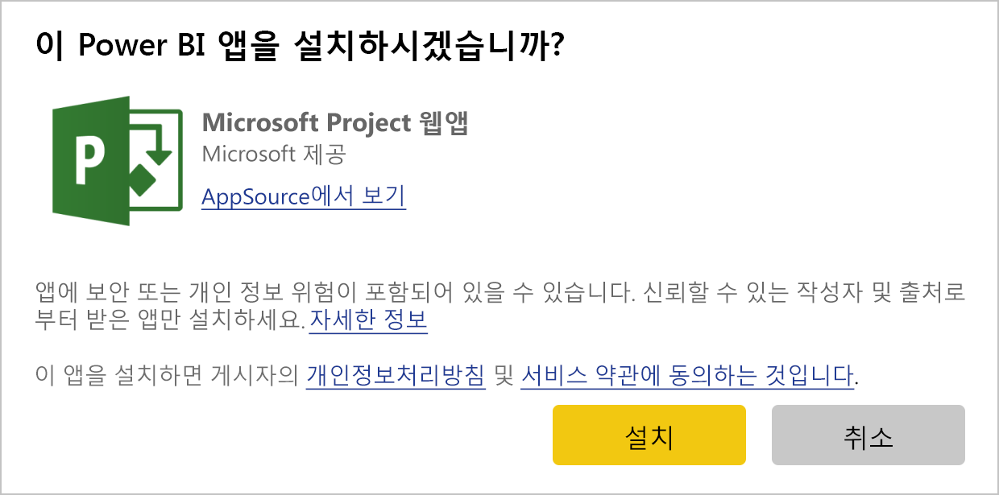
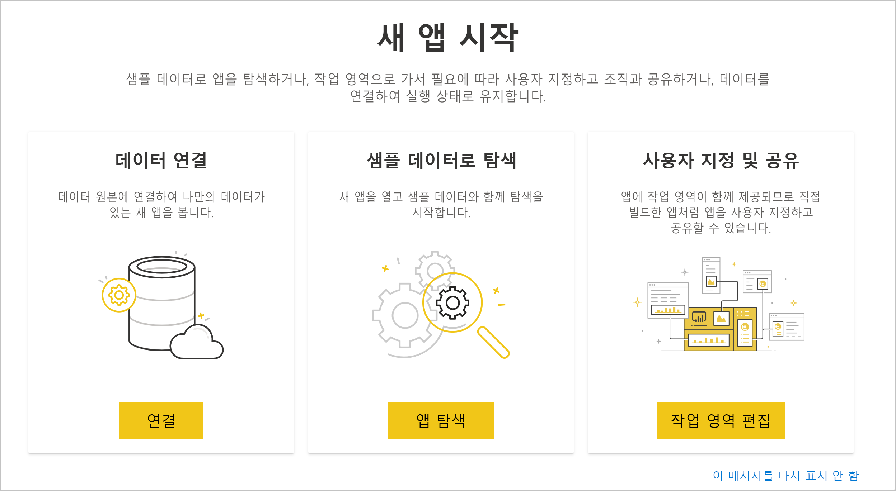
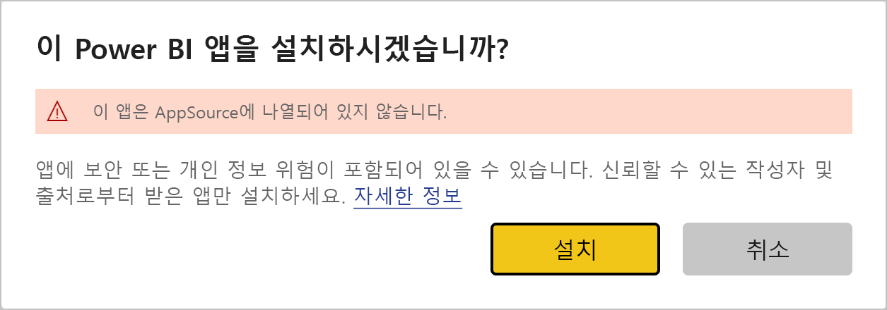
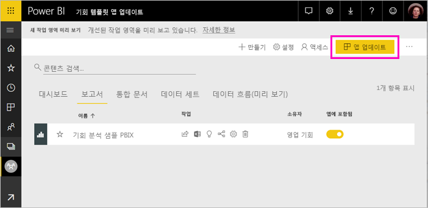
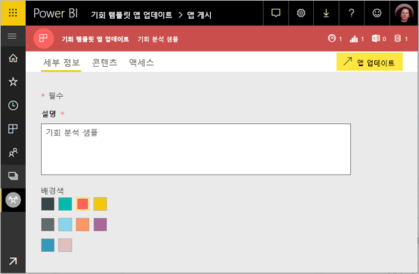
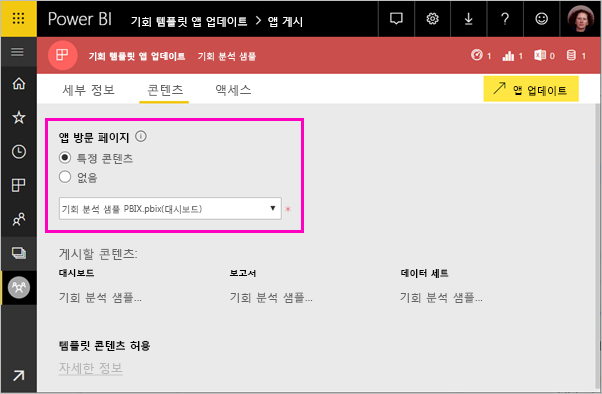

# 조직에 템플릿 앱 설치 및 배포 - Power BI

Power BI 분석가인가요? 따라서 이 문서에서는 Salesforce, Microsoft Dynamics, Google Analytics와 같이 비즈니스를 실행하는 데 사용하는 여러 서비스를 연결하기 위해 *템플릿 앱*을 설치하는 방법을 설명합니다. 대시보드 및 보고서를 수정하여 조직의 요구 사항을 충족한 다음, 동료에게 *앱*으로 배포할 수 있습니다. 

직접 배포할 템플릿 앱을 만드는 데 관심이 있는 [Power BI에서 템플릿 앱 만들기](service-template-apps-create.md)를 참조하세요. Power BI 파트너는 코딩이 거의 없거나 전혀 없는 Power BI 앱을 빌드하여 고객에게 배포할 수 있습니다. 

## 필수 조건  

템플릿 앱의 설치, 사용자 지정 및 배포에 대한 요구 사항은 다음과 같습니다. 

- [Power BI pro 라이선스](service-self-service-signup-for-power-bi.md)
- [Power BI의 기본 개념](service-basic-concepts.md) 숙지
- 템플릿 앱 작성자 또는 AppSource에서 유효한 설치 링크입니다. 
- 템플릿 앱을 설치할 권한입니다. 

## 템플릿 앱 설치

템플릿 앱에 대한 링크를 받을 수 있습니다. 그렇지 않은 경우 관심 있는 AppSource를 검색할 수 있습니다. 어느 방법이든 설치한 후에는 이를 수정하여 자신의 조직에 배포할 수 있습니다.

### 브라우저에서 AppSource 검색

브라우저에서 이 링크를 선택하여 Power BI 앱에 필터링된 AppSource를 엽니다.

- https://appsource.microsoft.com/marketplace/apps?product=power-bi

### Power BI 서비스에서 AppSource 검색

1. Power BI 서비스의 왼쪽 탐색 창에서 **앱** > **앱 가져오기**를 선택합니다.

    

2. AppSource에서 **앱**을 선택합니다.

    

3. 앱을 찾아보거나 검색한 다음, **지금 받기**를 선택합니다.

4. 대화 상자에서 **설치**를 선택합니다.

     Power BI Pro 라이선스가 있는 경우 앱은 연결된 앱 작업 영역과 함께 설치됩니다. 연결된 작업 영역에서 앱을 사용자 지정합니다.

    설치가 성공하면 새 앱이 준비되었다는 알림이 표시됩니다.
4. **앱으로 이동**을 선택합니다.
5. **새 앱 시작**에서 다음 세 가지 옵션 중 하나를 선택합니다.

    

    - **앱 탐색**: 기본 샘플 데이터 탐색입니다. 앱의 모양과 느낌을 가져오려면 여기서 시작합니다. 
    - **데이터 연결**: 데이터 원본을 샘플 데이터에서 사용자 고유의 데이터 원본으로 변경합니다. 데이터 세트 매개 변수 및 데이터 원본 자격 증명을 재정의할 수 있습니다. 템플릿 앱 팁 문서에서 [알려진 제한 사항](service-template-apps-tips.md#known-limitations)을 참조하세요. 
    - **작업 영역으로 이동**(가장 고급 옵션): 앱 작성기에서 허용되는 모든 변경 작업을 수행할 수 있습니다.

    또는 이 대화 상자를 건너뛰고 왼쪽 탐색 창의 **작업 영역**을 통해 연결된 작업 영역에 직접 액세스합니다.
    >[!NOTE]
    >*조직 앱*과 *앱 작업 영역* 모두에 설치된 템플릿 앱을 설치합니다. [Power BI에서 앱 배포](service-create-distribute-apps.md)에 대해 자세히 알아보세요.
 
6. 동료와 공유하기 전에 자신의 데이터에 연결하려고 합니다. 보고서 또는 대시보드를 수정하여 조직에서 사용할 수 있도록 할 수도 있습니다. 이 시점에서 다른 보고서나 대시보드를 추가할 수도 있습니다.

   AppSource에 나열되지 않은 앱에 대한 설치 링크를 선택하는 경우 선택 내용을 확인하라는 유효성 검사 대화 상자가 나타납니다.

   

   >[!NOTE]
   >AppSource에 나열되지 않은 템플릿 앱을 설치하려면 관리자 사용 권한으로 요청해야 합니다. 자세한 내용은 Power BI [관리 포털, 템플릿 앱 설정](service-admin-portal.md#template-apps-settings)을 참조하세요.

## 앱 업데이트 및 배포

조직용 앱을 업데이트하면 게시할 준비가 된 것입니다. 이 단계는 다른 모든 앱을 게시하는 경우와 동일합니다.

1. 사용자 지정을 마쳤으면 작업 영역 목록 보기에서 오른쪽 위 모서리에 있는 **앱 업데이트**를 선택합니다.  

    

2. **세부 정보**에서 설명 및 배경 색을 수정할 수 있습니다.

   

3. **콘텐츠**에서 대시보드 또는 보고서 중 하나의 방문 페이지를 선택할 수 있습니다.

   

4. **액세스**에서 선택한 사용자 또는 전체 조직에 액세스 권한을 부여합니다.  

   

5. **업데이트**를 선택합니다. 

6. 성공적으로 게시된 후에 링크를 복사하여 액세스 권한이 있는 사용자와 공유할 수 있습니다. 서로 공유한 경우 AppSource의 **내 조직** 탭에서도 볼 수 있습니다.

## 다음 단계 

[Power BI에서 동료와 작업 영역 만들기](service-create-workspaces.md)

  

 
