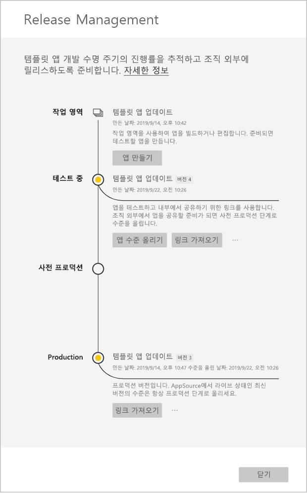

# 템플릿 앱 업데이트, 삭제 및 추출

이제 앱이 프로덕션 중이므로, 프로덕션 중인 앱을 중단하지 않고 테스트 단계에서 다시 시작할 수 있습니다.
## 앱 업데이트

1. **릴리스 관리** 창에서 **앱 만들기**를 선택합니다.
2. 앱 만들기 프로세스로 돌아갑니다.
3. **브랜딩**, **콘텐츠**, **제어** 및 **액세스**를 설정한 후 **앱 만들기**를 다시 선택합니다.
4. **닫기**를 선택하고 **릴리스 관리**로 돌아갑니다.

   이제 두 가지 버전이 있습니다. 프로덕션 중인 또는 테스트 중인 버전입니다.

    

5. 테넌트 외부 테스트에 대한 사전 프로덕션으로 앱을 승격할 준비가 되었으면 [릴리스 관리] 창으로 돌아가서 **테스트** 옆의 **앱 수준 올리기**를 선택합니다.
6. 링크가 이제 활성화됩니다. [Power BI 앱 제품 업데이트](https://docs.microsoft.com/azure/marketplace/cloud-partner-portal/power-bi/cpp-update-existing-offer)의 단계를 따라 CPP(Cloud 파트너 포털)에 다시 제출합니다.
7. CPP에서 제품의 유효성을 다시 검사할 뿐 아니라 제품을 다시 **게시**해야 합니다.

>[!NOTE]
>앱이 Cloud 파트너 포털에서 승인되고 앱을 게시한 후에만 프로덕션 단계로 앱 수준을 올립니다.

## 작업 영역 추출
이제 추출 기능을 사용하면 그 어느 때보다 쉽게 이전 버전의 템플릿 앱으로 롤백할 수 있습니다. 다음 단계에서는 다양한 릴리스 단계에서 새 작업 영역으로 특정 앱 버전을 추출합니다.

1. [릴리스 관리] 창에서 자세히 **(...)** , **추출**을 차례로 누릅니다.

     
2. 대화 상자에서 추출된 작업 영역의 이름을 입력합니다. 새 작업 영역이 추가됩니다.

새 작업 영역 버전 관리가 다시 설정되며 새로 추출된 작업 영역에서 템플릿 앱을 계속 개발 및 배포할 수 있습니다.

## 템플릿 앱 버전 삭제
템플릿 앱 작업 영역은 배포된 활성 템플릿 앱의 원본입니다. 템플릿 앱 사용자를 보호하려는 경우 먼저 작업 영역에서 생성된 모든 앱 버전을 제거해야 작업 영역을 삭제할 수 있습니다.
앱 버전을 삭제하면 더 이상 작동하지 않는 앱 URL도 삭제됩니다.

1. [릴리스 관리] 창에서 줄임표 **(...)** , **삭제**를 차례로 눌러 선택합니다.
 
 

>[!NOTE]
>고객 또는 **AppSource**가 사용 중인 앱 버전을 삭제하지 않아야 합니다. 삭제하면 더 이상 작동하지 않습니다.

## 다음 단계

[조직의 템플릿 앱 설치, 사용자 지정 및 배포](service-template-apps-install-distribute.md)에서 고객이 템플릿 앱과 상호 작용하는 방법을 참조하세요.

앱 배포에 대한 자세한 내용은 [Power BI 애플리케이션 제안](https://docs.microsoft.com/azure/marketplace/cloud-partner-portal/power-bi/cpp-power-bi-offer)을 참조하세요.
