# Power BI 서비스 살펴보기

Power BI 서비스를 오랫동안 사용 중인 경우 이제 사용자 인터페이스에 주요한 변경 사항이 생긴 것을 확인할 수 있습니다.  이러한 변경 내용은 콘텐츠(예: 대시보드, 보고서, 데이터 집합)가 구성되는 방법 및 해당 콘텐츠를 사용하여 작업을 수행하는 경로(클릭)에 영향을 줍니다. 

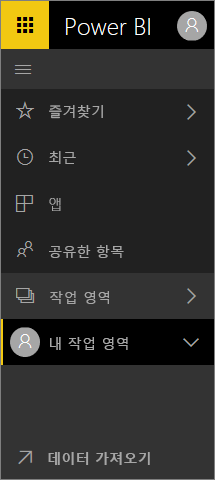

## 어떻게 할까요?
이전 Power BI 서비스 인터페이스에 익숙한 사용자의 경우 이 참조 가이드는 새 인터페이스에서 작업을 수행하는 방법을 파악할 수 있도록 도와 줍니다. 처음에는 혼란스러울 것이라고 판단하지만 새 레이아웃에 대한 많은 시간 절약 혜택을 발견할 것입니다. 

**빠른 참조 가이드**

| 작업 | 새(현재) 경로 |
| --- | --- | --- |
| 대시보드를 즐겨찾기에 추가 |작업 영역 > 대시보드 및 별 모양 아이콘을 선택하여 노란색으로 설정 |
| 즐겨 찾는 대시보드 목록 보기 |왼쪽 탐색 창에서 **즐겨찾기** 선택 |
| 최근에 방문한 대시보드 및 보고서 보기 |왼쪽 탐색 창에서 **최근** 선택 |
| 사용자와 공유된 대시보드 목록 보기 |왼쪽 탐색 창에서 **공유한 항목** 선택 |
| 대시보드 공유 |대시보드 열기 및 **공유** 선택 또는 앱 만들기 및 게시 |
| 대시보드 삭제 |내 작업 영역 > 대시보드 > 휴지통 아이콘 |
| 보고서 삭제 |내 작업 영역 > 보고서 > 휴지통 아이콘 |
| 데이터 집합 삭제 |내 작업 영역 > 데이터 집합 >... > 삭제 |
| 대시보드 열기 |작업 영역 > 대시보드 > 및 대시보드의 이름 선택 |
| 보고서를 엽니다. |작업 영역 > 보고서 > 및 보고서의 이름 선택 |
| 데이터 집합 열기 |작업 영역 > 데이터 집합 > 및 데이터 집합의 이름 선택 |
| 대시보드 만들기 |위쪽 탐색 모음에서 만들기 > 대시보드 선택 |
| 보고서 만들기 |위쪽 탐색 모음에서 만들기 > 보고서 선택 |
| 데이터 집합 만들기 |위쪽 탐색 모음에서 만들기 > 데이터 집합 선택 |
| 앱 만들기 |작업 영역 > 앱 작업 영역 만들기 |
| 사용자가 소유한 모든 대시보드, 보고서 및 데이터 집합의 목록 보기 |작업 영역 > 내 작업 영역 |

## Power BI 서비스에 대한 탐색 환경을 변경한 이유는?
* 대시보드, 보고서, 통합 문서 및 데이터 집합에 대한 목록 간소화    
* 즐겨찾기, 가장 최근 및 작업 영역 선택에 대한 빠른 액세스 플라이아웃 메뉴 추가    
* 대시보드, 보고서 및 데이터 집합에 대한 관련 콘텐츠 식별 방법 추가    
* 통합 문서를 위한 별도의 콘텐츠 영역 추가    
* 즐겨찾기 대시보드를 위한 별도의 영역 만들기    
* 사용자와 공유하는 콘텐츠를 위한 별도의 영역 만들기 
* 최신 콘텐츠를 위한 별도의 영역 만들기  
* 작업 완료에 필요한 클릭 횟수 감소 - 동일한 화면에서 콘텐츠 목록 및 해당 콘텐츠에 대해 수행할 수 있는 작업을 결합했습니다. 예를 들어, 대시보드와 보고서 간에 전환합니다.</td></tr></table>

Amanda가 새로운 탐색 환경을 설명하고 향상된 기능을 설명하는 비디오를 시청하세요.  그런 다음 비디오 아래에 있는 단계별 지침을 따라서 직접 탐색해 볼 수 있습니다.

<iframe width="560" height="315" src="https://www.youtube.com/embed/G26dr2PsEpk" frameborder="0" allowfullscreen></iframe>

## 일부 새 기능을 추가했습니다.
단계별 지침을 따라서 직접 탐색합니다.

### 콘텐츠(대시보드, 보고서, 통합 문서, 데이터 집합, 작업 영역, 앱) 보기
먼저 기본 콘텐츠(대시보드, 보고서, 데이터 집합, 통합 문서)가 어떻게 구성되는지 살펴 보겠습니다. 이전에는 모든 콘텐츠가 왼쪽 탐색 창에 나열되었습니다. 지금도 이 옵션은 있지만, 기본값은 작업 영역 컨텍스트 내에서 콘텐츠 형식별로 표시하는 것입니다. 왼쪽 탐색 창(왼쪽 탐색)에서 작업 영역을 선택하면 Power BI 캔버스의 오른쪽에 연결된 콘텐츠(대시보드, 보고서, 통합 문서, 데이터 집합)의 탭으로 채워집니다.

Power BI 무료가 있을 경우 단 하나의 작업 영역, 즉 **내 작업 영역**만 표시됩니다.

### 즐겨찾기 대시보드
**즐겨찾기**를 통해 가장 중요한 대시보드에 빠르게 액세스할 수 있습니다.  

1. 대시보드가 열려 있는 상태에서 오른쪽 위 모서리의 **즐겨찾기**를 선택합니다.
   
   
   
   **즐겨찾기**가 **즐겨찾기에서 제거**로 변경되고 별표 아이콘이 노란색으로 바뀝니다.
   
   
2. 즐겨찾기에 추가된 모든 대시보드의 목록을 표시하려면 왼쪽 탐색에서 **즐겨찾기** 오른쪽에 있는 화살표를 선택합니다. 왼쪽 탐색은 Power BI 서비스의 영구 기능이기 때문에 Power BI 서비스의 어디에서든 목록에 액세스할 수 있습니다.
   
    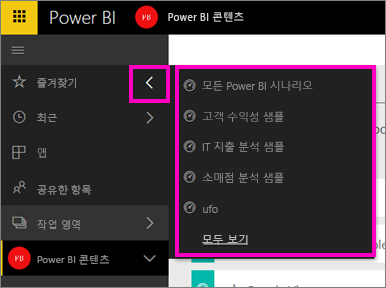
   
    여기에서 대시보드를 선택하여 열 수 있습니다.
3. **즐겨찾기** 창을 열려면 왼쪽 탐색에서 **즐겨찾기**를 선택하거나 즐겨찾기 아이콘 을 선택합니다.
   
   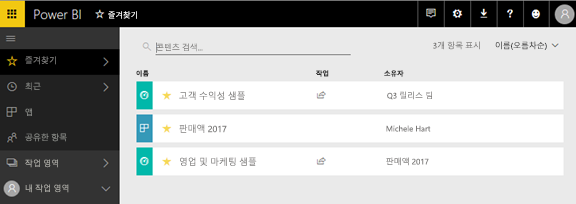
   
   여기에서 대시보드를 선택하여 열거나, 대시보드 소유자를 보거나, 대시보드를 즐겨찾기에서 제거하거나, 동료와 대시보드를 공유할 수 있습니다.
4. 대시보드를 즐겨찾기로 표시하는 또 다른 방법은 **대시보드** 탭에 있습니다.  대시보드가 포함된 작업 영역을 열고 대시보드 이름 왼쪽에 있는 별표 아이콘을 선택만 하면 됩니다.
   
   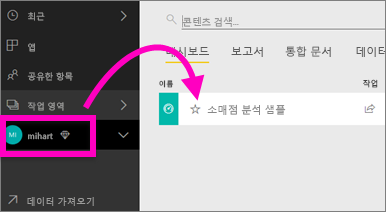

자세한 내용은 [대시보드를 즐겨찾기에 추가](service-dashboard-favorite.md)를 참조하세요.

### 최근
**최근** 창으로 가서 가장 최근에 액세스한 보고서 및 대시보드로 신속하게 이동하세요. 여기에는 모든 작업 영역의 콘텐츠가 포함됩니다.

  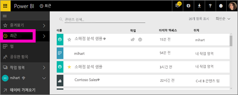

즐겨찾기와 마찬가지로 왼쪽 탐색의 **최근** 옆에 있는 화살표를 선택하면 Power BI 서비스의 어느 곳에서나 최근 항목에 빠르게 액세스할 수 있습니다.

  

자세한 내용은 [Power BI의 최근 항목](service-recent.md)을 참조하세요.

### 앱
앱은 한 곳에서 모든 주요 메트릭을 제공하도록 제작된 대시보드 및 보고서의 컬렉션입니다. 조직의 내부에 앱을 사용하고 Google 웹로그 분석 및 Microsoft Dynamics CRM 등과 같은 [외부 서비스에 대한 앱](service-connect-to-services.md)을 사용할 수 있습니다. 

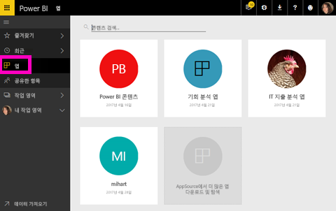

자세한 내용은 **앱 작업 영역**(아래)과 [Power BI 앱이란](service-install-use-apps.md)을 참조하세요.

### 공유한 항목
**공유한 항목**은 동료들이 사용자와 공유한 모든 대시보드의 위치입니다.  대시보드 소유자에 의해 필터링하고, 관련된 내용을 찾기 위해 검색 필드를 사용하고, 항목을 날짜별로 정렬합니다.  그리고 자주 방문하는 공유 콘텐츠의 경우 **공유한 항목** 보기에서 바로 즐겨찾기에 훨씬 쉽게 추가할 수 있습니다.

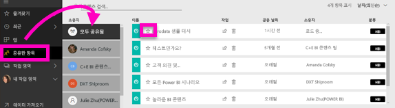

자세한 내용은 [공유한 항목](service-shared-with-me.md)을 참조하세요.

### 작업 영역 사용
탐색 창의 옆은 *작업 영역*입니다. 작업 영역은 Power BI 콘텐츠의 *컨테이너*로 간주될 수 있습니다. 작업 영역에는 **내 작업 영역**과 앱 작업 영역, 두 가지 유형이 있습니다.

앱 작업 영역 또는 관리자의 멤버가 아닐 경우, 왼쪽 탐색에 앱 작업 영역이 표시되지 않을 수 있습니다. Power BI 무료 고객인 경우 앱 작업 영역이 나타나지 않습니다.

#### 내 작업 영역
**내 작업 영역**은 소유하고 있는 모든 콘텐츠를 저장합니다. 고유한 콘텐츠에 대한 개인 샌드박스 또는 작업 영역으로 생각하면 됩니다. 내 작업 영역의 콘텐츠를 동료와 공유할 수 있습니다. 내 작업 영역 내에서 콘텐츠는 대시보드, 보고서, 통합 문서, 데이터 집합이라는 네 개의 탭으로 구성됩니다.

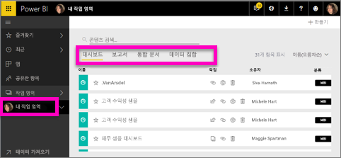

#### 앱 작업 영역
앱과 앱 작업 영역은 Power BI Pro의 기능입니다. 다른 사용자를 위해 대시보드 및 보고서를 만드는 사용자라면 이 작업을 수행하기 위해 앱 작업 영역을 사용하게 됩니다. 앱 작업 영역은 앱을 만드는 곳이므로, 앱을 만들려면 먼저 앱 작업 영역을 만들어야 합니다. 앱의 콘텐츠를 위한 영역 및 컨테이너를 스테이징하는 그룹 작업 영역이 진화된 것입니다.  사용자 및 동료는 대시보드, 보고서는 물론, 더 광범위한 대상 그룹이나 조직 전체에 배포할 계획이 있는 기타 콘텐츠에 대해 공동 작업할 수 있습니다.

자세한 내용은 [Power BI에서 앱 만들기 및 배포](service-create-distribute-apps.md#app-workspaces)를 참조하세요.

**내 작업 영역** 내에서 콘텐츠는 대시보드, 보고서, 통합 문서, 데이터 집합이라는 네 개의 탭으로 구성됩니다.

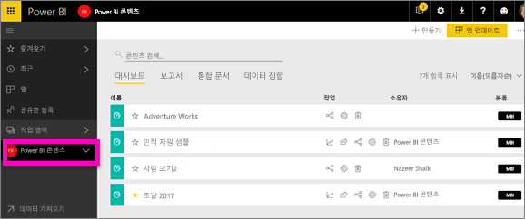

왼쪽 창에서 **작업 영역**을 참조하여 작업 영역을 전환합니다.

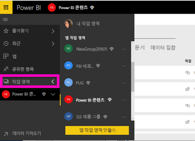

### 콘텐츠 검색 및 정렬
새 콘텐츠 보기를 사용하면 콘텐츠를 더 쉽게 검색, 필터링 및 정렬할 수 있습니다. 대시보드, 보고서 또는 통합 문서를 검색하려면 검색 영역에서 입력합니다. Power BI에서는 검색 문자열이 이름의 일부로 포함된 콘텐츠만 필터링합니다.

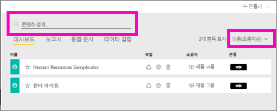

또한, 이름 또는 소유자별로 콘텐츠를 정렬할 수도 있습니다.  

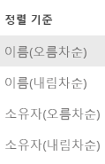

자세한 내용은 [Power BI 탐색: 검색, 정렬, 필터링](service-navigation-search-filter-sort.md)을 참조하세요.

## 다음 단계
질문이나 의견이 있으십니까? [Power BI 커뮤니티 포럼 방문](http://community.powerbi.com/t5/Navigation-Preview-Forum/bd-p/NavigationPreview)

