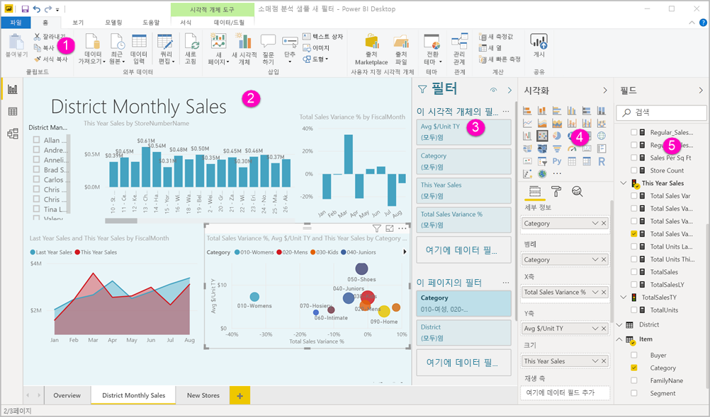
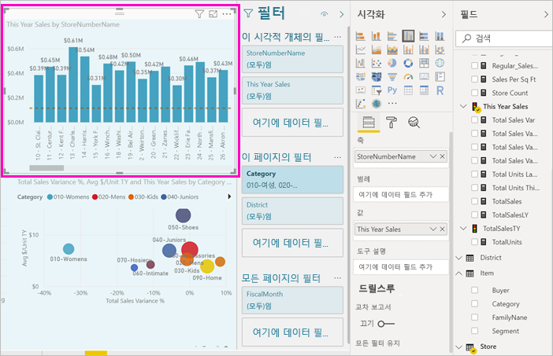
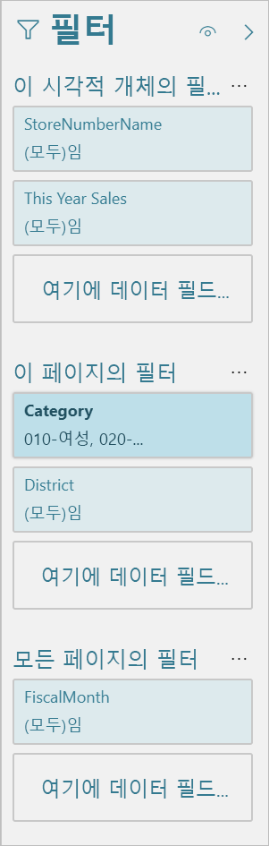
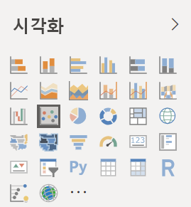
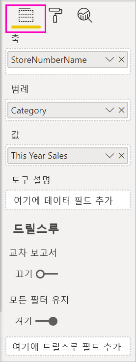
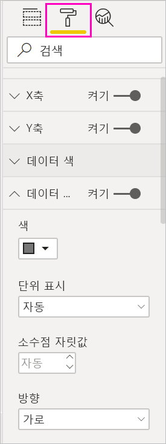
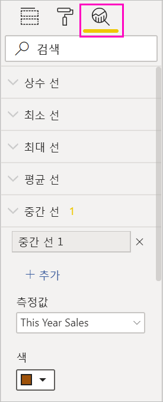
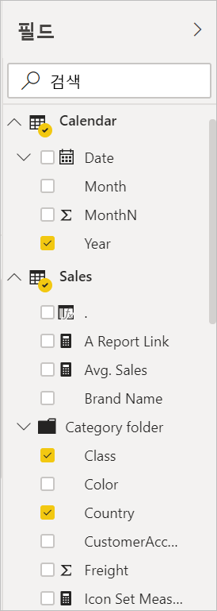

# Power BI의 보고서 편집기 둘러보기

Power BI Desktop 및 Power BI 서비스의 ‘보고서 편집기’에서는 차트, 테이블, 지도 및 기타 시각적 개체를 사용하여 소비자에게 표시되는 보고서를 디자인합니다.  보고서 편집기는 두 환경에서 비슷합니다. 일반적으로, 먼저 Power BI Desktop에서 보고서를 만듭니다. 그런 후에 보고서를 Power BI 서비스에 게시하고 계속 수정할 수 있습니다. Power BI 서비스에서는 보고서를 기반으로 대시보드를 만들 수도 있습니다.

대시보드와 보고서를 만든 후에는 보고서 소비자에게 배포합니다. 공유 방법에 따라 최종 사용자는 Power BI 서비스의 읽기용 보기에서 보고서나 대시보드를 조작할 수 있지만, 편집할 수는 없습니다. [보고서 소비자가 Power BI 서비스에서 수행할 수 있는 작업](consumer/end-user-reading-view.md)을 자세히 알아보세요. 

이 비디오는 Power BI Desktop의 보고서 편집기를 보여줍니다. 이 문서에서도 Power BI Desktop의 보고서 편집기를 보여 줍니다. 

<iframe width="560" height="315" src="https://www.youtube.com/embed/IkJda4O7oGs" frameborder="0" allowfullscreen></iframe>

Power BI 서비스에서 보고서 편집기는 편집용 보기로만 제공됩니다. 편집용 보기에서 보고서를 열려면 보고서 소유자 또는 작성자이거나, 보고서를 포함하는 작업 영역의 참가자여야 합니다.

Power BI 보고서 편집기는 다음과 같은 몇 개의 주요 섹션으로 나누어져 있습니다.  

1. 위쪽 탐색 창
1. 보고서 캔버스
1. 필터 창
1. 시각화 창
1. 필드 창

## 1. 위쪽 탐색 창
위쪽 탐색 창에서 사용할 수 있는 작업은 여러 가지가 있으며, 항상 새로운 작업이 추가됩니다. 특정 작업에 대한 자세한 내용을 보려면 Power BI 설명서의 목차나 검색 상자를 사용합니다.

## 2. 보고서 캔버스
보고서 캔버스는 작업이 표시되는 위치입니다. 필드, 필터 및 시각화 창을 사용하여 시각 효과를 만들 경우 해당 항목이 보고서 캔버스에 구성되어 표시됩니다. 캔버스 아래의 각 탭은 보고서의 페이지를 나타냅니다. 해당 페이지를 열려면 탭을 선택합니다. 

## 보고서 편집기 창

보고서를 처음 열면 다음 세 개의 창이 표시됩니다. 필터, 시각화 및 필드. 왼쪽에 있는 처음 두 개의 창인 필터와 시각화는 시각화의 모양(유형, 색, 필터링, 서식)을 제어합니다. 오른쪽에 있는 마지막 창인 필드는 시각화에 사용되는 기본 데이터를 관리합니다. 보고서 편집기에 표시되는 콘텐츠는 보고서 캔버스에서 선택하는 항목에 따라 달라집니다. 

예를 들어 이 세로 막대형 차트와 같은 개별 시각적 개체를 선택하는 경우 다음과 같이 표시됩니다.

**필터 창**에는 시각적 개체, 페이지 또는 모든 페이지의 필터가 표시됩니다. 이 경우에는 페이지 수준 필터만 있고 시각적 수준 필터는 없습니다.

**시각화 창의 맨 위**에서는 사용 중인 시각적 개체의 유형을 확인합니다. 이 예제에서는 묶은 세로 막대형 차트입니다. 

**시각화 창의 맨 아래**에는 다음 세 개의 탭이 있습니다.

 **필드**에는 시각적 개체의 필드가 표시됩니다. 모든 세부 정보를 보려면 아래로 스크롤해야 할 수도 있습니다. 이 차트는 StoreNumberName 및 This Year Sales를 사용합니다.

 **서식** 선택한 시각화의 서식 창을 표시하려면 페인트 롤러 아이콘을 선택합니다.

 **분석** 분석 창을 표시하려면 돋보기 아이콘을 선택합니다.

**필드 창**에는 데이터 모델에서 사용 가능한 모든 테이블이 나열됩니다. 테이블을 펼치면 해당 테이블의 필드가 표시됩니다. 노란색 확인 표시는 해당 테이블의 필드가 시각화에 하나 이상 있음을 나타냅니다.

각 창에 대한 세부 정보를 계속 읽어 보세요.

## 3. 필터 창
필터 창을 사용하여 페이지, 보고서, 드릴스루 및 시각적 수준에서 보고서에 대한 지속 필터를 보고 설정하고 수정할 수 있습니다. 예, 시각적 개체의 요소를 선택하거나 슬라이서 같은 도구를 사용하여 보고서 페이지 및 시각적 개체에서 임시 필터링을 수행할 수 있습니다. 필터 창의 필터링은 필터의 상태가 보고서와 함께 저장된다는 장점이 있습니다. 

필터 창에는 또 다른 강력한 기능이 있습니다. 즉, ‘보고서의 시각적 개체 중 하나에 없는’ 필드를 사용하여 필터링할 수 있습니다.  설명해 보겠습니다. 시각화를 만들 때 Power BI는 시각화의 모든 필드를 필터 창의 시각적 개체 수준 필터 영역에 자동으로 추가합니다. 현재 시각화에 사용되지 않는 필드를 사용하여 시각적 개체, 페이지, 드릴스루 또는 보고서 필터를 설정하려면 필터 버킷 중 하나로 끌어오면 됩니다.

새 필터 환경은 더 많은 유연성을 제공합니다. 예를 들어 보고서와 같은 모양으로 필터에 서식을 지정할 수 있습니다. 필터를 잠그거나 보고서 소비자에게 숨길 수도 있습니다. 

[새 필터 환경](power-bi-report-filter.md)을 자세히 알아보세요.

## 4. 시각화 창

시각화 창에는 4개의 섹션이 있습니다. 창의 맨 위에서 시작하겠습니다.

여기서는 시각화 유형을 선택합니다. 만들 수 있는 다양한 유형의 시각화가 작은 아이콘으로 표시됩니다. 위 그림에서는 거품형 차트를 선택했습니다. 먼저 시각화 유형을 선택하지 않고 필드를 선택하여 시각화 빌드를 시작하면, Power BI가 자동으로 시각화 유형을 선택합니다. Power BI의 선택을 그대로 사용하거나, 다른 아이콘을 선택하여 유형을 변경할 수 있습니다.

사용자 지정 시각화를 Power BI Desktop으로 다운로드할 수 있습니다. 해당 아이콘도 이 창에 표시됩니다. 

### 시각화의 필드 관리

이 창의 버킷(*웰*이라고도 함)은 선택한 시각화 유형에 따라 달라집니다.  예를 들어 가로 막대형 차트를 선택한 경우 축, 범례, 값이 표시됩니다. 필드를 선택하거나 캔버스로 끌어오면, Power BI는 해당 필드를 버킷 중 하나에 추가합니다.  필드 목록의 필드를 직접 버킷으로 끌어갈 수도 있습니다.  일부 버킷은 특정 형식의 데이터로 제한됩니다.  예를 들어 **값**은 숫자가 아닌 필드를 허용하지 않습니다. 따라서 **Category** 필드를 **값** 버킷으로 끌어오면, Power BI에서 해당 필드를 **Count of Category**로 변경합니다.

자세한 내용은 [Power BI 보고서에 시각화 추가](visuals/power-bi-report-add-visualizations-i.md)를 참조하세요.

창의 이 부분에는 [드릴스루](desktop-drillthrough.md) 및 필터 동작을 제어하는 옵션도 있습니다.

### 시각적 개체 서식 지정
페인트 롤러 아이콘을 선택하여 서식 창을 엽니다. 선택한 시각화의 형식에 따라 사용할 수 있는 옵션이 달라집니다.

매우 다양한 서식 지정이 가능합니다.  자세히 알아보려면 직접 살펴보거나 다음 문서를 참조하세요.

* [시각화 제목, 배경 및 범례 사용자 지정](visuals/power-bi-visualization-customize-title-background-and-legend.md)
* [색 서식 지정](visuals/service-getting-started-with-color-formatting-and-axis-properties.md)
* [X축 및 Y축 속성 사용자 지정](visuals/power-bi-visualization-customize-x-axis-and-y-axis.md)

### 시각화에 분석 추가
분석 창을 표시하려면 돋보기 아이콘을 선택합니다. 선택한 시각화의 형식에 따라 사용할 수 있는 옵션이 달라집니다.

Power BI 서비스의 분석 창에서 시각적 개체에 동적 참조선을 추가하고, 중요한 추세 또는 인사이트에 집중할 수 있습니다. 자세한 내용은 [Power BI Desktop의 분석 창](desktop-analytics-pane.md)을 참조하세요.

## 5. 필드 창
필드 창은 시각화를 만드는 데 사용할 수 있는 데이터의 테이블, 폴더 및 필드를 표시합니다.

|  |  |
| --- | --- |
|  |<ul><li>필드를 페이지로 끌어 새 시각화를 시작합니다.  필드를 기존 시각화로 끌어 필드를 해당 시각화에 추가할 수도 있습니다.  </li> <li>필드 옆에 있는 확인 표시를 추가하면 Power BI가 해당 필드를 활성(또는 새) 시각화에 추가합니다. 또한 해당 필드에 배치할 버킷도 결정됩니다.  예를 들어 필드가 범례, 축 또는 값에서 사용되어야 하나요? Power BI가 최적 사항을 제안하며 필요한 경우 사용자가 버킷에서 해당 항목을 움직일 수 있습니다.   </li><li>어떤 방법을 사용하든 선택한 각 필드가 보고서 편집기의 시각화 창에 추가됩니다.</li></ul> |

Power BI Desktop에는 필드 표시/숨기기, 계산 추가 등의 옵션도 있습니다.

## 필드 아이콘

Power BI는 여러 다른 아이콘을 사용하여 보고서의 필드 유형을 나타냅니다. 아이콘을 인식할 수 있으면, 아이콘이 시각적 개체에 따라 어떻게 동작하는지를 잘 파악할 수 있습니다. 다음은 몇 가지 일반적인 아이콘입니다.

|아이콘  |의미  |
|---------|---------|
|  | 필드 목록의 폴더 |
| | 숫자 필드: 숫자 필드는 합계, 평균 등을 구할 수 있는 집계입니다. 집계는 데이터와 함께 가져오고, 보고서의 기반이 되는 데이터 모델에서 정의됩니다. 자세한 내용은 [Power BI 보고서의 집계](service-aggregates.md)를 참조하세요. |
| | 숫자가 아닌 데이터 형식의 계산 열: 열 값을 정의하는 DAX(Data Analysis Expressions) 수식을 사용하여 만드는 숫자가 아닌 새 열입니다. [계산 열](desktop-calculated-columns.md)에 대해 자세히 알아보세요. |
|     |   숫자 계산 열: 열 값을 정의하는 DAX(Data Analysis Expressions) 수식을 사용하여 만드는 새 열입니다. [계산 열](desktop-calculated-columns.md)에 대해 자세히 알아보세요. |
| |  측정값: 측정값에는 하드 코드된 고유한 수식이 있습니다. 계산은 변경할 수 없습니다. 예를 들어 합계인 경우 합계만 될 수 있습니다. 값은 열에 저장되지 않습니다. 시각적 개체에서의 해당 위치만 사용하여, 즉석에서 계산됩니다. 자세한 내용은 [측정값 이해](desktop-measures.md)를 참조하세요. |
|     | 측정값 그룹  |
| |      KPI: 측정 가능한 목표에 대해 만든 진행률의 정도를 알리는 시각적 신호입니다. [KPI(핵심 성과 지표)](visuals/power-bi-visualization-kpi.md) 시각적 개체에 대해 자세히 알아보세요. |
|     |  필드 계층 구조: 화살표를 선택하여 계층 구조를 구성하는 필드를 확인합니다.  자세한 내용을 보려면 [계층 구조를 만들고 사용하는 방법](https://www.youtube.com/watch?v=q8WDUAiTGeU)에 대한 YouTube의 Power BI 동영상을 시청하세요. |
|     | 지역 데이터: 이러한 위치 필드는 지도 시각화를 만드는 데 사용할 수 있습니다. |
|      | ID 필드: 이 아이콘이 있는 필드는 ‘고유 필드’이며, 중복된 값이 있는 경우에도 모든 값을 표시하도록 설정됩니다.  예를 들어 데이터에 ‘Robin Smith’라는 서로 다른 두 사람에 대한 레코드가 있을 수 있으며, 각 레코드는 고유한 것으로 처리됩니다. 합계가 계산되지 않습니다.   |
|   | 매개 변수: 매개 변수를 설정하여 보고서 및 데이터 모델의 일부(예: 쿼리 필터, 데이터 원본 참조, 측정값 정의 등)가 하나 이상의 매개 변수 값에 따라 달라지도록 합니다. 자세한 내용은 [쿼리 매개 변수](https://powerbi.microsoft.com/blog/deep-dive-into-query-parameters-and-power-bi-templates/)에 대한 Power BI 블로그 게시물을 참조하세요. |
|  | 기본 제공 날짜 테이블이 있는 달력 날짜 필드 |

## 다음 단계
[보고서 만들기](service-report-create-new.md)

[Power BI 서비스](service-report-create-new.md), [Power BI Desktop](desktop-report-view.md) 및 [Power BI 모바일 앱](consumer/mobile/mobile-apps-view-phone-report.md)의 보고서에 대해 자세히 알아보세요.

[Power BI 디자이너에 대한 기본 개념](service-basic-concepts.md)

궁금한 점이 더 있나요? [Power BI 커뮤니티를 이용하세요.](https://community.powerbi.com/)

