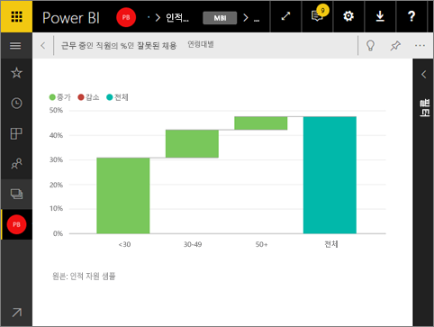

# 전체 화면 모드에서 대시보드 타일 표시
먼저 타일이 [포커스 모드](service-focus-mode.md)에 있어야 전체 화면 모드에서 표시할 수 있습니다.

## 전체 화면 모드 정의
메뉴 및 탐색 단추 없이 [대시보드, 보고서](service-fullscreen-mode.md) 및 타일을 표시합니다.  항상 한 눈에 비즈니스 전체를 볼 수 있습니다. 이를 TV 모드라고도 합니다.

다음과 같은 경우에 전체 화면 모드를 사용합니다.

* 모임이나 회의에서 타일 프레젠테이션
* 사무실의 큰 전용 화면이나 프로젝터에 타일 표시
* 작은 화면에서 타일 확인
* 잠긴 모드에서 타일 검토 - 기본 보고서를 열지 않고 화면을 터치하거나 타일을 마우스로 가리킬 수 있습니다.

## 전체 화면 모드를 켜려면(끄려면)
1. [타일을 팝아웃하고 포커스 모드에서 표시합니다](service-focus-mode.md).
   
    
   
    타일이 캔버스를 채워 자세히 볼 수 있습니다. 대시보드 타일에 대한 포커스 모드에서 이 시각화 개체를 만들 때 적용된 필터를 확인하고 수정할 수 있습니다.
   
    
2. 위의 메뉴 모음에서 이 아이콘 을(를) 선택하여 전체 화면 모드에서 타일을 표시합니다.
3. 전체 화면 모드에서는 타일이 전체 화면을 채우며 시선을 분산시키는 메뉴나 탐색 단추 없이 표시됩니다.  항상 한 눈에 타일 전체를 볼 수 있습니다. 이를 TV 모드라고도 합니다.
   
   
4. 마우스를 이동하면 메뉴가 나타납니다. 전체 화면 모드를 종료할 때까지 메뉴는 하단 오른쪽 모서리에 남아 있습니다. 사라지는 경우 커서를 이동하거나 화면을 누릅니다.
   
    
   
   * **뒤로** 단추를 사용하여 브라우저에서 이전 페이지로 이동합니다. 이전 페이지가 Power BI 서비스 페이지였던 경우 전체 화면 모드로 표시됩니다.  전체 화면 모드는 전체 화면을 닫을 때까지 유지됩니다.
   * 전체 화면 모드에서 타일을 인쇄하려면 인쇄 아이콘을 선택합니다.
     
   * 전체 화면 모드를 종료하려면 **전체 화면 닫기** 아이콘 을 선택합니다.

## 다음 단계
[Power BI의 대시보드](service-dashboards.md)

[대시보드 및 보고서의 전체 화면 모드](service-fullscreen-mode.md)

[Power BI의 포커스 모드](service-focus-mode.md)

궁금한 점이 더 있나요? [Power BI 커뮤니티를 이용하세요.](http://community.powerbi.com/)

