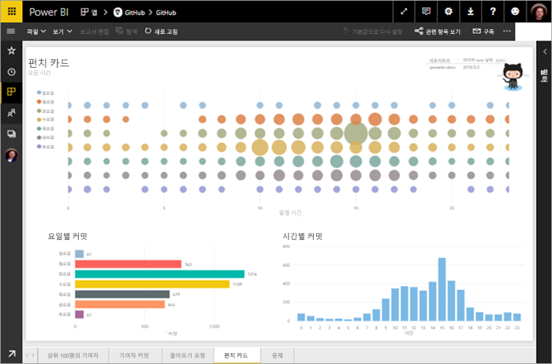
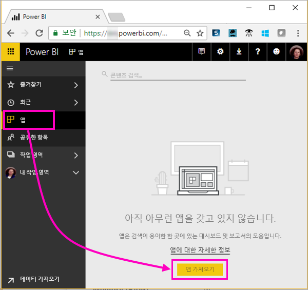
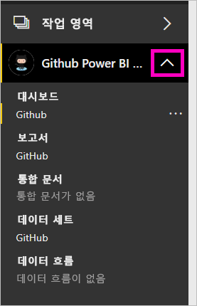
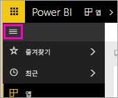
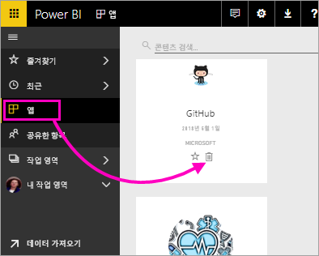

---
title: '자습서:  Power BI를 사용하여 GitHub 리포지토리에 연결'
description: 이 자습서에서는 Power BI를 사용하여 GitHub 서비스의 실제 데이터에 연결하고, Power BI는 대시보드와 보고서를 자동으로 만듭니다.
author: maggiesMSFT
ms.reviewer: SarinaJoan
ms.service: powerbi
ms.subservice: powerbi-service
ms.custom: connect-to-services
ms.topic: tutorial
ms.date: 08/07/2019
ms.author: maggies
LocalizationGroup: Connect to services
ms.openlocfilehash: 986f35cd1c4f612b16374107487d0ca20c9c607e
ms.sourcegitcommit: 64c860fcbf2969bf089cec358331a1fc1e0d39a8
ms.translationtype: HT
ms.contentlocale: ko-KR
ms.lasthandoff: 11/09/2019
ms.locfileid: "73871269"
---
# 자습서:  Power BI를 사용하여 GitHub 리포지토리에 연결
이 자습서에서는 Power BI를 사용하여 GitHub 서비스의 실제 데이터에 연결하고, Power BI는 대시보드와 보고서를 자동으로 만듭니다. Power BI 콘텐츠 공용 저장소(*리포지토리*라고도 하는)에 연결하여 다음과 같은 질문에 대한 답변을 볼 수 있습니다:  얼마나 많은 사람들이 Power BI 공개 콘텐츠에 기여하나요? 가장 많이 기여하는 사람은 누구인가요? 어떤 요일에 기여가 가장 많은가요? 그리고 기타 질문들이 있습니다. 

이 자습서에서 수행하는 단계는 다음과 같습니다.

> [!div class="checklist"]
> * GitHub 계정이 아직 없는 경우 이 계정에 등록 
> * Power BI 계정에 로그인 또는 해당 계정이 아직 없는 경우 이 계정에 등록
> * Power BI 서비스 열기
> * GitHub 앱 찾기
> * Power BI 공용 GitHub 리포지토리에 대한 정보 입력
> * GitHub 데이터를 사용하여 대시보드 및 보고서 보기
> * 앱을 삭제하여 리소스 정리

아직 Power BI에 등록하지 않은 경우 시작하기 전에 [평가판에 등록합니다](https://app.powerbi.com/signupredirect?pbi_source=web).

## 필수 조건

이 자습서를 완료하려면 GitHub 계정이 필요합니다. 아직 GitHub 계정이 없으면 다음을 수행합니다. 

- [GitHub 계정](https://docs.microsoft.com/contribute/get-started-setup-github)에 등록합니다.

## 연결 방법
1. Power BI 서비스 (https://app.powerbi.com) 에 로그인합니다. 
2. 탐색 창에서 **앱**, **앱 가져오기**를 선택합니다.
   
    

3. **앱**을 선택하고, 검색 상자에 **GitHub**를 입력하고 > **지금 받기** 합니다.
   
    

4. **이 Power BI 앱을 설치하겠습니까?** 에서 **설치**를 선택합니다.
5. **새 앱이 준비되었습니다.** 가 표시되면 **앱으로 이동**을 선택합니다.
6. **새 앱 시작**에서 **데이터**를 선택합니다.

    

7. 리포지토리의 리포지토리 이름과 리포지토리 소유자를 입력합니다. 이 리포지토리에 대한 URL은 https://github.com/MicrosoftDocs/powerbi-docs 이므로 **리포지토리 소유자**는 **MicrosoftDocs**이고 **리포지토리**는 **powerbi-docs**입니다. 
   
    

5. 만든 GitHub 자격 증명을 입력합니다. 브라우저에서 GitHub에 이미 로그인되어 있으면 Power BI에서 이 단계를 건너뛸 수 있습니다. 

6. **인증 방법**에 대해서는, 선택된 **oAuth2**를 유지하고 \> **로그인**합니다.

7. GitHub 인증 화면을 따릅니다. GitHub 데이터에 대한 Power BI 권한을 부여합니다.
   
   이제 Power BI에서 GitHub와 연결하고 데이터에 연결할 수 있습니다.  하루에 한 번 데이터가 새로 고쳐집니다.

8. Power BI가 데이터를 가져오면 새 GitHub 작업 영역의 콘텐츠가 표시됩니다. 
9. 탐색 창에서 작업 영역 이름 옆에 있는 화살표를 선택합니다. 작업 영역에 대시보드 및 보고서가 포함되어 있는 것을 확인할 수 있습니다. 

    

10. 대시보드 이름 옆에 있는 **추가 옵션**(...)을 선택한 다음 > **이름 바꾸기**를 선택하고 > **GitHub 대시보드**를 입력합니다.
 
     

8. 전역 탐색 아이콘을 선택하여 탐색 창을 최소화하면 더 많은 공간을 확보할 수 있습니다.

    

10. GitHub 대시보드를 선택합니다.
    
    GitHub 대시보드에는 실시간 데이터가 포함되므로 표시되는 값이 다를 수 있습니다.

    

    

## 질문하기

1. **데이터에 대해 질문하기**에 커서를 놓습니다. Power BI는 **시작할 질문**을 제공합니다. 

1. **how many users are there**를 선택합니다.
 
    

13. **how many**와 **users are there** 사이에 **pull requests per**를 입력합니다.

     Power BI에서 사용자별 끌어오기 요청 수를 나타내는 가로 막대형 차트를 만듭니다.

    

13. 그런 다음 대시보드에 고정하려면 핀을 선택하고 **질문 및 답변을 종료**합니다.

## GitHub 보고서 보기 

1. GitHub 대시보드에서 **Pull Requests by Month** 세로 막대형 차트를 선택하여 관련 보고서를 엽니다.

    

2. **Total pull requests by user** 차트에서 사용자 이름을 선택합니다. 이 예에서는 2월에 대부분의 시간이 표시됩니다.

    

3. **Punch Card** 탭을 선택하여 보고서의 다음 페이지를 표시합니다. 
 
    

    분명히 화요일 오후 3시는 사람들이 자신의 업무를 확인하는 *커밋*에 대한 가장 일반적인 시간과 요일입니다.

## 리소스 정리

자습서를 완료했으므로 GitHub 앱을 삭제할 수 있습니다. 

1. 탐색 창에서 **앱**을 선택합니다.
2. GitHub 타일 위를 마우스로 가리키고 **삭제** 휴지통을 선택합니다.

    

## 다음 단계

이 자습서에서는 GitHub 공용 리포지토리에 연결하고 데이터를 가져와서 Power BI의 대시보드 및 보고서에서 서식을 지정했습니다. 대시보드 및 보고서를 탐색하여 데이터에 대한 몇 가지 질문에 답변했습니다. 이제 Salesforce, Microsoft Dynamics 및 Google Analytics와 같은 다른 서비스에 연결하는 방법에 대해 자세히 알아볼 수 있습니다. 
 
> [!div class="nextstepaction"]
> [사용하는 온라인 서비스에 연결](service-connect-to-services.md)

