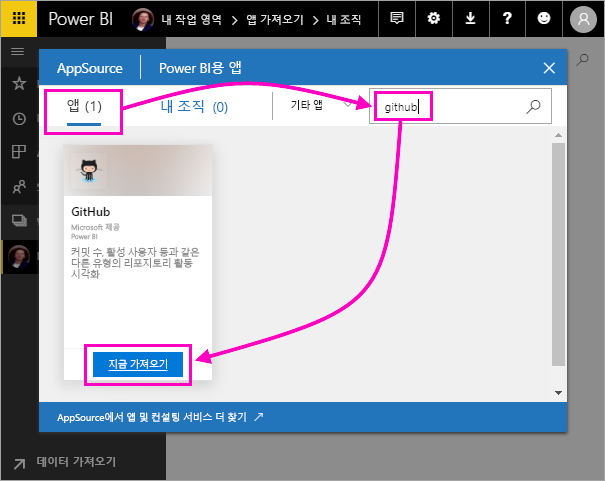
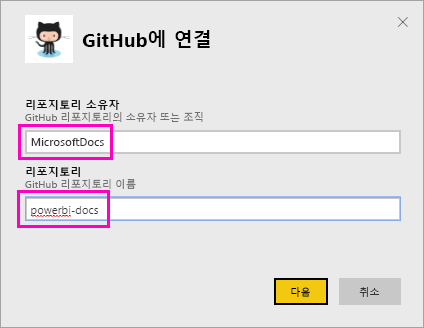
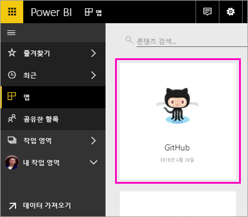
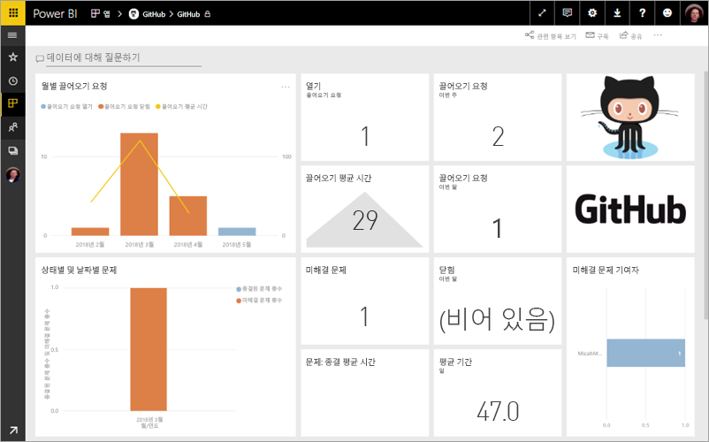
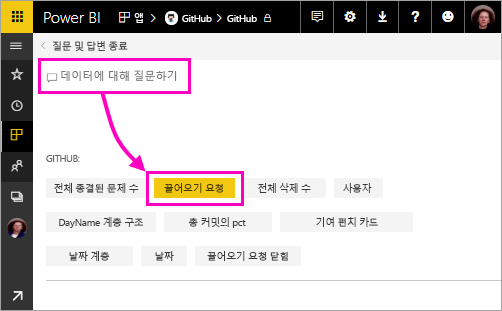
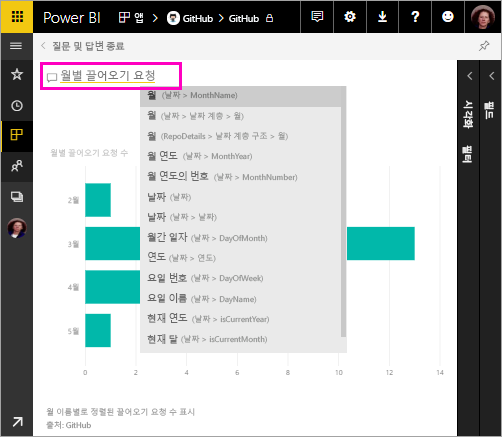
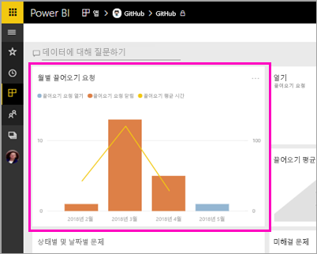
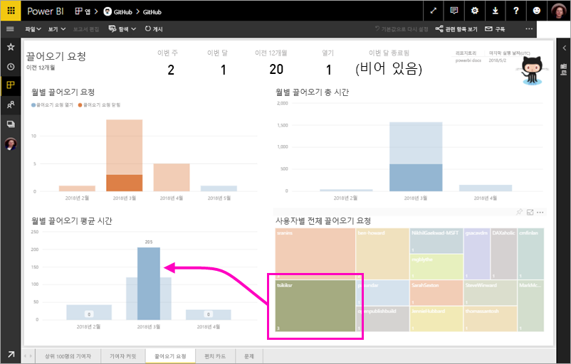

# 자습서: Power BI를 사용하여 GitHub 샘플에 연결
이 자습서에서는 Power BI를 사용하여 GitHub 서비스의 실제 데이터에 연결하고, Power BI에서 대시보드와 보고서를 자동으로 만듭니다. Power BI 콘텐츠 공용 리포지토리(*repo*라고도 함)에 연결하여 다음 질문과 관련된 정보를 참조합니다. 얼마나 많은 사람들이 Power BI 공개 콘텐츠에 기여하나요? 가장 많이 기여한 사람은 누구인가요? 어떤 요일이 가장 많이 기여하는가요? 그리고 다른 질문에도 답변합니다. 

이 자습서에서 수행하는 단계는 다음과 같습니다.

> [!div class="checklist"]
> * GitHub 계정이 아직 없는 경우 이 계정에 등록 
> * Power BI 계정에 로그인 또는 해당 계정이 아직 없는 경우 이 계정에 등록
> * Power BI 서비스 열기
> * GitHub 앱 찾기
> * Power BI 공용 GitHub 리포지토리에 대한 정보 입력
> * GitHub 데이터를 사용하여 대시보드 및 보고서 열기
> * 앱을 삭제하여 리소스 정리

아직 Power BI에 등록하지 않은 경우 시작하기 전에 [평가판에 등록합니다](https://app.powerbi.com/signupredirect?pbi_source=web).

## 필수 조건

이 자습서를 완료하려면 GitHub 계정이 필요합니다. 아직 GitHub 계정이 없으면 다음을 수행합니다. 

- [GitHub 계정](https://docs.microsoft.com/contribute/get-started-setup-github)에 등록

## 연결 방법
1. Power BI 서비스 (http://powerbi.com) 에 로그인합니다. 
2. 왼쪽 탐색 창에서 **앱**, **앱 가져오기**를 차례로 선택합니다.
   
    

3. **앱**을 선택하고 검색 창에 **github**를 입력합니다.> **지금 가져오기**.
   
    

4. 리포지토리의 리포지토리 이름과 리포지토리 소유자를 입력합니다. 이 리포지토리에 대한 URL은 https://github.com/MicrosoftDocs/powerbi-docs이므로 **리포지토리 소유자**는 **MicrosoftDocs**이고 **리포지토리**는 **powerbi-docs**입니다. 
   
    

5. 만든 GitHub 자격 증명을 입력합니다. 브라우저에서 GitHub에 이미 로그인되어 있으면 Power BI에서 이 단계를 건너뛸 수 있습니다. 

6. **인증 방법**에 대해 **oAuth2** \> **로그인**을 선택합니다.

7. Github 인증 화면을 따릅니다. GitHub 데이터에 대한 Power BI 권한을 부여합니다.
   
   이제 Power BI에서 GitHub와 연결하고 데이터에 연결할 수 있습니다.  하루에 한 번 데이터가 새로 고쳐집니다.

8. Power BI에서 데이터를 가져오면 새 GitHub 타일이 표시됩니다. 
 
    

8. 전역 탐색 아이콘을 선택하여 왼쪽 탐색 영역을 최소화하면 더 많은 공간을 확보할 수 있습니다.

    

10. 8단계에서 GitHub 타일을 선택합니다. 
    
    GitHub 대시보드가 열립니다. 이 경우 실시간 데이터이므로 표시되는 값이 다를 수 있습니다.

    

    

## 질문하기

11. **데이터에 대해 질문하기**에 커서를 놓은 다음, **끌어오기 요청**을 선택합니다. 

    

12. **월별**을 입력합니다.
 
    

     Power BI에서 월별 끌어오기 요청 수를 나타내는 가로 막대형 차트를 만듭니다.

13. **질문 및 답변 종료**를 선택합니다.

## GitHub 보고서 보기 

1. GitHub 대시보드에서 **월별 끌어오기 요청** 콤보 열 꺾은선형 차트를 선택하여 관련 보고서를 엽니다.

    

2. **사용자별 총 끌어 오기 요청 수** 차트에서 사용자 이름을 선택하고, 다음 예와 같이 3월 전체 평균 시간보다 더 긴 평균 시간이 있었음을 확인합니다.

    

3. **펀치 카드** 탭을 선택하여 보고서의 다음 페이지를 표시합니다. 
 
    

    분명히 화요일 오후 3시는 사람들이 자신의 업무를 체크 인하는 *커밋*에 대한 가장 일반적인 시간과 요일입니다.

## 리소스 정리

자습서를 완료했으므로 GitHub 앱을 삭제할 수 있습니다. 

1. 왼쪽 탐색 모음에서 **앱**을 선택합니다.
2. GitHub 타일 위를 마우스로 가리키고 **삭제** 휴지통을 선택합니다.

    

## 다음 단계

이 자습서에서는 GitHub 공용 리포지토리에 연결하고 데이터를 가져와서 Power BI의 대시보드 및 보고서에서 서식을 지정했습니다. 대시보드 및 보고서를 탐색하여 데이터에 대한 몇 가지 질문에 답변했습니다. 이제 Salesforce, Microsoft Dynamics 및 Google Analytics와 같은 다른 서비스에 연결하는 방법에 대해 자세히 알아볼 수 있습니다. 
 
> [!div class="nextstepaction"]
> [사용하는 온라인 서비스에 연결](service-connect-to-services.md)

