# 자습서: Power BI에서 Machine Learning Studio 모델 호출(미리 보기)

이 자습서에서는 **Azure Machine Learning Studio** 모델의 인사이트를 Power BI에 통합하는 연습을 합니다. 이 자습서는 Power BI 사용자에게 Azure ML 모델에 액세스 권한을 부여하고, 데이터 흐름을 만들고, Azure ML 모델의 인사이트를 데이터 흐름에 적용하는데 도움이 되는 지침을 포함하고 있습니다. Azure ML 모델을 처음 만드는데 도움이 되는 빠른 시작 가이드도 참조합니다.

이 자습서에서 설명하는 단계는 다음과 같습니다.

> [!div class="checklist"]
> * Azure Machine Learning 모델 만들기 및 게시
> * 모델을 사용할 Power BI 사용자에게 액세스 권한 부여
> * 데이터 흐름 만들기
> * Azure ML 모델의 인사이트를 데이터 흐름에 적용

## Azure ML 모델 만들기 및 게시

[연습 1단계: Machine Learning Studio 작업 영역 만들기](https://docs.microsoft.com/azure/machine-learning/studio/walkthrough-1-create-ml-workspace)의 지침에 따라 **Machine Learning** 작업 영역을 만듭니다.

이미 있는 Azure ML 모델 또는 데이터 세트와 해당 단계를 함께 사용할 수 있습니다. 게시된 모델이 없는 경우 자동차 가격 예측에 대한 Azure ML 모델을 설정하는 [Azure Machine Learning Studio에서 첫 번째 데이터 과학 실험 만들기](https://docs.microsoft.com/azure/machine-learning/studio/create-experiment)를 참조하여 몇 분 만에 모델을 만들 수 있습니다.

[Azure Machine Learning Studio 웹 서비스 배포](https://docs.microsoft.com/azure/machine-learning/studio/publish-a-machine-learning-web-service)의 단계에 따라 Azure ML 모델을 웹 서비스로 게시합니다.

## Power BI 사용자에게 액세스 권한 부여

Power BI에서 Azure ML 모델에 액세스하려면 Azure 구독 및 리소스 그룹에 대한 **읽기** 액세스 권한과 Machine Learning Studio 모델용 Azure Machine Learning Studio 웹 서비스에 대한 **읽기** 액세스 권한이 있어야 합니다.  Azure Machine Learning Service 모델의 경우 Machine Learning Service 작업 영역에 대한 **읽기** 액세스 권한이 필요합니다.

다음 단계에서는 모델이 게시된 Azure 구독 및 리소스 그룹에 대한 공동 관리자라고 가정하겠습니다.

[Azure Portal](https://portal.azure.com)에 로그인하여 **구독** 페이지로 이동합니다. 이 페이지는 왼쪽 탐색 메뉴에 있는 **모든 서비스** 목록을 사용하여 찾을 수 있습니다.

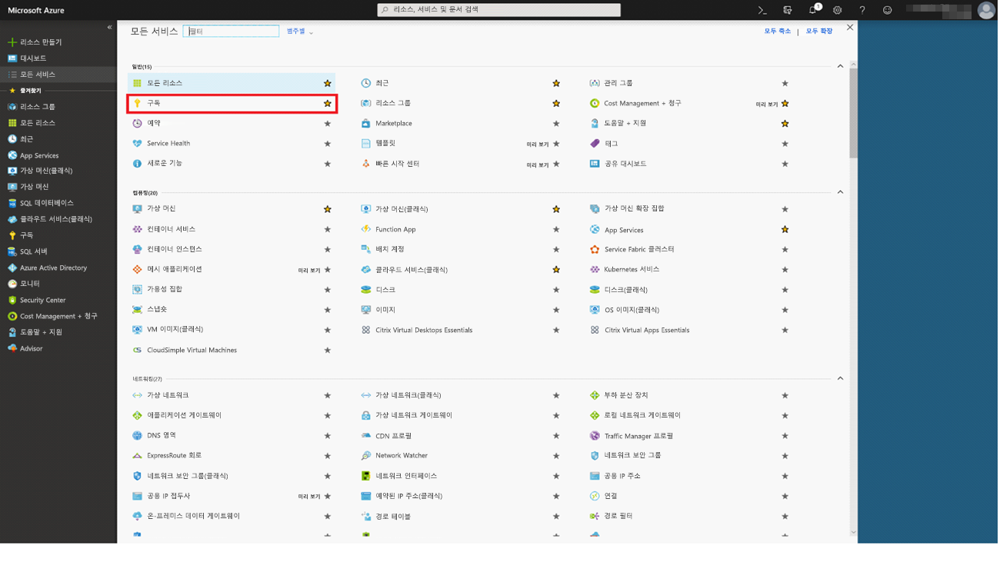

모델을 게시하는 데 사용한 Azure 구독을 선택하고 **액세스 제어(IAM)** 를 선택합니다. 다음으로, **역할 할당 추가**, **독자** 역할, Power BI 사용자를 차례로 선택합니다. 완료되면 **저장**을 선택합니다. 아래 이미지에서는 해당 선택 내용을 보여 줍니다.

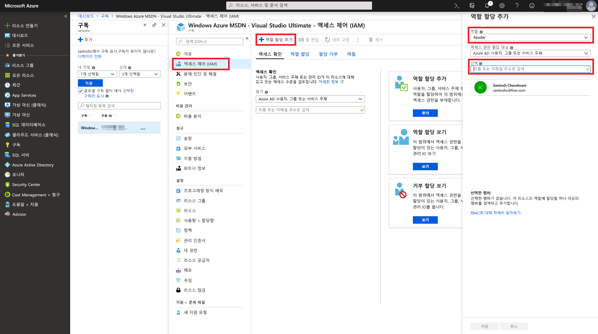

그런 다음, 위의 단계를 반복하여 Azure ML 모델이 배포된 특정 Machine Learning 웹 서비스의 Power BI 사용자에게 **기여자** 역할 액세스 권한을 부여합니다.

## 데이터 흐름 만들기

### 데이터 흐름 만들기에 사용할 데이터 가져오기

이전 단계에서 Azure ML 모델에 액세스 권한을 부여한 사용자 자격 증명을 사용하여 Power BI 서비스에 로그인합니다.

이 단계에서는 Azure ML 모델을 사용하여 점수를 매길 데이터가 CSV 형식으로 있다고 가정합니다.  **자동차 가격 책정 실험**을 사용하여 Machine Learning Studio에서 모델을 만든 경우 아래 링크의 데이터 세트를 공유합니다.

* [Azure Learning Studio 샘플 모델](https://github.com/santoshc1/PowerBI-AI-samples/blob/master/Tutorial_MLStudio_model_integration/Automobile%20price%20data%20_Raw_.csv)

### 데이터 흐름 만들기

데이터 흐름에 엔터티를 만들려면 Power BI 서비스에 로그인하고, 사용하도록 설정된 AI 미리 보기가 있는 전용 용량의 작업 영역으로 이동합니다.

작업 영역이 아직 없는 경우 만들 수 있습니다. 왼쪽 메뉴에서 **작업 영역**을 선택하고 하단 패널에서 **앱 작업 영역 만들기**를 선택합니다.  작업 영역 세부 정보를 입력하는 패널이 열립니다. 작업 영역 이름을 입력하고 **저장**을 선택합니다.

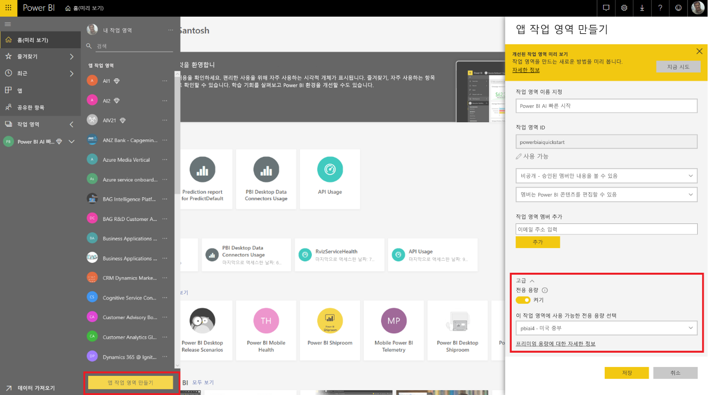

작업 영역을 만든 후에는 시작 화면 오른쪽 하단의 **건너뛰기**를 선택할 수 있습니다.

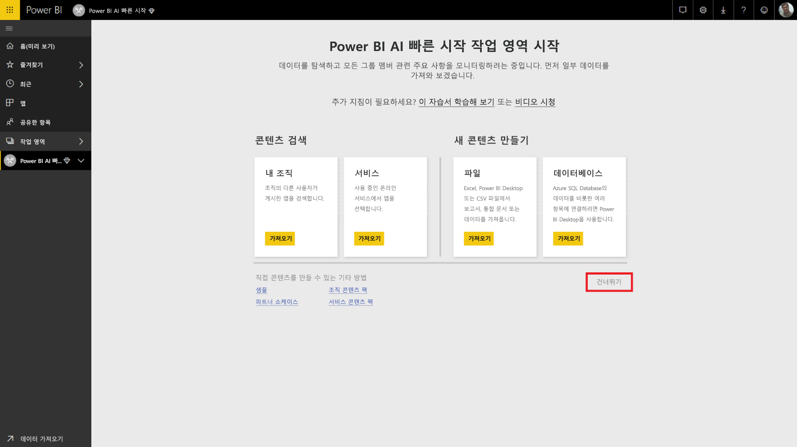

**데이터 흐름(미리 보기)** 탭을 선택하고, 작업 영역 오른쪽 상단의 **만들기** 단추를 선택하고, **데이터 흐름**을 선택합니다.

**새 엔터티 추가**를 선택하면 브라우저에 **파워 쿼리 편집기**가 실행됩니다.

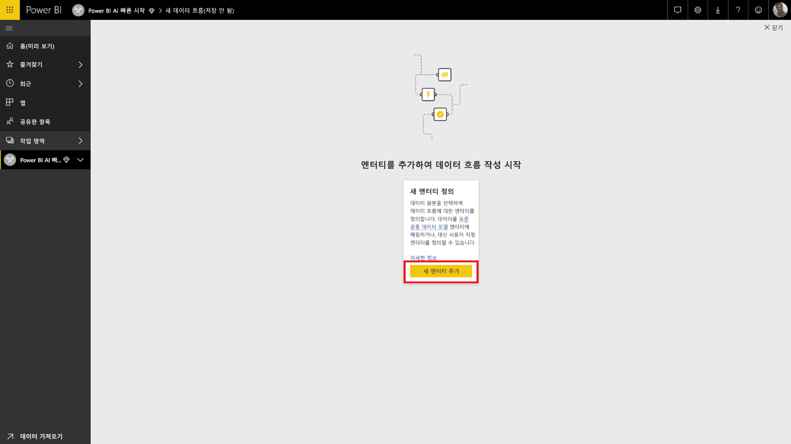

**텍스트/CSV 파일**을 데이터 원본으로 선택합니다.

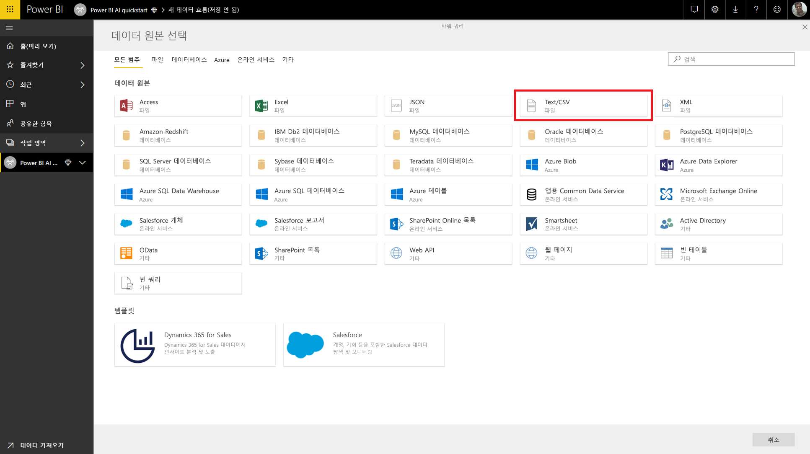

다음 화면에는 데이터 원본에 연결할지 묻는 메시지가 표시됩니다. Azure ML 모델을 만드는 데 사용한 데이터에 대한 링크를 붙여넣습니다. _자동차 가격 책정_ 데이터를 사용한 경우 다음 링크를 **파일 경로 또는 URL** 상자에 붙여넣고 **다음**을 누릅니다.

`https://raw.githubusercontent.com/MicrosoftLearning/Principles-of-Machine-Learning-Python/master/Module7/Automobile%20price%20data%20_Raw_.csv`

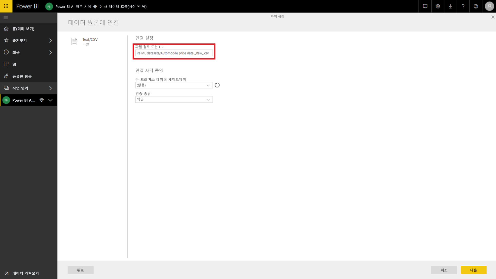

파워 쿼리 편집기는 CSV 파일의 데이터에 대한 미리 보기를 보여 줍니다. 명령 리본에서 **테이블 변환**을 선택하고 **첫 행을 머리글로 사용**을 선택합니다.  오른쪽의 **적용된 단계** 창에 _승격된 헤더_ 쿼리 단계가 추가됩니다. 오른쪽 창을 사용하여 쿼리 이름을 _자동차 가격 책정_ 같은 친근한 이름으로 바꿀 수도 있습니다.

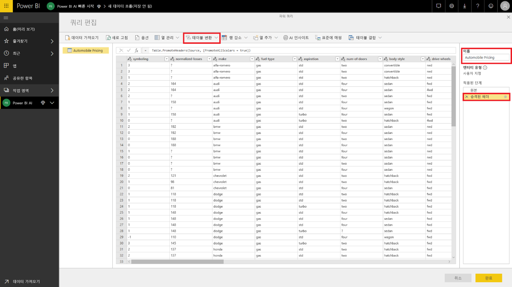

원본 데이터 세트에 ‘?’로 설정된 알 수 없는 값이 있습니다.  이러한 값을 정리하도록 ‘?’를 ‘0’으로 바꿔 나중에 오류가 발생하는 것을 간단하게 방지할 수 있습니다.  이 작업을 수행하려면 열 머리글에서 해당 이름을 클릭하여 *normalized-losses*, *bore*, *stroke*, *compression-ratio*, *horsepower*, *peak-rpm* 및 *price* 열을 선택하고, '열 변환'을 클릭하고, '값 바꾸기'를 선택합니다.  ‘?’를 ‘0’으로 바꿉니다.

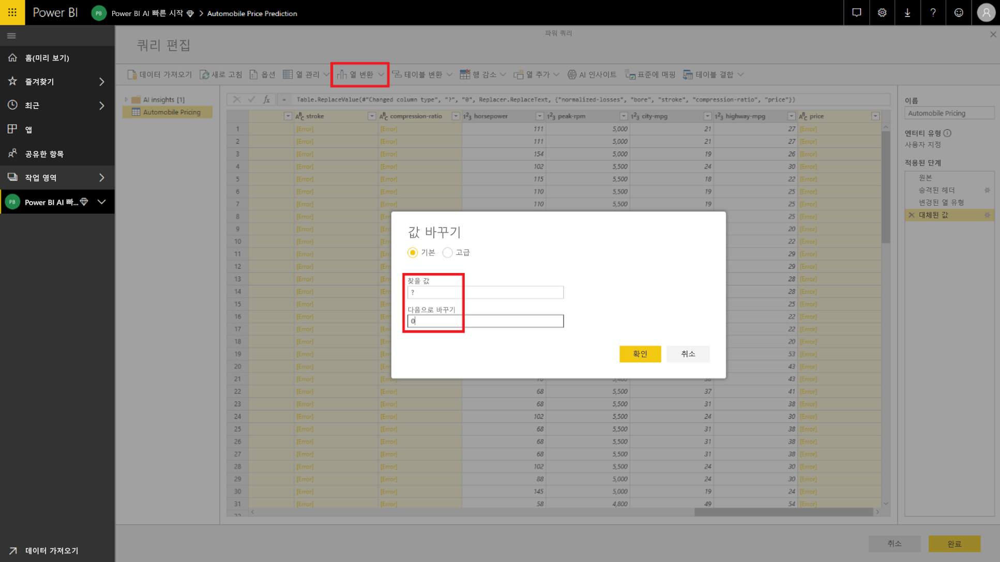

텍스트/CSV 원본의 테이블에 있는 모든 열은 텍스트 열로 처리됩니다.  그런 다음, 숫자 열을 올바른 데이터 형식으로 변경해야 합니다.  이 작업은 파워 쿼리에서 열 머리글의 데이터 형식 기호를 클릭하여 수행할 수 있습니다.  해당 열을 다음 형식으로 변경합니다.

- **정수**: symboling, normalized-losses, curb-weight, engine-size, horsepower, peak-rpm, city-mpg, highway-mpg, price
- **10진수**: wheel-base, length, width, height, bore, stroke, compression-ratio

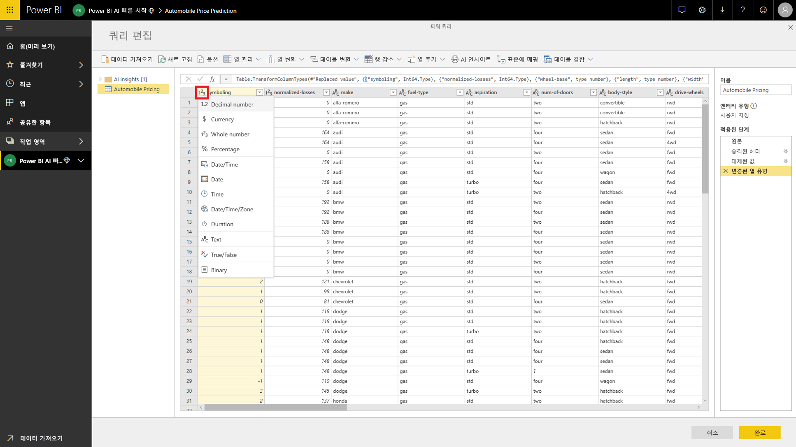

**완료**를 선택하여 파워 쿼리 편집기를 닫습니다. 그러면 추가한 _자동차 가격 책정_ 데이터가 포함된 엔터티 목록이 표시됩니다. 오른쪽 위 모서리의 **저장**을 선택하고, 데이터 흐름의 이름을 입력하고, **저장**을 선택합니다.

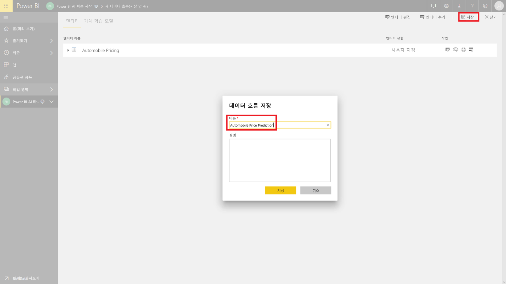

### 데이터 흐름 새로 고침

데이터 흐름을 저장하면 데이터 흐름이 저장되었다는 알림이 표시됩니다. **지금 새로 고침**을 선택하여 원본에서 데이터 흐름으로 데이터를 수집합니다.

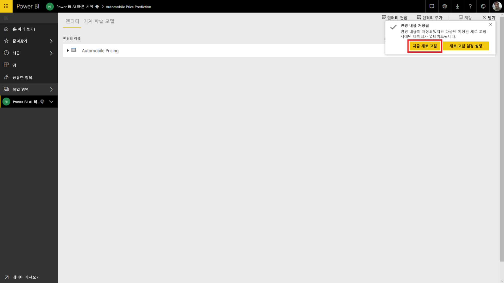

오른쪽 위 모서리의 **닫기**를 선택하고 데이터 흐름 새로 고침이 완료될 때까지 기다립니다.

**작업** 명령을 사용하여 데이터 흐름을 새로 고칠 수도 있습니다. 새로 고침이 완료되면 데이터 흐름에 타임스탬프가 표시됩니다.

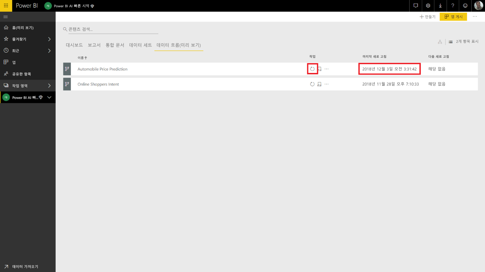

## Azure ML 모델의 인사이트 적용

_자동차 가격 예측_ 에 대한 Azure ML 모델에 액세스하려면 예측 가격을 추가할 _자동차 가격 책정_ 엔터티를 편집합니다.

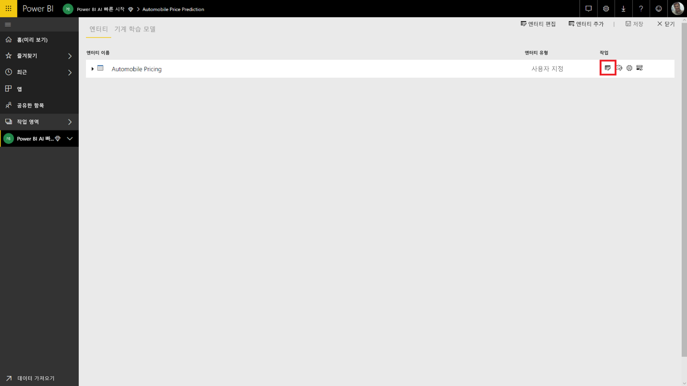

**편집** 아이콘을 선택하면 데이터 흐름의 엔터티에 대한 파워 쿼리 편집기가 열립니다.

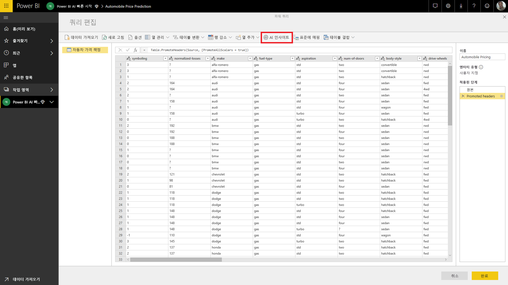

리본에서 **AI 인사이트** 단추를 선택하고 왼쪽 탐색 메뉴의 _Azure Machine Learning 모델_ 폴더를 선택합니다.

액세스 권한이 부여된 Azure ML 모델이 *AzureML* 접두사가 포함된 파워 쿼리 함수로 나열됩니다.  _AutomobilePricePrediction_ 모델에 해당하는 함수를 클릭하면 이 모델의 웹 서비스용 매개 변수가 함수 매개 변수로 나열됩니다.

Azure ML 모델을 호출하려면 선택한 엔터티의 열을 드롭다운에서 입력으로 지정합니다. 입력 대화 상자 왼쪽으로 열 아이콘을 전환하여 입력으로 사용할 상수 값을 지정할 수도 있습니다. 열 이름이 함수 매개 변수 이름 중 하나와 일치하면 해당 열이 자동으로 입력으로 제안됩니다.  열 이름이 일치하지 않으면 드롭다운에서 선택할 수 있습니다.

_자동차 가격 예측_ 모델의 경우 입력 매개 변수는 다음과 같습니다.

- make
- body-style
- wheel-base
- engine-size
- horsepower
- peak-rpm
- highway-mpg

여기서는 모델 학습에 사용된 원래 데이터 세트와 테이블이 일치하므로 모든 매개 변수에 올바른 열이 이미 선택되어 있습니다.

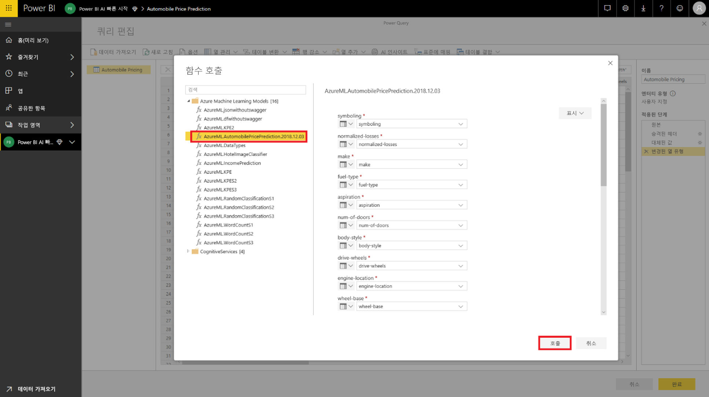

Azure ML 모델 출력 미리 보기를 엔터티 테이블에 새 열로 표시하려면 **호출**을 선택합니다. 모델 호출을 쿼리의 적용 단계로 표시할 수도 있습니다.

모델 출력은 출력 열에 레코드로 표시됩니다. 이 열을 확장하여 별도의 열에 개별 출력 매개 변수를 생성할 수 있습니다. 여기서는 자동차 예측 가격이 포함된 _Scored Labels_ 에만 관심이 있습니다.  따라서 나머지를 선택 취소하고 **확인**을 선택합니다.

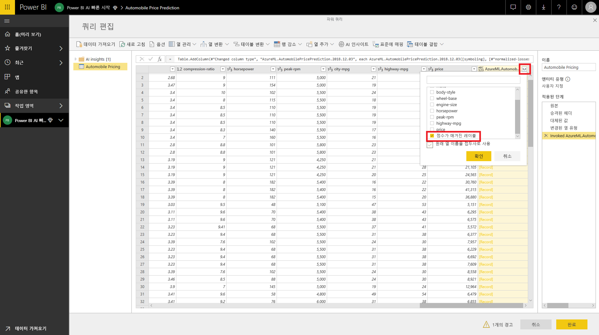

그러면 _*Scored Labels*_ 열에 Azure ML 모델의 가격 예측이 표시됩니다.

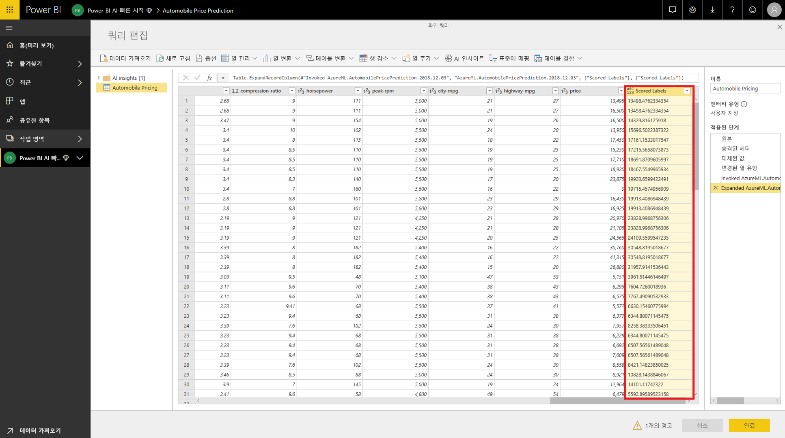

데이터 흐름을 저장하면 엔터티 테이블의 모든 새 행 또는 업데이트된 행에 대해 데이터 흐름을 새로 고치는 경우 자동으로 Azure ML 모델이 호출됩니다.

## 리소스 정리

이 문서를 사용하여 만든 Azure 리소스가 더 이상 필요하지 않은 경우 요금이 발생하지 않도록 삭제하세요.  데이터 흐름도 더 이상 필요하지 않으면 삭제할 수 있습니다.

## 다음 단계

이 자습서에서는 다음 단계에 따라 간단한 데이터 세트로 Azure Machine Learning Studio를 사용하여 간단한 실험을 만들었습니다.

- Azure Machine Learning 모델 만들기 및 게시
- 모델을 사용할 Power BI 사용자에게 액세스 권한 부여
- 데이터 흐름 만들기
- Azure ML 모델의 인사이트를 데이터 흐름에 적용

Power BI에서 Azure Machine Learning을 통합하는 작업에 대한 자세한 내용을 보려면 [Power BI에서 Azure Machine Learning 통합(미리 보기)](service-machine-learning-integration.md)을 참조하세요.
