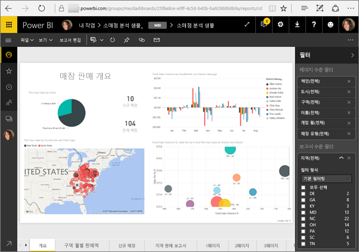
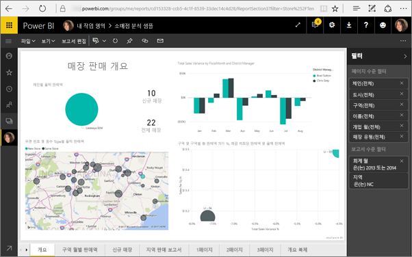
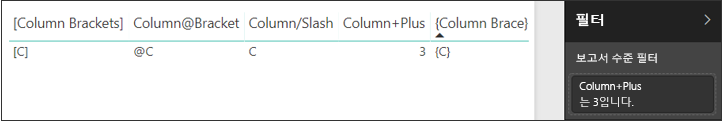

# <a name="filter-a-report-using-query-string-parameters-in-the-url"></a>URL에 쿼리 문자열 매개 변수를 사용하여 보고서 필터링

Power BI 서비스에서 보고서를 열면 보고서의 페이지마다 고유한 URL을 보유합니다. 보고서 페이지를 필터링하려면 보고서 캔버스에서 필터 창을 사용할 수 있습니다.  또는 URL에 쿼리 문자열 매개 변수를 추가하여 보고서를 사전 필터링할 수 있습니다. 동료에게 보여 주고 싶은 보고서가 있고 이를 위해 미리 필터링하려고 할 수 있습니다. 필터링하는 한 가지 방법은 보고서에 대한 기본 URL로 시작하고, 필터 매개 변수를 URL에 추가한 다음, 새로운 전체 URL을 메일로 보내는 것입니다.



## <a name="uses-for-query-string-parameters"></a>쿼리 문자열 매개 변수의 용도

Power BI Desktop에서 작업 중이라고 가정합니다. 다른 Power BI 보고서에 대한 링크가 있는 보고서를 만들지만 다른 보고서의 일부 정보만 표시하려고 합니다. 먼저, 쿼리 문자열 매개 변수를 사용하여 보고서를 필터링하고 URL을 저장합니다. 다음으로, 이러한 새 보고서 URL을 사용하여 데스크톱에서 테이블을 만듭니다.  그런 다음, 보고서를 게시하고 공유합니다.

쿼리 문자열 매개 변수는 고급 Power BI 솔루션을 만드는 사용자에게 필요합니다.  DAX를 사용하면 현재 보고서에서 고객의 선택에 따라 동적으로 필터링된 보고서 URL을 생성하는 보고서를 만들 수 있습니다. 고객이 URL을 선택하는 경우 원하는 정보만이 표시됩니다. 

## <a name="query-string-parameter-syntax-for-filtering"></a>필터링을 위한 쿼리 문자열 매개 변수 구문

매개 변수를 사용하면 해당 값에 공백이나 특수 문자가 포함될 경우에도 하나 이상의 값에 대해 보고서를 필터링할 수 있습니다. 기본 구문은 매우 간단합니다. 보고서 URL로 시작하고, 물음표를 추가한 다음, 필터 구문을 추가하면 됩니다.

URL?filter=***Table***/***Field*** eq '***value***'


* **테이블** 및 **필드** 이름은 대소문자를 구분하고, **값**은 구분하지 않습니다.
* 보고서 보기에서 숨겨진 필드는 계속 필터링할 수 있습니다.

### <a name="reports-in-apps"></a>앱의 보고서

앱의 보고서에 URL 필터를 추가하려는 경우 형식이 약간 다릅니다. 앱의 보고서에 대한 링크에는 URL에 추가되는 쿼리 매개 변수(ctid)가 있습니다. 쿼리 매개 변수를 앰퍼샌드(&)로 구분합니다. “?filter=”를 유지하고, 앞에 앰퍼샌드(&)가 추가된 URL의 끝으로 ctid 매개 변수를 이동합니다. 

이 예제와 같습니다.

app.powerbi.com/groups/me/apps/*app-id*/reports/*report-id*/ReportSection?filter=*Table*/*Field* eq '*value*'&ctid=*ctid*

### <a name="field-types"></a>필드 형식

ㅍ필드 형식은 숫자, 날짜/시간 또는 문자열일 수 있고 사용된 형식은 데이터 세트에서 설정된 형식과 일치해야 합니다.  예를 들어 날짜로 설정된 데이터 세트 열에서 날짜/시간 또는 숫자 값을 찾으려는 경우(예: Table/StringColumn eq 1) “문자열” 형식의 테이블 열을 지정하는 작업은 작동하지 않습니다.

* **문자열**은 ‘manager name’과 같이 작은따옴표로 묶여야 합니다.
* **숫자**에는 특별한 서식 지정이 필요하지 않습니다. 자세한 내용은 이 문서의 [숫자 데이터 형식](#numeric-data-types)을 참조하세요.
* **날짜 및 시간** 이 문서의 [Date 데이터 형식](#date-data-types)을 참조하세요. 

여전히 혼동되는 경우 계속 읽어 보고 자세히 분석합니다.  

## <a name="filter-on-a-field"></a>필드 필터링

보고서에 대한 URL이 다음과 같다고 가정합니다.


North Carolina에 매장이 있다는 것을 맵 시각화(위)에서 확인할 수 있습니다.

>[!NOTE]
>이 예제는 [소매점 분석 샘플](sample-datasets.md)을 토대로 합니다.
> 

"NC"(North Carolina)의 매장에 대한 데이터만 표시하도록 보고서를 필터링하려면 다음으로 URL을 추가합니다.

?filter=Store/Territory eq 'NC'


>[!NOTE]
>*NC*는 **Store** 테이블의 **Territory** 필드에 저장된 값입니다.
> 

보고서는 North Carolina에 대해 필터링되며 보고서 페이지에 있는 모든 시각화는 North Carolina에 대한 데이터만 표시합니다.



## <a name="filter-on-multiple-fields"></a>여러 필드 필터링

또한 URL에 추가 매개 변수를 추가하여 여러 필드에서 필터링할 수 있습니다. 우리의 원래 필터 매개 변수로 돌아갑니다.

```
?filter=Store/Territory eq 'NC'
```

추가 필드를 필터링하려면 **and** 및 다른 필드를 동일한 형식으로 추가합니다. 예를 들면 다음과 같습니다.

```
?filter=Store/Territory eq 'NC' and Store/Chain eq 'Fashions Direct'
```

<iframe width="640" height="360" src="https://www.youtube.com/embed/0sDGKxOaC8w?showinfo=0" frameborder="0" allowfullscreen></iframe>

## <a name="operators"></a>연산자

Power BI는 **and** 외에도 많은 연산자를 지원합니다. 아래 표에서는 지원하는 콘텐츠 형식과 함께 해당 연산자를 나열합니다.

|연산자  | 정의 | 문자열  | 숫자 | 날짜 |  예제|
|---------|---------|---------|---------|---------|---------|
|**and**     | 그리고 |  예      | 예 |  예|  product/price le 200 and price gt 3.5 |
|**eq**     | 같음 |  예      | 예   |  예       | Address/City eq 'Redmond' |
|**ne**     | 같지 않음 |   예      | 예  | 예        |  Address/City ne 'London' |
|**ge**     |  크거나 같음       | 아니요 | 예 |예 |  product/price ge 10
|**gt**     | 보다 큼        |아니요 | 예 | 예  | product/price gt 20
|**le**     |   작거나 같음      | 아니요 | 예 | 예  | product/price le 100
|**lt**     |  다음보다 작음       | 아니요 | 예 | 예 |  product/price lt 20
|**in\*\***     |  포함       | 예 | 예 |  예 | Student/Age in (27, 29)


\*\***in**을 사용하는 경우 **in**의 오른쪽 값은 괄호로 묶이고 쉼표로 구분된 목록 또는 컬렉션을 반환하는 단일 식일 수 있습니다.

### <a name="numeric-data-types"></a>숫자 데이터 형식

Power BI URL 필터에는 다음 형식의 숫자가 포함될 수 있습니다.

|숫자 형식  |예제  |
|---------|---------|
|**integer**     |   5      |
|**long**     |   5 L 또는 5 l      |
|**double**     |   5.5나 55e-1이나 0.55e+1 또는 5D나 5d 또는 0.5e1D나 0.5e1d 또는 5.5D나 5.5d 또는 55e-1D나 55e-1d     |
|**decimal**     |   5M이나 5m 또는 5.5M이나 5.5m      |
|**float**     | 5 F나 5 f 또는 0.5e1 F나 0.5e-1 d        |

### <a name="date-data-types"></a>날짜 데이터 형식

Power BI는 **Date** 및 **DateTimeOffset** 데이터 형식에 대해 OData V3 및 V4를 모두 지원합니다. OData V3의 경우 날짜는 작은따옴표로 묶여야 하고 앞에 단어 datetime이 와야 합니다. OData V4에서는 작은따옴표와 단어 datetime이 필요하지 않습니다. 
  
날짜는 EDM 서식을 사용하여 표시됩니다(2019-02-12T00:00:00). ‘YYYY-MM-DD’로 날짜를 지정하면 Power BI에서는 ‘YYYY-MM-DDT00:00:00’과 같이 해석합니다. 월과 일이 두 자리 숫자(MM 및 DD)인지 확인합니다.

이러한 차이점이 중요한 이유는 무엇인가요? 쿼리 문자열 매개 변수 **Table/Date gt ‘2018-08-03’** 을 만든다고 가정하겠습니다.  결과에는 2018년 8월 3일이 포함되나요, 아니면 2018년 8월 4일에 시작하나요? Power BI에서는 쿼리를 **Table/Date gt ‘2018-08-03T00:00:00’** 으로 변환합니다. 이러한 날짜는 **‘2018-08-03T00:00:00’** 보다 크므로 시간 부분이 0이 아닌 모든 날짜가 결과에 포함됩니다.

V3와 V4 사이에는 다른 점이 있습니다. OData V3는 날짜를 지원하지 않고 날짜/시간만 지원합니다. 따라서 V3 형식을 사용하는 경우 전체 날짜 시간으로 정규화해야 합니다. “datetime’2019-05-20’” 같은 날짜 리터럴은 V3 표기법에서 지원되지 않습니다. 하지만 V4 표기법에서는 “2019-05-20”으로만 쓸 수 있습니다. 다음은 V3 및 V4의 두 가지 동일한 필터 쿼리입니다.

- OData V4 형식: filter=Table/Date gt 2019-05-20
- OData V3 형식: filter=Table/Date gt datetime’2019-05-20T00:00:00’


## <a name="special-characters-in-url-filters"></a>URL 필터의 특수 문자

특수 문자 및 공백에는 몇 가지 추가 서식 지정이 필요합니다. 쿼리에 공백, 대시 또는 기타 ASCII 문자가 아닌 문자가 포함되는 경우 밑줄과 X로 시작하는 ‘이스케이프 코드’( **_x**) 및 4자리 **유니코드**와 그 뒤에 다른 밑줄을 붙여 해당 특수 문자의 접두사를 지정합니다.  유니코드가 4자 미만인 경우 0으로 채워야 합니다. 몇 가지 예제는 다음과 같습니다.

|식별자  |유니코드  | Power BI용 코딩  |
|---------|---------|---------|
|**Table Name**     | 공간은 0x20입니다.        |  Table_x0020_Name       |
|**Column**@**Number**     |   @은 0x40입니다.     |  Column_x0040_Number       |
|**[Column]**     |  [ is 0x005B ]는 0x005D입니다.       |  _x005B_Column_x005D_       |
|**Column+Plus**     | +는 0x2B입니다.        |  Column_x002B_Plus       |

Table_x0020_Name/Column_x002B_Plus eq 3 


Table_x0020_Special/_x005B_Column_x0020_Brackets_x005D_ eq '[C]' 

## <a name="use-dax-to-filter-on-multiple-values"></a>DAX를 사용하여 여러 값을 필터링

여러 값을 필터링하는 한 가지 방법은 두 필드를 하나의 값으로 연결하는 계산된 열을 만드는 것입니다. 그런 다음 해당 값을 필터링할 수 있습니다.

예를 들어 다음과 같은 두 개의 필드가 있습니다. Territory 및 Chain. Power BI Desktop에서 TerritoryChain이라는 [새 계산된 열](desktop-tutorial-create-calculated-columns.md)(필드)을 만듭니다. **필드** 이름에는 공백을 포함할 수 없다는 점에 유의하세요. 다음은 해당 열에 대한 DAX 수식입니다

TerritoryChain = [Territory] & " - " & [Chain]

보고서를 Power BI 서비스에 게시한 후 URL 쿼리 문자열을 사용하여 NC에 있는 Lindseys 매장으로만 표시 데이터를 필터링합니다.

    https://app.powerbi.com/groups/me/reports/8d6e300b-696f-498e-b611-41ae03366851/ReportSection3?filter=Store/TerritoryChain eq 'NC – Lindseys'

## <a name="pin-a-tile-from-a-filtered-report"></a>필터링된 보고서에서 타일 고정

쿼리 문자열 매개 변수를 사용하여 보고서를 필터링했으면 보고서에서 대시보드로 시각화를 고정할 수 있습니다.  대시보드의 타일에는 필터링된 데이터가 표시되고 대시보드 타일을 선택하면 타일 생성에 사용된 보고서가 열립니다.  그러나 URL을 사용하여 수행한 필터링은 보고서와 함께 저장되지 않습니다. 대시보드 타일을 선택하면 보고서가 필터링되지 않은 상태에서 열립니다.  따라서 대시보드 타일에 표시된 데이터는 보고서 시각화에 표시된 데이터와 일치하지 않습니다.

이 불일치는 대시보드에서는 필터링되고 보고서에서는 필터링되지 않는 다른 결과를 보고 싶을 때 도움이 됩니다.

## <a name="considerations-and-troubleshooting"></a>고려 사항 및 문제 해결

쿼리 문자열 매개 변수를 사용할 때 알아야 할 몇 가지 사항이 있습니다.

* *in* 연산자를 사용하는 경우 *in*의 오른쪽에 있는 값은 괄호로 묶이고 쉼표로 구분된 목록이어야 합니다.    
* Power BI Report Server에서는 보고서 URL에 보고서 매개 변수를 포함시켜 [보고서 매개 변수를 전달](https://docs.microsoft.com/sql/reporting-services/pass-a-report-parameter-within-a-url?view=sql-server-2017.md)할 수 있습니다. 이러한 URL 매개 변수는 보고서 처리 엔진에 직접 전달되기 때문에 접두사가 붙지 않습니다.
* 쿼리 문자열 필터링은 [웹에 게시](service-publish-to-web.md) 또는 [PDF로 내보내기](consumer/end-user-pdf.md)에서는 작동하지 않습니다.
* [SharePoint Online에 보고서 웹 파트 포함](service-embed-report-spo.md)은 URL 필터를 지원하지 않습니다.
* Javascript 제한 때문에 Long 데이터 형식은 (2^53-1)입니다.
* 보고서 URL 필터에는 10개 식 제한(AND로 연결된 10개의 필터)이 있습니다.

## <a name="next-steps"></a>다음 단계

[시각화를 대시보드에 고정](service-dashboard-pin-tile-from-report.md)  
[평가판 등록](https://powerbi.microsoft.com/get-started/)

궁금한 점이 더 있나요? [Power BI 커뮤니티에 질문합니다.](https://community.powerbi.com/)
