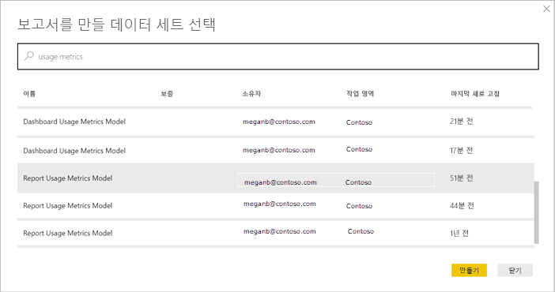
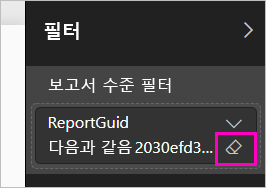

# Power BI 대시보드 및 보고서의 사용 메트릭 모니터링

대시보드 및 보고서를 만드는 경우 사용량 메트릭은 해당 영향을 이해하도록 돕습니다. 대시보드 사용 메트릭 또는 보고서 사용 메트릭을 실행하면 해당 대시보드 및 보고서가 조직 내에서 어떻게 사용되고 있는지, 누구에 의해 어떠한 목적으로 사용되고 있는지를 파악할 수 있습니다.  

이러한 사용 메트릭 보고서는 읽기 전용입니다. 읽기 전용이기는 하나 원하는 경우 사용 메트릭 보고서를 복사할 수 있습니다. 사용 메트릭 보고서를 복사하면 편집 가능한 표준 Power BI 보고서가 생성됩니다. 이에 더해, Power BI Desktop에서 기본 데이터 세트를 바탕으로 작업 영역에 있는 모든 대시보드 또는 모든 보고서의 사용 메트릭을 포함하는 자체 보고서를 만들 수도 있습니다. 복사된 보고서는 선택한 대시보드 또는 보고서의 메트릭만 보여줍니다. 기본 필터를 제거하면 선택한 작업 영역의 모든 사용 메트릭이 포함된 기본 데이터 세트에 액세스할 수 있습니다. 관리자가 허용한 경우에는 특정 사용자의 이름을 확인할 수도 있습니다.

> [!NOTE]
> 사용 메트릭은 SharePoint Online에 포함된 보고서의 사용량을 추적합니다. 그러나 사용 메트릭은 “사용자 소유 자격 증명” 또는 “앱 소유 자격 증명” 흐름을 통해 포함된 대시보드 및 보고서를 추적하지 않습니다. 사용 메트릭은 [웹에 게시](service-publish-to-web.md)를 통해 포함된 보고서의 사용도 추적하지 않습니다.

## 사용 메트릭이 중요한 이유

콘텐츠가 사용되는 방식을 알고 있으면 영향을 보여 주고 활동의 우선 순위를 정하는 데 도움이 됩니다. 사용 메트릭은 보고서 중 하나가 조직의 거대한 세그먼트에 의해 매일 사용되는 것을 보여 주고 사용자가 만든 대시보드를 전혀 보고 있지 않는 것을 보여 줄 수 있습니다. 이러한 유형의 피드백은 작업 활동 안내에 유용합니다.

Power BI 서비스에서는 사용 메트릭 보고서를 실행할 수만 있습니다. 그러나, 사용 메트릭 보고서를 저장하거나 대시보드에 고정하는 경우 모바일 디바이스에서 해당 보고서를 열고 상호 작용할 수 있습니다.

## 필수 조건

- 사용 메트릭 데이터를 실행하고 액세스하려면 Power BI Pro 라이선스가 필요합니다. 단, 사용 메트릭 기능은 할당된 라이선스에 상관없이 모든 사용자의 사용 정보를 캡처합니다.
- 특정 대시보드 또는 보고서에 대한 사용 메트릭에 액세스하려면 해당 대시보드 또는 보고서에 대한 편집 권한이 있어야 합니다.
- Power BI 관리자가 콘텐츠 작성자에 대해 사용 메트릭을 사용 설정해 두었어야 합니다. Power BI 관리자가 사용 메트릭에서 사용자별 데이터 수집을 사용 설정해 두었을 수도 있습니다. [관리 포털에서 이러한 옵션을 사용하도록 설정](service-admin-portal.md#control-usage-metrics)하는 방법을 알아보세요. 

## 사용 메트릭 보고서 보기

1. 대시보드 또는 보고서를 포함하는 작업 영역에서 시작합니다.
2. 작업 영역 콘텐츠 목록 또는 대시보드나 보고서 자체에서 **사용 메트릭** 에 대한 아이콘을 선택합니다.

    

    
3. 처음에 이를 수행하면 Power BI에서 사용 메트릭 보고서를 만들고 준비되면 사용자에게 알려줍니다.

    
4. 결과를 보려면 **사용 메트릭 보기**를 선택합니다.

    사용 메트릭은 Power BI 대시보드 및 보고서를 배포 및 유지 관리하는 데 강력한 협력 기능입니다. 보고서 중 가장 유용한 페이지와 단계적으로 중지해야 하는 페이지를 알고 싶으세요? **보고서 페이지**별로 조각화하여 살펴보세요. 대시보드에 대한 모바일 레이아웃을 작성해야 하는지 궁금하세요? **플랫폼**별로 조각화하여 모바일 앱 및 웹 브라우저를 통해 콘텐츠에 액세스하는 사용자 수를 알아보세요.

5. 필요에 따라 시각화를 마우스로 가리키고 핀 고정 아이콘을 선택하여 시각화를 대시보드에 추가할 수 있습니다. 또는 상단의 메뉴 모음에서 **라이브 페이지 고정**을 선택하여 전체 페이지를 대시보드에 추가할 수 있습니다. 대시보드에서 사용 메트릭을 좀 더 간편하게 모니터링하거나 다른 사용자와 공유할 수 있습니다.

    > [!NOTE]
    > 사용 메트릭 보고서에서 타일을 대시보드에 고정할 경우 해당 대시보드를 앱에 추가할 수 없습니다.

### 대시보드 사용 메트릭 보고서

### 보고서 사용 메트릭 보고서

## 사용 메트릭 보고서 정보

**사용 메트릭** 또는 대시보드나 보고서 옆의 을 선택하면 Power BI에서는 해당 콘텐츠에 대한 최근 90일 동안의 사용 메트릭을 사용하여 미리 작성된 보고서를 생성합니다.  이 보고서는 이미 익숙한 Power BI 보고서와 비슷합니다. 최종 사용자가 액세스를 부여받은 방법(웹 또는 모바일 앱 등을 통해 액세스했는지 여부)에 따라 조각화할 수 있습니다. 대시보드 및 보고서를 확대하면 사용 메트릭 보고서도 확대되며 매일 새 데이터로 업데이트됩니다.  

사용 메트릭 보고서는 **최근**, **작업 영역**, **즐겨찾기** 또는 기타 콘텐츠 목록에 표시되지 않으며, 앱에 추가할 수 없습니다. 사용 메트릭 보고서에서 타일을 대시보드에 고정할 경우 해당 대시보드를 앱에 추가할 수 없습니다.

보고서 데이터를 자세히 살펴보거나 기본 데이터 세트를 바탕으로 자체 보고서를 작성하려면 두 가지 옵션을 사용할 수 있습니다. 

- Power BI 서비스에서 보고서의 복사본을 만듭니다. 자세한 내용은 이 문서의 [사용 메트릭 보고서의 복사본 저장](#save-a-copy-of-the-usage-metrics-report) 섹션을 참조하세요.
- Power BI Desktop에서 데이터 세트에 연결합니다. 모든 작업 영역에서 데이터 세트의 이름은 “보고서 사용 메트릭 모델”입니다. 자세한 내용은 [게시된 데이터 세트에 대해 연결 설정](desktop-report-lifecycle-datasets.md#establish-a-power-bi-service-live-connection-to-the-published-dataset)을 참조하세요.

    

## 보고되는 메트릭은 무엇인가요?

| 메트릭 | 대시보드 | 보고서 | 설명 |
| --- | --- | --- | --- |
| 배포 방법 슬라이서 |예 |예 |사용자가 콘텐츠에 액세스하는 방법입니다. 다음과 같이 3가지 방법이 있습니다. 사용자는 [앱 작업 영역](consumer/end-user-experience.md)의 구성원이 되거나, [콘텐츠를 공유](service-share-dashboards.md)하거나, 콘텐츠 팩/앱을 설치하여 대시보드 또는 보고서를 액세스할 수 있습니다.  앱을 통한 보기는 “콘텐츠 팩”으로 개수됩니다. |
| 플랫폼 슬라이서 |예 |예 |대시보드 또는 보고서가 Power BI 서비스(powerbi.com) 또는 모바일 디바이스를 통해 액세스되었나요? 모바일은 iOS, Android 및 Windows 앱을 모두 포함합니다. |
| 보고서 페이지 슬라이서 |아니요 |예 |보고서에 두 개 이상의 페이지가 있는 경우 표시된 페이지에서 보고서를 분할합니다. “비어 있음” 목록 옵션이 표시되면 보고서 페이지가 최근에 추가 및/또는(24시간 이내에 새 페이지의 실제 이름이 슬라이서 목록에 표시됨) 보고서 페이지가 삭제되었음을 의미합니다. “비어 있음”은 이러한 상황을 캡처합니다. |
| 일별 보기 |예 |예 |일별 보기의 총 수 - 보기는 보고서 페이지 또는 대시보드를 로드하는 사용자로 정의됩니다. |
| 고유한 일별 뷰어 |예 |예 |대시보드 또는 보고서를 보는 *다른* 사용자의 수(AAD 사용자 계정에 기반)입니다. |
| 사용자별 보기 |예 |예 |개별 사용자로 분류한 지난 90일 동안 보기의 수입니다. |
| 일별 공유 |예 |아니요 |다른 사용자 또는 그룹과 대시보드를 공유한 횟수입니다. |
| 총 조회 수 |예 |예 |지난 90일 동안의 조회 수입니다. |
| 총 뷰어 수 |예 |예 |지난 90일 동안의 고유한 뷰어 수입니다. |
| 총 공유 |예 |아니요 |지난 90일 동안 대시보드 또는 보고서를 공유한 횟수입니다. |
| 조직의 총 수 |예 |예 |전체 조직에서 지난 90일 동안 한 번 이상 조회한 모든 대시보드 또는 보고서 수입니다.  순위를 계산하는 데 사용합니다. |
| 순위: 총 조회 수 |예 |예 |지난 90일 동안 조직에 있는 모든 대시보드 또는 보고서 총 조회 수의 경우 이 대시보드 또는 보고서 순위를 집계합니다. |
| 순위: 총 공유 수 |예 |아니요 |지난 90일 동안 조직에 있는 모든 대시보드 총 공유의 경우 이 대시보드 또는 보고서 순위를 집계합니다. |

## 사용 메트릭 보고서의 복사본 저장

**다른 이름으로 저장**을 사용하여, 사용 메트릭 보고서를 필요에 따라 사용자 지정할 수 있는 일반 Power BI 보고서로 변환할 수 있습니다. Power BI Desktop을 사용하여 기본 데이터 세트를 바탕으로 사용자 지정 사용 메트릭 보고서를 작성할 수도 있습니다. 자세한 내용은 [게시된 데이터 세트에 대해 연결 설정](desktop-report-lifecycle-datasets.md#establish-a-power-bi-service-live-connection-to-the-published-dataset)을 참조하세요.

기본 데이터 세트에 작업 영역의 모든 대시보드 또는 보고서에 대한 사용 정보가 포함되는 것이 가장 좋습니다. 그러면 더 많은 가능성이 지원됩니다. 예를 들어 사용에 따라 작업 영역에서 모든 대시보드를 비교하는 보고서를 만들 수 있습니다. 또는 해당 앱 내에 배포된 모든 콘텐츠의 사용량을 집계하여 Power BI 앱에 대한 사용 메트릭 대시보드를 만들 수도 있습니다.  이 문서의 뒷부분에서 필터를 제거하고 [작업 영역의 모든 사용 메트릭을 확인](#see-all-workspace-usage-metrics)하는 방법을 참조하세요.

### 사용 보고서의 복사본 만들기

미리 작성된 읽기 전용 보고서의 복사본을 만들면 해당 보고서의 편집 가능한 복사본이 생성됩니다. 얼핏 보기에는 완전히 같아 보이지만 이 복사본에서는 편집용 보기로 보고서를 열고, 새 시각화, 필터 및 페이지를 추가하고, 기존 시각화를 수정하거나 삭제하는 등 많은 작업을 수행할 수 있습니다. 새 보고서는 현재 작업 영역에 저장됩니다.

1. 미리 작성된 사용 메트릭 보고서에서 **파일 > 다른 이름으로 저장**을 선택합니다. 편집 가능한 Power BI 보고서가 생성되고 현재 작업 영역에 저장됩니다.

    
2. 편집용 보기에서 보고서를 열고 [다른 Power BI 보고서와 마찬가지로 상호 작용](service-interact-with-a-report-in-editing-view.md)합니다. 예를 들어 새 페이지를 추가하고, 새 시각화를 빌드하고, 필터를 추가하고, 글꼴 및 색 등 서식을 지정합니다.

    
3. 새 보고서가 현재 작업 영역의 **보고서** 탭에 저장되고 **최근** 콘텐츠 목록에 추가됩니다.

    

## 작업 영역 사용 메트릭 ‘모두’ 보기

작업 영역의 모든 대시보드 또는 모든 보고서에 대한 메트릭을 보려면 필터를 제거해야 합니다. 보고서는 기본적으로 해당 보고서를 만드는 데 사용한 대시보드 또는 보고서의 메트릭만 표시하도록 필터링되어 있습니다.

1. **보고서 편집**을 선택하여 편집용 보기에서 편집 가능한 새 보고서를 엽니다.

    
2. 필터 창에서 **보고서 수준 필터** 버킷으로 이동한 다음 **ReportGuid** 옆의 지우개를 선택하여 필터를 제거합니다.

    

    이제 보고서에 전체 작업 영역의 메트릭이 표시됩니다.

## 사용 메트릭의 Power BI 관리자 제어

사용 메트릭 보고서는 Power BI 또는 Office 365 관리자가 켜거나 끌 수 있는 기능입니다. 관리자는 어느 사용자가 사용 메트릭에 대한 액세스를 가질지를 세부적으로 제어합니다. 기본적으로 조직의 모든 사용자에 대해 **설정**되어 있습니다.

> [!NOTE]
> Power BI 테넌트 관리자만 관리 포털을 보고 설정을 편집할 수 있습니다. 

기본적으로 사용자별 데이터는 사용 메트릭에서 활성화되어 있고 메트릭 보고서에는 콘텐츠 소비자 계정 정보가 포함됩니다. 일부 또는 모든 사용자에게 이 정보를 노출하지 않으려는 경우, 지정된 보안 그룹에서 또는 전체 조직에서 이 기능을 사용 안 할 수 있습니다. 그러면 계정 정보는 *이름 없음*으로 보고서에 표시됩니다.

전체 조직에 대한 사용 메트릭을 사용 안 하면 관리자는 **기존 사용 메트릭 콘텐츠 모두 삭제** 옵션을 사용하여 사용 메트릭 보고서를 사용하여 빌드한 기존 보고서 및 대시보드 타일을 모두 삭제할 수 있습니다. 이 옵션은 이미 사용 메트릭을 사용 중일 수도 있는 조직의 모든 사용자에게서 사용 메트릭 데이터에 대한 모든 액세스를 제거합니다. 기존 사용 메트릭 콘텐츠 삭제는 되돌릴 수 없습니다.

설정에 대한 자세한 내용은 관리 포털 문서에서 [사용 메트릭 제어](service-admin-portal.md#control-usage-metrics)를 참조하세요. 

## 국가별 클라우드의 사용 메트릭

Power BI는 별도의 국가별 클라우드에서 사용할 수 있습니다. 이러한 클라우드는 서비스 전달, 데이터 주거성, 액세스 및 통제와 관련하여 로컬 규정에 부합하는 고유 모델과 결합된 Power BI 글로벌 버전으로서 동일한 수준의 보안, 개인 정보 보호, 규정 준수 및 투명성을 제공합니다. 지역 규정에 대한 이 고유한 모델로 인해 사용 메트릭을 국가별 클라우드에서 사용할 수 없습니다. 자세한 내용은 [국가별 클라우드](https://powerbi.microsoft.com/clouds/)를 참조하세요.

## 고려 사항 및 제한 사항

사용 메트릭과 감사 로그를 비교할 때 발생할 수 있는 차이점과 이유를 이해하는 것이 중요합니다. *감사 로그*는 Power BI 서비스의 데이터를 사용하여 수집되며, *사용 메트릭*은 클라이언트에서 수집됩니다. 감사 로그의 활동 집계 개수가 항상 사용 메트릭과 일치하지 않을 수 있으며, 그 이유는 다음과 같습니다.

* 사용 메트릭은 일관되지 않는 네트워크 연결, 광고 차단 또는 클라이언트에서 이벤트 전송을 방해할 수 있는 기타 문제로 인해 실제보다 활동 수가 적게 집계될 수 있습니다.
* 이 문서의 앞부분에서 설명한 대로 특정 유형의 보기는 사용 메트릭에 포함되지 않습니다.
* Power BI 서비스로 요청을 다시 전송할 필요 없이 클라이언트가 새로 고쳐지는 경우 사용 메트릭은 실제보다 활동 수가 많이 집계될 수 있습니다.

## 질문과 대답

사용 메트릭과 감사 로그 간의 잠재적 차이 외에도 사용 메트릭에 대한 다음 질문과 답변은 사용자와 관리자에게 도움이 될 수 있습니다.

**Q:**    대시보드 또는 보고서에서 사용 메트릭을 실행할 수 없습니다.

**A:**    소유하거나 편집할 수 있는 권한이 있는 콘텐츠에 대한 사용 메트릭만을 볼 수 있습니다.

**Q:**    사용 메트릭은 포함된 대시보드 및 보고서에서 보기를 캡처하나요?

**A:**    현재 사용 메트릭은 포함된 대시보드, 보고서 및 [웹에 게시](service-publish-to-web.md) 흐름의 사용 캡처를 지원하지 않습니다. 이 경우 기존 웹 분석 플랫폼을 사용하여 호스팅 앱 또는 포털에 대한 사용량을 추적하는 것이 좋습니다.

**Q:**    모든 콘텐츠에서 사용 메트릭을 전혀 실행할 수 없습니다.

**A1:**    관리자는 조직에 대해 이 기능을 해제할 수 있습니다.  이 경우에 해당하는지 관리자에게 문의하세요.

**A2:**    사용 메트릭은 Power BI Pro 기능입니다.

**Q:**    최신 상태의 데이터가 아닌 것 같습니다. 예를 들어 배포 방법이 표시되지 않거나 보고서 페이지가 누락되었습니다.

**A:**    데이터를 업데이트하는 데 최대 24시간이 걸릴 수 있습니다.

**Q:**    작업 영역에는 4개의 보고서가 있지만 사용 메트릭 보고서에는 3개만 표시됩니다.

**A:**    사용 메트릭 보고서는 지난 90일 동안 액세스되었던 보고서(또는 대시보드)만 포함합니다.  보고서(또는 대시보드)가 표시되지 않으면 90일 전에 사용되었을 가능성이 있습니다.

## 다음 단계

[관리 포털에서 Power BI 관리](service-admin-portal.md)

궁금한 점이 더 있나요? [Power BI 커뮤니티를 이용하세요.](http://community.powerbi.com/)
