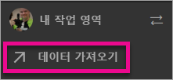
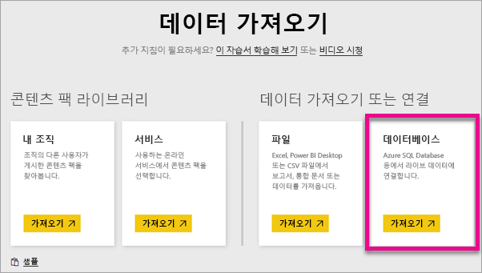
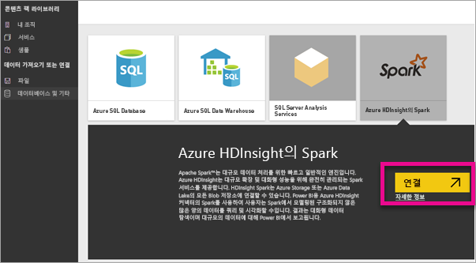
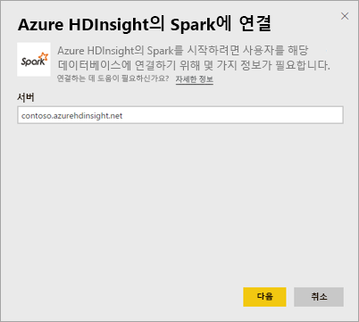
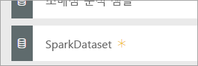
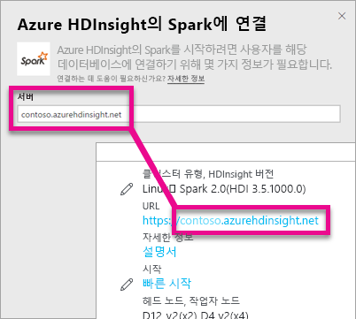
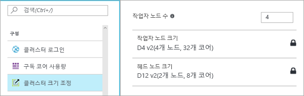

# DirectQuery를 포함하는 HDInsight의 Spark
DirectQuery를 포함하는 Azure HDInsight의 Spark를 통해 Spark 클러스터에 이미 있는 데이터와 메트릭을 기반으로 하는 동적 보고서를 만들 수 있습니다. DirectQuery를 사용할 경우 보고서 뷰에서 데이터를 탐색할 때 쿼리가 Azure HDInsight Spark 클러스터로 다시 전송됩니다. 이 환경은 연결하는 엔터티를 잘 알고 있는 사용자에게 제안됩니다.

> [!WARNING]
> Spark 기반 데이터 집합을 기반으로 하는 대시보드 타일에 대한 타일 자동 새로 고침이 비활성화되었습니다. **대시보드 타일 새로 고침**을 선택하여 수동으로 새로 고칠 수 있습니다. 보고서는 영향을 받지 않으며 최신 상태로 유지됩니다. 
> 
> 

Power BI 서비스 내에서 DirectQuery를 사용하여 Azure HDInsight의 Spark 데이터 원본에 연결하는 데 다음 단계를 사용할 수 있습니다.

1. 왼쪽 탐색 창의 맨 아래에 있는 **데이터 가져오기** 를 선택합니다.
   
     
2. **데이터베이스 및 기타**를 선택합니다.
   
     
3. **HDInsight의 Spark** 커넥터를 선택 하고 **연결**을 선택합니다.
   
     
4. 연결하려는 **서버** 의 이름뿐만 아니라 **사용자 이름** 과 **암호**를 입력합니다. 서버는 항상 \<clustername\>.azurehdinsight.net 형태이어야 하며, 이러한 값을 찾는 방법에 대한 자세한 내용은 아래를 참조하세요.
   
     
   
     
5. 연결되면 "SparkDataset"라는 이름의 새 데이터 집합이 표시됩니다. 생성된 자리 표시자 타일을 통해 데이터 집합에 액세스할 수도 있습니다.
   
     
6. 데이터 집합을 드릴인투하여 데이터베이스의 모든 테이블 및 열을 탐색할 수 있습니다. 열을 선택하면 쿼리가 다시 소스로 전송되고 동적으로 시각 효과를 만듭니다. 이러한 시각 효과를 새 보고서에 저장하고 대시보드에 다시 고정할 수 있습니다.

## HDInsight의 Spark 매개 변수 찾기
서버는 항상 \<clustername\>azurehdinsight.net 형식이며 Azure Portal에서 찾을 수 있습니다.

또한 Azure Portal에서 사용자 이름 및 암호도 찾을 수 있습니다.

## 제한 사항
이러한 제한 사항 및 참고는 환경이 계속 향상됨에 따라 변경될 수 있습니다. 추가 설명서는 [Azure HDInsight의 Apache Spark와 함께 BI 도구 사용](https://azure.microsoft.com/documentation/articles/hdinsight-apache-spark-use-bi-tools/)에서 찾을 수 있습니다.

* Power BI 서비스는 Spark 2.0 및 HDInsight 3.5의 구성만 지원합니다.
* 열 선택 또는 필터 추가와 같은 모든 작업은 데이터베이스에 다시 쿼리를 보냅니다. 따라서 매우 큰 필드를 선택하기 전에 적절한 시각적 형식을 선택하는 것이 좋습니다.
* DirectQuery 데이터 집합에 질문 및 답변을 사용할 수 없습니다.
* 스키마 변경 내용은 자동으로 선택되지 않습니다.
* Power BI는 데이터 집합 내의 **모든 테이블에서** 16,000개의 열을 지원합니다. Power BI는 또한 테이블당 내부 행 번호 열을 포함합니다. 즉, 데이터 집합에 100개의 테이블이 있는 경우 사용할 수 있는 열 수는 15,900개입니다. Spark 데이터 원본에서 사용하는 데이터 양에 따라 이러한 제한이 발생할 수 있습니다.

## 문제 해결
클러스터에 대한 쿼리를 실행하는 데 문제가 있는 경우, 응용 프로그램이 여전히 실행 중인지 확인하고 필요한 경우 다시 시작합니다.

Azure Portal의 **구성** > **클러스터 크기 조정**에서 추가 리소스를 할당할 수도 있습니다.

## 다음 단계
[시작: HDInsight Linux에서 Apache Spark 클러스터 만들기 및 Spark SQL을 사용하여 대화형 쿼리 실행](https://azure.microsoft.com/documentation/articles/hdinsight-apache-spark-jupyter-spark-sql)  
[Power BI 시작](service-get-started.md)  
[Power BI에 대한 데이터 가져오기](service-get-data.md)  
궁금한 점이 더 있나요? [Power BI 커뮤니티를 이용하세요.](http://community.powerbi.com/)

