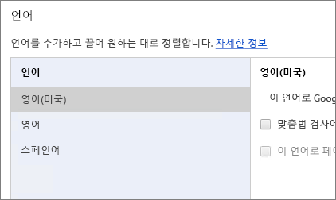
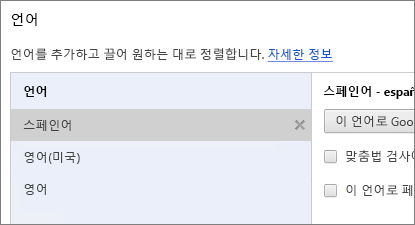
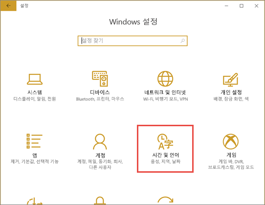
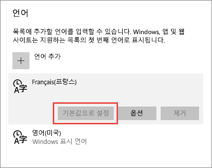
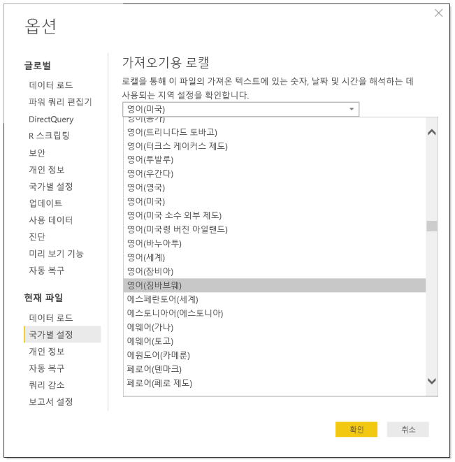
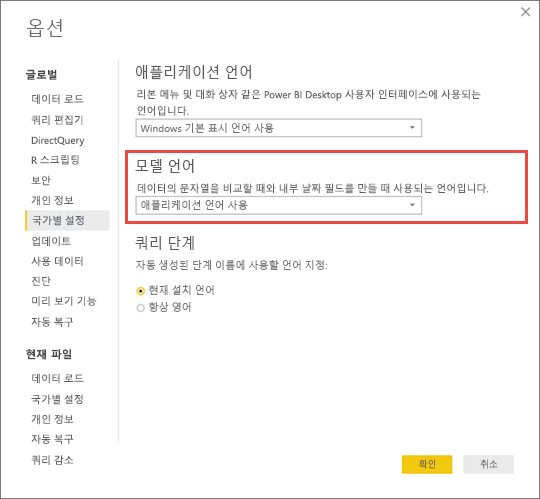

# Power BI에 지원되는 언어 및 국가/지역

이 문서는 지원 되는 언어 및 국가/지역 Power BI 서비스, Power BI Desktop 및 Power BI 설명서를 나열합니다.

## Power BI를 사용할 수 있는 국가 및 지역
Power BI를 사용할 수 있는 국가 및 지역 목록은 [국제 지원 가용성 목록](https://products.office.com/business/international-availability)을 참조하세요. 

## Power BI 서비스에 대한 언어
브라우저의 Power BI 서비스는 다음 44개 언어로 제공됩니다.

* 아랍어
* 바스크어-바스크어
* 불가리아어-Български
* 카탈로니아어-català
* 중국어(간체)-中文(简体)
* 중국어(번체)-中文(繁體)
* 크로아티아어-hrvatski
* 체코어-čeština
* 덴마크어-dansk
* 네덜란드어-네덜란드어
* 영어-영어
* 에스토니아어-eesti
* 핀란드어-suomi
* 프랑스어-français
* 갈리시아어-galego
* 독일어-Deutsch
* 그리스어-Ελληνικά
* 히브리어
* 힌디어-हिंदी
* 헝가리어-magyar
* 인도네시아어-바하사 인도네시아어
* 이탈리아어-italiano
* 일본어-日本語
* 카자흐어-Қазақ
* 한국어-한국어
* 라트비아어-latviešu
* 리투아니아어-lietuvių
* 말레이어-바하사 말레이어
* 노르웨이어(복말)-norsk(복말)
* 폴란드어-Polski
* 포르투갈어(브라질)-Português
* 포르투갈어(포르투갈)-Português
* 루마니아어-română
* 러시아어-Русский
* 세르비아어(키릴자모)-српски
* 세르비아어(라틴 문자)-srpski
* 슬로바키아어-slovenčina
* 슬로베니아어-slovenski
* 스페인어-español
* 스웨덴어-svenska
* 태국어-ไทย
* 터키어-Türkçe
* 우크라이나어-українська
* 베트남어-Tiếng Việt

### 번역 내용
Power BI 메뉴, 단추, 메시지 및 언어를 환경의 다른 요소를 변환합니다.

이번에 몇 가지 기능은 영어로만 제공됩니다.

* 대시보드 및 보고서는 Power BI Microsoft Dynamics CRM, Google Analytics, Salesforce와 같은 서비스에 연결할 때 만듭니다. 여전히 자신의 언어로 사용자 고유의 대시보드 및 보고서를 만들 수 있습니다.
* 질문과 대답을 통한 데이터 탐색

추가된 기능이 기타 언어로 제공될 수 있도록 노력하겠습니다. 

### Power BI 서비스에서 해당 언어를 선택합니다.
1. Power BI 서비스에서 **설정** 아이콘  > **설정**을 선택합니다.
2. **일반** 탭 > **언어**에서.
3. 언어 > **적용**을 선택합니다.

### 브라우저에서 해당 언어를 선택합니다.
Power BI는 컴퓨터의 언어 기본 설정에 따라 언어를 검색합니다. 이러한 기본 설정을 액세스하고 변경하는 방법은 운영 체제 및 브라우저에 따라 달라질 수 있습니다. Internet Explorer 및 Google Chrome에서 이러한 기본 설정에 액세스하는 방법은 다음과 같습니다.

#### Internet Explorer(버전 11)
1. 브라우저 창의 오른쪽 위 모서리에 있는 **도구** 단추를 클릭합니다.
   
   
2. **인터넷 옵션**을 클릭합니다.
3. 모양 아래의 일반 탭에 있는 인터넷 옵션 대화 상자에서 **언어** 단추를 클릭합니다.

#### Google Chrome(버전 42)
1. 브라우저 창의 오른쪽 위 모서리에 있는 메뉴 단추를 클릭합니다.
   
   
2. **설정**을 클릭합니다.
3. **고급 설정 표시**를 클릭합니다.
4. 언어에서 **언어 및 입력 설정** 단추를 클릭합니다.
5. **추가**를 클릭하고 언어를 선택한 다음, **확인**을 클릭합니다.
   
   
   
   새로운 언어는 목록 끝에 있습니다. 
6. 목록의 맨 위에 새 언어를 끌어놓고 **이 언어로 Google Chrome 표시**를 클릭합니다.
   
   
   
   브라우저를 닫았다가 다시 열어서 변경 사항을 확인해야 합니다.

## Power BI Desktop의 언어 또는 로캘 선택
Power BI Desktop을 얻는 방법은 두 가지입니다. 다운로드하거나 Windows 스토어에서 설치할 수 있습니다.

* [Windows 스토어에서 Power BI Desktop을 설치](#choose-a-language-for-power-bi-desktop-installed-from-the-windows-store)하면 모든 언어가 설치되고 Windows 기본 언어에 해당하는 언어가 표시됩니다.
* [Power BI Desktop을 다운로드](#choose-a-language-when-you-download-power-bi-desktop)할 때 언어를 선택합니다. 
* 특정 보고서를 위한 [데이터를 가져올 때 사용할 로캘을 선택](#choose-the-locale-for-importing-data-into-power-bi-desktop)할 수도 있습니다.

### Windows 스토어에서 설치된 Power BI Desktop의 언어 선택
1. Windows 스토어에서 [Power BI Desktop을 설치](http://aka.ms/pbidesktopstore)합니다.
2. 언어를 변경하려면 컴퓨터에서 **Windows 설정**을 검색합니다. 
3. **시간 및 언어**를 선택합니다.
   
     
4. **언어 및 지역**을 선택하고 언어를 선택하고 **기본값으로 설정**을 선택합니다.
   
     
   
     다음에 Power BI Desktop을 시작하면 기본값으로 설정한 언어가 사용됩니다. 

### Power BI Desktop을 다운로드할 때 언어 선택
Power BI Desktop용으로 선택한 언어는 보고서의 숫자 및 날짜 표시 형식에 영향을 미칩니다. 

* [Power BI Desktop을 다운로드](https://powerbi.microsoft.com/desktop)할 때 언어를 선택합니다. 

Power BI Desktop에서 언어를 변경하려면 다운로드 페이지로 돌아가서 다른 언어로 다운로드하십시오.

### Power BI Desktop으로 데이터를 가져올 때 사용할 로캘 선택
Power BI Desktop을 다운로드하든 Windows 스토어에서 설치하든 특정 보고서에 대한 로캘을 Power BI Desktop 버전의 로캘이 아닌 다른 로캘로 선택할 수 있습니다. 데이터에서 가져온 때 방식으로 데이터를 해석 하는 로캘의 변경은 원본, 예를 들어 "3/4/2017" 3 월 또는 년 3 월 4로 해석 되는 여부입니다. 

1. Power BI Desktop에서 **파일** > **옵션 및 설정** > **옵션**으로 이동합니다.
2. **현재 파일**에서 **국가별 설정**을 선택합니다.
3. **가져오기용 로캘** 상자에서 다른 로캘을 선택합니다. 
   
   
4. **확인**을 선택합니다.

### Power BI Desktop에서 모델 언어 선택

Power BI Desktop 애플리케이션의 언어를 설정할 수 있을 뿐만 아니라 모델 언어도 설정할 수 있습니다. 모델 언어는 다음 두 가지에 주로 영향을 미칩니다.

- 문자열 비교 및 정렬 방법. 예를 들어 터키어는 데이터베이스의 데이터 정렬에 따라 문자 i가 두 가지로 표기되기 때문에 문자열을 정렬할 경우 다른 순서로 정렬될 수 있습니다. 
- Power BI Desktop이 날짜 필드에서 숨겨진 날짜 테이블을 만들 때 사용하는 언어. 필드 이름의 예로는 월/Monat/Mois 등이 있습니다.

> [!NOTE]
> Power BI의 모델은 현재 대/소문자(또는 가나)를 구분하지 않는 로캘을 사용하므로 “ABC” 및 “abc”는 동일한 것으로 처리됩니다. “ABC”가 먼저 데이터베이스에 로드되면 “Abc”와 같이 대/소문자로만 구분되는 다른 문자열이 별도의 값으로 로드되지 않습니다.
> 
>

모델 언어를 설정하는 방법은 다음과 같습니다.

1. Power BI Desktop에서 **파일** > **옵션 및 설정** > **옵션**으로 이동합니다.
2. **전역** 아래에서 **국가별 설정**을 선택합니다.
3. **모델 언어** 상자에서 다른 언어를 선택합니다. 

    

> [!NOTE]
> 생성된 후에는 Power BI 모델의 언어를 변경할 수 없습니다.
> 
>

## 도움말 문서에 대한 언어
도움말은 다음과 같은 10가지 언어로 지역화됩니다. 

* 중국어(간체)-中文(简体)
* 중국어(번체)-中文(繁體)
* 프랑스어-français
* 독일어-Deutsch
* 이탈리아어-italiano
* 일본어-日本語
* 한국어-한국어
* 포르투갈어(브라질)-Português
* 러시아어-Русский
* 스페인어-español

## 다음 단계
* Power BI 모바일 앱 중 하나를 사용하고 있나요? 자세한 내용은 [Power BI 모바일 앱에서 지원되는 언어](consumer/mobile/mobile-apps-supported-languages.md)를 참조하세요.
* 궁금한 점이 더 있나요? [Power BI 커뮤니티](http://community.powerbi.com/)에 질문합니다.
* 여전히 문제가 있나요? [Power BI 지원 페이지](https://powerbi.microsoft.com/support/)를 방문하세요.

