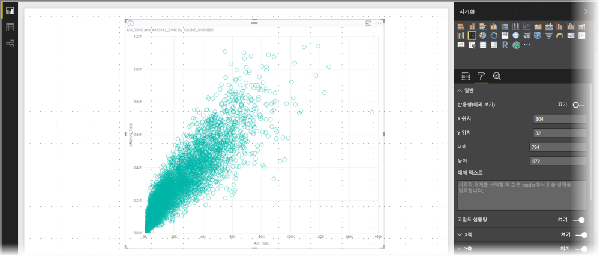
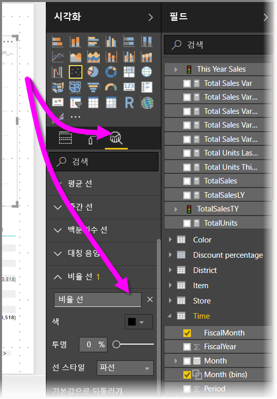
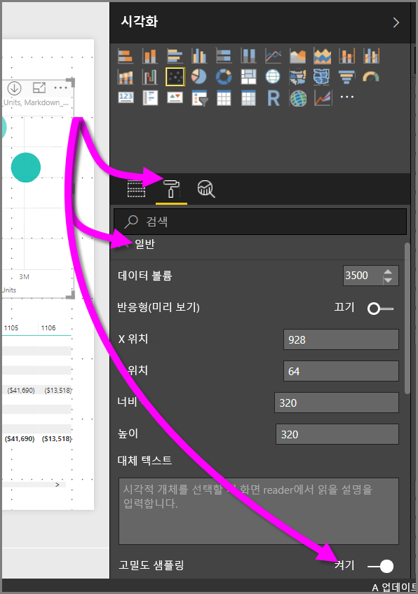

# Power BI 분산형 차트의 고밀도 샘플링
**Power BI Desktop** 2017년 9월 릴리스 및 **Power BI 서비스** 업데이트부터 새 샘플링 알고리즘은 분산형 차트에서 고밀도 데이터를 나타내는 방법을 향상시키는 데 사용할 수 있습니다.

예를 들어 매년 수만 개의 데이터 요소가 있는 각 상점의 경우 조직의 영업 활동에서 분산형 차트를 만들 수 있습니다. 이러한 정보의 분산형 차트는 사용 가능한 데이터에서 데이터를 샘플링하고(해당 데이터의 의미 있는 표현을 선택하여 시간 경과에 따른 판매 상황을 보여줌), 기본 데이터를 나타내는 분산형 차트를 만듭니다. 이는 고밀도 분산형 차트의 일반적인 사례입니다. Power BI는 고밀도 데이터의 해당 샘플링을 향상시켰으며, 이에 대해 이 문서에서 자세히 설명합니다.

> [!NOTE]
> 이 문서에서 설명하는 **고밀도 샘플링** 알고리즘은 **Power BI Desktop** 및 **Power BI 서비스** 둘 다의 분산형 차트에서 사용할 수 있습니다.
> 
> 

## 고밀도 분산형 차트 작동 방식
이전에 **Power BI**는 분산형 차트를 만들기 위해 결정적 방식으로 기본 데이터의 전체 범위에서 샘플 데이터 요소의 컬렉션을 선택했습니다. 특히 Power BI는 분산형 차트 시리즈에서 데이터의 첫 번째 및 마지막 행을 선택하고 나머지 행을 균등하게 나누어서 총 3,500개의 데이터 요소가 분산형 차트에 그려집니다. 예를 들어 샘플에 35,000개 행이 있는 경우 첫 번째 및 마지막 행을 그리기 위해 선택한 후 10번째 행마다 그려집니다(35,000 / 10 = 10번째 행마다 = 3,500개 데이터 요소). 또한 이전에는 데이터 계열에 그릴 수 없는 null 값 또는 요소(예: 텍스트 값)가 표시되지 않았으며, 이에 따라 시각적 개체를 생성할 때 고려되지 않았습니다. 이러한 샘플링을 사용하면 분산형 차트의 인지된 밀도는 대표 데이터 요소에 기반했으므로 묵시적 시각 밀도는 기본 데이터의 전체 컬렉션이 아닌 샘플링된 요소의 환경이었습니다.

**고밀도 샘플링**을 사용하는 경우 Power BI는 겹치는 지점을 제거하는 알고리즘을 구현하고 시각적 개체와 상호 작용할 때 시각적 개체의 지점에 연결될 수 있는지를 확인합니다. 또한 알고리즘은 데이터 집합의 모든 요소가 시각적 개체에 표시되도록 하여 대표 샘플만 그리는 것이 아니라 선택한 요소의 의미에 대한 컨텍스트를 제공합니다.

정의에 따르면, 고밀도 데이터를 샘플링하여 상호 작용에 응답하는 시각화를 합리적으로 빠르게 만듭니다. 시각적 개체에 너무 많은 데이터 요소가 있으면 문제가 발생할 수 있으며, 추세의 가시성이 손상될 수 있습니다. 따라서 데이터를 샘플링하는 방법은 최상의 시각화 환경을 제공하고 모든 데이터가 표시되도록 하는 샘플링 알고리즘을 만드는 것입니다. Power BI에서 알고리즘은 전반적인 데이터 집합에서 중요한 요소에 대한 응답성, 표현 및 명확한 보존의 최적 조합을 제공하도록 향상되었습니다.

> [!NOTE]
> **고밀도 샘플링** 알고리즘을 사용하는 분산형 차트는 모든 분산형 차트와 마찬가지로 정사각형 시각적 개체에 가장 잘 그려집니다.
> 
> 

## 새로운 분산형 차트 샘플링 알고리즘 작동 방법
분산형 차트의 **고밀도 샘플링**에 대한 새로운 알고리즘은 기본 데이터를 더 효과적으로 캡처 및 표현하고 겹치는 요소를 제거하는 메서드를 사용합니다. 각 데이터 요소에 작은 반지름부터 시작합니다(시각화의 지정된 지점에 대한 시각적 원 크기) 모든 데이터 요소의 반지름을 증가시킵니다. 두 개(이상)의 데이터 요소가 겹치는 경우 (증가된 반지름 크기의) 단일 원은 이러한 겹쳐진 데이터 요소를 나타냅니다. 알고리즘은 해당 반지름 값이 분산형 차트에 적절한 수의 데이터 요소(3,500개)를 표시할 때까지 데이터 요소의 반지름을 계속 증가시킵니다.

이 알고리즘의 메서드는 이상값을 결과 시각적 개체에 표시하도록 합니다. 중첩 구조를 결정하는 경우 알고리즘은 기본 시각화된 지점에 대한 정확도를 포함하여 지수 크기를 시각화하는 등 크기도 고려합니다.

또한 알고리즘은 분산형 차트의 전체적인 모양을 유지합니다.

> [!NOTE]
> 분산형 차트에 **고밀도 샘플링** 알고리즘을 사용하는 경우 목표는 내재된 시각적 밀도가 ‘아니라’ 데이터의 ‘정확한 배포’입니다. 예를 들어 특정 부분에서 겹치는 원(밀도)이 많은 분산형 차트가 표시되고 많은 데이터 요소가 클러스터되어야 한다고 가정할 수 있습니다. **고밀도 샘플링** 알고리즘은 많은 데이터 요소를 표시하기 위해 하나의 원을 사용할 수 있으므로 이러한 내재된 시각적 밀도(또는 “클러스터링”)는 표시되지 않습니다. 지정된 영역에서 자세한 내용을 보려면 슬라이서를 사용하여 확대할 수 있습니다.
> 
> 

또한 그릴 수 없는 데이터 요소(예: null 값 또는 텍스트 값)는 무시되므로 그릴 수 있는 다른 값을 선택하면 분산형 차트의 진정한 모양을 유지 관리할 수 있습니다.

### 분산형 차트에 대한 표준 알고리즘을 사용하는 경우
**고밀도 샘플링**을 분산형 차트에 적용할 수 없고 원래의 알고리즘이 사용되는 경우가 있습니다. 이런 경우는 다음과 같습니다.

* **세부 정보** 아래에서 값을 마우스 오른쪽 단추로 클릭하고 메뉴에서 **데이터가 없는 항목 표시**로 설정하면 분산형 차트가 원래 알고리즘으로 되돌아갑니다.
  
  
* **재생** 축의 모든 값은 분산형 차트가 원래 알고리즘으로 되돌아가도록 만듭니다.
* 분산형 차트에서 X 및 Y 축이 모두 누락되면 차트는 원래 알고리즘으로 되돌아갑니다.
* **분석** 창에서 **비율 줄**을 사용하면 차트가 원래 알고리즘으로 되돌아갑니다.
  
  

## 분산형 차트에 고밀도 샘플링을 사용하는 방법
**고밀도 샘플링**을 켜려면 분산형 차트를 선택하고, **서식** 창으로 이동한 다음, **일반** 카드를 확장하고, 해당 카드의 아래쪽에 있는 **고밀도 샘플링** 토글 슬라이더를 **켜기**로 밉니다.

> [!NOTE]
> 슬라이더가 켜지면 Power BI는 가능할 때마다 **고밀도 샘플링** 알고리즘을 사용하려고 합니다. 알고리즘을 사용할 수 없는 경우(예: *재생* 축에서 값을 배치한 경우) 차트가 표준 알고리즘으로 되돌아가더라도 지정 슬라이더는 **켜기** 위치에 있게 됩니다. *재생* 축에서 값을 제거하거나 고밀도 샘플링 알고리즘을 사용할 수 있도록 조건을 변경하면 기능이 활성화되어 있으므로 차트에서 자동으로 해당 차트에 고밀도 샘플링을 사용합니다.
> 
> [!NOTE]
> 데이터 요소는 인덱스별로 그룹화되거나 선택됩니다. 범례는 알고리즘의 샘플링에 영향을 주지 않습니다. 시각적 개체의 순서 지정에만 적용됩니다.
> 
> 

## 고려 사항 및 제한 사항
고밀도 샘플링 알고리즘은 Power BI에 중요한 향상된 기능이지만 고밀도 값 및 분산형 차트를 사용할 때 알아야 할 몇 가지 고려 사항이 있습니다.

* **고밀도 샘플링** 알고리즘은 Power BI 서비스 기반 모델, 가져온 모델 또는 DirectQuery에 대한 라이브 연결만을 사용합니다.

## 다음 단계
다른 차트의 고밀도 샘플링에 대한 자세한 내용은 다음 문서를 참조하세요.

* [Power BI의 고밀도 선 샘플링](../desktop-high-density-sampling.md)

