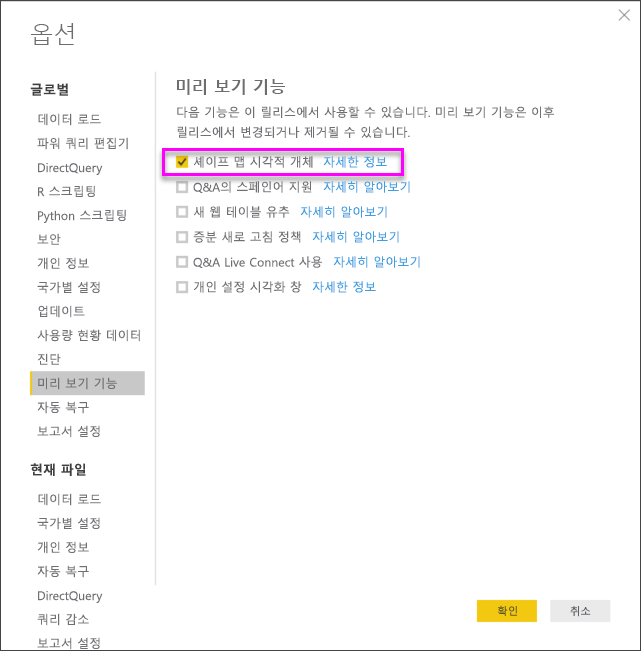
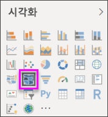
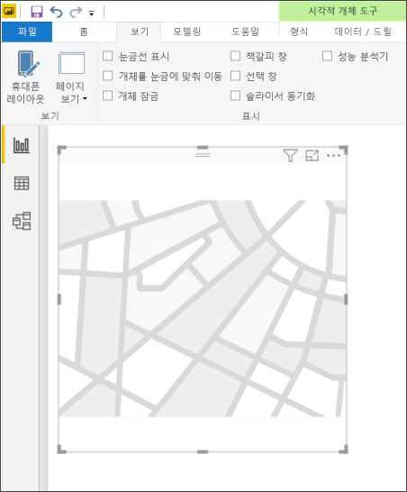
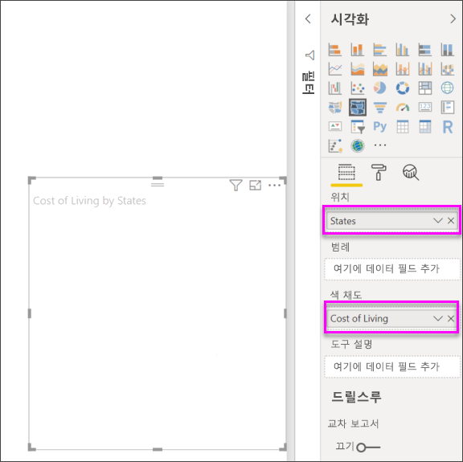
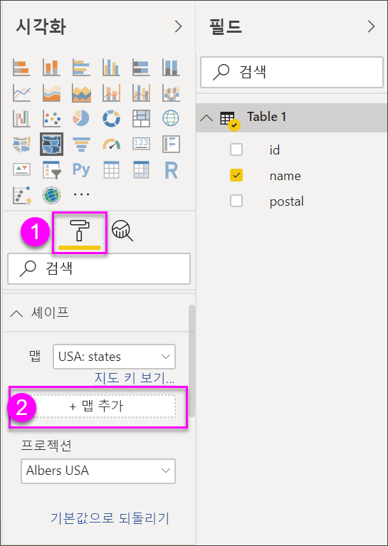

# Power BI Desktop에서 도형 맵 시각화 만들기(미리 보기)

[!INCLUDE [power-bi-visuals-desktop-banner](../includes/power-bi-visuals-desktop-banner.md)]

**도형 맵** 시각적 개체를 만들어 색을 사용하여 맵의 영역을 비교합니다. **맵** 시각적 개체와 달리 **도형 맵**은 데이터 요소의 정확한 지리적 위치를 맵에 표시할 수 없습니다. 대신, 색을 다르게 지정하여 맵 영역의 상대 비교를 표시하는 데 주로 사용됩니다.

**도형 맵** 시각적 개체는 사용자가 만들 수 있는 사용자 지정 맵을 사용하는 매력적인 기능이 있는 ESRI/TopoJSON 맵을 기반으로 합니다. 사용자 지정 맵의 예로는 지리적, 좌석 배치, 평면도 등이 있습니다. 사용자 지정 맵을 사용하는 기능은 **도형 맵**의 이 미리 보기 버전에서 사용할 수 없습니다.

## 도형 맵 만들기
미리 보기 릴리스에서 제공하는 맵을 사용하여 **도형 맵** 컨트롤을 테스트할 수 있습니다. 또는 **사용자 지정 맵 사용**이라는 다음 섹션에서 설명한 요구 사항을 충족하면 고유한 사용자 지정 맵을 사용할 수 있습니다.

**도형 맵** 시각적 개체는 미리 보기 상태이며 Power BI Desktop에서 사용하도록 설정해야 합니다. **도형 맵**을 사용하도록 설정하려면 **파일 > 옵션 및 설정 > 옵션 > 미리 보기 기능**을 선택한 후 **도형 맵 시각화** 확인란을 선택합니다. 선택한 후에는 Power BI Desktop을 다시 시작해야 합니다.

**도형 맵**이 활성화되면 **시각화** 창에서 **도형 맵** 아이콘을 선택합니다.

Power BI Desktop에 비어 있는 **도형 맵** 시각적 개체 디자인 캔버스가 만들어집니다.

다음 단계를 수행하여 **도형 맵**을 만듭니다.

1. **필드** 창에서 지역 이름(또는 약어)이 있는 데이터 필드를 **위치** 버킷으로, 데이터 측정 필드를 **색 채도** 버킷(맵에 아직 표시되지 않음)으로 끌어옵니다.

   > [!NOTE]
   > **도형 맵**을 테스트하기 위해 맵 데이터를 신속하게 가져오는 방법은 아래 **맵 데이터 가져오기** 제목의 섹션을 참조하세요.
   > 
   > 

   
2. **서식** 설정 창에서 **도형**을 확장하고 **표준 맵** 드롭다운에서 선택하여 데이터를 표시합니다. 이 시점에는 다음 이미지와 같이 렌더링이 나타납니다.

   

   > [!NOTE]
   > 이 문서의 끝에 있는 **지역 키** 섹션은 **도형 맵** 시각적 개체를 테스트하는 데 사용할 수 있는 맵 지역 키가 포함된 테이블의 컬렉션입니다.
   > 
   > 
3. 그런 다음, **기본 색**, **확대/축소** 등과 같은 서식 지정 옵션을 사용하여 맵을 수정할 수 있습니다. 또한 **범례** 버킷에 범주 데이터 열을 추가하고 범주에 따라 맵 지역을 분류할 수도 있습니다.

## 사용자 지정 맵 사용
**TopoJSON** 형식인 **도형 맵**과 함께 사용자 지정 맵을 사용할 수 있습니다. 맵이 다른 형식인 경우 [**맵 쉐이퍼**](https://mapshaper.org/)와 같은 온라인 도구를 사용하여 *셰이프 파일* 또는 *GeoJSON* 맵을 **TopoJSON** 서식으로 변환할 수 있습니다.

**TopoJSON** 맵 파일을 사용하려면 ShapeMap 시각적 개체를 보고서에 추가하고 일부 데이터를 ‘위치’ 및 ‘색 채도’ 버킷에 추가합니다.   그런 다음, 선택한 **서식** 섹션이 있는 **시각화** 창에서(다음 이미지에 (1)로 표시) **도형** 섹션을 확장하고 **+ 맵 추가**를 선택합니다.

## 샘플 사용자 지정 맵
‘미국 연방 검사국’은 소송 및 담당 건수 데이터에 대한 연간 회계 보고서를 릴리스합니다.   해당되는 모든 보고서를 아래 링크에서 확인할 수 있습니다.

https://www.justice.gov/usao/resources/annual-statistical-reports

상태가 여러 구역으로 나눌 수 있으므로 사용자 지정 도형 맵을 사용해야 합니다.  그런 다음, 미국 사법 구역의 **TopoJSON** 맵을 **Power BI Desktop**으로 가져와서 연간 회계 구역 검사 데이터를 시각화할 수 있습니다.  아래 이미지에서는 이 맵의 예제를 표시합니다.

개별 상태 맵을 사용하여 흥미로운 작업을 수행할 수 있고 포함된 구역에 따라 세부 정보를 표시할 수 있습니다. 

이 데이터 세트 및 시각화를 실험하려는 경우 다음 링크를 사용하여 이 보고서를 생성하는 데 사용된 원본 PBIX 파일을 다운로드할 수 있습니다.

* [도형 맵 데모 .PBIX 파일 사용자 지정](https://download.microsoft.com/download/1/2/8/128943FB-9231-42BD-8A5D-5E2362C9D589/DistrictAttorneyFiscalReport.pbix)

## 맵 데이터 가져오기
데이터를 모델로 신속하게 가져와 **도형 맵**을 테스트하기 위해서는 이 문서의 끝에 있는 테이블 중 하나를 복사한 후 리본 메뉴 **홈** 탭에서 **데이터 입력**을 선택하면 됩니다.

데이터에 여러 열이 있는 경우 Excel과 같은 편집기를 사용하여 데이터를 붙여넣은 다음, 각 데이터 열을 개별적으로 복사해야 합니다. 그러면 데이터를 Power BI Desktop에 붙여넣을 수 있습니다. 맨 위 행이 헤더로 자동으로 식별됩니다.

Excel에서처럼 새 열 이름(오른쪽 빈 열)을 입력한 후 각 셀에 값을 추가하여 새 행을 입력할 수 있습니다. 완료한 후 **로드**를 선택하면 테이블이 Power BI Desktop에 대한 데이터 모델에 추가됩니다.

> [!NOTE]
> 국가 또는 지역 작업 시, 지오코딩이 지도 시각화에서 제대로 작동되도록 세 글자 약어를 사용하세요. 일부 국가나 지역이 제대로 인식되지 않을 수 있으므로 두 글자 약어는 사용하지 *마십시오*.
> 
> 두 글자로만 된 약어가 있는 경우 [이 외부 블로그 게시물](https://blog.ailon.org/how-to-display-2-letter-country-data-on-a-power-bi-map-85fc738497d6#.yudauacxp)을 확인하여 두 글자 국가/지역 약어를 세 글자 국가/지역 약어와 연결하는 방법에 대한 단계를 수행합니다.
> 
> 

## 미리 보기 동작 및 요구 사항
이 미리 보기 릴리스의 **도형 맵**에 대한 몇 가지 고려 사항과 요구 사항이 있습니다.

* **도형 맵** 시각적 개체는 미리 보기 상태이며 Power BI Desktop에서 사용하도록 설정해야 합니다. **도형 맵**을 사용하도록 설정하려면 **파일 > 옵션 및 설정 > 옵션 > 미리 보기 기능**을 선택한 후 **도형 맵 시각화** 확인란을 선택합니다.
* 현재는 **범례** 분류가 제대로 작동하려면 **색 채도** 버킷도 설정되어 있어야 합니다.
* **도형 맵**의 최종 릴리스 버전에는 현재 선택된 맵의 맵 키를 보여주는 사용자 인터페이스가 포함됩니다(최종 릴리스에 대한 날짜 집합은 없지만, **도형 맵**은 미리 보기에 있음). 이 미리 보기 릴리스에서 이 문서의 다음 **지역 키** 섹션에 있는 테이블의 맵 지역 키를 참조할 수 있습니다.
* **도형 맵** 시각적 개체는 최대 1,500개의 데이터 요소를 표시합니다.

## 지역 키

이 미리 보기 릴리스에서는 다음 **지역 키**를 사용하여 **도형 맵**을 테스트합니다.

### 오스트레일리아: 시/도

| ID | abbr | iso | name | postal |
| --- | --- | --- | --- | --- |
| au-wa |WA |AU-WA |Western Australia |WA |
| au-vic |Vic |AU-VIC |Victoria |VIC |
| au-tas |Tas |AU-TAS |Tasmania |TAS |
| au-sa |SA |AU-SA |South Australia |SA |
| au-qld |Qld |AU-QLD |Queensland |QLD |
| au-nt |NT |AU-NT |Northern Territory |NT |
| au-nsw |NSW |AU-NSW |New South Wales |NSW |
| au-act |ACT |AU-ACT |Australian Capital Territory |ACT |

### 오스트리아: 시/도

| ID | iso | name | name-en | postal |
| --- | --- | --- | --- | --- |
| at-wi |AT-9 |Wien |Vienna |WI |
| at-vo |AT-8 |Vorarlberg |Vorarlberg |VO |
| at-tr |AT-7 |Tirol |Tyrol |TR |
| at-st |AT-6 |Steiermark |Styria |ST |
| at-sz |AT-5 |Salzburg |Salzburg |SZ |
| at-oo |AT-4 |Oberösterreich |Upper Austria |OO |
| at-no |AT-3 |Niederösterreich |Lower Austria |NO |
| at-ka |AT-2 |Kärnten |Carinthia |KA |
| at-bu |AT-1 |Burgenland |Burgenland |BU |

### 브라질: 시/도

| ID |
| --- |
| Tocantins |
| Pernambuco |
| Goias |
| Sergipe |
| Sao Paulo |
| Santa Catarina |
| Roraima |
| Rondonia |
| Rio Grande do Sul |
| Rio Grande do Norte |
| Rio de Janeiro |
| Piaui |
| Parana |
| Paraiba |
| Para |
| Minas Gerais |
| Mato Grosso |
| Maranhao |
| Mato Grosso do Sul |
| Distrito Federal |
| Ceara |
| Espirito Santo |
| Bahia |
| Amazonas |
| Amapa |
| Alagoas |
| Acre |
| Litigated Zone 1 |
| Litigated Zone 2 |
| Litigated Zone 3 |
| Litigated Zone 4 |

### 캐나다: 시/도

| ID | iso | name | postal |
| --- | --- | --- | --- |
| ca-nu |CA-NU |Nunavut |NU |
| ca-nt |CA-NT |Northwest Territories |NT |
| ca-yt |CA-YT |Yukon |YT |
| ca-sk |CA-SK |Saskatchewan |SK |
| ca-qc |CA-QC |Quebec |QC |
| ca-pe |CA-PE |Prince Edward Island |PE |
| ca-on |CA-ON |Ontario |ON |
| ca-ns |CA-NS |Nova Scotia |NS |
| ca-nl |CA-NL |Newfoundland and Labrador |NL |
| ca-nb |CA-NB |New Brunswick |NB |
| ca-mb |CA-MB |Manitoba |MB |
| ca-bc |CA-BC |British Columbia |BC |
| ca-ab |CA-AB |Alberta |AB |

### 프랑스: 지역

| ID | name | name-en |
| --- | --- | --- |
| Auvergne-Rhone-Alpes |  |  |
| Bourgogne-Franche-Comte |  |  |
| Bretagne |Bretagne |Brittany |
| Centre-Val de Loire |Centre-Val de Loire |Centre-Val de Loire |
| Corse |Corse |Corsica |
| Grand Est |  |  |
| 과들루프 | |   |
| Hauts-de-France |  |  |
| Ile-de-France |Île-de-France |Ile-de-France |
| La Reunion |  |  |
| 마요트  |  |  |
| Normandie |Normandie |  |
| Nouvelle-Aquitaine |  |  |
| Occitanie  |  |  |
| Pays de la Loire |Pays de la Loire |Pays de la Loire |
| Provence-Alpes-Cote d'Azur |Provence-Alpes-Côte d'Azur |Provence-Alpes-Cote d'Azur |
|  |  |  |

### 독일: 시/도

| ID | iso | name | name-en | postal |
| --- | --- | --- | --- | --- |
| de-be |DE-BE |Berlin |Berlin |BE |
| de-th |DE-TH |Thüringen |Thuringia |TH |
| de-st |DE-ST |Sachsen-Anhalt |Saxony-Anhalt |ST |
| de-sn |DE-SN |Sachsen |Saxony |SN |
| de-mv |DE-MV |Mecklenburg-Vorpommern |Mecklenburg-Vorpommern |MV |
| de-bb |DE-BB |Brandenburg |Brandenburg |BB |
| de-sh |DE-SH |Schleswig-Holstein |Schleswig-Holstein |SH |
| de-sl |DE-SL |Saarland |Saarland |SL |
| de-rp |DE-RP |Rheinland-Pfalz |Rhineland-Palatinate |RP |
| de-nw |DE-NW |Nordrhein-Westfalen |North Rhine-Westphalia |NW |
| de-ni |DE-NI |Niedersachsen |Lower Saxony |NI |
| de-he |DE-HE |Hessen |Hesse |HE |
| de-hh |DE-HH |Hamburg |Hamburg |HH |
| de-hb |DE-HB |Bremen |Bremen |HB |
| de-by |DE-BY |Bayern |Bavaria |BY |
| de-bw |DE-BW |Baden-Württemberg |Baden-Wurttemberg |BW |

### 아일랜드: 지방

| ID |
| --- |
| Wicklow |
| Wexford |
| Westmeath |
| Waterford |
| Sligo |
| Tipperary |
| Roscommon |
| Offaly |
| Monaghan |
| Meath |
| Mayo |
| Louth |
| Longford |
| Limerick |
| Leitrim |
| Laoighis |
| Kilkenny |
| Kildare |
| Kerry |
| Galway |
| Dublin |
| Donegal |
| Cork |
| Clare |
| Cavan |
| Carlow |

### 이탈리아: 지역

| ID | iso | name | name-en | postal |
| --- | --- | --- | --- | --- |
| it-vn |IT-34 |Veneto |Veneto |VN |
| it-vd |IT-23 |Valle d'Aosta |Aosta Valley |VD |
| it-um |IT-55 |Umbria |Umbria |UM |
| it-tt |IT-32 |Trentino-Alto Adige |Trentino-South Tyrol |TT |
| it-tc |IT-52 |Toscana |Tuscany |TC |
| it-sc |IT-82 |Sicilia |Sicily |SC |
| it-sd |IT-88 |Sardegna |Sardinia |SD |
| it-pm |IT-21 |Piemonte |Piedmont |PM |
| it-ml |IT-67 |Molise |Molise |ML |
| it-mh |IT-57 |Marche |Marche |MH |
| it-lm |IT-25 |Lombardia |Lombardy |LM |
| it-lg |IT-42 |Liguria |Liguria |LG |
| it-lz |IT-62 |Lazio |Lazio |LZ |
| it-fv |IT-36 |Friuli-Venezia Giulia |Friuli-Venezia Giulia |FV |
| it-er |IT-45 |Emilia-Romagna |Emilia-Romagna |ER |
| it-cm |IT-72 |Campania |Campania |CM |
| it-lb |IT-78 |Calabria |Calabria |LB |
| it-bc |IT-77 |Basilicata |Basilicata |BC |
| it-pu |IT-75 |Apulia |Puglia |PU |
| it-ab |IT-65 |Abruzzo |Abruzzo |AB |

### 멕시코: 시/도

| ID | abreviatura | iso | name | name-en | postal |
| --- | --- | --- | --- | --- | --- |
| mx-zac |Zac. |MX-ZAC |Zacatecas |Zacatecas |ZA |
| mx-yuc |Yuc. |MX-YUC |Yucatán |Yucatan |YU |
| mx-ver |Ver. |MX-VER |Veracruz |Veracruz |VE |
| mx-tla |Tlax. |MX-TLA |Tlaxcala |Tlaxcala |TL |
| mx-tam |Tamps. |MX-TAM |Tamaulipas |Tamaulipas |TM |
| mx-tab |Tab. |MX-TAB |Tabasco |Tabasco |TB |
| mx-son |Son. |MX-SON |Sonora |Sonora |SO |
| mx-sin |Sin. |MX-SIN |Sinaloa |Sinaloa |SI |
| mx-slp |S.L.P. |MX-SLP |San Luis Potosí |San Luis Potosi |SL |
| mx-roo |Q.R. |MX-ROO |Quintana Roo |Quintana Roo |QR |
| mx-que |Qro. |MX-QUE |Querétaro |Queretaro |QE |
| mx-pue |Pue. |MX-PUE |Puebla |Puebla |PU |
| mx-oax |Oax. |MX-OAX |Oaxaca |Oaxaca |OA |
| mx-nle |N.L. |MX-NLE |Nuevo León |Nuevo Leon |NL |
| mx-nay |Nay. |MX-NAY |Nayarit |Nayarit |NA |
| mx-mor |Mor. |MX-MOR |Morelos |Morelos |MR |
| mx-mic |Mich. |MX-MIC |Michoacán |Michoacan |MC |
| mx-mex |Méx. |MX-MEX |Estado de México |Mexico State |MX |
| mx-jal |Jal. |MX-JAL |Jalisco |Jalisco |JA |
| mx-hid |Hgo. |MX-HID |Hidalgo |Hidalgo |HI |
| mx-gro |Gro. |MX-GRO |Guerrero |Guerrero |GR |
| mx-gua |Gto. |MX-GUA |Guanajuato |Guanajuato |GT |
| mx-dur |Dgo. |MX-DUR |Durango |Durango |DU |
| mx-dif |CDMX. |MX-DIF |Ciudad de México |Mexico City |DF |
| mx-col |Col. |MX-COL |Colima |Colima |CL |
| mx-coa |Coah. |MX-COA |Coahuila |Coahuila |CA |
| mx-chh |Chih. |MX-CHH |Chihuahua |Chihuahua |CH |
| mx-chp |Chis. |MX-CHP |Chiapas |Chiapas |CP |
| mx-cam |Camp. |MX-CAM |Campeche |Campeche |CM |
| mx-bcs |B.C.S. |MX-BCS |Baja California Sur |Baja California Sur |BS |
| mx-bcn |B.C. |MX-BCN |Baja California |Baja California |BN |
| mx-agu |Ags. |MX-AGU |Aguascalientes |Aguascalientes |AG |

### 네덜란드: 시/도

| ID | iso | name | name-en |
| --- | --- | --- | --- |
| nl-zh |NL-ZH |Zuid-Holland |South Holland |
| nl-ze |NL-ZE |Zeeland |Zeeland |
| nl-ut |NL-UT |Utrecht |Utrecht |
| nl-ov |NL-OV |Overijssel |Overijssel |
| nl-nh |NL-NH |Noord-Holland |North Holland |
| nl-nb |NL-NB |Noord-Brabant |North Brabant |
| nl-li |NL-LI |Limburg |Limburg |
| nl-gr |NL-GR |Groningen |Groningen |
| nl-ge |NL-GE |Gelderland |Gelderland |
| nl-fr |NL-FR |Fryslân |Friesland |
| nl-fl |NL-FL |Flevoland |Flevoland |
| nl-dr |NL-DR |Drenthe |Drenthe |

### 영국: 국가

| ID | iso | name |
| --- | --- | --- |
| gb-wls |GB-WLS |Wales |
| gb-sct |GB-SCT |Scotland |
| gb-nir |GB-NIR |Northern Ireland |
| gb-eng |GB-ENG |England |

### 미국: 시/도

| ID | name | postal |
| --- | --- | --- |
| us-mi |Michigan |MI |
| us-ak |Alaska |AK |
| us-hi |Hawaii |HI |
| us-fl |Florida |FL |
| us-la |Louisiana |LA |
| us-ar |Arkansas |AR |
| us-sc |South Carolina |SC |
| us-ga |Georgia |GA |
| us-ms |Mississippi |MS |
| us-al |Alabama |AL |
| us-nm |New Mexico |NM |
| us-tx |Texas |TX |
| us-tn |Tennessee |TN |
| us-nc |North Carolina |NC |
| us-ok |Oklahoma |OK |
| us-az |Arizona |AZ |
| us-mo |Missouri |MO |
| us-va |Virginia |VA |
| us-ks |Kansas |KS |
| us-ky |Kentucky |KY |
| us-co |Colorado |CO |
| us-md |Maryland |MD |
| us-wv |West Virginia |WV |
| us-de |Delaware |DE |
| us-dc |District of Columbia |DC |
| us-il |Illinois |IL |
| us-oh |Ohio |OH |
| us-ca |California |CA |
| us-ut |Utah |UT |
| us-nv |Nevada |NV |
| us-in |Indiana |IN |
| us-nj |New Jersey |NJ |
| us-ri |Rhode Island |RI |
| us-ct |Connecticut |CT |
| us-pa |Pennsylvania |PA |
| us-ny |New York |NY |
| us-ne |Nebraska |NE |
| us-ma |Massachusetts |MA |
| us-ia |Iowa |IA |
| us-nh |New Hampshire |NH |
| us-or |Oregon |또는 |
| us-mn |Minnesota |MN |
| us-vt |Vermont |VT |
| us-id |Idaho |ID |
| us-wi |Wisconsin |WI |
| us-wy |Wyoming |WY |
| us-sd |South Dakota |SD |
| us-nd |North Dakota |ND |
| us-me |Maine |ME |
| us-mt |Montana |MT |
| us-wa |Washington |WA |

## 다음 단계

* [Power BI의 행렬 시각적 개체](desktop-matrix-visual.md)

* [Power BI의 시각화 유형](power-bi-visualization-types-for-reports-and-q-and-a.md)
