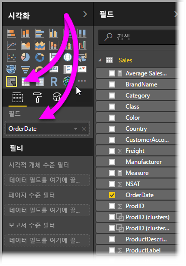
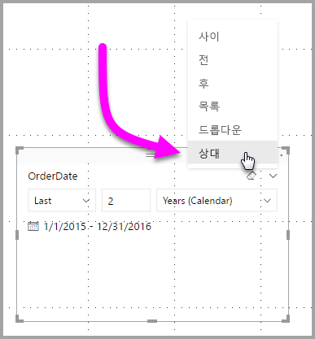
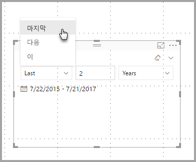
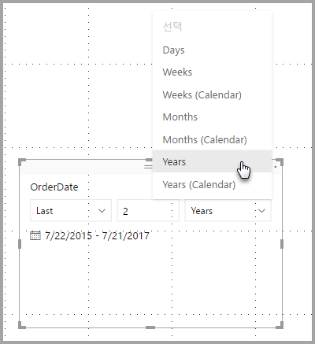
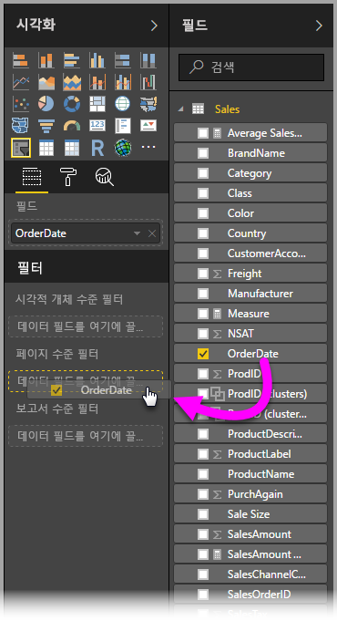
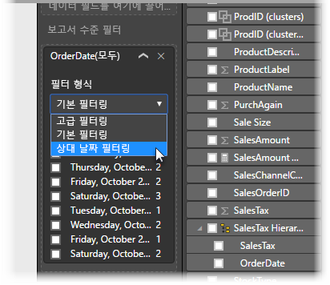
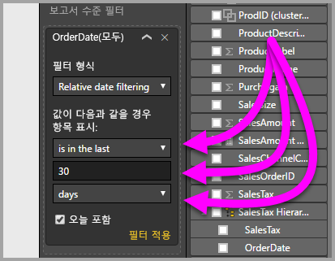

# Power BI Desktop에서 상대 날짜 슬라이서 및 필터 사용
**상대 날짜 슬라이서** 또는 **상대 날짜 필터**를 사용하면 데이터 모델의 모든 날짜 열에 시간 기반 필터를 적용할 수 있습니다. 예를 들어 **상대 날짜 슬라이서**를 사용하여 지난 30일(또는 월, 달력 월 등) 이내에 발생한 판매 데이터만 표시할 수 있습니다. 그리고 데이터를 새로 고치면 상대 기간에 적절한 상대 날짜 제약 조건이 자동으로 적용됩니다.

## 상대 날짜 범위 슬라이서 사용
다른 슬라이서와 마찬가지로 상대 날짜 슬라이서를 사용할 수 있습니다. 간단히 보고서에 대한 **슬라이서** 시각적 개체를 만든 다음, **필드** 값에 대해 날짜 값을 선택하면 됩니다. 다음 이미지에서는 *OrderDate* 필드가 선택되어 있습니다.

**상대 날짜 슬라이서**의 오른쪽 위 모서리에서 캐럿을 선택하면 메뉴가 나타납니다.

상대 날짜 슬라이서의 경우 *상대*를 선택합니다.

그런 다음, 설정을 선택할 수 있습니다. ‘상대 날짜 슬라이서’의 첫 번째 드롭다운에 대해 다음 선택 항목이 제공됩니다.

* 마지막
* 다음
* 이

이러한 선택 항목은 다음 이미지에서 보여 줍니다.

‘상대 날짜 슬라이서’의 다음(가운데) 설정을 사용하면 숫자를 입력하여 상대 날짜 범위를 정의할 수 있습니다.

세 번째 설정을 사용하여 날짜 측정을 선택할 수 있습니다. 다음 선택 항목이 제공됩니다.

* 일
* 주
* 주(달력)
* 월
* 월(달력)
* 연도
* 연도(달력)

이러한 선택 항목은 다음 이미지에서 보여 줍니다.

목록에서 ‘월’을 선택하고 가운데 설정에서 입력 2를 선택하면 다음과 같은 상황이 발생합니다. 오늘이 7월 20일이면 슬라이서로 제한된 시각적 개체에 포함된 데이터는 5월 20일부터 7월 20일(오늘 날짜)까지 지난 2개월 동안의 데이터를 보여줍니다.

이에 비해 *월(달력)* 을 선택한 경우 제한된 시각적 개체에서는 5월 1일부터 6월 30일(마지막 두 개의 완전한 달력 월)까지의 데이터를 보여 줍니다.

## 상대 날짜 범위 필터 사용
보고서 페이지 또는 전체 보고서에 대한 상대 날짜 범위 필터를 만들 수도 있습니다. 이렇게 하려면 다음 이미지와 같이 간단히 날짜 필드를 **필드** 창의 **페이지 수준 필터** 또는 **보고서 수준 필터** 영역으로 끌기만 하면 됩니다.

일단 여기서는 **상대 날짜 슬라이서**를 사용자 지정하는 것과 비슷한 방식으로 상대 날짜 범위를 수정할 수 있습니다. **필터 형식** 드롭다운에서 **상대 날짜 필터링**을 선택합니다.

**상대 날짜 필터링**이 선택되면 슬라이서와 마찬가지로 가운데에 있는 숫자 상자를 포함하여 수정할 세 개 섹션이 표시됩니다.

이것이 보고서에서 이러한 상대 날짜 제약 조건을 사용하는 전부입니다.

## 제한 사항 및 고려 사항
다음 제한 사항 및 고려 사항은 현재 **상대 날짜 범위 슬라이서**와 필터에 적용되는 것입니다.

* **Power BI**의 데이터 모델에는 표준 시간대 정보가 포함되지 않습니다. 모델에서 시간은 저장할 수 있지만 해당 표준 시간대가 표시되지 않습니다.
* 슬라이서와 필터는 항상 UTC 시간을 기반으로 하므로 보고서에 필터를 구성하고 다른 표준 시간대의 동료에게 보내더라도 동일한 데이터가 표시됩니다. 그러나 UTC 표준 시간대가 아닌 경우 예상보다 다른 시간 오프셋의 데이터가 표시될 수 있습니다.
* 현지 표준 시간대에서 캡처된 데이터는 **쿼리 편집기**를 사용하여 UTC로 변환할 수 있습니다.

