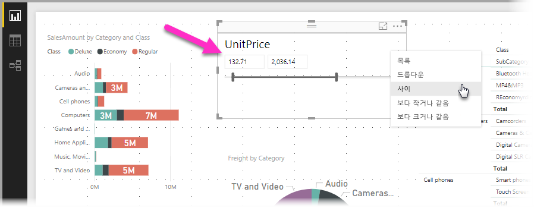
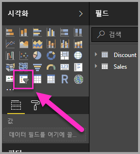
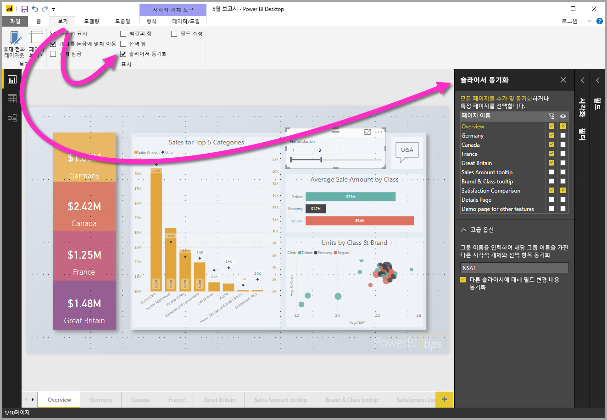
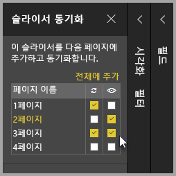
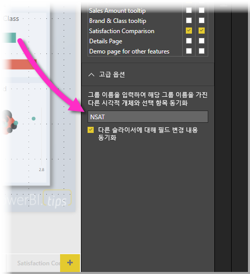

# Power BI Desktop의 슬라이서 사용

**Power BI Desktop**의 **슬라이서**를 사용하여 보고서 페이지에서 시각적 개체의 결과를 필터링할 수 있습니다. 슬라이서를 사용하면 슬라이서 자체로 조작하여 적용되는 필터를 쉽게 조정할 수 있습니다. 슬라이서가 표시되는 방법과 조작 방법에 대한 옵션을 지정할 수도 있습니다. 다음 이미지는 ‘형식’ 드롭다운이 표시된 슬라이서를 보여줍니다. 

슬라이서를 다음의 다양한 형식 중 하나로 표시할 수 있습니다.

* 목록
* 드롭다운
* 사이
* 보다 작거나 같음
* 보다 크거나 같음

**시각화** 창에서 **슬라이서** 시각적 개체를 클릭하여 슬라이서를 보고서에 추가할 수 있습니다.

슬라이서는 **Power BI Desktop**과 **Power BI 서비스**에서 비슷하게 동작합니다. 슬라이서 사용에 대한 문서는 [Power BI 서비스의 슬라이서](power-bi-visualization-slicers.md)를 참조하세요.

## 보고서 페이지에서 슬라이서 동기화

**Power BI Desktop**의 여러 보고서 페이지에서 슬라이서를 동기화할 수 있습니다. 슬라이서를 동기화하려면 리본의 **보기** 창에서 **슬라이서 동기화**를 선택합니다. 슬라이서를 동기화하면 다음 이미지에 표시된 것처럼 **슬라이서 동기화** 창이 나타납니다.

**슬라이서 동기화** 창에서는 보고서 페이지에서 슬라이서를 동기화하는 방법을 지정할 수 있습니다. 각 슬라이서를 개별 보고서 페이지에 **적용**할지 여부와 각 개별 보고서 페이지에 슬라이서를 **표시**할지 여부를 지정할 수 있습니다.

예를 들어 다음 이미지에 표시된 것처럼 보고서의 **2페이지**에 슬라이서를 배치할 수 있습니다. 그런 다음, 슬라이서를 선택한 각 페이지에 ‘적용’할지 여부와 보고서에서 선택한 각 페이지에 해당 슬라이서를 ‘표시’할지 여부를 선택할 수 있습니다. 각 슬라이서에 대해 어떤 조합도 적용할 수 있습니다. 

창에 있는 **전체에 추가** 링크를 사용하면 보고서의 모든 페이지에 선택한 슬라이서가 적용됩니다.

**슬라이서 동기화** 창에 표시되는 선택 항목은 ‘선택한 슬라이서’에만 적용됩니다. 다양한 페이지에 여러 슬라이서를 적용하고 창을 사용하여 각 슬라이서가 보고서의 여러 페이지에 개별적으로 적용되는 방법을 정의할 수 있습니다. 

슬라이서의 선택 항목은 동기화할 수 있지만 스타일, 편집 및 삭제 같은 다른 선택 항목은 동기화되지 ‘않습니다’. 

## 슬라이서에 대한 고급 옵션

**슬라이서 동기화** 창의 **고급 옵션** 섹션에서 **그룹 이름**을 슬라이서 컬렉션에 적용하고, 동일한 그룹을 공유하는 슬라이서를 페이지 간에 동기화할 수도 잇습니다. 

이 기능을 사용하면 사용자 지정 슬라이서 그룹을 만들어 동기화 상태를 유지할 수 있습니다. 기본 이름이 제공되지만 원하는 이름을 사용할 수 있습니다. 

그룹 이름은 슬라이서에 추가적인 유연성을 제공합니다. 동일한 필드를 사용하는 슬라이서를 동기화할 별도의 그룹을 만들거나 다른 필드를 사용하는 슬라이서를 동일한 그룹에 배치할 수 있습니다. 

## 다음 단계

다음 문서에도 관심이 있을 수 있습니다.

* [Power BI 서비스의 슬라이서](power-bi-visualization-slicers.md)
* [Power BI Desktop에서 숫자 범위 슬라이서 사용](../desktop-slicer-numeric-range.md)
* [Power BI Desktop에서 상대 날짜 슬라이서 및 필터 사용](desktop-slicer-filter-date-range.md)

