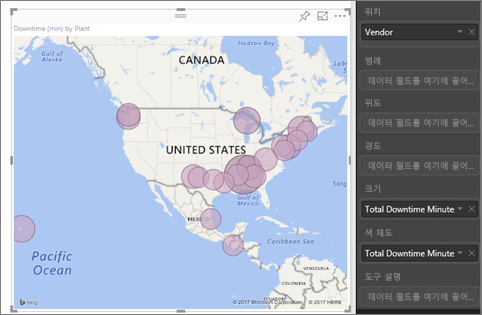
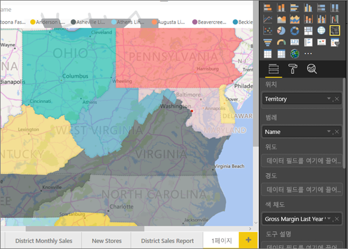
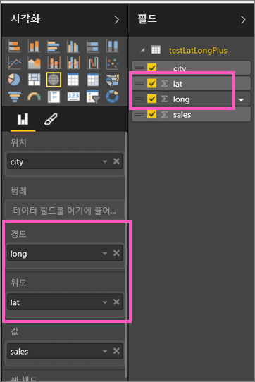
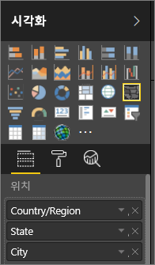

# Power BI Map 시각화를 위한 팁과 힌트
Power BI는 Bing Maps과 통합되어 기본 지도 좌표를 제공(지오코딩이라는 프로세스)하므로 지도를 쉽게 만들 수 있습니다. 이와 함께 알고리즘을 사용하여 올바른 위치를 식별하지만, 경우에 따라 추측하기도 합니다. Power BI가 자체적으로 지도 시각화를 만들 수 없는 경우 Bing Maps의 도움말을 등록합니다. 

사용자 또는 사용자의 관리자는 지오코딩에 URL Bing을 사용할 수 있도록 방화벽을 업데이트해야 할 수 있습니다.  이러한 URL은 다음과 같습니다.
* https://dev.virtualearth.net/REST/V1/Locations
* https://platform.bing.com/geo/spatial/v1/public/Geodata
* https://www.bing.com/api/maps/mapcontrol

올바른 지오코딩의 가능성을 높이기 위해 다음과 같은 팁을 사용합니다. 팁의 첫 번째 세트는 데이터 세트 자체에 액세스할 수 있는 경우 사용할 수 있습니다. 팁의 두 번째 집합은 데이터 세트에 액세스할 수 없는 경우 Power BI에서 수행할 수 있는 것들입니다. 마지막 집합은 URL 목록입니다.

## Bing 지도로 무엇이 전송됩니까?
Power BI 서비스 및 Power BI Desktop은 지도 시각화를 만드는 데 필요한 지역 데이터를 Bing에 전송합니다. 여기에는 **위치**, **위도** 및 **경도** 버킷의 데이터와 **보고서 수준**, **페이지 수준** 또는 **시각적 수준** 필터 버킷 중 하나의 지역 필드가 포함될 수 있습니다. 전달되는 내용은 지도 형식에 따라 달라집니다. 자세히 알아보려면 [Bing 지도 개인 정보](https://go.microsoft.com/fwlink/?LinkID=248686)를 참조하세요.

* 지도(거품형 지도)의 경우 위도 및 경도가 제공되면 데이터는 Bing에 전송되지 않습니다. 그렇지 않은 경우 **위치**(또는 필터) 버킷의 데이터가 Bing에 전송됩니다.     
* 등치 지역도는 위도와 경도가 제공되더라도 **위치** 버킷에 필드가 필요합니다. **위치**, **위도** 또는 **경도** 버킷에 있는 모든 데이터가 Bing에 전송됩니다.
  
    아래 예에서 **공급 업체** 필드가 지오코딩에 사용되었으므로 모든 공급 업체 데이터가 Bing에 전송됩니다. **크기** 및 **색 채도** 버킷의 데이터는 Bing에 전송되지 않습니다.
  
    
  
    아래 두 번째 예에서는 **지역** 필드가 지오코딩에 사용되었으므로 모든 지역 데이터가 Bing에 전송됩니다. **범례** 및 **색 채도** 버킷의 데이터는 Bing에 전송되지 않습니다.
  
    

## 데이터 세트: 기본 데이터 세트를 개선하기 위한 팁
지도 시각화를 만드는 데 사용되는 데이터 세트에 대한 액세스 권한이 있는 경우 올바른 지역 코딩의 가능성을 높이기 위해 할 수 있는 몇 가지 사항이 있습니다.

**1. Power BI Desktop에 지리적 필드 재분류**

Power BI Desktop에서 데이터 필드에 **데이터 범주**를 설정하면 필드가 올바르게 지오코딩되도록 보장할 수 있습니다. 원하는 필드를 선택하고 **모델링** 탭으로 이동한 다음 **데이터 범주**를 **주소**, **도시**, **대륙**, **국가/지역**, **국가**, **우편 번호**, **시**/**도** 중 하나로 설정합니다. 이러한 데이터 범주는 Bing에서 정보를 올바르게 인코딩하는 데 도움이 됩니다. 

자세히 알아보려면 [Power BI Desktop의 데이터 분류](../desktop-data-categorization.md)를 참조하세요. SQL Server Analysis Services에 라이브로 연결하는 경우 [SSDT(SQL Server Data Tools)](https://docs.microsoft.com/sql/ssdt/download-sql-server-data-tools-ssdt)를 사용하여 Power BI 외부에서 데이터 분류를 설정해야 합니다.

**2. 둘 이상의 위치 열을 사용합니다.**    
 경우에 따라서는 매핑에 대한 데이터 범주를 설정하는 것이 Bing에서 의도를 올바르게 추측하는 데 부족할 수 있습니다. 여러 국가나 지역에서는 위치가 존재하기 때문에 일부 지정이 모호해집니다. 예를 들어, 영국, 펜실베니아, 뉴욕에 ***사우샘프턴***이 있습니다.

Power BI는 Bing의 [구조화되지 않은 URL 템플릿 서비스](https://msdn.microsoft.com/library/ff701714.aspx)를 사용하여 국가에 대한 주소 값 집합에 따라 위도 및 경도 좌표를 얻습니다. 데이터에 위치 데이터가 충분하지 않은 경우 그러한 열을 추가하고 적절하게 분류합니다.

 예를 들어 *도시* 열만 있는 경우 Bing에서 지오코딩하기 어려울 수 있습니다. 추가적으로 *지역* 열을 추가하여 위치를 명확하게 합니다.  경우에 따라 데이터 세트에 둘 이상의 위치 열만 추가하면 됩니다(이 경우 시/도). 필드 분류를 잊지 마세요. 위 #1을 참조하세요.

각 필드에 분류에 연결된 특정 정보만 있는지 확인하세요.  예를 들어 도시 위치 필드는 **뉴욕주 사우샘프턴**이 아니라 **사우샘프턴**이어야 합니다.  그리고 주소 위치 필드는 **1 Microsoft Way, Redmond, WA**가 아니라 **1 Microsoft Way**여야 합니다.

**3. 특정 위도 및 경도 사용**

위도 및 경도 값을 데이터 세트에 추가합니다. 모호성을 제거하고 결과를 보다 신속하게 반환합니다. 위도 및 경도 필드는 *10진수* 형식이어야 하며 데이터 모델에서 설정할 수 있습니다.

<iframe width="560" height="315" src="https://www.youtube.com/embed/ajTPGNpthcg" frameborder="0" allowfullscreen></iframe>

**4. 전체 위치 정보가 있는 열에는 장소 범주 사용**

지도에는 지리적 계층을 사용하는 것이 좋지만 전체 지리적 정보가 있는 단일 위치 열을 사용해야 할 경우 데이터 분류를 **장소**로 설정할 수 있습니다. 예를 들어 열의 데이터가 전체 주소(예: 1 Microsoft Way, Redmond Washington 98052)일 경우 이처럼 일반화된 데이터 범주는 Bing에서 최적으로 작동합니다. 

## Power BI: 맵 시각화를 사용할 때 보다 나은 결과를 얻는 팁
**1. 위도 및 경도 필드 사용(있는 경우)**

Power BI에서 사용하는 데이터 세트에 위도 및 경도 필드가 있다면 사용하세요.  Power BI에는 지도 데이터를 명확하게 할 수 있는 특별한 버킷이 있습니다. 위도 데이터가 포함된 필드를 **시각화 > 위도** 영역으로 끌어다 놓기만 하면 됩니다.  경도 데이터의 경우에도 마찬가지입니다. 이렇게 하려면 시각화를 만들 때 *위치* 필드도 채워야 합니다. 그렇지 않은 경우 기본적으로 데이터가 집계되므로 예를 들어 위도 및 경도가 도시 수준이 아닌 주 수준에서 연결됩니다.

 

## 서로 다른 "수준"의 위치로 드릴다운할 수 있도록 지역 계층 구조를 사용합니다.
데이터 세트에 이미 서로 다른 수준의 위치 데이터가 있는 경우 사용자와 동료가 Power BI를 사용하여 *지역 계층*을 만들 수 있습니다. 이를 수행하려면 둘 이상의 필드를 **위치** 버킷으로 끕니다. 이러한 방식을 함께 사용하면 필드는 지역 계층이 됩니다. 아래 예제에서는 다음 지역 필드를 추가했습니다. 국가/지역, 시/도 및 도시. Power BI에서 사용자와 동료는 이 지역 계층 구조를 사용하여 드릴업 및 드릴다운할 수 있습니다.

  

   

지리적 위치를 드릴할 때는 각 드릴 단추가 어떻게 작동하고 Bing Maps로 어떤 정보가 전송되는지 알아야 합니다. 

* 맨 오른쪽에 있는 드릴 모드라는 드릴 단추 를 사용하면 지도 위치를 선택하고 특정 위치로 한 번에 한 수준씩 드릴 다운할 수 있습니다. 예를 들어 드릴 다운을 켜고 북아메리카를 클릭할 경우 계층에서 한 수준 아래(북아메리카의 주)로 내려갑니다. 지오 코딩의 경우 Power BI가 북아메리카에 해당하는 국가 및 주 데이터만 Bing Maps에 전송합니다.  
* 왼쪽에는 다른 2개의 드릴 옵션이 있습니다. 첫 번째 옵션인 은 모든 위치에서 계층의 다음 수준으로 한 번에 드릴합니다. 예를 들어 현재 국가를 보고 있고 이 옵션을 사용하여 다음 수준인 주로 이동하면 Power BI에서 모든 국가의 주 데이터를 표시합니다. 지오 코딩의 경우 Power BI가 모든 위치에 해당하는 주 데이터(국가 데이터는 제외)를 Bing Maps에 전송합니다. 이 옵션은 계층의 각 수준이 상위 수준과 관련이 없는 경우에 유용합니다. 
* 두 번째 옵션인  지도를 클릭할 필요가 없다는 점을 제외하고 드릴 다운과 유사합니다.  현재 수준의 컨텍스트를 기억하여 계층의 한 수준 아래로 확장됩니다. 예를 들어 현재 국가를 보고 있는데 이 아이콘을 선택하면 계층의 한 수준 아래인 주로 이동합니다. 지오 코딩의 경우 Bing Maps 지오 코드의 정확도를 높이는 데 도움이 되도록 Power BI가 각 주와 해당 국가에 대한 데이터를 전송합니다. 대부분의 지도에서 맨 오른쪽을 보면 이 옵션이나 드릴 다운 옵션을 사용할 수 있으므로 Bing에 최대한 많은 정보를 전송하여 정확한 위치 정보를 얻을 수 있습니다. 

## 다음 단계
[Power BI 시각화에서 드릴다운](../consumer/end-user-drill.md)

[Power Bi 시각화](power-bi-report-visualizations.md)

궁금한 점이 더 있나요? [Power BI 커뮤니티를 이용하세요.](http://community.powerbi.com/)

