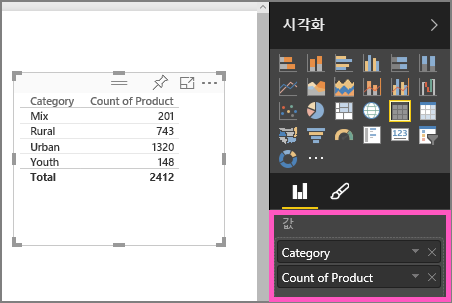
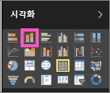
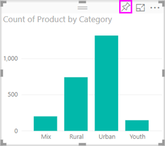

# 1부, Power BI 보고서에 시각화 추가

이 문서는 보고서에서 시각화를 만드는 방법에 대해 간단히 소개합니다. 이 문서는 Power BI 서비스 및 Power BI Desktop 모두에 적용됩니다. 고급 콘텐츠를 보려면 이 시리즈의 [2부를 참조](power-bi-report-add-visualizations-ii.md)하세요. Amanda가 보여주는 보고서 캔버스에서 시각적 개체를 만들고, 편집하고, 서식을 지정하는 몇 가지 다양한 방법을 확인해 보세요. 그런 다음 직접 [영업 마케팅 샘플](../sample-datasets.md)을 사용하여 자신만의 보고서를 만들어 보세요.

<iframe width="560" height="315" src="https://www.youtube.com/embed/IkJda4O7oGs" frameborder="0" allowfullscreen></iframe>

## 보고서를 열고 새 페이지 추가

1. [편집용 보기에서 보고서](../service-interact-with-a-report-in-editing-view.md)를 엽니다.

    이 자습서는 [영업 및 마케팅 샘플](../sample-datasets.md)을 사용합니다.

1. **필드** 창이 표시되지 않으면 화살표 아이콘을 선택하여 엽니다.

   

1. 보고서에 빈 페이지를 추가합니다.

## 시각화 요소를 보고서에 추가

1. **필드** 창에서 필드를 선택하여 시각화를 만듭니다.

    **SalesFact** > **Sales $** 와 같이 숫자 필드부터 시작합니다. Power BI에서 단일 열이 포함된 열 차트를 만듭니다.

    

    또는 **Name** 또는 **Product**와 같은 범주 필드부터 시작합니다. Power BI에서 테이블이 생성되고 이 필드가 **값** 섹션에 추가됩니다.

    

    또는 **Geo** > **City**와 같은 지리 필드부터 시작합니다. Power BI 및 Bing Maps는 지도 시각화를 만듭니다.

    

1. 시각화를 만든 다음 해당 형식을 변경합니다. **Product** > **Category**를 선택한 후 **Product** > **Count of Product**를 선택하여 둘 다 **값** 섹선에 추가합니다.

   

1. **누적 세로 막대형 차트** 아이콘을 선택하여 세로 막대형 차트로 시각화를 변경합니다.

   

1. 보고서에서 시각화를 만들 경우 [대시보드에 고정](../service-dashboard-pin-tile-from-report.md)할 수 있습니다. 시각화를 고정하려면 고정 아이콘 을 선택합니다.

   
  
## 다음 단계

 이제

* [2부: Power BI 보고서에 시각화 추가](power-bi-report-add-visualizations-ii.md)로 계속 진행합니다.

* 보고서에서 [시각화와 상호 작용](../consumer/end-user-reading-view.md)합니다.

* [시각화로 더 많은 작업을 할 수 있습니다](power-bi-report-visualizations.md).

* [보고서를 저장합니다](../service-report-save.md).
