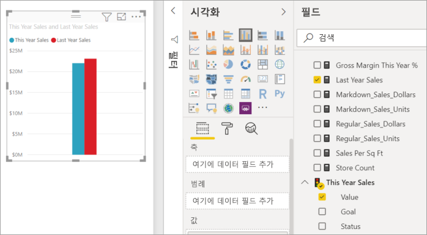
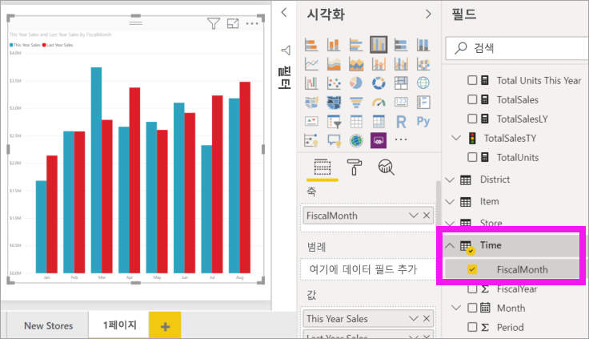
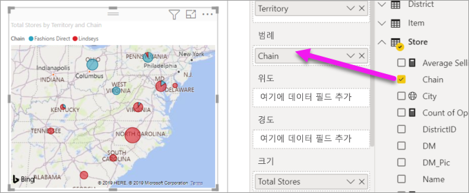

# Power BI 보고서에 시각적 개체 추가(2부)

[!INCLUDE [power-bi-visuals-desktop-banner](../includes/power-bi-visuals-desktop-banner.md)]

[1부](power-bi-report-add-visualizations-i.md)에서 필드 이름 옆의 확인란을 선택하여 기본 시각화를 만들었습니다.  2부에서는 끌어서 놓기를 사용하는 방법과 **필드** 및 **시각화** 창을 완전히 활용하여 시각화를 만들고 수정하는 방법을 알아봅니다.

## 새 시각화 만들기
이 자습서에서는 소매점 분석 데이터 세트를 자세히 살펴보고 몇 가지 주요 시각화를 만듭니다.

## 필수 조건

이 자습서는 [소매점 분석 샘플 PBIX 파일](https://download.microsoft.com/download/9/6/D/96DDC2FF-2568-491D-AAFA-AFDD6F763AE3/Retail%20Analysis%20Sample%20PBIX.pbix)을 사용합니다.

1. Power BI Desktop 메뉴 모음의 왼쪽 위 섹션에서 **파일** > **열기**를 선택합니다.
   
2. **소매점 분석 샘플 PBIX 파일**을 찾습니다.

1. **소매점 분석 샘플 PBIX 파일**을 보고서 보기 으로 엽니다.

1. 새 페이지를 추가하기 위해  탭을 선택합니다.

## 시각화 요소를 보고서에 추가

**필드** 창에서 필드를 선택하여 시각화를 만듭니다. 만들어지는 시각화 유형은 선택한 필드 유형에 따라 달라집니다. Power BI는 데이터 형식을 사용하여 결과를 표시하는 데 사용할 시각화를 결정합니다. 시각화 창에서 다른 아이콘을 선택하면 사용되는 시각화를 변경할 수 있습니다. 모든 시각화에서 데이터를 표시할 수 있는 것은 아닙니다. 예를 들어 지리 데이터는 깔때기형 차트나 꺾은선형 차트에서 제대로 표시되지 않습니다. 

### 올해와 작년의 매출을 비교하는 영역 차트를 추가합니다.

1. **Sales** 테이블에서 **This Year Sales** > **Value** 및 **Last Year Sales**를 선택합니다. Power BI에 세로 막대형 차트가 만들어집니다.  이 차트는 흥미로우며, 자세히 살펴보는 것이 좋습니다. 월별 매출이 어떻게 보이나요?  
   
   

2. Time 테이블에서 **FiscalMonth**를 **축** 영역으로 끌어옵니다.  
   

3. 영역 차트로 [시각화를 변경](power-bi-report-change-visualization-type.md)합니다.  선택할 수 있는 다양한 시각화 유형이 있습니다. 사용할 유형을 결정하는 데 도움이 필요하면 [각 유형에 대한 설명, 모범 사례 팁 및 자습서](power-bi-visualization-types-for-reports-and-q-and-a.md)를 참조하세요. 시각화 창에서 영역 차트 아이콘 을 선택합니다.

4. **추가 작업**(...)을 선택한 다음, **정렬 기준** >  **FiscalMonth**를 선택하여 시각화를 정렬합니다.

5. 시각화를 선택하고 윤곽 원 중 하나를 클릭한 다음 끌어서 [시각화의 크기를 조정](power-bi-visualization-move-and-resize.md)합니다. 스크롤 막대가 보이지 않도록 넓게 만들고 다른 시각화를 추가할 만큼의 공간을 남겨둡니다.
   
   
6. [보고서를 저장합니다](../service-report-save.md).

### 위치별 매출을 볼 수 있는 맵 시각화 추가

1. **Store** 테이블에서 **Territory**를 선택합니다. **Total Stores**를 크기 영역으로 끌어 놓습니다. Power BI는 해당 지역이 위치인 것을 인식하고 맵 시각화를 만듭니다.  
   

2. 범례를 추가합니다.  매장 이름별로 데이터를 보려면 **Store** > **Chain**을 범례 영역으로 끌어 놓습니다.  
   

## 다음 단계
* [Power BI 보고서의 시각화](power-bi-report-visualizations.md)에 대해 자세히 알아보세요.  
* 궁금한 점이 더 있나요? [Power BI 커뮤니티를 이용하세요.](https://community.powerbi.com/)

