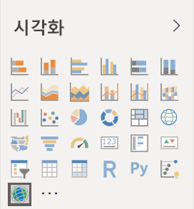
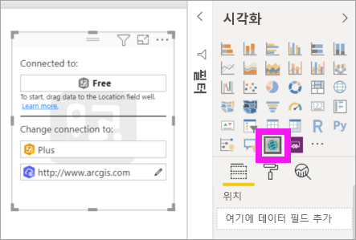
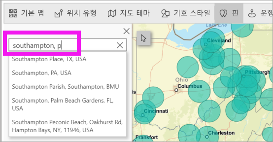
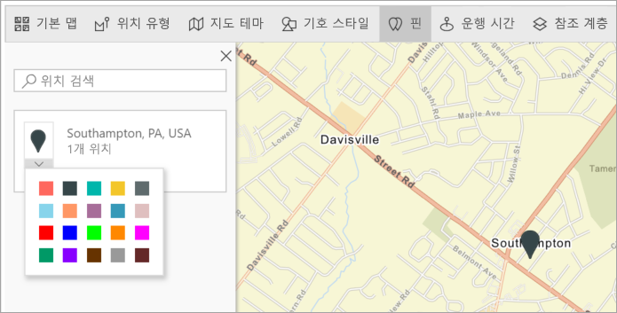
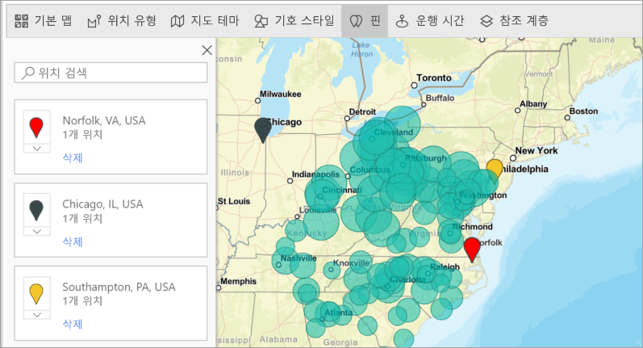
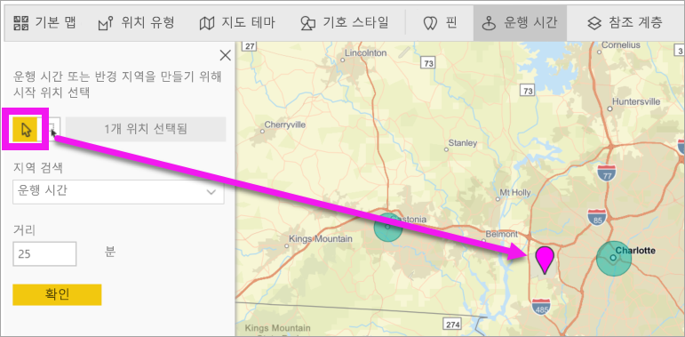
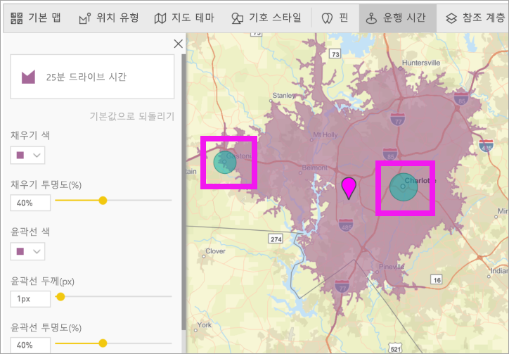
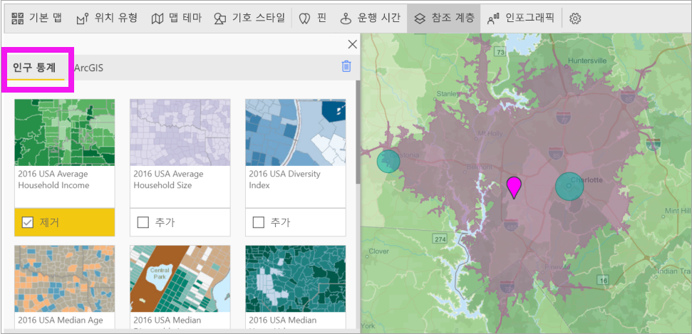

# Power BI Desktop에서 ArcGIS 지도 만들기

[!INCLUDE [power-bi-visuals-desktop-banner](../includes/power-bi-visuals-desktop-banner.md)]

이 자습서는 ArcGIS Maps for Power BI를 만드는 사람의 관점에서 작성되었습니다. ‘디자이너’가 동료와 ArcGIS Maps for Power BI 지도를 공유하면, 동료가 지도를 보고 조작할 수 있지만 변경 내용을 저장할 수는 없습니다.  ArcGIS 지도를 보는 방법에 대한 자세한 내용은 [ArcGIS Maps for Power BI 조작](power-bi-visualizations-arcgis.md)을 참조하세요.

ArcGIS 지도와 Power BI의 조합은 지도에서 요소의 표현을 넘어서 완전히 새로운 수준으로 매핑합니다. 기본 지도, 위치 유형, 테마, 기호 스타일 및 참조 계층에서 선택하여 멋진 정보 제공용 지도 시각화를 만듭니다. 공간 분석과 지도의 신뢰할 수 있는 데이터 계층의 조합은 시각화에서 데이터의 심도 깊은 이해를 제공합니다.

 모바일 디바이스에서 ArcGIS Maps for Power BI 지도를 만들 수는 없지만, 지도를 보고 조작할 수 있습니다. [ArcGIS 지도와 상호 작용](power-bi-visualizations-arcgis.md)을 참조하세요.

> [!TIP]
> GIS는 Geographic Information Systems(지리적 정보 시스템)의 약자입니다.

아래 예제에서는 2016 평균 가처분 소득의 인구 통계 계층에 대해 heatmap으로 지역 판매를 표시하는 데 진한 회색 캔버스를 사용합니다. 살펴보면 아시겠지만, ArcGIS Maps for Power BI를 사용하면 거의 무제한의 향상된 매핑 기능, 인구 통계 데이터, 매력적인 지도 시각화가 제공되므로 최상의 스토리를 구성할 수 있습니다.

> [!TIP]
> [Esri의 ArcGIS Maps for Power BI 페이지](https://www.esri.com/powerbi)를 방문하여 다양한 예제를 참조하고 후기를 확인하세요. 그런 다음, Esri의 [ArcGIS Maps for Power BI 시작 페이지](https://doc.arcgis.com/en/maps-for-powerbi/get-started/about-maps-for-power-bi.htm)를 참조하세요.

## 사용자 동의
ArcGIS Maps for Power BI는 Esri(https://www.esri.com) 에서 제공합니다. Power BI용 ArcGIS Maps의 사용은 Esri의 사용 약관 및 개인 정보 보호 정책에 따릅니다. Power BI용 ArcGIS Maps 시각적 개체를 사용할 Power BI 사용자는 승인 대화 상자를 수락해야 합니다.

**리소스**

[용어](https://go.microsoft.com/fwlink/?LinkID=826322)

[개인 정보 보호 정책](https://go.microsoft.com/fwlink/?LinkID=826323)

[Power BI용 ArcGIS Maps 제품 페이지](https://www.esri.com/powerbi)

## 필수 조건

이 자습서는 Power BI Desktop 및 PBIX [소매점 분석 샘플](https://download.microsoft.com/download/9/6/D/96DDC2FF-2568-491D-AAFA-AFDD6F763AE3/Retail%20Analysis%20Sample%20PBIX.pbix)을 사용합니다. Power BI 서비스를 사용하여 ArcGIS Maps for Power BI를 만들 수도 있습니다. 

1. 메뉴 모음의 왼쪽 위 섹션에서 **파일** \> **열기**를 선택합니다.
   
2. 로컬 머신에 저장된 **소매점 분석 샘플 PBIX 파일**을 찾습니다.

1. 보고서 뷰 에서 **소매점 분석 샘플**을 엽니다.

1. 선택  탭을 선택합니다.

   
## ArcGIS Maps for Power BI 지도 시각화 만들기

Will이 몇 가지 시각화를 만드는 과정을 살펴본 다음, 아래 단계를 따라 [소매점 분석 샘플 .PBIX 파일](../sample-datasets.md)을 사용하여 직접 체험해 보세요.
    

   > [!NOTE]
   > 이 비디오에서는 이전 버전의 Power BI Desktop을 사용합니다.
   > 

> [!VIDEO https://www.youtube.com/embed/EKVvOZmxg9s]

1. 시각화 창에서 ArcGIS Maps for Power BI 아이콘을 선택합니다.
   
        

2. Power BI에서 빈 템플릿을 보고서 캔버스에 추가합니다. 이 자습서에서는 무료 버전을 사용합니다.
   
   

3. **필드** 창에서 데이터 필드를 **위치** 또는 **위도** 및/또는 **경도** 버킷으로 끌어갑니다. 이 예제에서는 **Store > City**를 사용합니다.
   
   > [!NOTE]
   > Power BI용 ArcGIS 맵은 선택한 필드가 지도 상에서 도형이나 점으로 가장 적절하게 표시되는지를 자동으로 감지합니다. 설정에서 기본값을 조정할 수 있습니다(아래 참조).
   > 
   > 
   
    

4. **필드** 창에서 측정값을 **크기** 버킷으로 끌어 데이터가 표시되는 모양을 조정합니다. 이 예제에서는 **Sales > Last Year Sales**를 사용합니다.
   
    

첫 번째 ArcGIS Maps for Power BI 지도를 만들었습니다. 이제 기본 지도, 위치 유형, 테마 등을 사용하여 지도를 구체화하고 서식을 지정합시다.

## ArcGIS Maps for Power BI의 설정 및 서식
**Power BI용 ArcGIS Maps** 서식 지정 기능에 액세스하려면 다음과 같이 수행합니다.

1. 시각화의 오른쪽 위에 있는 **추가 작업**(...)을 선택한 다음, **편집**을 선택하여 추가 기능에 액세스합니다.
   
   
   
   시각화가 펼쳐지고, 사용 가능한 기능이 위쪽에 표시됩니다. 선택한 기능마다 자세한 옵션을 제공하는 작업 창이 열립니다. 
   
   
   

> [!TIP]
> **Esri**에서는 **Power BI용 ArcGIS Maps** 기능 모음에 대한 [종합적인 설명서](https://go.microsoft.com/fwlink/?LinkID=828772)를 제공하고 있습니다.

### 기본 지도
4개의 기본 지도, 즉 진한 회색 캔버스, 연한 회색 캔버스, OpenStreetMap 및 도로 지도가 제공됩니다.  ‘도로’는 ArcGIS 표준 기본 지도입니다. 

기본 지도를 적용하려면 작업 창에서 선택합니다.

### 위치 유형
ArcGIS Maps for Power BI는 지도에 데이터를 표시하는 최상의 방법을 자동으로 검색합니다. 지점 또는 경계 중에서 선택합니다. 위치 유형 옵션을 사용하여 이러한 선택을 자세히 조정할 수 있습니다.

**경계**는 표준 지리적 값이 데이터에 포함된 경우에만 작동됩니다. ArcGIS Maps for Power BI는 지도에 표시할 도형을 자동으로 파악합니다. 표준 지리적 값에는 국가, 지방, 우편 번호 등이 포함됩니다. 하지만 지오코딩과 마찬가지로, Power BI에서 필드가 기본적으로 경계여야 하는지를 검색하지 못하거나 데이터의 경계를 찾지 못할 수 있습니다.  

### 맵 테마
4 개 지도 테마가 제공됩니다. Power BI는 **위치** 및 **크기** 버킷에 추가한 필드에 따라 **위치만** 또는 **크기** 테마 중 하나를 자동으로 선택합니다. 두 버킷에 모두 필드를 추가했기 때문에 예제에서는 지도가 기본적으로 **크기**로 설정되었습니다. 다른 테마를 사용해 보고, 다음 단계로 이동하기 전에 **크기**로 되돌립니다.  

<table>
<tr><th>테마</th><th>설명</th>
<tr>
<td>위치 전용</td>
<td>위치 버킷에 추가한 필드에 따라 지도에 데이터 요소 또는 채워진 경계를 그립니다.</td>
</tr>
<tr>
<td>열 지도</td>
<td>지도에 데이터 강도를 그립니다. 활동이나 값이 높은 영역이 더 강렬한 색으로 표시됩니다. </td>
</tr>
<tr>
<td>크기</td>
<td>크기 버킷에 추가한 필드에 따라 지도에 데이터 요소를 그립니다.</td>
</tr>
<tr>
<td>클러스터링</td>
<td>지정한 클러스터 반경 내의 지점은 지도의 해당 영역에 있는 지점 수를 나타내는 단일 기호로 그룹화됩니다. </td>
</tr>
</table>

### 기호 스타일
기호 스타일을 사용하면 데이터가 지도에 표시되는 모양을 자세히 조정할 수 있습니다. 기호 스타일은 선택한 위치 유형과 지도 테마에 따라 상황에 맞게 지정됩니다. 아래 예제에서는 **크기**로 설정된 지도 테마와 투명도, 스타일 및 크기에 대한 몇 가지 기호 스타일 조정을 보여 줍니다. 

### 핀
핀을 추가하여 지도의 지점에 주의를 환기시킵니다.  

1. **핀** 탭을 선택합니다.
2. 검색 상자에 키워드(예: 주소, 장소 및 관심 지점)를 입력하고 드롭다운에서 선택합니다. 지도에 기호가 나타나고 지도는 위치에 자동으로 확대합니다. 검색 결과는 핀 창에 위치 카드로서 저장됩니다. 최대 10개의 위치 카드를 저장할 수 있습니다.
   
   
3. Power BI는 해당 위치에 핀을 추가하고 사용자는 핀의 색을 변경할 수 있습니다.
   
   
4. 핀을 추가하고 삭제합니다.
   
   

### 운행 시간
운행 시간 창에서는 위치를 선택한 다음 지정된 반경 또는 운행 시간 내에서 어떤 지도 기능이 있는지 확인할 수 있습니다. 아래 예제에서는 워싱턴 D.C.의 50마일 반경을 보여 줍니다.  아래 단계에 따라 고유한 운행 시간 계층을 만듭니다. 
    

1. 단일 선택 도구를 선택하고 핀 고정 또는 거품형을 선택합니다. 이 예제에서는 Charlotte Douglas 공항에 대해 핀 고정을 선택했습니다.

   
   
   > [!TIP]
   > 지도를 확대하면 위치를 선택하기가 쉬워집니다. \+ 아이콘이나 마우스 스크롤을 사용하여 확대/축소할 수 있습니다.
   > 
   > 
2. 며칠 동안 Charlotte Douglas 공항으로 가서 적절한 운행 거리 내에 있는 체인 매장을 파악하려 한다고 가정해 봅시다. 검색 영역을 **운행 시간**으로 변경하고, 거리를 **25**분으로 변경합니다. 확인을 선택합니다.    
   
    

    

3. 25분 운행 이내에는 두 개의 매장이 있습니다. 반경은 자주색으로 표시됩니다. 위치를 선택하여 세부 정보를 표시합니다. 아니면 색 및 외곽선을 변경하여 변경 형식을 지정합니다.
   
    

### 참조 계층
#### 참조 계층 - 인구 통계
Power BI용 ArcGIS Maps에는 Power BI에서 상황에 맞게 데이터를 조정하는 데 유용한 인구 통계 계층이 제공됩니다.

1. **참조 계층** 탭, **인구 통계**를 차례로 선택합니다.
2. 나열되는 계층마다 확인란이 있습니다. 확인 표시를 추가하여 해당 계층을 지도에 추가합니다.  이 예에서는 평균 가구 소득을 추가했습니다. 
   
    
3. 각 계층 또한 대화형 계층입니다. 거품형을 마우스로 가리켜 세부 정보를 확인합니다. 음영 처리된 영역을 클릭하면 세부 정보가 차트 형태로 표시됩니다. 여기서는 우편 번호 28227을 선택했으며, 두 개의 차트가 표시됩니다.
   
    

#### 참조 계층 - ArcGIS
ArcGIS Online에서는 공용 웹 지도를 게시하는 조직을 위한 기능을 제공하고 있습니다. 또한 Esri에서는 Living Atlas를 통해 처리되는 웹 지도 모음도 제공하고 있습니다. ArcGIS 탭에서 모든 공용 웹 지도 또는 Living Atlas 지도를 검색하여 지도에 참조 계층으로 추가할 수 있습니다.

1. **참조 계층** 탭, **ArcGIS**를 차례로 선택합니다.
2. 검색 용어를 입력한 후 지도 계층을 선택합니다. 이 예에서는 미국 하원의원 선거구를 선택했습니다.
   
    
3. 자세한 정보를 보려면 음영 처리된 영역을 선택하여 ‘참조 계층에서 선택’을 엽니다.  참조 계층 선택 도구를 사용하여 참조 계층에 있는 경계 또는 개체를 선택합니다.

 

## 데이터 요소 선택
ArcGIS Maps for Power BI에서는 데이터를 빠르고 정확하게 선택할 수 있도록 다섯 가지 선택 모드를 지원합니다.

다음 이미지에 표시된 단일 선택 도구 아이콘 위에 커서를 올려서 선택 모드를 변경합니다. 이렇게 하면 숨겨진 막대가 펼쳐지고 추가 도구가 표시됩니다.

각 도구는 사용자가 데이터를 선택할 수 있도록 해 주는 고유한 역할을 갖습니다. 

 개별 데이터 요소를 선택합니다.

 지도에 사각형을 그린 후 포함된 데이터 요소를 선택합니다.

 사용할 참조 계층에 사용된 경계 또는 다각형을 통해 포함된 데이터 요소를 선택합니다.

 버퍼 계층을 사용하여 데이터를 선택할 수 있습니다.

 서로 유사한 데이터 요소를 선택할 수 있습니다.

> [!NOTE]
> 최대 250개 데이터 요소를 한 번에 선택할 수 있습니다.
> 
> 

 

## 도움말 가져오기
**Esri**에서는 **Power BI용 ArcGIS Maps** 기능 모음에 대한 [종합적인 설명서](https://go.microsoft.com/fwlink/?LinkID=828772)를 제공하고 있습니다.

[**Power BI용 ArcGIS Maps**와 관련된 Power BI 커뮤니티](https://go.microsoft.com/fwlink/?LinkID=828771)에서 질문하고 최신 정보를 얻고 문제를 보고하고 대답을 찾을 수 있습니다.

개선을 위해 제안할 사항이 있으면 [Power BI 아이디어 목록](https://ideas.powerbi.com)에 제출해 주십시오.

 

## 조직 내 Power BI용 ArcGIS Maps 사용 관리
Power BI에서는 디자이너, 테넌트 관리자 및 IT 관리자가 ArcGIS Maps for Power BI 사용을 관리할 수 있는 기능을 제공합니다. 아래에서 각 역할이 수행할 수 있는 단계를 확인할 수 있습니다. 

### 디자이너 옵션
디자이너는 Power BI Desktop의 보안 탭에서 ArcGIS Maps for Power BI를 사용하지 않도록 설정할 수 있습니다. **파일** > **옵션 및 설정**을 선택한 다음, **옵션** > **보안**을 선택합니다. 기본적으로 ArcGIS Maps는 사용할 수 없게 되는 경우 로드되지 않습니다.

### 테넌트 관리자 옵션
PowerBI.com에서 테넌트 관리자는 모든 사용자에 대해 ArcGIS Maps for Power BI를 끌 수 있습니다. **설정** > **관리 포털** > **테넌트 설정**을 선택합니다. 사용하지 않도록 설정된 경우 Power BI의 시각화 창에 ArcGIS Maps for Power BI 아이콘이 더 이상 표시되지 않습니다.

### IT 관리자 옵션
Power BI Desktop에서 **그룹 정책**을 사용하여 조직에 배포된 컴퓨터 전체에서 ArcGIS Maps for Power BI를 사용하지 않도록 설정할 수 있습니다.

<table>
<tr><th>특성</th><th>값</th>
</tr>
<tr>
<td>key</td>
<td>Software\Policies\Microsoft\Power BI Desktop&lt;/td&gt;
</tr>
<tr>
<td>valueName</td>
<td>EnableArcGISMaps</td>
</tr>
</table>

1(10진수) 값이면 Power BI용 ArcGIS Maps를 사용할 수 있습니다.

0(10진수) 값이면 Power BI용 ArcGIS Maps를 사용할 수 없습니다.

## 고려 사항 및 제한 사항
Power BI용 ArcGIS Maps는 다음과 같은 서비스 및 애플리케이션에서 사용할 수 있습니다.

<table>
<tr><th>서비스/앱</th><th>가용성</th></tr>
<tr>
<td>Power BI Desktop</td>
<td>예</td>
</tr>
<tr>
<td>Power BI 서비스(app.powerbi.com)</td>
<td>예</td>
</tr>
<tr>
<td>Power BI 모바일 애플리케이션</td>
<td>예</td>
</tr>
<tr>
<td>Power BI 웹에 게시</td>
<td>아니요</td>
</tr>
<tr>
<td>Power BI Embedded</td>
<td>아니요</td>
</tr>
<tr>
<td>Power BI 서비스 포함(PowerBI.com)</td>
<td>아니요</td>
</tr>
</table>

Power BI용 ArcGIS Maps를 사용할 수 없는 서비스 또는 애플리케이션에서 시각화는 빈 Power BI 로고와 함께 빈 시각적 개체로서 표시합니다.

주소를 지오코딩한 경우 첫 1500개 주소만 지오코딩됩니다. 지오코딩 장소 이름이나 국가에는 1500개 주소 제한이 적용되지 않습니다.

 

**ArcGIS Maps for Power BI를 함께 작동하는 방법**
ArcGIS Maps for Power BI는 Esri(https://www.esri.com) 에서 제공합니다. ArcGIS Maps for Power BI의 사용은 Esri의 [사용 약관](https://go.microsoft.com/fwlink/?LinkID=8263222) 및 [개인 정보 보호 정책](https://go.microsoft.com/fwlink/?LinkID=826323)에 따릅니다. Power BI용 ArcGIS Maps 시각적 개체를 사용할 Power BI 사용자는 승인 대화 상자를 수락해야 합니다(자세한 내용은 사용자 동의 참조).  Esri의 ArcGIS Maps for Power BI를 사용하는 작업은 승인 대화 상자에 연결되어 있는 Esri의 사용 약관 및 개인 정보 보호 정책에 따릅니다. 각 사용자는 처음으로 ArcGIS Maps for Power BI를 사용하기 전에 동의해야 합니다. 사용자가 동의하면 시각적 개체에 바인딩된 데이터는 지오코딩을 위해 Esri의 서비스로 전송됩니다. 즉, 위치 정보를 맵에 표시될 수 있는 위도 및 경도 정보로 변환하는 것입니다. 데이터 시각화에 바인딩된 모든 데이터를 Esri의 서비스에 보낼 수 있다고 가정해야 합니다. Esri에서는 기본 맵, 공간 분석, 지오코딩 등와 같은 서비스를 제공합니다. ArcGIS Maps for Power BI 시각적 개체는 Esri에서 제공되고 유지 관리되는 인증서에 의해 보호되는 SSL 연결을 사용하여 이러한 서비스와 상호 작용합니다. ArcGIS Maps for Power BI에 대한 추가 정보는 Esri의 [ArcGIS Maps for Power BI 제품 페이지](https://www.esri.com/powerbi)에서 가져올 수 있습니다.

ArcGIS Maps for Power BI를 통해 Esri에서 제공하는 Plus 구독에 등록한 사용자는 Esri와 직접적인 관계를 갖게 됩니다. Power BI는 Esri에 사용자에 대한 개인 정보를 전송하지 않습니다. 사용자가 고유한 AAD ID를 사용하여 Esri 제공 AAD 애플리케이션에 로그인하고 트러스트합니다. 이렇게 하면 사용자는 Esri와 개인 정보를 직접 공유하게 됩니다. 사용자가 ArcGIS Maps for Power BI 시각적 개체에 추가 콘텐츠를 추가하면 다른 Power BI 사용자도 해당 콘텐츠를 보거나 편집하기 위해 Esri의 추가 구독이 필요합니다. 

Esri의 ArcGIS Maps for Power BI가 작동하는 방법에 대한 기술적인 세부 질문은 해당 지원 사이트를 통해 Esri에 문의하세요.

**Esri로 전송되는 데이터는 무엇인가요?**
[설명서 사이트](https://doc.arcgis.com/en/maps-for-powerbi/get-started/data-transfer.htm)에서 Esri로 전송되는 데이터를 확인할 수 있습니다.

**Power BI용 ArcGIS Maps를 사용하는 경우 요금이 부과됩니까?**

ArcGIS Maps for Power BI는 **Esri**에서 추가 비용 없이 제공합니다. 사용자 계약에 동의해야 합니다.  

**Power BI Desktop에서 내 캐시가 가득 찼다는 오류 메시지가 나타나는 경우**

이는 해결 중인 버그입니다.  캐시를 지우려면 C:\Users\\AppData\Local\Microsoft\Power BI Desktop\CEF 위치에서 파일을 삭제한 후 Power BI를 다시 시작해 봅니다.

**Power BI용 ArcGIS Maps에서 Esri Shapefiles를 지원합니까?**

Power BI용 ArcGIS Maps는 국가/지역, 시/도 및 우편 번호와 같은 표준 경계를 자동으로 감지합니다. 고유한 도형을 제공해야 하는 경우 [Power BI Desktop용 도형 맵](desktop-shape-map.md)를 사용할 수 있습니다.

**오프라인에서 ArcGIS 지도를 볼 수 있습니까?**

아니요, 지도를 표시하려면 Power BI는 네트워크 연결이 필요합니다.

**Power BI에서 내 ArcGIS Online 계정을 연결할 수 있습니까?**

아직은 연결할 수 없습니다. [이 아이디어에 투표](https://ideas.powerbi.com/forums/265200-power-bi-ideas/suggestions/9154765-arcgis-geodatabases)를 이용해 주십시오. 그리고 이 연결 기능에 대한 서비스를 시작하게 되면 귀하에게 전자 메일을 보내겠습니다.  

## 다음 단계
[사용자와 공유한 ArcGIS 지도와 상호 작용](power-bi-visualizations-arcgis.md)

[Power BI용 ArcGIS 지도의 가용성을 발표하는 블로그 게시물](https://powerbi.microsoft.com/blog/announcing-arcgis-maps-for-power-bi-by-esri-preview/)

궁금한 점이 더 있나요? [Power BI 커뮤니티에 질문합니다.](https://community.powerbi.com/)

