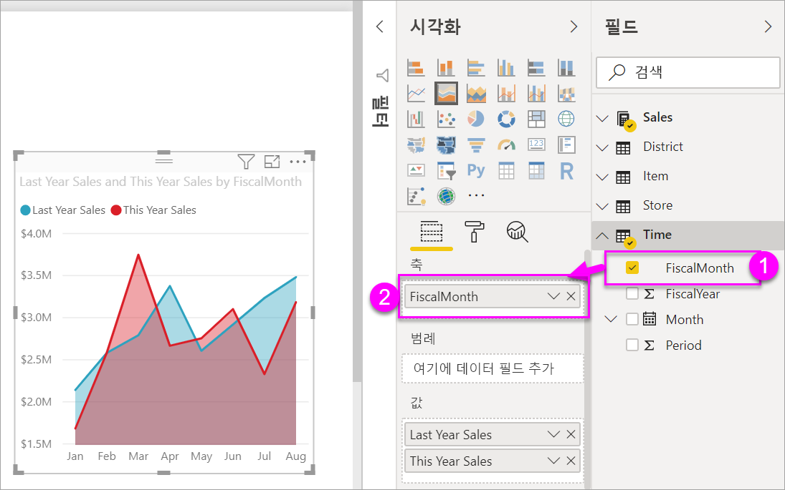
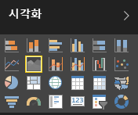
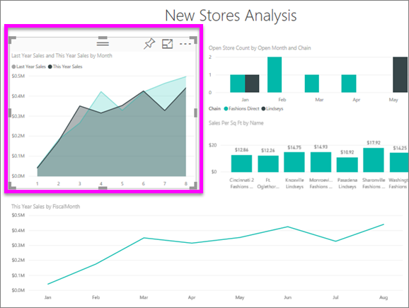
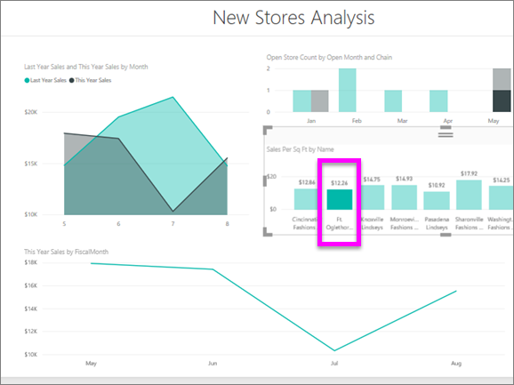

# 기본 영역형 차트
기본 영역형 차트(계층화된 영역형 차트라고도 함)는 꺾은선형 차트를 기반으로 합니다. 축과 선 사이의 영역이 볼륨을 나타내는 색으로 채워집니다. 

영역형 차트는 시간에 따른 변경 크기를 강조하며 추세 간의 총 가치에 주목하도록 하는 데 사용할 수 있습니다. 예를 들어, 시간에 따른 수익을 나타내는 데이터를 영역형 차트에 그려 총 수익을 강조할 수 있습니다.

## 기본 영역형 차트를 사용하는 경우
다음과 같은 경우 기본 영역형 차트를 사용하는 것이 좋습니다.

* 시계열 전체 볼륨 추세 보기 및 비교 
* 물리적으로 셀 수 있는 집합을 나타내는 개별 계열

### 필수 조건
 - Power BI 서비스
 - 소매점 분석 샘플

이를 수행하려면 Power BI에 로그인하여 **데이터 가져오기 \> 샘플 \> 소매 분석 샘플 > 연결**을 선택한 다음 **대시보드로 이동**을 선택합니다. 

## 기본 영역형 차트 만들기
 

1. "소매 분석 샘플" 대시보드에서 **Total Stores** 타일을 선택하여 "소매 분석 샘플" 보고서를 엽니다.
2. **편집**을 선택하여 편집용 보기에서 보고서를 엽니다.
3. 보고서 맨 아래에서 노란색 더하기 아이콘(+)을 선택하여 새 보고서 페이지를 추가합니다.
4. 올해 판매액과 지난 해 판매액을 월별로 보여주는 영역형 차트를 만듭니다.
   
   a. 필드 창에서 **판매 \> 지난해 판매액** 및 **올해 판매액 > 값**을 선택합니다.

   

   b.  시각화 창에서 영역 차트 아이콘을 선택하여 차트를 기본 영역 차트로 변환합니다.

   
   
   c.  **시간\> 월**을 선택하여 **축** 영역에 추가합니다.   
   
   
   d.  월별 차트를 표시하려면 줄임표(시각적 개체의 오른쪽 위 모서리)를 선택 하고 **월별 정렬**을 선택합니다. 정렬 순서를 변경하려면 줄임표를 다시 선택하고 **오름차순 정렬** 또는 **내림차순 정렬**을 선택합니다.

## 강조 표시 및 교차 필터링
필터 창 사용 방법에 대한 자세한 내용은 [보고서에 필터 추가](../power-bi-report-add-filter.md)를 참조하세요.

차트에서 한 특정 영역을 강조 표시하려면 영역 또는 영역의 위쪽 테두리를 선택합니다.  다른 시각화 유형과는 달리, 동일한 페이지에 다른 시각화가 있는 경우 기본 영역형 차트를 강조 표시해도 보고서 페이지의 다른 시각화를 교차 필터링하지 않습니다. 그러나 영역형 차트는 보고서 페이지에서 기타 시각화 요소에 의해 트리거되는 교차 필터링의 대상입니다. 

1. 영역 차트를 선택하고 다른 보고서 페이지에 복사(Ctrl+C 및 Ctrl+V)하여 시도해 보세요.
2. 음영 처리 영역 중 하나를 선택한 후 다른 음영 처리 영역을 선택합니다. 페이지의 다른 시각화에는 영향을 주지 않는 것을 확인할 수 있습니다.

    

3. 이제 페이지에서 다른 시각화(예: 세로 막대형 차트의 막대 또는 꺾은선형 차트의 월) 중 하나의 요소를 선택합니다. 영역 차트가 영향을 받아 필터링됩니다.  

     

자세한 내용은 [보고서의 시각적 상호 작용](../service-reports-visual-interactions.md)을 참조하세요.

## 고려 사항 및 문제 해결   
* [장애가 있는 사용자가 보고서에 액세스할 수 있도록 만들기](../desktop-accessibility.md)
* 기본 영역형 차트는 계층화된 영역의 폐색으로 인해 값을 비교하는 데는 효과적이지 않습니다. Power BI는 투명도를 사용하여 영역의 겹침을 나타냅니다. 그러나 이것은 두세 개의 서로 다른 영역에서만 잘 작동합니다. 4개 이상의 측정값에 대한 추세를 비교해야 하는 경우 꺾은선형 차트를 사용해보세요. 4개 이상의 측정값에 대한 볼륨을 비교해야 하는 경우 트리맵을 사용해보세요.

## 다음 단계
[Power BI의 보고서](power-bi-visualization-card.md)  

