# <a name="best-design-practices-for-reports-and-visuals"></a>보고서 및 시각적 효과에 대한 디자인 모범 사례

이 문서에서는 Power BI 보고서 디자인에 대한 모범 사례를 제공합니다. 보고서와 페이지 및 보고서를 구성하는 개별적인 시각적 개체에 적용할 수 있는 디자인 원칙을 설명합니다. 이러한 모범 사례의 대다수는 대시보드 디자인에도 적용됩니다.

> [!NOTE]
> 이 문서에 제시된 권장 사항은 시기와 경우에 따라 적절하게 적용할 수 있는 지침입니다. 아래 설명되어 있는 모든 원칙에는 “규칙을 깨기에” 타당한 이유가 있을 수 있습니다.

이 문서가 출발점이 되어 여기서 알아본 내용을 보고서와 시각화에 적용하고, [Microsoft Power BI Community](http://community.powerbi.com/)에서 대화도 계속하기를 바랍니다. 현재 BI 보고서 디자인 및 시각화 사용법은 관심을 많이 받는 주제입니다. BI 보고서 디자인을 폭넓고 심층적으로 살펴보는 독자, 블로거 및 웹 사이트가 많이 있습니다. 몇 가지 항목이 문서의 끝에 나와 있습니다.

> *정보의 양이 많아서가 아니라 정보를 길들이는 방법을 몰라서 압도되는 것입니다.*
-- Stephen Few

## <a name="a-look-at-the-landscape-and-terminology"></a>외관 및 용어에 대해 살펴보기

Power BI에서 보고서는 하나 이상의 보고서 페이지를 포함할 수 있습니다. 모든 페이지를 함께 통틀어 보고서라고 부릅니다. 보고서의 기본 요소는 시각적 개체(시각화라고도 함), 독립 실행형 이미지 및 텍스트 상자입니다. 개별적인 데이터 요소, 보고서 요소 및 보고서 페이지에는 무수한 서식 옵션이 있습니다.

보고서 계획 단계를 시작으로 기본 보고서 디자인 원칙을 알아본 다음 시각적 디자인 원칙을 설명하고 개별적인 시각적 개체 유형 모범 사례에 대한 설명으로 마무리하겠습니다.

Power BI 보고서 생성 및 사용에 대한 심층적인 설명과 지침은 [Power BI 알아보기](https://powerbi.microsoft.com/learning/)에 제공됩니다.

## <a name="before-you-build-your-first-visualization-focus-on-requirements"></a>첫 번째 시각화를 빌드하기 전에 요구 사항에 주력하기

보고서를 만드는 일은 첫 번째 시각적 개체를 빌드하기 전부터 시작됩니다. 좋은 보고서에는 계획이 필요합니다. 작업할 데이터가 무엇인지 파악하고 보고서에 대한 요구 사항을 기록해 둡니다. 직접 다음과 같은 질문을 해봅니다.

* 비즈니스 요구 사항은 무엇인가요?

* 독자가 이 데이터를 어떻게 사용하려고 하나요?

* 누가 이 데이터를 사용하려고 하나요?

* 독자는 이 보고서를 기반으로 어떤 결정을 내리려고 하나요?

이러한 질문에 대한 답변이 디자인을 주도하게 됩니다. 모든 보고서에는 스토리가 있습니다. 스토리가 비즈니스 요구 사항과 일치하는지 확인합니다. 인사이트 활용을 극적으로 보여 주는 시각적 개체를 추가하면 이목을 끌 수는 있지만 인사이트 활용이 비즈니스 요구와 일치하지 않는다면 유용한 보고서가 될 수 없습니다. 실제로는 시각적 개체가 사용자가 집중하는 데 방해가 될 수 있습니다. 이 데이터에서는 결정을 내리기 위한 정보를 수집할 수 없다는 사실도 알게 됩니다. 이 보고서를 사용하여 측정하는 데 필요한 사항을 측정할 수 있나요?

보고서를 사용하여 모니터링, 검색, 추적, 예측, 측정, 관리, 테스트 등을 수행할 수 있습니다. 예를 들어 성과를 측정하는 판매 보고서가 비즈니스 요구 사항입니다. 현재 판매를 검토하고, 이전 판매와 비교하고, 경쟁사와 비교하고, 경고를 트리거하는 KPI를 포함하는 보고서를 디자인할 수 있습니다. 독자들은 판매 수치를 드릴다운하여 판매에 영향을 줄 수 있는 매장 폐쇄나 공급망 문제를 볼 수 있습니다. 또 다른 드릴다운을 통해 매장, 지역, 제품, 계절 등을 기준으로 판매를 검토할 수 있습니다.

보고서의 고객을 파악합니다. 익숙한 용어를 사용하여 보고서를 디자인하고 고객의 지식수준과 비슷한 수준으로 복잡성 및 세부 사항 데이터를 제공합니다. 고객의 유형이 두 가지 이상인가요? 하나의 크기가 항상 모두에게 맞는 것은 아닙니다. 전문 지식을 기반으로 보고서 페이지를 별도로 디자인합니다. 고객 스스로 식별할 수 있도록 각 페이지에 레이블을 명확하게 지정할 필요가 있습니다. 또 다른 옵션은 고객 스스로 자신에게 맞게 페이지를 고칠 수 있도록 슬라이서를 사용하는 것입니다. 계획 단계에서 고객을 참여시키면 그들에게 필요할 것으로 예상하고 페이지를 잘못 빌드하는 실수를 피할 수 있습니다. 실수하면 처음부터 다시 시작하고 반복할 각오를 해야 합니다.

비즈니스 요구, 고객, 포함할 메트릭을 파악하고 나면 다음 단계는 스토리 구사에 적합한 시각적 개체를 선택하는 것입니다. 가장 효과적인 방식으로 해당 시각적 개체를 제공하는 방법을 살펴봅니다. 보고서 디자인의 몇 가지 기본적인 원칙부터 시작하겠습니다.

## <a name="principles-of-report-design"></a>보고서 디자인의 원칙

보고서 페이지의 공간은 제한되어 있으며 그 공간 안에 원하는 모든 요소를 넣으면서도 정보를 쉽게 이해할 수 있게 하는 것은 가장 어려운 일 중 하나입니다. 또한 시각적으로 매력적인 보고서의 가치를 과소평가하면 안 됩니다. 핵심은 매력적인 보고서와 유용한 보고서 사이에서 균형을 잡는 것입니다.

레이아웃, 명확성, 미관에 대해 살펴보겠습니다.

### <a name="layout-of-the-report-canvas"></a>보고서 캔버스의 레이아웃

보고서 캔버스의 공간은 한정되어 있습니다. 하나의 보고서 페이지에 모든 요소를 넣을 수 없으면 보고서를 여러 페이지로 나눕니다. 특정 대상(예: HR, IT, 판매, SLT)에 맞게 보고서 페이지를 조정할 수 있습니다. 원하는 경우 특정 비즈니스 질문에 맞게 조정합니다.

* “결함은 가동 중지 시간에 어떻게 영향을 미치나요?”

* “마케팅 캠페인이 감정에 미치는 영향은 무엇인가요?”

점진적인 스토리로 접근하는 것이 더 좋을 수 있습니다. 개요 또는 관심을 끄는 “후크”의 첫 번째 페이지일 수 있고, 두 번째 페이지는 데이터 스토리를 계속하고, 세 번째 페이지는 스토리를 더 깊이 살펴보는 방식으로 진행됩니다. 전체 보고서를 단일 페이지에 넣는 경우도 해당됩니다. 그렇지 못한 경우에는 콘텐츠를 논리적으로 나누는 별도의 보고서 페이지를 만듭니다. 페이지에 의미 있고 유용한 이름을 지정해야 합니다.

미술관을 채운다고 생각해 보겠습니다. 작품 50점을 작은 전시실 한 곳에 모두 배치하지는 않을 것입니다. 의자를 사용하고 벽마다 다른 색을 칠하기도 할 것입니다. 큐레이터로 공통적인 테마가 있는 작품만 선택합니다. 방문자가 이동하면서 생각할 수 있는 충분한 공간이 있는 전시실에 작품을 배치합니다. 보고 있는 작품을 설명하는 정보용 카드를 배치할 수도 있습니다. 대부분의 현대 미술관 벽이 단색인 데는 이유가 있습니다.

이 문서에서는 작업이 많이 필요한 보고서 예제부터 살펴보겠습니다. 모범 사례와 디자인 원칙을 적용하면서 보고서가 개선되는 것을 볼 수 있을 것입니다.


**그림 1: 보기 힘든 보고서 페이지에는 많은 작업이 필요함**

위의 예제에는 아래에서 설명할 공간 관련(레이아웃) 디자인 문제가 많이 포함되어 있습니다.

* 맞춤, 순서 및 근접 사용

* 잘못된 공간 및 정렬 사용

* 혼잡함

### <a name="alignment-order-and-proximity"></a>맞춤, 순서 및 근접

보고서 요소의 레이아웃은 독자의 이해도에 영향을 주며 보고서 페이지 전반에서 독자를 안내합니다. 요소를 배치하는 방식에 따라 스토리가 달라집니다. “여기에서 시작해서 여기를 보세요.”라거나 “여기 3가지 요소는 서로 관련이 있습니다.”라고 알려줄 수 있습니다.

* 대부분의 문화권은 왼쪽에서 오른쪽으로, 위에서 아래로 훑어봅니다. 가장 중요한 요소는 보고서의 왼쪽 위 모서리에 배치합니다. 나머지 시각적 개체는 정보를 논리적으로 탐색하고 이해할 수 있도록 배치합니다.

* 독자의 선택이 필요한 요소(예: 슬라이서)는 선택의 영향을 받는 시각화 개체의 왼쪽에 배치합니다.

* 위치 관련 요소는 서로 가까이 배치합니다. 근접은 요소의 관계를 의미합니다.

* 관계를 알리는 다른 방식은 관련된 요소 둘레에 테두리 또는 배경 색을 추가하는 것입니다. 반대로 보고서에서 서로 다른 섹션을 구분하려면 구분선을 추가합니다.

* 보고서 페이지의 섹션을 시각적으로 분류하려면 공백을 사용합니다.

* 보고서 페이지를 채웁니다. 공백이 너무 많은 경우에는 시각화의 크기를 키우거나 캔버스 크기를 줄입니다.

* 보고서 요소의 크기는 의도적에 맞게 조정합니다. 사용 가능한 공간에 맞춰서 시각화의 크기를 조정하지 않습니다.

* 중요한 요소는 다른 요소보다 크게 만들고 화살표와 같은 시각 요소를 추가하여 주의를 끕니다.

* 보고서 페이지의 요소를 대칭으로 또는 의도적으로 비대칭으로 정렬합니다.

맞춤에 대해 좀 더 자세히 살펴보겠습니다.

#### <a name="alignment"></a>맞춤

맞춤이란 다양한 구성 요소의 크기를 동일하게 만든다는 의미가 아닙니다. 보고서의 각 행에는 같은 수의 구성 요소를 배치해야 한다는 의미가 아닙니다. 단지 페이지의 탐색과 가독성에 도움을 주는 구조를 갖춘다는 의미입니다.

업데이트된 보고서에서 왼쪽 및 오른쪽 가장자리에 맞춰서 보고서 구성 요소를 배치했음을 알 수 있습니다. 또한 각 보고서 행을 가로 및 세로로 맞췄습니다. 슬라이서는 영향을 주는 시각적 개체의 왼쪽에 있습니다.


**그림 2: 보기 힘든 보고서 예제가 레이아웃 편집을 통해 개선됨**

Power BI에는 시각적 개체를 정렬하는 데 유용한 도구가 포함됩니다. Power BI Desktop에서 시각적 개체를 여러 개 선택한 상태에서 **시각적 개체 도구** 리본 탭의 **맞춤** 및 **분산** 옵션을 사용하면 시각적 개체의 위치를 맞출 수 있습니다.

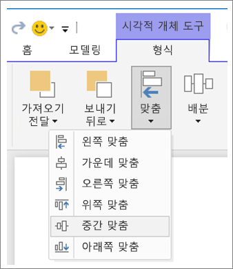

**그림 3a: Power BI Desktop에서 시각적 개체 도구 정렬하기**


**그림 3b: Power BI 서비스에서 시각적 개체 도구 정렬하기**

Power BI 서비스 및 Power BI Desktop에서는 시각적 개체의 크기와 위치를 정확하게 제어할 수도 있습니다. 모든 시각적 개체의 **서식** 창에 있는 **일반** 탭에서 이 컨트롤을 찾을 수 있습니다.

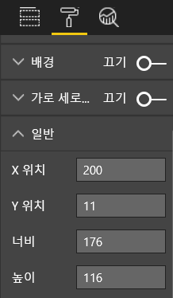

**그림 4: 시각적 개체에 대한 정확한 위치 설정**

예제 보고서 페이지(그림 2)에서 Power BI는 카드 2개와 큰 테두리를 200의 **X 위치**에 맞춥니다.

#### <a name="fit-to-the-space"></a>공간에 맞추기

주어진 공간을 최대한 활용합니다. 사람들이 보고서를 보고 표시하는 방식을 알고 있다면 그것을 염두에 두고 디자인합니다. 캔버스를 채워서 빈 공간을 줄입니다. 개별 시각적 개체에 스크롤 막대가 필요하지 않도록 최선을 다합니다. 시각적 개체를 보기 어렵게 만들지 않으면서 공간을 채웁니다.

##### <a name="adjust-the-page-size"></a>페이지 크기 조정

페이지 크기를 줄이면 전체 페이지에 비해 개별 요소가 상대적으로 커집니다. 페이지에서 시각적 개체의 선택을 취소하고 **서식** 창에서 **페이지 크기** 탭을 사용합니다.

다음은 페이지 크기 **4:3**을 사용한 후 **16:9**를 사용하는 보고서 페이지입니다. 16:9 레이아웃이 훨씬 더 적합한 것을 볼 수 있습니다. 두 번째 시각적 개체에는 스크롤 막대를 제거할 만큼 충분한 공간이 있습니다.

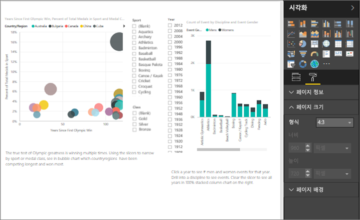

**그림 5a: 4:3 페이지 크기 보고서**

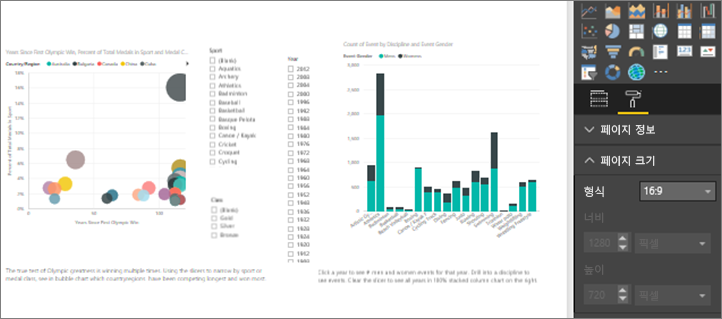

**그림 5b: 16:9 페이지 크기 보고서**

보고서가 4:3, 16:9 또는 다른 가로 세로 비율로 표시되나요? 작은 화면이나 큰 화면에서 표시되나요? 보고서가 가능한 모든 화면 비율과 크기로 표시되나요? 이 내용을 염두에 두고 디자인합니다.

예제 보고서 페이지가 약간 비좁아 보입니다. 시각적 개체를 선택하지 않음:

1. 을 선택하여 **서식** 창을 엽니다.

1. **페이지 크기**를 확장합니다.

1. **형식**에 대해 **사용자 지정**을 선택합니다.

1. **높이**를 **900**으로 변경합니다.

    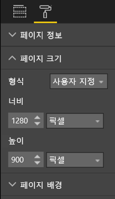

**그림 6: 페이지 높이 늘리기**

#### <a name="reduce-clutter"></a>혼잡함 줄이기

혼잡한 보고서 페이지는 한 눈에 이해하기가 어렵기 때문에 이에 압도되어 독자들이 읽으려는 시도조차 하지 않을 수 있습니다. 필요하지 않은 보고서 요소는 모두 제거합니다. 이해도나 탐색에 도움이 되지 않는 기능을 추가하지 마세요. 보고서 페이지는 정보를 최대한 명확하고 신속하고 응집력 있게 전달해야 합니다.

Edward Tufte는 *The Visual Display of Quantitative Information* 라는 그의 저서에서 이것을 “data to ink ratio(데이터 잉크 비율)”로 언급했습니다. 기본적으로 필수적이지 않은 것은 모두 제거하라는 의미입니다.

혼잡함을 제거하면 보고서 페이지의 공백이 늘어납니다. [맞춤, 순서 및 근접](#alignment-order-and-proximity) 섹션에서 알아본 모범 사례를 적용할 공간이 더 많이 확보됩니다.

예제에서 보기 쉬워진 상태를 볼 수 있습니다. 혼잡함이 제거되었고 요소를 모아서 그룹화하기 위해 셰이프가 추가되었습니다. 배경 이미지는 사라졌고, 불필요한 화살표 셰이프와 텍스트 상자도 없어졌으며, 시각적 개체 하나를 보고서의 다른 페이지로 이동했습니다. 공백을 늘리기 위해 페이지 길이도 늘였습니다.


**그림 7: 보기 힘든 예제 보고서가 정돈됨**

### <a name="tell-a-story-at-a-glance"></a>스토리 한 눈에 알려주기

사전 지식이 없는 사람이 아무런 설명 없이 보고서를 신속하게 이해할 수 있는지를 전반적으로 평가해야 합니다. 페이지가 무엇을 말하는지 각 차트/테이블이 무엇을 전달하지를 독자들이 한눈에 볼 수 있습니다.

독자들이 보고서를 볼 때 처음 봤으면 하는 요소로 그들의 시선을 집중해야 합니다. 그런 다음, 왼쪽에서 오른쪽으로 위에서 아래로 시선이 이어지게 됩니다. 텍스트 상자 레이블, 셰이프, 테두리, 크기 및 색상과 같은 시각 신호를 추가하면 이러한 행동을 바꿀 수 있습니다.

#### <a name="text-boxes"></a>텍스트 상자

시각화 제목만으로는 스토리를 전달하기 부족한 경우가 있습니다. 보고서를 보는 사람들과 소통하기 위해 텍스트 상자를 추가합니다. 텍스트 상자를 사용하여 보고서 페이지와 시각적 개체 그룹 또는 개별적인 시각적 개체를 설명합니다. 텍스트 상자는 결과를 설명하거나 시각적 개체, 시각적 개체에 포함된 구성 요소 또는 시각적 개체 사이의 관계를 더 잘 정의합니다. 텍스트 상자를 사용하여 텍스트 상자에서 호출된 다양한 조건에 따라 주의를 끌 수 있습니다.

Power BI 서비스의 위쪽 메뉴 모음에서 **텍스트 상자**를 선택합니다. (Power BI Desktop의 경우 리본의 **삽입** 영역에서 **텍스트 상자**를 선택합니다.)

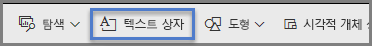

**그림 8: Power BI 서비스에 텍스트 상자 추가**

빈 상자에 텍스트를 입력합니다. 그런 다음, 컨트롤을 사용하여 글꼴, 크기, 맞춤 등을 설정합니다. 핸들을 사용하여 상자 크기를 조정합니다.

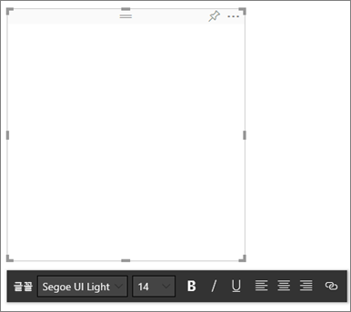

**그림 9: 텍스트 상자 서식 지정**

그래도 지나치면 안 됩니다! 보고서에 텍스트가 너무 많으면 시각적 개체의 가치가 떨어집니다. 보고서 페이지를 이해할 수 있도록 만들기 위해 텍스트가 많이 필요하다면 처음부터 다시 시작합니다. 개체만으로 스토리를 더 잘 알려줄 수 있는 다른 시각적 개체를 선택할 수 있나요? 시각적 개체의 원래 제목을 약간 수정하여 좀 더 쉽게 이해할 수 있도록 만들 수 있나요?

#### <a name="text"></a>텍스트

텍스트 스타일 가이드를 만들어서 보고서의 모든 페이지에 적용합니다. 글꼴, 텍스트 크기 및 색은 몇 가지만 선택합니다. 이 스타일 가이드를 텍스트 요소에 적용합니다. 시각화 내에서 만든 글꼴 옵션에도 적용합니다. [시각화의 일부인 제목 및 레이블](#titles-and-labels-that-are-part-of-the-visualizations) 섹션을 참조하세요. 굵은 글꼴, 기울임꼴, 증가된 글꼴 크기, 특정 색상 등을 언제 사용할지에 대한 규칙을 설정합니다. 모두 대문자로 표시하거나 밑줄을 사용하는 경우는 피합니다.

#### <a name="shapes"></a>셰이프

셰이프도 탐색 및 이해도에 도움을 줄 수 있습니다. 셰이프를 사용하여 관련된 정보를 모아서 그룹화하고, 중요한 데이터에 강조 표시를 하고, 화살표를 사용하여 시선을 끌 수 있습니다. 셰이프는 보고서를 어디부터 시작할지 어떻게 해석할지 이해하는 데 유용합니다. 디자인 용어에서는 이것을 ‘대비’라고 말하기도 합니다. 

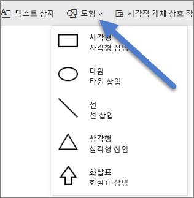

**그림 10a: Power BI 서비스의 셰이프**

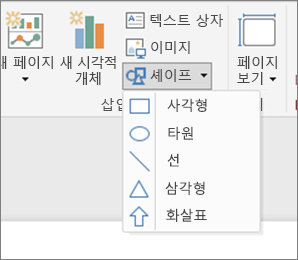

**그림 10b: Power BI Desktop의 셰이프**

이제 예제 페이지의 모양은 어떤가요? 그림 11은 텍스트 크기와 색상이 일관적으로 적용된 보다 깔끔하고 덜 혼잡한 페이지를 보여 줍니다. 왼쪽 위 모서리에 있는 페이지 제목은 페이지가 무엇을 말하는지 알려줍니다.


**그림 11: 텍스트 지침이 적용되고 제목이 추가된 예제 보고서**

예제에서 보고서 페이지 제목을 왼쪽 위 모서리에 추가했습니다. 이곳은 독자가 처음 보는 위치입니다. 페이지의 나머지 부분에 비해 두드러져 보이도록 글꼴 크기는 28pt이고 글꼴은 굵은 고딕입니다. 텍스트 스타일 가이드에는 배경 없이 검은색 제목, 범례 및 레이블이 필요합니다. 가능한 경우 페이지의 모든 시각적 개체에 이 스타일 가이드를 적용했습니다(콤보 차트 축과 레이블은 편집할 수 없음). 또한 다음 요소는 스타일 가이드 사양으로 구성되었습니다.

* 카드: **범주 레이블**은 **끄기**로 설정되고, **제목**은 **켜기**로 설정되고, 12pt, 검은색, 가운데 맞춤으로 설정됩니다.

* 시각적 개체 제목: **켜기**로 설정된 경우 12pt 및 왼쪽 맞춤으로 설정합니다.

* 슬라이서: **머리글**은 **끄기**로 설정되고, **제목**은 **켜기**로 설정됩니다. **항목** > **텍스트**는 회색 및 10pt를 유지합니다.

* 분산형 차트 및 세로 막대형 차트: X축과 Y축 및 X축과 Y축 제목(사용되는 경우)은 글꼴이 검은색입니다.

#### <a name="color"></a>색

색은 일관성을 위해 사용합니다. 나중에 [시각 디자인의 원칙](#principles-of-visual-design)에서 색에 대해 자세히 설명하겠습니다. 여기에서는 색을 신중하게 선택해야 한다는 점을 언급하겠습니다. 독자가 보고서를 신속하게 이해하는 데 색이 방해 요인이 되지 않아야 하기 때문입니다. 밝은 색이 너무 많으면 인지하는 데 방해가 됩니다. 이 섹션에는 색에 관한 금기 사항만 포함됩니다.

#### <a name="backgrounds"></a>배경

보고서 페이지의 배경을 설정할 때는 보고서를 흐릿하게 만들지 않고, 페이지의 다른 색과 겹치지 않고, 일반적으로 눈에 손상을 주지 않는 색을 선택합니다. 일부 색에는 내재적 의미가 있다는 점에 유의합니다. 예를 들어 미국의 경우 보고서에 빨간색이 있으면 일반적으로 “잘못된” 의미로 해석됩니다.

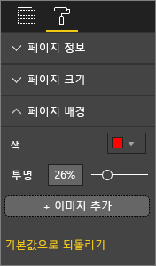

**그림 12: 보고서 배경 설정**

작품이 아닌 기능적인 보고서를 만드는 것입니다. 보고서 요소를 두드러져 보이게 하고 가독성을 높이는 색을 선택합니다. 웹 페이지에 대한 색과 시각화 사용에 대한 연구에 따르면 색 대비가 높을수록 이해 속도가 높아진다고 합니다. 다음 두 개의 백서에서 이 주제를 살펴봅니다.

* [웹 페이지 검색 시 시각적 개체의 텍스트 및 배경색 효과](https://www.sciencedirect.com/science/article/pii/S0141938202000410)

* [웹 페이지 시각적 복잡성 및 미적 특성에 대한 사용자의 인식 결정](https://www.researchgate.net/publication/301362579_Determining_Users'_Perception_of_Web_Page_Visual_Complexity_and_Aesthetic_Characteristics)

몇 가지 색 모범 사례가 예제 보고서(그림 20 및 21)에 적용되어 있습니다. 가장 주목할만한 부분은 배경색을 검정으로 변경한 것입니다. 노란색은 너무 밝아서 눈에 무리가 갑니다. 또한 **Count of athlete name by year and class**(연도 및 클래스별 선수 이름 수) 차트의 경우 막대의 노란색 부분이 노란색 배경 때문에 사라져 보입니다. 검정(또는 흰색) 배경을 사용하면 대비가 최대가 되고 시각적 개체로 주의를 끌 수 있습니다.

예제 보고서를 개선하기 위해 수행한 추가 단계는 다음과 같습니다.

#### <a name="page-title"></a>페이지 제목

배경을 검정색으로 변경하는 경우 텍스트 상자 필드에 검정색 글꼴만 허용되기 때문에 제목이 사라집니다. 이 문제를 해결하려면 텍스트 상자 제목을 대신 추가합니다.

1. 텍스트 상자를 선택한 상태에서 텍스트를 지웁니다.

1. **시각화** 탭에서 **제목**을 선택하고 **켜기**로 설정합니다.

1. 화살표를 선택하여 **제목** 옵션을 확장합니다.

1. **제목 텍스트** 필드에 **Summer Olympic Games**를 입력합니다.

1. **글꼴 색**에서 흰색을 선택합니다.

    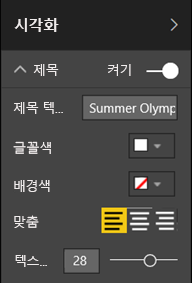

    **그림 13: 페이지 제목 추가**

#### <a name="cards"></a>카드

카드 시각적 개체의 경우 다음을 수행합니다.

1. 을 선택하여 **서식** 창을 엽니다.

1. **배경**을 **켜기**로 설정합니다.

1. **투명도** **0%** 의 흰색을 선택합니다.

    

1. 그런 다음, **제목**을 **켜기**로 설정합니다.

1. **글꼴 색**에서 흰색을 선택하고 **배경색**에서 검은색을 선택합니다.

    

#### <a name="slicers"></a>슬라이서

이 지점까지 슬라이서 두 개의 서식이 다르게 지정되었습니다. 이것은 타당한 디자인이 아닙니다. 두 슬라이서 모두에 대해 다음을 수행합니다. 

1. 배경색을 바다색으로 변경합니다.

    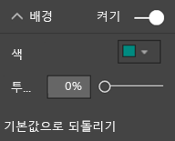

    **그림 14: 슬라이서 배경색 변경**

    바다색은 페이지 색상표의 일부이기 때문에 바람직한 선택이며 등치 지역도, 트리맵, 세로 막대형 차트에서 볼 수 있습니다.

1. 얇은 흰색 테두리를 추가합니다.

    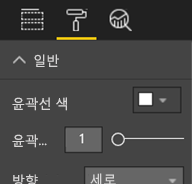

    **그림 15: 슬라이서에 테두리 추가**

1. 회색 글꼴은 바다색에 대비해서 보기가 어려우니 **항목** 색을 흰색으로 변경합니다.

    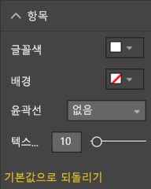

    **그림 16: 슬라이서 글꼴색 변경**

1. 마지막으로 **제목** 아래에서 **글꼴 색**을 흰색으로 변경하고 검정 **배경색**을 추가합니다.

    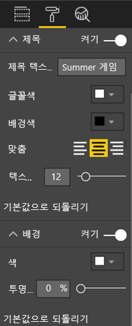

    **그림 17: 슬라이서 제목 서식 지정**

#### <a name="rectangle-shape"></a>사각형 셰이프

사각형도 검은색 배경 때문에 사라졌습니다. 이 문제를 해결하려면 다음을 수행합니다.

1. 셰이프를 선택합니다.

1. **셰이프 서식 지정** 창에서 **배경**을 **켜기**로 밉니다.

    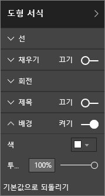

    **그림 18: 셰이프 서식 지정**

#### <a name="column-charts-bubble-chart-filled-map-and-treemap"></a>세로 막대형 차트, 거품형 차트, 등치 지역도, 트리맵

보고서 페이지의 나머지 시각적 개체에 흰색 배경을 추가합니다. **서식** 창에서:

1. **배경** 옵션을 확장합니다.

1. **색**을 흰색으로 설정합니다.

1. **투명도**를 0으로 설정합니다.

    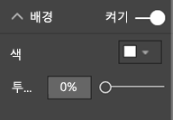

    **그림 19: 나머지 시각화에 흰색 배경 추가**

서식을 다시 지정한 후 보고서는 다음과 같이 표시됩니다.


**그림 20: 색 모범 사례가 적용된 보고서 예제(검정색 배경)**


**그림 21: 색 모범 사례가 적용된 보고서 예제(흰색 배경)**

### <a name="aesthetics"></a>미관

맞춤, 색, 글꼴 선택, 혼잡함과 같이 미관상 고려되는 많은 부분은 위에서 설명했습니다. 보고서 디자인에 관해 논의할만한 가치가 있는 모범 사례가 몇 가지 더 있습니다. 이 모범 사례는 보고서의 전체적인 모양에 관해 설명합니다.

보고서의 기능은 미관이 아니라 비즈니스 요구를 충족하는 것이라는 사실을 기억해 주세요. 어느 정도의 미관은 필요하며, 특히 첫인상과 관련된 경우에는 그렇습니다. 내슈빌에 거주하는 컨설턴트인 Tony Bodoh는 “감정이 논리보다 0.5초 앞서 작용한다.”라고 설명합니다. 독자는 먼저 감정적으로 보고서 페이지에 반응하게 됩니다. 그런 다음, 시간을 두고 자세히 분석합니다. 페이지에 체계가 없거나, 혼란스럽거나, 비전문적으로 보인다면, 독자들은 페이지에서 전달하는 강력한 스토리를 알아챌 수 없습니다.

이러한 현상을 블로거이자 TechTarget 업계 분석가인 Wayne Eckerson은 다음과 같이 비유합니다. 보고서 디자인은 방을 장식하는 것과 같습니다. 시간이 지남에 따라 꽃병, 소파, 협탁, 그림 등을 구입합니다. 개별적으로는 이러한 요소를 모두 좋아합니다. 이러한 물건은 하나씩 보면 나름의 이유가 있지만 한데 모으면 조화를 해치거나 서로 어울리지 않습니다.

다음 사항을 집중적으로 다룹니다.

* 공통적인 주제를 새로 만들거나 보고서에서 찾아서 보고서의 모든 페이지에 적용합니다.

* 실제 스토리를 훼손하지 않고 뒷받침하는 독립 실행형 이미지와 기타 그래픽을 사용합니다.

* 이 문서에서 여태까지 설명한 모든 모범 사례를 적용합니다.

## <a name="principles-of-visual-design"></a>시각 디자인의 원칙

여태까지는 보고서 디자인의 원칙 및 보고서를 신속하게 파악할 수 있도록 보고서 요소를 구성하는 방법에 대해 살펴봤습니다. 이제 시각화 개체 자체에 대한 디자인 원칙을 살펴보겠습니다. 다음 섹션에서는 개별 시각적 개체를 심층적으로 알아보고 일반적으로 사용되는 유형 중 몇 가지에 대한 모범 사례를 설명하겠습니다.

예제 보고서 페이지를 잠시 놔두고 다른 예제를 살펴보겠습니다. 시각 디자인의 원칙을 살펴본 후에는 예제 보고서 페이지로 돌아가서 알아본 내용을 적용하겠습니다. 단계별 지침이 제공됩니다.

### <a name="planning--choose-the-right-visual"></a>계획 – 적합한 시각적 개체 선택

보고서 빌드를 시작하기 전에 보고서 계획이 중요한 것처럼 각각의 시각적 개체에도 계획이 필요합니다. 자신에게 “시각적 개체를 사용하여 전달하려는 스토리가 무엇인가?”를 질문한 다음, 어떤 시각적 개체 유형이 스토리를 가장 잘 전달할지 알아냅니다. 매출 주기의 진행 상태는 가로 막대형 차트로 나타낼 수 있지만 폭포 차트나 깔때기형 차트가 그런 상태를 더 잘 전달하지 않을까요? 이 프로세스에 관한 도움말은 이 문서의 마지막 섹션인 [시각적 개체 유형 및 모범 사례](#visual-types-and-best-practices)를 참조하세요. 이 섹션에서는 몇 가지 더 일반적인 유형의 시각적 개체에 대한 모범 사례를 설명합니다. 처음 선택한 시각적 개체 유형이 최고의 옵션이 되지 않더라도 놀라지 마세요. 어떤 유형이 요점을 가장 잘 전달하는지 알아보기 위해 시각적 개체 유형을 두 가지 이상 시도해 봅니다.

양적 데이터와 범주형 데이터의 차이를 이해하고 어떤 시각적 개체 유형이 어떤 데이터 유형과 가장 잘 맞는지 알아냅니다. 양적 데이터는 측정값이라고도 하며 일반적으로 숫자입니다. 범주형 데이터는 차원이라고도 하며 분류할 수 있습니다. 이 내용은 [적합한 측정값 선택](#choose-the-right-measure) 섹션에서 자세히 설명합니다.

보고서를 보다 인상적으로 만들려는 목적만으로 예쁘고 더 복잡한 시각적 개체 유형을 사용하려는 유혹은 피해야 합니다. 필요한 것은 스토리 전달을 위한 가장 간단한 옵션입니다. 가로 막대형 차트와 간단한 꺾은선형 차트는 정보를 신속하게 전달할 수 있습니다. 친숙하고 편리하며 대부분의 독자가 쉽게 해석합니다. 대부분의 독자가 왼쪽에서 오른쪽으로 위에서 아래로 읽기 때문에 이 두 가지 차트 유형을 훑어보고 정보를 빠르게 이해할 수 있다는 이점이 더해집니다.

스토리 전달을 위해 시각적 개체에 스크롤이 필요한가요? 가능하면 스크롤을 사용하지 않습니다. 필터를 적용하고 계층 구조/드릴다운을 사용합니다. 해당 요소를 사용해도 스크롤 막대가 제거되지 않으면 다른 시각적 개체 유형을 선택해 봅니다. 스크롤을 제거할 수 없다면 독자는 세로 스크롤보다 가로 스크롤을 쉽게 받아들입니다.

스토리에 가장 적합한 시각적 개체를 선택한 경우에도 스토리 전달에 도움이 필요할 수 있습니다. 레이블, 제목, 메뉴, 색, 크기를 적용하는 위치가 그렇습니다. 이 디자인 요소는 [디자인 요소](#design-elements) 섹션의 뒷부분에서 설명하겠습니다.

### <a name="choose-the-right-measure"></a>적합한 측정값 선택

시각적 개체가 전달하는 스토리가 흥미진진한가요? 중요한가요? 시각적 개체를 좋아한다는 이유로 시각적 개체를 빌드하지 마세요. 그런 데이터가 흥미로운 스토리를 전달한다고 생각할 수 있지만 그렇지 않습니다. 처음부터 다시 시작하는 것을 두려워하지 말고 더 흥미로운 스토리를 찾아보세요. 스토리는 있지만 다른 방식으로 측정해야 할 수도 있습니다.

판매부장의 성공을 측정하려 한다고 가정하겠습니다. 이를 위해 어떤 측정을 사용해야 하나요? 총 판매액이나 총 수익, 전년 대비 성장 또는 대상 목표 대비 실적을 검토하면 측정을 가장 잘 수행할 수 있을까요? 영업 직원 Sally가 수익이 가장 높은 것으로 보입니다. 가로 막대형 차트로 영업 직원별 총수익을 표시한다면 다른 영업 직원과 비교해 월등히 높게 표시될 것입니다. Sally는 영업 비용(출장비, 운송비, 제조비 등)이 많이 들기 때문에 판매액을 검토하는 것만으로는 최적의 스토리를 전달하지 못합니다.

#### <a name="reflect-reality-dont-distort-reality"></a>현실을 반영하세요. 현실을 왜곡하지 마세요.

진실을 왜곡하는 시각적 개체가 빌드되기도 합니다. 데이터 전문가가 잘못된 시각적 개체로 간주하는 내용을 공유하는 웹 사이트가 있습니다. 설명에 포함된 공통적인 주제는 시각적 개체를 만들고 배포했던 회사에 대한 실망입니다. 잘못된 시각적 개체는 해당 회사를 믿을 수 없다는 메시지를 전달합니다.

현실을 의도적으로 왜곡하지 않으면서 전달하려는 스토리를 말하기 위해 조작되지 않은 시각적 개체를 만들어야 합니다. 예를 들면 다음과 같습니다.


**그림 22: 현실이 왜곡된 차트**

이 예제의 경우 4개 회사 사이에 큰 차이가 있고 CorpB가 다른 3개 회사보다 훨씬 더 성공적인 것처럼 보입니다. X축이 0부터 시작되지 않고 회사 사이의 차이가 오차 범위 내에 있을 수 있다는 점에 유의해야 합니다. 다음은 동일한 데이터를 0부터 시작하는 X축으로 나타낸 것입니다.


**그림 23: 현실적인 차트**

독자들은 X축이 0부터 시작될 것으로 예상하고 그렇게 가정하기도 합니다. 0부터 시작하지 않기로 결정했다면 그렇게 하되 결과를 왜곡하지 않는 방식이어야 합니다. 일반 수준에서 벗어난 부분을 지적하는 시각 신호 또는 텍스트 상자를 추가하는 것이 좋습니다.

### <a name="design-elements"></a>디자인 요소

유형 및 측정값을 선택했고 시각적 개체를 만들었다면 최대 효과를 위해 디스플레이를 미세하게 조정할 차례입니다. 이 섹션에서 다루는 내용은 다음과 같습니다.

* 레이아웃, 공간 및 크기

* 텍스트 요소: 레이블, 주석, 메뉴, 제목

* 정렬

* 시각적 상호 작용

* 색

#### <a name="tweaking-visuals-for-best-use-of-space"></a>최대 공간 활용을 위해 시각적 개체 조정

여러 개의 차트를 보고서 하나에 맞게 넣으려는 경우 데이터 잉크 비율을 최대화하는 것이 데이터에 포함된 스토리를 부각시키는 데 도움이 됩니다. 위에서 언급했듯이 Edward Tufte는 ‘데이터 잉크’ 비율이라는 용어를 만들었습니다. ‘데이터 잉크’ 비율의 목표는 독자의 데이터 해석 능력을 저해하지 않는 한도 내에서 차트에 있는 표시를 최대한 많이 제거하는 것입니다.

아래에 있는 첫 번째 차트 세트에는 중복된 축 레이블 **Jan 2014**, **Apr 2014** 등이 있습니다. 제목에서는 **by Date**가 반복됩니다. 각 차트의 제목만을 위해 각 차트마다 가로 공간이 필요합니다. 차트 제목을 제거하고 개별적인 축 레이블을 설정하면 잉크를 일부 제거하고 전반적인 공간 활용도를 높일 수 있습니다. 위쪽 차트 두 개의 축 레이블을 제거하면 잉크를 더 많이 줄이고 더 많은 공간을 데이터에 사용할 수 있습니다.

특정 기간을 표시하고 싶다면 모든 차트 뒤에 선이나 사각형을 그릴 수 있습니다. 이렇게 하면 시선을 위쪽이나 아래쪽으로 끌어 비교를 도울 수 있습니다.

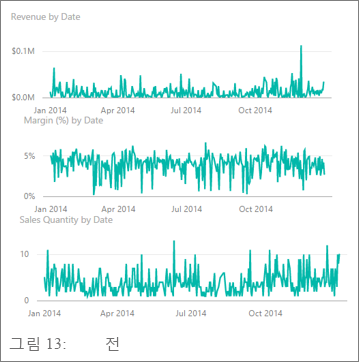

**그림 24: 이전**


**그림 25: 이후**

**축 제목을 설정 및 해제하려면**

1. 시각적 개체를 선택하여 활성화합니다.

1. 을 선택하여 **서식** 창을 엽니다.

1. **X축** 또는 **Y축**에 대한 옵션을 확장합니다.

1. **제목**의 슬라이더를 켜기 또는 끄기로 끌어갑니다.

    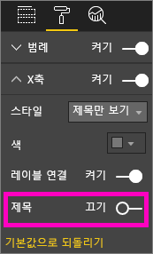

    **그림 26: 축 제목 설정 및 해제**

##### <a name="to-turn-axis-labels-on-and-off"></a>축 레이블을 켜고 끄려면

1. 시각적 개체를 선택하여 활성화합니다.

1. 을 선택하여 **서식** 창을 엽니다.

1. **X축** 및 **Y축** 옆에 슬라이더가 있습니다.

1. 슬라이더를 이동하여 축 레이블을 설정하거나 해제합니다.

    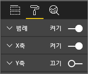

    **그림 27: 축 레이블 설정 및 해제**

    > [!TIP]
    > **데이터 레이블**을 켰다면 Y축 레이블을 끌 수 있는 시나리오가 될 수 있습니다.

##### <a name="to-remove-visual-titles"></a>시각적 개체 제목을 제거하려면

1. 시각적 개체를 선택하여 활성화합니다.

1. 을 선택하여 **서식** 창을 엽니다.

1. **제목** 슬라이더를 **끄기**로 설정합니다.

    

    **그림 28: 시각적 개체에서 제목 제거**

독자가 보고서를 어떻게 볼지 고려합니다. 사람들이 읽을 수 있도록 시각적 개체와 텍스트를 충분히 크고 진하게 만듭니다. 페이지에 상대적으로 큰 시각적 개체가 있다면 독자들이 그것을 가장 중요한 것으로 추정합니다. 보고서가 복잡하고 혼잡해 보이지 않도록 시각적 개체 사이에 공간을 충분히 배치합니다. 독자의 시선을 끌 수 있도록 시각적 개체를 정렬합니다.

##### <a name="to-resize-a-visual"></a>시각적 개체의 크기를 조정하려면

1. 시각적 개체를 선택하여 활성화합니다.

1. 핸들 중 하나를 잡고 끌어서 크기를 조정합니다.

    

    **그림 29: 시각적 개체 크기 조정**

##### <a name="to-move-a-visual"></a>시각적 개체를 이동하려면

1. 시각적 개체를 선택하여 활성화합니다.

1. 시각적 개체 위쪽 가운데에서 위치 조정 막대를 선택합니다.

1. 시각적 개체를 새 위치로 끌어갑니다.

    

    **그림 30: 시각적 개체 이동**

#### <a name="titles-and-labels-that-are-part-of-the-visualizations"></a>시각화의 일부인 제목 및 레이블

제목과 레이블이 쉽게 읽을 수 있고 의미가 명확한지 확인합니다. 제목과 레이블에 포함된 텍스트에는 두드러진 색을 사용하고 최적의 크기를 적용해야 합니다. 스타일 가이드를 기억하시나요(문서의 앞부분 [텍스트](#text) 참조)? 색과 크기의 수를 제한합니다. 글꼴 크기와 색이 너무 많으면 페이지가 혼란스럽고 복잡해 보입니다. 보고서 페이지에 있는 모든 시각적 개체의 제목에 동일한 글꼴 색과 크기를 사용하는 것이 좋습니다. 또한 보고서 페이지의 모든 제목에 대해 동일한 맞춤을 선택합니다.

**서식 창**

아래 나열된 각각의 서식 변경을 위해 페인트 롤러 아이콘 을 선택하여 **서식** 창을 엽니다.

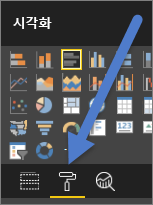

**그림 31: 서식 창 열기**

그런 다음, 조정할 시각적 개체 요소를 선택하고 **켜기**로 설정되어 있는지 확인합니다. 시각적 요소의 예에는 **X축**, **Y축**, **제목**, **데이터 레이블**, **범례**가 있습니다. 아래 예제는 **제목** 요소를 보여줍니다.

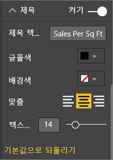

**그림 32: 시각적 개체 제목 서식 지정**

##### <a name="set-the-text-size"></a>텍스트 크기 설정

제목과 데이터 레이블의 텍스트 크기는 조정할 수 있지만 X축이나 Y축 또는 범례의 텍스트 크기는 조정할 수 없습니다. 특히 데이터 레이블의 경우 **표시 단위** 및 **소수 자릿수**를 조정합니다. 결국, 보고서에 정보를 표시할 만한 최적의 수준을 찾을 수 있습니다.

##### <a name="set-the-text-alignment"></a>텍스트 맞춤 설정

왼쪽, 오른쪽 또는 가운데의 제목 맞춤을 선택할 수 있습니다. 한 가지를 선택하고 페이지의 모든 시각적 개체에 동일한 설정을 적용합니다.

##### <a name="set-the-text-position"></a>텍스트 위치 설정

일부 Y축과 범례의 텍스트 위치를 조정할 수 있습니다. 무엇을 선택하든 페이지에 있는 다른 Y축과 범례에 대해 같은 항목을 선택합니다.

##### <a name="set-the-title-and-label-length"></a>제목 및 레이블 길이 설정

제목, 축 제목, 데이터 레이블, 범례의 길이를 조정합니다. 이 요소를 표시하려는 경우 길이(텍스트 크기와 함께)를 조정하면 Power BI가 값을 자르지 않습니다.

* **제목** 및 **범례**의 경우 설정은 **제목 텍스트**입니다. 시각적 개체에 표시할 실제 제목을 입력합니다.

* **X축** 및 **Y축**의 경우 설정은 **스타일**이며 드롭다운에서 선택합니다.

* **데이터 레이블**의 경우 해당되는 설정은 **표시** 및 **10진수**입니다. **표시** 드롭다운을 사용하여 **백만**, **천**, **없음**, **자동** 등의 측정 단위를 선택합니다. **10진수** 필드를 사용하여 Power BI에 표시할 소수 자릿수를 알려줍니다.

##### <a name="set-the-text-color"></a>텍스트 색 설정

제목, 축 및 데이터 레이블의 텍스트 색을 조정할 수 있습니다.

#### <a name="titles-and-labels-that-arent-part-of-the-visualizations"></a>시각화의 일부가 아닌 제목 및 레이블

이 문서의 앞쪽에서 보고서 페이지에 텍스트 상자를 추가하는 내용을 설명했습니다. 시각화 제목만으로는 스토리를 전달하기 부족한 경우가 있습니다. 텍스트 상자를 추가하여 보고서의 독자들에게 추가적인 정보를 알릴 수 있습니다.

보고서 페이지가 너무 혼란스럽거나 복잡해 보이지 않도록 하려면 텍스트 상자 글꼴, 크기, 색 및 맞춤을 일관적으로 적용합니다. 텍스트 상자에 있는 텍스트를 변경하려면 텍스트 상자를 선택하여 서식 메뉴를 표시합니다.


**그림 33: 텍스트 상자에 사용된 글꼴 서식 지정**

#### <a name="sorting"></a>정렬

보다 빠른 인사이트를 제공할 수 있는 간단한 방법은 시각적 개체에 정렬을 설정하는 것입니다. 예를 들어 막대형 차트에 있는 값을 기준으로 가로 막대형 차트를 내림차순이나 오름차순으로 정렬하면 공간을 더 사용하지 않고도 의미 있는 증분 정보를 신속하게 표시할 수 있습니다.

차트를 정렬하려면:

1. 차트의 오른쪽 위 모서리에서 줄임표를 선택합니다.

1. **정렬**을 선택합니다.

1. 정렬 기준으로 사용할 필드와 방향을 선택합니다.

자세한 내용은 [시각적 개체 정렬 방식 변경](../consumer/end-user-change-sort.md)을 참조하세요.

#### <a name="chart-interaction-and-interplay"></a>차트 상호 작용

Power BI의 가장 강력한 기능 중 하나는 차트가 상호 작용하는 방식을 편집할 수 있는 기능입니다. 기본적으로 차트는 번갈아 강조 표시됩니다. 즉 데이터 요소를 선택하면 다른 차트의 관련 데이터가 밝아지고 관련되지 않은 데이터는 어두워집니다. 차트를 실제 필터로 사용하도록 이 동작을 재정의할 수 있습니다. 이렇게 하면 페이지의 공간이 절약됩니다. Power BI 서비스에서 메뉴 모음에서 **시각적 개체 상호 작용**을 선택하여 변경합니다.

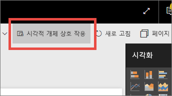

**그림 34: 시각적 개체 상호 작용**

그런 다음, 페이지에 있는 각각의 시각적 개체에 대해 선택한 시각적 개체로 필터링이나 강조 표시를 할지 또는 아무것도 하지 않을지를 결정합니다. 일부 시각적 개체는 강조 표시할 수 없습니다. 강조할 수 없는 시각적 개체의 경우 강조 표시 컨트롤을 사용할 수 없습니다. 자세한 내용은 [Power BI의 시각적 개체 상호 작용](../consumer/end-user-interactions.md)을 참조하세요.

> [!TIP]
> Power BI를 처음 접하는 독자에게는 보고서를 선택하고 상호 작용하는 기능이 바로 명확해 보이지 않을 수 있습니다. 선택하면 더 많은 인사이트가 표시되는 항목을 독자들이 할 수 있도록 텍스트 상자를 추가합니다.

#### <a name="the-use-of-color-in-visuals"></a>시각적 개체에 색 사용

앞서 이 문서에서 보고서 전반에 대한 색 사용 계획의 중요성을 언급했습니다. 이 섹션은 겹치는 내용을 일부 포함하지만 주로 개별 시각적 개체에 색을 사용하는 방식을 설명합니다. 같은 원칙이 적용됩니다. 다시 말해, 보고서를 함께 연결하고, 중요한 데이터를 강조하고, 시각적 개체에 대한 독자의 이해도를 향상하기 위해 색을 사용합니다. 다른 색이 너무 많이 있으면 산만해 보입니다. 독자들이 어디를 봐야 할지 알아내기 어렵게 만듭니다. 미관을 위해 이해도를 희생하지 말아야 합니다. 이해도를 높이는 경우에만 색을 추가해야 합니다.

> [!TIP]
> 대상 및 색의 내재적 규칙을 알아야 합니다. 예를 들어 미국의 경우 녹색은 일반적으로 “양호함”을 빨간색은 일반적으로 “잘못됨”을 의미합니다.

다음 섹션은 아래와 같이 구성됩니다.

* 데이터 색

* 데이터 레이블 색

* 범주 값에 대한 색

* 숫자 값에 대한 색

##### <a name="use-colors-to-highlight-interesting-data"></a>색을 사용하여 흥미로운 데이터 강조 표시

색을 사용하는 가장 간단한 방법은 주의를 끌도록 데이터 요소의 색을 하나 이상 변경하는 것입니다. 이 예제에서는 하계 및 동계 올림픽을 번갈아 표시하도록 올림픽을 4년 주기에서 2년 주기로 변경하면 색이 변합니다.


**그림 35: 색을 사용하여 스토리 전달하기**

**서식** 창의 **데이터 색** 탭에서 데이터 요소 색을 변경할 수 있습니다. 각 데이터 요소를 개별적으로 사용자 지정하려면 **모두 표시**가 **켜기**로 설정되어 있어야 합니다.

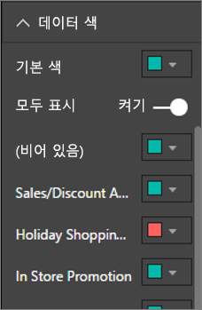

**그림 36: 데이터 요소 색 설정**

> [!NOTE]
> Power BI는 보고서 시각적 개체에 기본 테마를 적용합니다. 디자이너는 다양성과 대비를 제공하도록 테마 색을 선택했습니다. 기본 테마 색상표를 다른 색으로 전환하려면 **사용자 지정 색**을 선택합니다.
>
> 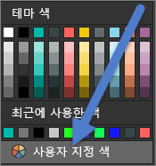
>
> **그림 37: 사용자 지정 색 선택**

Power BI Desktop에서 두 번째 계열을 사용하면 **이상값** 또는 선의 일부를 강조 표시할 수 있습니다.


**그림 38: Power BI Desktop을 사용하여 이상값 그리기**

여기서 **이상값** 계열의 값은 8월 평균 기온이 60도 아래로 떨어진 경우에만 존재합니다. 이 작업을 위해 다음 수식을 사용하여 DAX 계산 열을 만들었습니다.

```
Outliers = if(Editions[Temp]<60, Editions[Temp], BLANK())
```

예제의 경우 세 개의 이상값은 **1952**, **1956** 및 **2000**입니다.

##### <a name="colors-for-labels-and-titles"></a>레이블 및 제목 색

사용할 수 있는 모든 서식 옵션을 살펴보다 보면 제목과 범례에 색을 추가할 수 있는 위치를 많이 찾을 수 있습니다. 예를 들어 데이터 레이블과 축 제목 색을 변경할 수 있습니다. 그래도 주의해야 합니다. 일반적으로 모든 시각적 개체 제목에 동일한 색을 사용하는 것이 좋습니다. 이 문서에 있는 다른 지침처럼 규칙을 깰만한 상황과 이유는 항상 존재합니다. 규칙을 깨기로 한다면 합당한 이유가 있어야 합니다.

##### <a name="colors-for-categorical-values"></a>범주 값에 대한 색

계열이 포함된 차트에는 일반적으로 범례에 범주 값이 포함되어 있습니다. 예를 들어 아래 범례에 있는 각각의 색은 다른 범주의 국가/지역을 나타냅니다.


**그림 39: 기본 색 적용**

디자이너는 Power BI에서 범주 값을 쉽게 구분하기 좋은 색 분판을 제공하기 위해 사용하는 기본 색을 선택했습니다. 이 색을 회사 계획 등에 맞춰 변경하는 경우가 있지만 이로 인해 문제가 발생할 수 있습니다.


**그림 40: 단색의 색조로 색 적용**

단색조만 사용하여 다양한 농도의 색이 적용되어 있는 시각적 개체는 범주의 순서에 관해 잘못된 생각을 유발합니다. 거품 색이 어두울수록 색조가 밝은 거품보다 규모가 더 크거나 작을 것이라는 암시를 줍니다. 사전순 정렬과 달리 이러한 종류의 범주 값에는 일반적으로 내재적 순서가 없습니다.

기본 색을 변경하려면 을 선택하여 **서식** 창을 열고 **데이터 색**을 선택합니다.

##### <a name="colors-for-numerical-values"></a>숫자 값에 대한 색

내재적 순서와 숫자 값이 없는 필드에 대해서도 값에 따라 데이터 요소에 색을 설정할 수 있습니다. 값에 따라 데이터 요소에 색을 설정하면 데이터에서 값의 분포를 표시하는 데 유용하고 Power BI가 하나의 차트에 두 가지 변수를 표시할 수도 있습니다. 다음 차트는 메달 수는 중국이 가장 많지만 일본과 태국이 올림픽에 더 많이 참가했다는 것을 명확하게 보여 줍니다.


**그림 41: 값에 따른 데이터 요소 색**

이 차트를 만들려면:

1. 시각적 개체를 선택하여 활성화합니다.

1. 을 선택하여 **서식** 창을 엽니다.

1. **데이터 색** > 옵션 > **조건부 서식**을 선택합니다.

    

    **그림 42: 조건부 서식 선택**

1. **기본 색 - ‘데이터 색’** 대화 상자에서 해당 색을 조정합니다. 

    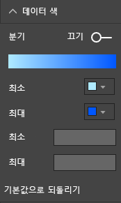

    **그림 43: 채도에 사용된 색 조정**

색을 사용하여 가운데 값 주위의 분산을 강조할 수도 있습니다. 예를 들어 양수 값은 녹색 음수 값은 빨간색을 지정합니다. 양수 또는 음수 값에 색을 할당하는 경우 문화적 차이를 고려해야 합니다. 모든 문화권이 잘못된 곳에 빨간색을 사용하고 양호한 곳에 녹색을 사용하는 것은 아닙니다.


**그림 44: 가운데 값 주위의 분산을 강조하는 색**

### <a name="principles-of-visual-design--applied-to-example-report-page"></a>시각 디자인의 원칙 – 예제 보고서 페이지에 적용됨

이제 위에서 언급한 시각 디자인 원칙을 샘플 보고서에 적용하겠습니다.


**그림 45: 예제 보고서(전)**


**그림 46: 예제 보고서(후)**

#### <a name="what-did-we-do"></a>수행한 작업

| 항목 | 설명 |
| ---- | ----------- |
| 슬라이서 | 페이지 수준 필터를 추가하고 **Gold**, **Silver**, **Bronze**만 선택하여 슬라이서에서 공백을 제거했습니다. <br> **단일 선택** 및 **모두 선택**에 대한 **선택 컨트롤**을 **끄기**로 변경했습니다. |
| 거품형 | 범례에 항목이 너무 많아서 화면을 스크롤해야 했습니다. 범례를 제거하고 대신 **범주 레이블**을 사용했습니다. 거품을 가리키면 세부 사항을 볼 수 있습니다.<br> 제목을 줄였고 “by country region”(국가 지역별)이 없어도 의미가 명백하기 때문에 제거했습니다. <br> 차트를 이해하기 쉽도록 두 축의 레이블을 모두 **켜기**로 설정했습니다. |
| 등치 지역도 | **데이터 색**이 더 두드러져 보이도록 변경했습니다. <br> **분기**를 설정했고 **최소값**을 분홍으로 **최대값**을 빨강으로 설정했습니다.
| 트리맵 | 미국용으로만 설정되어 있던 필터를 제거했습니다. <br> **데이터 레이블**을 소수 자릿수 하나로 설정합니다. <br> 시각적 개체에 **클래스** 필드를 사용했었지만 세 가지 메달(Gold, Silver, Bronze)에 대해 거의 항상 33%이기 때문에 유용하지 않았습니다. <br> 이와 달리 보다 흥미로운 필드인 **성별**을 선택했습니다. 디자인을 위해 수상 경기는 파란색 육상 경기는 회색으로 변경했습니다.
| 위쪽 가로 막대형 차트 | 제목을 줄이고, 데이터 레이블을 제거하고, 범례 제목을 껐습니다. <br> 제목의 단어 순서가 아래 차트와 일치하도록 변경했습니다.
| 아래쪽 가로 막대형 차트 | 위 차트와 일치하도록 연도를 기준으로 오름차순으로 정렬했습니다. <br> 클래스가 일치하도록 색을 변경했습니다. <br> 제목을 변경했습니다. <br> 데이터 공간을 더 확보하기 위해 범례를 해제했습니다. <br> 데이터 레이블을 켰습니다. 레이블을 읽기에 시각적 개체가 너무 작아서 보고서에 표시되지 않습니다. 독자가 시각적 개체를 **포커스** 모드에서 열면 표시됩니다. [포커스 모드](../consumer/end-user-focus.md)를 알아봅니다. <br> **도구 설명**에 **이벤트 수**를 추가했습니다. 이제 누적 세로 막대형을 가리키면 해당 연도에 사람들이 경쟁한 이벤트의 수가 도구 설명에 표시됩니다. |
| 시각적 개체 상호 작용 | 항상 전체 경기와 스포츠가 표시되도록 하기 위해서 두 카드의 상호 작용을 해제했습니다. |

## <a name="visual-types-and-best-practices"></a>시각적 개체 유형 및 모범 사례

Power BI는 다양한 기본 시각적 개체를 제공합니다. Microsoft와 Power BI 커뮤니티에서 사용할 수 있는 사용자 지정 시각적 개체를 추가하면 전체 옵션이 문서화하기 어려울 만큼 너무 많아집니다. 가장 많이 사용되는 기본 시각적 개체 유형 중 일부에 대해 살펴보겠습니다.

### <a name="line-charts"></a>꺽은선형 차트


꺽은선형 차트는 시간에 따른 데이터를 검토할 수 있는 강력한 방식입니다. 데이터를 표로 보는 경우에는 사람의 눈이 최고, 최저, 주기, 패턴 등을 포착하는 속도를 별로 활용하지 못합니다. 아래 예제는 수여된 메달의 수와 메달을 딴 운동 선수의 수에 관한 추세를 보여줍니다.


**그림 47: 꺾은선형 차트**

#### <a name="best-practices"></a>모범 사례

* 꺾은선형 차트를 처음 볼 때 눈에 띄는 것은 곡선의 모양입니다. 따라서 시간 또는 분포 범주와 같이 곡선에 의미를 부여하는 X축이 있어야 합니다. 제품이나 지리와 같은 범주 필드를 X축에 설정하면 꺾은선형 차트에 대한 흥미가 떨어집니다. 곡선의 셰이프는 의미 있는 정보를 제공하지 않습니다.

* 이처럼 차트 여러 개를 서로 위아래에 배치하는 경우 계열 사이의 비교가 쉽도록 X축에 맞춰서 배열합니다. 필터를 사용하여 Power BI가 동일한 범위의 값을 표시하도록 합니다. 날짜 범위를 검토하는 경우 날짜 범위가 같게 해야 합니다. 예를 들어 모든 차트가 1896 ~ 2012여야 합니다.

* 공간을 충분히 활용합니다. 데이터에 적합한 경우 차트에서 위쪽과 아래쪽 빈 공간을 없애기 위해 Y축의 **시작** 및 **끝** 지점을 설정합니다. 또한 시각적 개체가 실제 데이터 요소로 시선을 끌도록 도와줍니다. **시작** 및 **끝** 지점을 설정하려면:

  1. 시각적 개체를 선택하여 활성화합니다.

  1. 을 선택하여 **서식** 창을 엽니다.
  
  1. **Y축** 영역을 확장하고 **시작**점과 **끝**점을 설정합니다.
  
      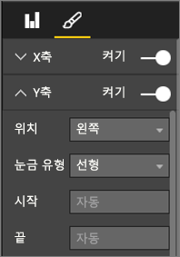
  
      **그림 48: 시작 및 끝 지점 설정**

* **시작** 및 **끝** 지점을 명시적으로 설정해야 하는 또 다른 이유는 동일한 Y축 필드를 사용하여 같은 페이지에서 둘 이상의 차트를 비교하는 경우입니다. 예를 들어 누적 이벤트 수를 볼 때 영국이 1~70개이고 오스트레일리아가 1~12개이면 두 가지 꺾은선형 차트는 서로 다른 Y축을 표시하게 됩니다(그림 49). 이렇게 하면 한눈에 비교하기가 어려워집니다. 이렇게 하지 않고 동일한 Y축 범위를 사용하도록 차트를 설정합니다(그림 50).
  
  
  
  **그림 49: Y축이 다른 꺾은선형 차트**
  
  
  
  **그림 50: Y축이 일치하는 꺾은선형 차트**

자세한 내용은 다음을 참조하세요.

* [X축 및 Y축 속성 사용자 지정](power-bi-visualization-customize-x-axis-and-y-axis.md)

* [Line Graphs and Irregular Intervals: An Incompatible Partnership](http://www.perceptualedge.com/articles/visual_business_intelligence/line_graphs_and_irregular_intervals.pdf)(꺾은선형 그래프 및 불규칙한 간격: 호환되지 않는 파트너십)

* [Data Visualization 101: Line Charts](http://www.columnfivemedia.com/data-visualization-101-line-charts)(데이터 시각화 101: 꺾은선형 차트)

### <a name="bar-and-column-charts"></a>가로 막대형 및 세로 막대형 차트


꺾은선형 차트가 시간에 따른 데이터를 표시하는 표준이라면 가로 막대형 차트는 다양한 범주의 특정 값을 표시하는 표준입니다. 수를 기준으로 가로 막대를 정렬하면 최고값과 분포를 바로 볼 수 있습니다. 가로 막대형 차트는 긴 레이블과 어울립니다.


**그림 51: 가로 막대형 차트**

#### <a name="best-practices"></a>모범 사례

* 값에 대한 데이터 레이블을 표시합니다. 이렇게 하면 특정 값을 식별하기 쉬워집니다. 데이터 레이블을 표시하려면: 

  1. 시각적 개체를 선택하여 활성화합니다.

  1. 을 선택하여 **서식** 창을 엽니다.
  
  1. **데이터 레이블**을 **켜기**로 설정합니다.

      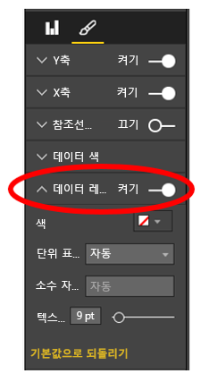

      **그림 52: 데이터 레이블 설정**

* 위의 가로 막대형 차트는 단일 시점의 많은 측정값에 대해 하나의 측정값을 비교하는 데 유용합니다. 꺾은선형 차트는 시간에 따른 추세를 보여 주는 반면 가로 막대형 차트는 특정 시점의 단일 범주에 대한 추세를 보여 줍니다. 얼핏 보면 가로 막대형 차트는 스페인이 24.70%라는 세계 최악의 실업률을 갖는 것을 보여 줍니다.

* 가로 막대형 또는 세로 막대형 차트가 할당된 공간에 맞지 않는 경우에는 Power BI에서 스크롤 막대가 추가됩니다. 가능한 경우, 타당하다면, 전체 차트를 표시하도록 시각적 개체와 보고서를 배열합니다. 이렇게 하면 독자가 전체 분포에 대한 개요를 볼 수 있습니다. 안타깝지만 예제에는 전 세계 국가의 수가 너무 많아서 이렇게 하는 것이 불가능합니다.

  포함된 값을 제한하는 한가지 방법은 필터를 사용하는 것입니다. 예를 들어 실업률이 20%를 초과하는 경우에만 국가를 보여 주는 **시각적 개체 수준** 필터를 추가합니다.

* 가로 막대형 및 세로 막대형 차트를 드릴다운하고 다시 백업할 수 있습니다. 이렇게 하면 공간을 더 차지하지 않고도 시각적 개체에 더 많은 정보를 넣을 수 있습니다. 아래 예제에는 지역 > 국가라는 계층이 있습니다. 지역 막대를 두 번 클릭하면 해당 지역을 구성하는 국가로 드릴다운됩니다. 드릴 모드에 대한 자세한 내용은 [Power BI의 시각화 드릴 모드](../consumer/end-user-drill.md)를 참조하세요.
  
  
  
  **그림 53: 드릴다운**

가로 막대형 차트 및 세로 막대형 차트에 대한 자세한 내용:

* [Data Visualization 101: Bar Charts](http://blog.newscred.com/article/data-visualization-101-bar-charts)(데이터 시각화 101: 가로 막대형 차트)

* [Data Visualization Catalog: 가로 막대형 차트](http://www.datavizcatalogue.com/methods/bar_chart.html#.VYV-hY3bLJw)

* [Data Visualization Catalog: 다중 집합 가로 막대형 차트](http://www.datavizcatalogue.com/methods/multiset_barchart.html#.VYV_gI3bLJw)

### <a name="stacked-bar-and-column-charts"></a>누적 가로 막대형 및 세로 막대형 차트


가로 막대 또는 세로 막대 안에 다양한 범주를 쌓아 올려서 가로 막대형 및 세로 막대형 차트에 다른 차원을 추가합니다. 이제 차트는 한 가지 전반적인 추세(높이 및 길이를 기반으로)에 대한 정보를 전달할 뿐만 아니라 추세에 대한 범주의 영향력도 보여 줍니다. 다음 차트는 2014년 수익이 60억 달러를 초과하는 우수 축구 팀 수익의 전반적인 증가를 보여 줍니다.


**그림 54: 누적 세로 막대형 차트**

누적 세로 막대형 차트는 시간에 따라 **총수익**이 증가하고 **광고** 및 **방송** 범주가 시간에 따라 꾸준히 증가하여 전반적인 수익 증가에 기여하는 것을 보여 줍니다. 하지만 이런 차트에서는 세 가지 범주가 서로에게 미치는 영향을 비교하기가 쉽지 않습니다. 예를 들어 “방송이나 경기일 증가 대비 광고 증가는 어떤가요?” 이 데이터에 맞는 선택 또는 시각적 데이터는 꺾은선형 차트입니다.

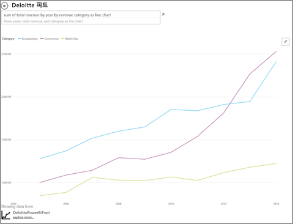

**그림 55: 꺾은선형 차트로 변환**

꺾은선형 차트에서는 광고 수익이 가장 많이 증가하고 방송 및 경기일 수익이 그 뒤를 따른다는 것을 쉽게 볼 수 있습니다.

#### <a name="best-practices"></a>모범 사례

* 가로 막대형 및 세로 막대형 차트의 경우, 가로 또는 세로로 표시할 수 있는 옵션이 있습니다. 레이블이 긴 경우에는 가로가 적합하며 시계열 데이터가 있는 경우에는 세로가 적합합니다.

* 시간에 따른 추세 및 다른 변화 패턴을 표시하려면 누적 가로 막대형 및 세로 막대형 차트를 사용하지 않는 것이 좋습니다. 꺽은선형 차트와 같은 다른 차트가 훨씬 더 적합합니다.

* 총 볼륨을 기준으로 또는 총비율로 분포를 표시할 수도 있습니다.

* Few는 다음과 같이 언급했습니다.

    > *“...누적 가로 막대형 차트의 세그먼트는 비교하기가 어렵습니다. 세그먼트를 나란히 정렬했고 모두가 같은 기준선에서 위쪽으로 증가한다면 높이를 비교하는 것이 쉬울 수 있지만 서로 누적된 경우에는 비교하기가 어렵습니다. 또, 월별로 (수익이) 변화하는 것을 보기는 꽤 쉽지만 다른 (범주의) (수익이) 변화하는 것을 보기는 매우 어렵습니다*.

* 100% 누적 차트는 백분율을 사용하는 경우에 매우 적합합니다. 아래 예제에서는 팀별 범주 분포를 볼 수 있습니다. 백분율은 상대적이며 패턴을 한눈에 보는 것이 가능합니다. Everton의 수익은 주로 방송(70% 이상)에서 발생하지만 PSG의 경우 방송에서 발생하는 수익은 20%뿐입니다. 가로로 표시하도록 선택하면 팀 레이블을 표시하기 쉽고 수익 유형의 영향을 보기 쉽습니다.

  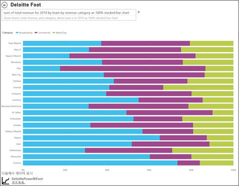

  **그림 56: 가로 누적 차트**

누적 차트에 대한 자세한 내용:

* [Data Visualization Catalog: Stacked Bar Graphs](http://www.datavizcatalogue.com/methods/stacked_bar_graph.html#top)(데이터 시각화 카탈로그: 누적 가로 막대형 그래프)

* [100% 누적 가로 막대형 그래프는 어떤 경우에 유용한가요?](http://www.perceptualedge.com/blog/?p=2239)(영문)

### <a name="combo-bar-and-column-charts"></a>콤보 가로 막대형 및 세로 막대형 차트


Power BI에서는 세로 막대형 차트와 꺾은선형 차트를 콤보 차트로 결합할 수 있습니다. 선택 항목은 다음과 같습니다. 

* 꺾은선형 및 누적 세로 막대형 차트 

* 꺾은선형 및 묶은 세로 막대형 차트

두 개의 개별적인 시각적 개체를 하나로 결합하면 소중한 캔버스 공간을 절약할 수 있습니다.

다음 두 개의 스크린샷은 전과 후를 보여 줍니다.


 **그림 57: 두 개의 개별적인 차트**

첫 번째 차트에는 두 개의 개별적인 시각적 개체가 있습니다. 세로 막대형 차트는 시간에 따른 인구를 보여 주고 꺾은선형 차트는 시간에 따른 GDP를 보여 줍니다. 이러한 차트는 X축(연도)과 값(2002 ~ 2012)이 같기 때문에 콤보 차트로 만들기에 적합합니다. 시각적 개체 하나에서 두 가지 추세를 비교할 수 있도록 차트를 결합하는 게 좋지 않을까요? 2개 차트를 결합하면 데이터를 더 빠르게 비교할 수 있습니다.


 **그림 58: 단일 콤보 차트**

새 보고서 페이지에는 꺾은선형 및 누적 세로 막대형 차트라는 시각적 개체가 하나 있습니다. 꺾은선형 및 묶은 세로 막대형 차트도 쉽게 만들 수 있었습니다. 이제 두 가지 추세 사이의 관계를 보기가 더 쉬워졌습니다. 2008년까지는 인구와 GDP의 추세가 유사했던 것을 볼 수 있습니다. 하지만 2009년부터 인구 증가가 둔화되고 GDP는 변동이 심해졌습니다.

#### <a name="best-practices"></a>모범 사례

* 콤보 차트는 시각적 개체 양쪽 모두에 공통적인 축이 하나 이상 있는 경우에 가장 적합합니다.

* 축을 주시하세요! 콤보 차트를 읽고 해석하기 쉬운가요? 범위와 값이 다르게 사용되나요? 세로 막대형 차트의 Y축 규모가 꺾은선형 차트의 Y축 규모보다 훨씬 작은 경우에는 콤보 차트를 사용하는 의미가 없습니다. 훨씬 아래쪽에 있는 세 번째 선(바다색)이 그런 경우입니다.

   

   **그림 59: 바람직하지 않은 꺾은선형 차트**

  또한 세로 막대형 차트와 꺾은선형 차트에 두 가지 다른 측정값이 사용된 경우 이중 축을 만들지 않는다면 콤보 차트는 의미가 없습니다. 예를 들어 달러 및 백분율을 축으로 만듭니다. 독자들이 차트를 이해할 수 있도록 두 축을 모두 포함해야 하고 축 레이블도 추가하는 것이 좋습니다.

  이중 축을 만들려면:

    1. 시각적 개체를 선택하여 활성화합니다.

    1. 을 선택하여 **서식** 창을 엽니다.

    1. **Y축**을 확장하고 **보조 표시**를 **켜기**로 설정합니다.

          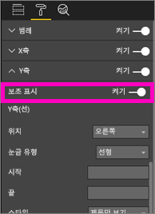

          **그림 60: 보조 축 표시**

    1. **Y축(열)**  > **제목**을 **켜기**로 설정합니다.

    1. **Y축(선)**  > **제목**을 **켜기**로 설정합니다.

  차트의 모양은 다음과 같습니다.

  

  **그림 61: 대신 콤보 차트 만들기**

* 이중 축을 활용해 보세요. 여러 값 범위와 여러 측정값을 비교하기 좋은 방법입니다. 하나의 시각적 개체에서 두 측정값 간의 상관 관계를 보여 주는 데 도움이 됩니다.

자세한 내용은 다음을 참조하세요.

* [Power BI의 콤보 차트](power-bi-visualization-combo-chart.md)

* [Dual-Scaled Axes in Graphs: Are They Ever the Best Solution? ](http://www.perceptualedge.com/articles/visual_business_intelligence/dual-scaled_axes.pdf)(그래프의 이중 규모 축: 가장 좋은 솔루션인가요?)

### <a name="scatter-chart"></a>분산형 차트


많은 변수를 한꺼번에 봐야 하는 경우에는 분산형 차트로 전체적인 그림을 보는 것이 유용합니다. 분산형 차트는 2(분산형) 또는 3(거품형) 정량 측정값 간의 관계를 표시합니다. 분산형 차트에는 항상 가로 축을 따라 하나의 숫자 데이터 집합을 표시하고 세로 축을 따라 다른 숫자 값 집합을 표시하는 두 개의 값 축이 있습니다. 차트에서 x 및 y 숫자 값의 교차점에 점이 표시되고 이러한 값이 단일 데이터 요소로 결합됩니다. Power BI에서는 이러한 데이터 요소를 가로 축에 (불)균등하게 분산할 수 있습니다. 데이터에 따라 다릅니다.

거품형 차트는 데이터 요소를 거품으로 바꾸고 거품 크기로 데이터의 추가 차원을 나타냅니다.

아래 거품형 차트에는 남미 국가별 1인당 GDP(Y축), GDP 합계(X축) 및 인구가 비교되어 있습니다.


**그림 62: 거품형 차트로 표현된 남미 GDP 및 인구**

거품의 크기는 해당 국가의 총 인구를 나타냅니다. 브라질은 인구가 가장 많고(거품 크기) 남아메리카 GDP의 가장 큰 부분을 차지합니다. X축에서 가장 멀리 있습니다. 하지만 우루과이, 칠레 및 아르헨티나의 1인당 GDP는 브라질보다 높습니다. Y축에서 더 위쪽에 있습니다.

재생 축을 추가하면 Hans Rosling처럼 시간에 따른 스토리를 전달할 수 있습니다. 자세한 내용은 [From Data to Insight & Impact: Showing Africa's Progress with Power View and PPI by Microsoft](https://www.youtube.com/watch?v=PbaDBJWCeD4)(데이터를 영향력 있는 인사이트로 전환: Microsoft에서 제공하는 파워 뷰 및 PPI를 사용하여 아프리카의 진행 상황 표시) 동영상을 참조하세요. 재생 축을 추가하려면 Datetime 필드를 **재생 축** 안으로 충분히 끌어옵니다.

#### <a name="best-practices"></a>모범 사례

* 분산형 및 거품형 차트는 스토리를 전달하기에 매우 좋습니다. 하지만 데이터를 탐색하는 경우에는 그다지 유용하지 않습니다. 이와 관련하여 Stephen Few는 다음과 같이 언급합니다.

    > *“이러한 접근 방식의 강점은 스토리 전달에 사용되는 경우에 발휘됩니다. Rosling이 이야기를 하는 동안 차트에서는 계속 거품이 움직이고, 값이 변화하고, 보여주고 싶은 부분을 가리키면서 정보가 살아있는 것을 볼 수 있습니다. 하지만 애니메이션 거품형 차트 자체는 데이터를 탐색하고 그에 대한 이해를 제공하는 데는 훨씬 덜 효과적입니다. 아마도 Rosling은 새로운 스토리를 찾아내기 위해서가 아니라 이미 알려진 스토리를 말하기 위해 이런 방법을 사용한 것 같습니다. 거품이 계속해서 움직이면 한 번에 두 개 이상의 거품에 주의를 기울일 수 없기 때문에 무슨 이야기를 하는지 알아내기 위해 애니메이션을 계속 다시 실행해야 합니다. 거품이 움직인 전체 경로를 볼 수 있도록 선택한 거품에 자취를 추가할 수 있지만 여러 개의 거품에 자취를 사용하면 차트는 곧 너무 혼잡해질 것입니다. 꼭 말하고 싶은 내용은 이런 방식은 탐색 및 분석용 정보를 표시하기에는 좋은 방법이 아니라는 점입니다.*

* 스토리 전달에 도움이 되도록 X축 및 Y축 레이블을 추가합니다. 특히 거품형 차트의 경우 사용되는 구성 요소가 많기 때문에 시각적 개체를 이해하는 데 레이블이 도움이 됩니다.

* 시각적 개체를 해석하기 쉽도록 데이터 레이블을 추가합니다. 특히 거품형 차트의 경우 범례에 항목이 많으면 비슷한 색을 구분하기 어려울 수 있습니다. 위의 시각적 개체에 포함된 수리남, 컬럼비아 및 에콰도르의 범례 색은 비슷합니다.

* 분산형 차트를 만들었는데 X축과 Y축의 모든 값이 집계된 하나의 데이터 요소만 표시되나요? 가로 선이나 세로 선 하나에 차트의 모든 값이 집계되나요? 이 집계를 수정하려면 **세부 정보** 영역에 필드를 추가하고 값을 그룹화하는 방법을 Power BI에 전달합니다. 필드는 그리려는 각 지점에 고유해야 합니다. 도움말은 [Power BI의 분산형 차트 및 거품형 차트 자습서](power-bi-visualization-scatter.md)를 참조하세요.

### <a name="treemap-charts"></a>트리맵 차트


트리맵은 전체를 구성하는 다양한 구성 요소의 상대적 크기에 대한 유용한 개요를 제공하기에 매우 유용합니다. 특히 범주별로 그룹화할 수 있는 경우에는 더 좋습니다. 새로운 비즈니스를 이해하려는 경우에 주요 구성 요소로 구성된 트리맵이 있으면 전반적인 분포를 이해하는 데 유용합니다.

아래 첫 번째 차트를 보면 브라질이 남아메리카 GDP의 약 반을 차지합니다. 또한 콜롬비아와 칠레가 대략 같은 규모라는 것을 알 수 있습니다.

보다 넓은 맥락을 보면서도 상위권 국가의 영향력에 대한 아이디어를 포함하고 싶다고 가정하겠습니다. 지역 내에 범주 멤버(국가)를 중첩해서 시각적 개체 계층 구조를 만들 수 있습니다. 기본적으로 두 번째 트리맵에서는 첫 번째로 지역의 상대적인 크기를 알 수 있습니다. 각 지역 내에서 어떤 국가가 상위권에 있는지 볼 수 있습니다. 세 곳의 커다란 지역인 유럽, 아시아 및 북아메리카가 보입니다. 이 지역 내에서 상위권 국가/지역을 쉽게 볼 수 있습니다.

트리맵의 주요 한계는 더 작은 사각형을 비교하기 어렵다는 점입니다. 개요를 보기에는 유용한 차트이지만 여러 구성 요소의 상대적 크기를 보다 정확하게 이해하려면 세로 막대형 차트와 가로 막대형 차트가 더 적합할 수 있습니다.

첫 번째 트리맵은 GDP 규모의 순위를 폭넓게 알려줍니다. 하지만 국가 간의 구체적인 차이를 식별하기는 어려우며, 특히 레이블이 없는 리프의 경우는 더 그렇습니다. 한 가지 그룹화를 비교하는 이 데이터에 대해서는 가로 막대형 또는 세로 막대형 차트가 더 적합할 수 있습니다.

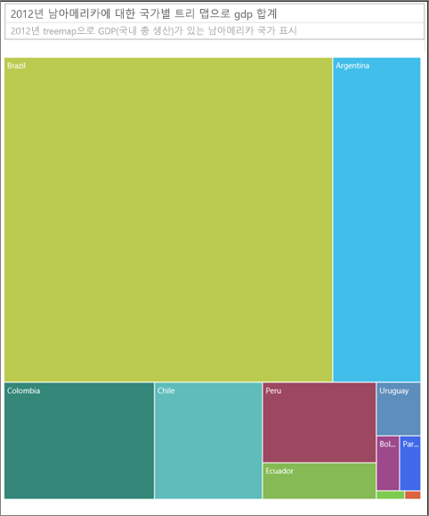

**그림 63: 트리맵으로 남아메리카 GDP 비교**

다음으로, 지역을 다른 데이터 수준으로 추가했습니다. 지역별로 GDP에 대한 전반적인 기여를 확인할 수 있습니다. 또한 지역 내에서 상대적인 영향을 확인할 수 있습니다. 누적되지 않는 측정값(예: 평균)을 사용하여 이 작업을 수행하면 세부 정보의 합계가 집계 수준의 실제 값을 나타내지 않을 수 있다는 점에 유의해야 합니다.


**그림 64: 트리맵에 표시된 지역 및 국가별 GDP**

트리맵에 대한 자세한 내용은 다음을 참조하세요.

* [Discovering Business Intelligence Using Treemap Visualizations](http://www.perceptualedge.com/articles/b-eye/treemaps.pdf)(트리맵 시각화를 사용하여 비즈니스 인텔리전스 검색)

* [Data Visualization Catalog: Treemap](http://www.datavizcatalogue.com/methods/treemap.html#.VYhylI3bL7Y)(데이터 시각화 카탈로그: 트리맵)

### <a name="other-charts"></a>기타 차트

#### <a name="pie-or-donut-charts"></a>원형 차트 또는 도넛형 차트


일반적으로 가로 막대형, 세로 막대형 및 꺾은선형 차트가 대부분의 용도에 적합합니다. 원형 차트와 도넛형 차트는 제대로 해석하기 어렵다는 사실은 잘 알려져 있습니다. 실제로 데이터를 왜곡하기도 합니다. 가능한 경우 사용을 피하는 것이 좋습니다. Stephen Few의 [Save the Pies for Dessert](https://www.perceptualedge.com/articles/08-21-07.pdf)(디저트를 위한 파이(원형) 저장)에는 이에 관한 역사와 위험성이 훌륭하게 저술되어 있습니다.

Stephen은 원형 차트가 유용할 수 있는 경우, 즉 전체와 부분의 관계를 비교하는 경우를 설명합니다. 100% 기준 누적 가로 막대형 차트보다 더 유용한 경우는 드뭅니다.

[Darkhorse Analytics 사이트](http://www.darkhorseanalytics.com/blog/salvaging-the-pie)에서 원형 차트에 관한 재미있는 다른 문서(및 애니메이션)를 찾을 수 있습니다.

#### <a name="radial-gauges--kpis"></a>방사형 계기 및 KPI


방사형 계기는 목표 대비 성과를 나타내기 좋은 시각적 개체이며 임원 대시보드에서 인기가 좋습니다. 하지만 두 가지 주요 문제가 있습니다. 원형 차트에서처럼 전체 180도 또는 목표선 대비 채워진 부분의 각도를 해석하기가 어렵습니다. 한 가지 메트릭을 표시하려고 많은 공간을 사용합니다.

이에 대한 좋은 대안은 간단한 KPI 시각적 개체입니다.


KPI는 값, 상태, 목표, 목표와의 차이 및 추세를 같은 크기의 공간에 표시합니다. 목표를 달성하지 못하면 녹색이 빨간색으로 변하고 데이터가 중간 목표를 달성하면 노란색이 될 수도 있습니다. 계기보다 훨씬 쉽게 읽고 해석할 수 있습니다.

자세한 내용은 다음을 참조하세요.

* [Power BI의 방사형 계기 차트](power-bi-visualization-radial-gauge-charts.md)

* [KPI 시각적 개체](power-bi-visualization-kpi.md)

## <a name="conclusion"></a>결론

이제 이러한 모범 사례를 테스트할 차례입니다. 자신만의 모범 사례를 공유해 주세요. 권장 사항에 그냥 동의하지 마세요. 아니면 규칙을 깰만한 좋은 이유를 찾으셨나요? 그런 경험도 알려 주시면 감사하겠습니다.

궁금한 점이 더 있나요? [Power BI 커뮤니티를 이용하세요.](http://community.powerbi.com/)

### <a name="book-recommendations"></a>권장 도서

요즘은 팀에서 시각 디자인 기법에 대한 지식을 새롭게 하도록 공부하기 좋은 책이 많이 있습니다. Stephen Few의 *Information Dashboard Design*은 필독 도서입니다. 또한 *Show Me the Numbers* 및 *Now You See It*이라는 책에는 내용이 매우 자세하고 심층적으로 다루어져 있습니다. Few를 비롯한 여러 사람들에게 영감을 준 Edward R. Tufte가 저술한 The Visual Display of Quantitative Information 은 이 분야의 고전으로 통합니다.  Tufte는 Visual Explanations, Envisioning Information 그리고 Beautiful Evidence 라는 책도 저술했습니다.    Andy Kirk의 신간 도서 *Data Visualization: A Handbook for Data Driven Design* 역시 대단히 유용합니다. 그 외 추천할만한 작가로는 Lachlan James, William McKnight, Boris Evelson(Forrester), Darkhorse Analytics 등이 있습니다.
