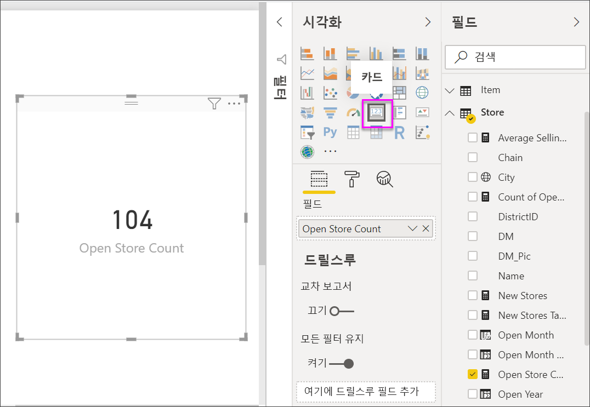
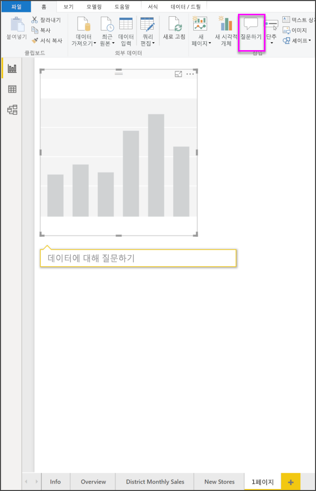
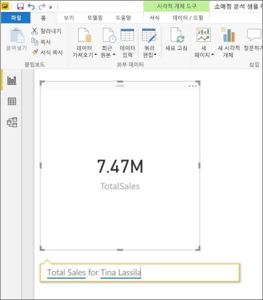
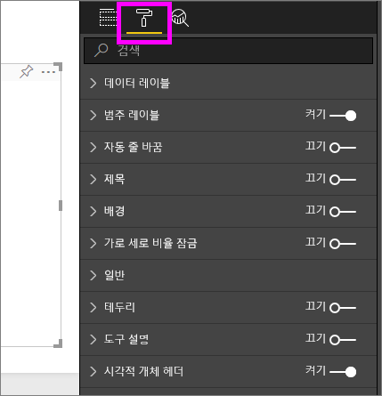
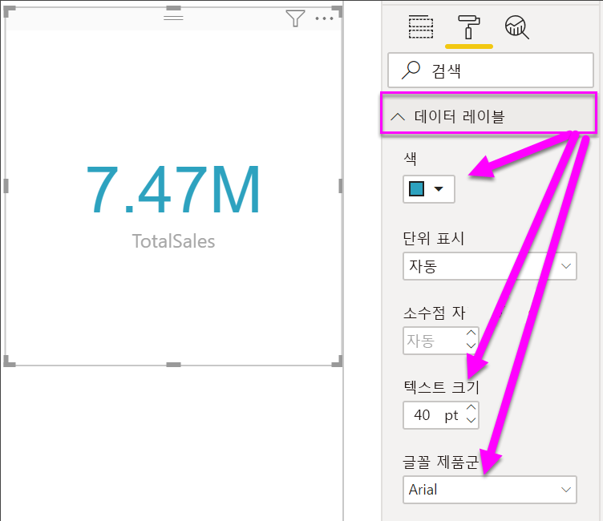
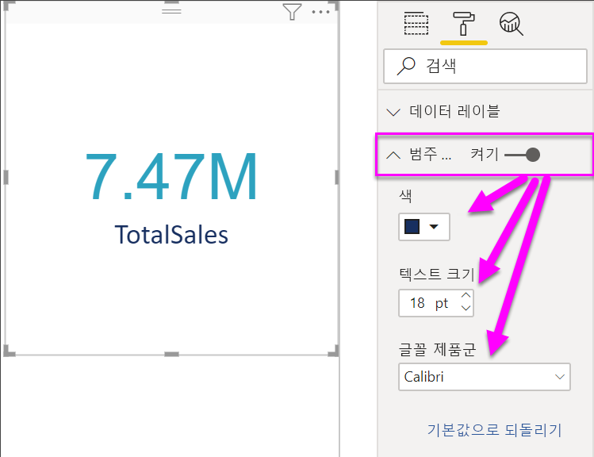
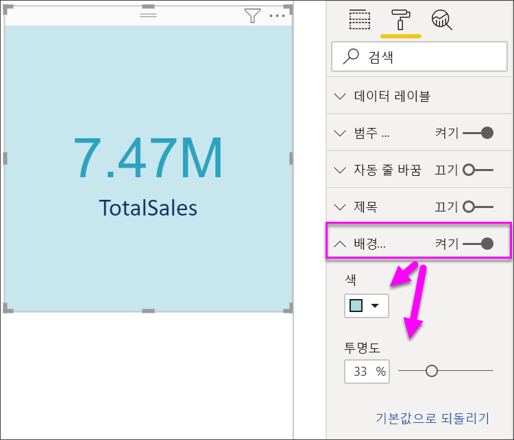

# 카드 시각화

[!INCLUDE [power-bi-visuals-desktop-banner](../includes/power-bi-visuals-desktop-banner.md)]

Power BI 대시보드 또는 보고서에서 총 매출, 연간 시장 점유율, 총 영업 기회와 같이 한 가지 가장 중요한 숫자만 추적하려는 경우가 있습니다. 이 시각화 유형을 *카드*라고 합니다. 거의 모든 네이티브 Power BI 시각화와 마찬가지로 카드도 보고서 편집기 또는 질문과 대답을 사용하여 만들 수 있습니다.

## 필수 조건

이 자습서는 [소매점 분석 샘플 PBIX 파일](https://download.microsoft.com/download/9/6/D/96DDC2FF-2568-491D-AAFA-AFDD6F763AE3/Retail%20Analysis%20Sample%20PBIX.pbix)을 사용합니다.

1. 메뉴 모음의 왼쪽 위 섹션에서 **파일** \> **열기**를 선택합니다.
   
2. **소매점 분석 샘플 PBIX 파일**을 찾습니다.

1. **소매점 분석 샘플 PBIX 파일**을 보고서 보기 으로 엽니다.

1. 선택  탭을 선택합니다.

## 옵션 1: 보고서 편집기를 사용하여 카드 만들기

카드를 만드는 첫 번째 방법은 Power BI Desktop에서 보고서 편집기를 사용하는 것입니다.

1. 빈 보고서 페이지에서 시작하고 **Store** \> **Open Store Count** 필드를 선택합니다.

    Power BI에서 하나의 숫자가 포함된 열 차트를 만듭니다.

   

2. 시각화 창에서 카드 아이콘을 선택합니다.

   

이렇게 해서 보고서 편집기를 사용하여 카드를 만들었습니다. 다음은 카드를 만드는 두 번째 방법, 즉 질문 및 답변 질문 상자를 사용하는 방법입니다.

## 옵션 2: 질문 및 답변 질문 상자에서 카드 만들기
질문 및 답변 상자는 카드를 만들 때 사용하는 또 다른 옵션입니다. 질문 및 답변 상자는 Power BI Desktop 보고서 보기에서 사용할 수 있습니다.

1. 빈 보고서 페이지에서 시작합니다.

1. 창 가장 위에서 **질문하기** 아이콘을 선택합니다. 

    Power BI가 해당 질문에 대한 카드와 상자를 만들어 줍니다. 

   

2. 예를 들어, 질문 상자에 “티나의 총판매량”을 입력합니다.

    질문 상자는 제안 기능과 설명을 통해 질문 과정을 도와주며, 마지막으로 총 수를 표시합니다.  

   

   

이렇게 해서 질문 및 답변 질문 상자를 사용하여 카드를 만들었습니다. 다음은 필요에 맞게 카드에 서식을 지정하기 위한 단계입니다.

## 카드 서식 지정
레이블, 텍스트, 색상 등을 변경하는 다양한 옵션이 있습니다. 옵션을 알아보는 가장 좋은 방법은 카드를 만든 다음, 서식 창을 살펴보는 것입니다. 다음은 사용 가능한 서식 옵션 중 몇 가지입니다. 

서식 창은 보고서에서 카드와 상호 작용할 때 사용할 수 있습니다. 

1. 먼저 페인트 롤러 아이콘을 선택하여 서식 창을 엽니다. 

    

2. 카드를 선택한 상태에서 **데이터 레이블**을 확장하고 색, 크기 및 글꼴 패밀리를 변경합니다. 수천 개의 매장이 있는 경우 **표시 단위**를 사용하여 천 단위까지 매장 수를 표시하고 소수 자릿수도 제어할 수 있습니다. 예를 들어 125,832.00 대신 125.8K로 표시합니다.

    

3.  **범주 레이블**을 확장하고 색과 크기를 변경합니다.

    

4. **배경**을 확장하고 슬라이더를 설정으로 이동합니다.  이제 배경색과 투명도를 변경할 수 있습니다.

    

5. 카드가 원하는 대로 정확하게 표시될 때까지 서식 옵션을 계속 살펴봅니다. 

## 고려 사항 및 문제 해결
질문 상자가 전혀 표시되지 않으면 시스템 또는 테넌트 관리자에게 문의합니다.    

## 다음 단계
[Power BI의 콤보 차트](power-bi-visualization-combo-chart.md)

[Power BI의 시각화 유형](power-bi-visualization-types-for-reports-and-q-and-a.md)
