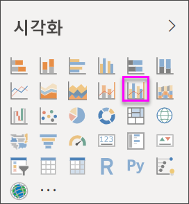
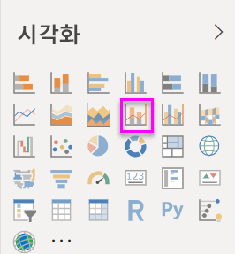
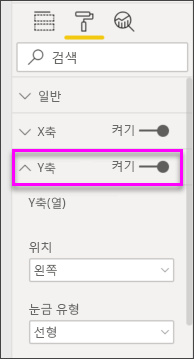
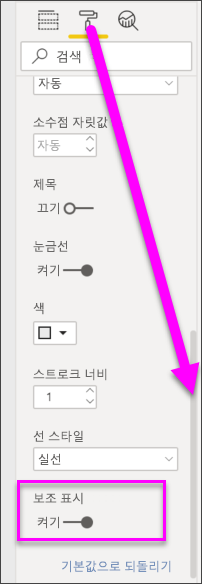

# Power BI의 콤보 차트

[!INCLUDE [power-bi-visuals-desktop-banner](../includes/power-bi-visuals-desktop-banner.md)]

Power BI 콤보 차트는 꺾은선형 차트와 세로 막대형 차트를 결합한 단일 시각화 요소입니다. 2개 차트를 하나로 결합하면 데이터를 더 빠르게 비교할 수 있습니다.

콤보 차트에는 하나 또는 두 개의 Y축이 있을 수 있습니다.

## 콤보 차트를 사용하는 경우
다음과 같은 경우 콤보 차트를 사용하는 것이 좋습니다.

* X축이 동일한 꺾은선형 차트와 세로 막대형 차트가 있는 경우
* 여러 값 범위와 여러 측정값을 비교하는 경우
* 두 측정값 간의 상관관계를 하나의 시각화에 보여주는 경우
* 하나의 측정값이 다른 측정값으로 정의된 목표를 충족하는지 확인하는 경우
* 캔버스 공간을 절약하려는 경우

### 필수 조건
이 자습서는 [소매점 분석 샘플 PBIX 파일](http://download.microsoft.com/download/9/6/D/96DDC2FF-2568-491D-AAFA-AFDD6F763AE3/Retail%20Analysis%20Sample%20PBIX.pbix)을 사용합니다.

1. 메뉴 모음의 왼쪽 위 섹션에서 **파일** > **열기**를 선택합니다.
   
2. **소매점 분석 샘플 PBIX 파일**을 찾습니다.

1. **소매점 분석 샘플 PBIX 파일**을 보고서 보기 으로 엽니다.

1. 선택  탭을 선택합니다.

## 기본, 단일 축, 콤보 차트 만들기
Will이 판매 및 샘플 마케팅을 사용하여 콤보 차트를 만드는 과정을 시청합니다.
   > [!NOTE]
   > 이 비디오에서는 이전 버전의 Power BI Desktop을 사용합니다.
   > 
   > 
<iframe width="560" height="315" src="https://www.youtube.com/embed/lnv66cTZ5ho?list=PL1N57mwBHtN0JFoKSR0n-tBkUJHeMP2cP" frameborder="0" allowfullscreen></iframe>  

1. 빈 보고서 페이지에서 시작하여 올해의 판매액 및 총 수익을 월별로 표시하는 세로 막대형 차트를 만듭니다.

    a.  필드 창에서 **Sales** \> **This Year Sales** > **Values**를 선택합니다.

    b.  **Sales** \> **Gross Margin This Year**을 **값** 영역에 끌어다 놓습니다.

    c. **Time** \> **FiscalMonth**를 선택하여 **축** 영역에 추가합니다.

    
5. 시각화의 오른쪽 위 모서리에 있는 줄임표(...)를 선택하고 **정렬 기준 > FiscalMonth**를 선택합니다. 정렬 순서를 변경하려면 줄임표를 다시 선택하고 **오름차순 정렬** 또는 **내림차순 정렬**을 선택합니다. 이 예제에서는 **오름차순 정렬**을 사용합니다.

6. 세로 막대형 차트를 콤보 차트로 변환합니다. 사용 가능한 두 가지 콤보 차트는 다음과 같습니다: **꺾은선형 및 누적 세로 막대형** 및 **꺾은선형 및 묶은 세로 막대형**. 세로 막대형 차트를 선택한 상태로 **시각화** 창에서 **꺾은선형 및 묶은 세로 막대형 차트**를 선택합니다.

    
7. **필드** 창에서 **Sales** \> **Last Year Sales**를 **꺾은선형 값** 버킷으로 끌어다 놓습니다.

   

   콤보 차트가 다음과 같이 표시됩니다.

   

## 두 개의 축이 있는 콤보 차트 만들기
이 작업에서는 총 수익과 매출을 비교하겠습니다.

1. **회계 월별** **Gross Margin Last Year(%)** 를 추적하는 새로운 꺾은선형 차트를 만듭니다. **월별** 및 **오름차순** 기준으로 정렬하려면 줄임표를 선택합니다.  
1월에는 GM%가 35%였고, 4월에 45% 고점에 도달했으며, 7월에 감소하고, 8월에 다시 고점에 도달했습니다. 작년과 금년의 매출 패턴이 유사할까요?

   
2. **This Year Sales > Value** 및 **Last Year Sales**를 꺾은선형 차트에 추가합니다. **Gross Margin Last Year(%)** 의 눈금은 **Sales** 눈금보다 훨씬 작기 때문에 비교하기가 어렵습니다.      

   
3. 보다 쉽게 읽고 해석 가능한 시각적 개체를 만들려면 꺾은선형 차트를 꺾은선형 및 누적 세로 막대형 차트로 변환합니다.

   

4. **Gross Margin Last Year(%)** 을 **세로 막대 값**에서 **꺾은선형 값**으로 끌어다 놓습니다. Power BI가 두 개의 축을 만들기 때문에 데이터 세트의 크기를 다르게 조정할 수 있습니다. 왼쪽은 판매액(달러)을 측정하고, 오른쪽은 백분율을 측정합니다. 질문에 대한 답변이 보입니다. 즉, 유사한 패턴이 확인됩니다.

       

## 축에 제목 추가
1. 페인트 롤러 아이콘 
1.  서식 창을 열려면.
1. 아래쪽 화살표를 선택하여 **Y축** 옵션을 확장합니다.
1. **Y축(열)** 에 대해 **위치**를 **왼쪽**으로 설정하고, **제목**을 **켬**으로 설정하고, **스타일**을 **제목만 표시**로 설정하고, **표시 단위**를 **백만**으로 설정합니다.

   
4. **Y축(열)** 아래에서 **보조 표시**가 보일 때까지 아래로 스크롤합니다. Y축에 대한 옵션이 너무 많기 때문에 스크롤 막대 두 개를 모두 사용해야 합니다. 보조 표시 섹션에 콤보 차트에서 꺾은선형 차트의 서식을 지정할 수 있는 옵션이 표시됩니다.

   
5. **Y축(선)** 에 대해 **위치**는 그대로 **오른쪽**으로 두고, **제목**을 **켬**으로 설정하고, **스타일**을 **제목만 표시**로 설정합니다.

   이제 콤보 차트에 이중 축과 제목이 표시됩니다.

   

6. 차트의 가독성을 높일 수 있도록 필요에 따라 텍스트 글꼴, 크기 및 색을 수정하고 기타 서식 옵션을 설정합니다.

여기서 다음과 같은 작업을 수행할 수 있습니다.

* [대시보드 타일로 콤보 차트를 추가합니다](../service-dashboard-tiles.md).
* [보고서를 저장합니다](../service-report-save.md).
* [장애가 있는 사용자가 보고서에 액세스할 수 있도록 만듭니다](../desktop-accessibility.md).

## 교차 강조 표시 및 교차 필터링

콤보 차트에서 특정 세로 막대 또는 꺾은선을 강조 표시하면 보고서 페이지의 다른 시각화 요소가 교차 강조 표시 및 교차 필터링되며 그 반대의 경우도 마찬가지입니다. 이 기본 동작을 변경하려면 [시각적 상호 작용](../service-reports-visual-interactions.md)을 사용합니다.

## 다음 단계

[Power BI의 도넛형 차트](power-bi-visualization-doughnut-charts.md)

[Power BI의 시각화 유형](power-bi-visualization-types-for-reports-and-q-and-a.md)
