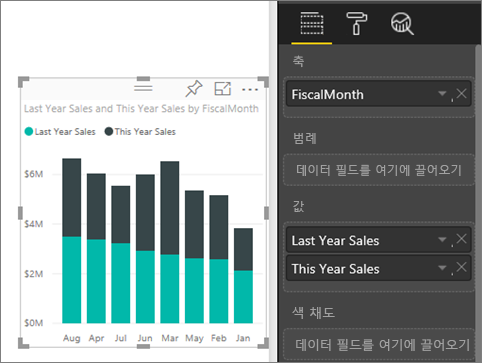
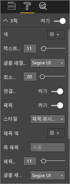
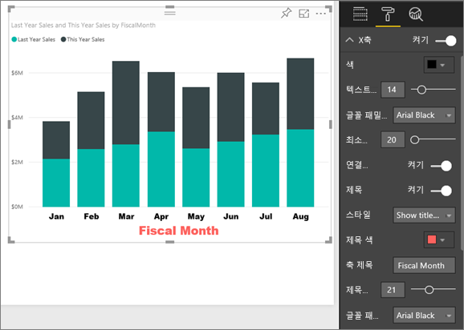
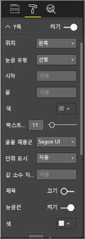
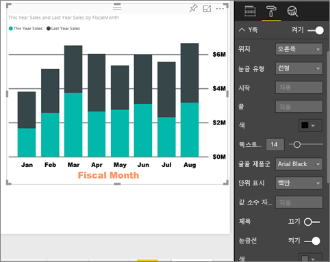
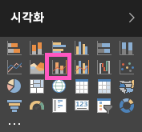
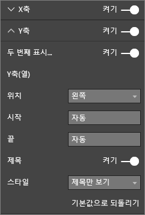

# X축 및 Y축 속성 사용자 지정
이 자습서에서는 시각적 개체의 X축 및 Y축을 사용자 지정하는 다양한 방법을 배웁니다. 모든 시각적 개체에 축이 있거나 모든 시각적 개체를 사용자 지정할 수 있는 것은 아닙니다. 예를 들어 원형 차트에는 축이 없습니다. 그리고 사용자 지정 옵션은 시각적 개체마다 다르며, 이 자습서에서 다 다루기에는 너무 많습니다. 따라서 가장 많이 사용되는 축을 몇 개만 살펴보고, Power BI 보고서 캔버스에서 시각적 서식 탭을 사용하는 방법을 익히도록 하겠습니다.  

> [!NOTE]
> 이 페이지는 Power BI 서비스 및 Power BI Desktop 모두에 적용됩니다. **서식**(페인트 폴러 아이콘 )을 선택하면 사용할 수 있는 이러한 사용자 지정 항목을 Power BI Desktop에서도 사용할 수 있습니다.  
>
>

Amanda가 X축 및 Y축을 사용자 지정하고 드릴업 및 드릴다운을 사용하는 경우 연결을 제어하기 위한 다양한 방법을 보여 주는 비디오를 시청하세요. 그런 다음 비디오 아래의 단계별 지침에 따라 직접 소매점 분석 샘플을 사용해 봅니다.

<iframe width="560" height="315" src="https://www.youtube.com/embed/9DeAKM4SNJM" frameborder="0" allowfullscreen></iframe>

## 보고서에서 시각화 X축 사용자 지정
## 누적된 차트 시각화 만들기
Power BI 서비스에 로그인하고 [편집용 보기](../service-interact-with-a-report-in-editing-view.md)에서 **소매점 분석 샘플** 보고서를 엽니다. 과정을 따르려면 [소매 분석 샘플에 연결](../sample-datasets.md)하세요.

1. 올해 판매액과 지난해 판매액을 회계 월별로 보여주는 새로운 세로 막대형 차트를 만듭니다.
2. 누적 세로 막대형 차트로 변환합니다.

    

## X축 사용자 지정
1. 시각화 및 필터 창에서 **서식**(페인트 롤러 아이콘 )을 선택하여 사용자 지정 옵션을 표시합니다.
2. X축 옵션을 확장합니다.

   
3. 켜기(또는 끄기) 슬라이더를 선택하여 X축을 켜고 끕니다. 이 경우에는 **켜기**로 설정합니다.  추가 데이터의 공간을 절약하기 위해 X축 옵션을 해제하는 것이 좋습니다.

    
4. 텍스트 색, 크기 및 글꼴의 서식을 지정합니다. 이 예제에서는 텍스트 **색**을 검정색으로, **텍스트 크기**를 14로, **글꼴**을 Arial Black으로 설정했습니다.  
5. X축 제목을 **켜기**로 설정하고 X축의 이름을 표시합니다. 이 경우에는 **FiscalMonth**입니다.  
6. 제목 텍스트 색, 크기 및 글꼴의 서식을 지정합니다.  이 예제에서는 **제목 색**을 주황색으로 설정하고, **축 제목**을 **회계 월**로 변경하고, **제목 텍스트 크기**를 21로 설정했습니다.
7. FiscalMonth 기준으로 정렬하려면 차트의 오른쪽 위 모서리에 있는 줄임표(...)를 선택하고 **FiscalMonth 기준 정렬**을 선택합니다.

    이러한 사용자 지정 후 세로 막대형 차트는 이렇게 보여야 합니다.

     

지금까지 수행한 모든 X축 사용자 지정 작업을 되돌리려면 **X축** 사용자 지정 창의 맨 아래에 있는 **기본값으로 되돌리기**를 선택합니다.

## Y축 사용자 지정
1. Y축 옵션을 확장합니다.

   

2. 켜기(또는 끄기) 슬라이더를 선택하여 Y축을 켜고 끕니다. 이 경우에는 **켜기**로 설정합니다.  추가 데이터의 공간을 절약하기 위해 Y축 옵션을 해제하는 것이 좋습니다.
   
    
3. Y축 **위치**를 오른쪽으로 이동합니다.
4. 텍스트 색, 크기 및 글꼴의 서식을 지정합니다. 이 예제에서는 텍스트 **색**을 검정색으로, **텍스트 크기**를 14로, **글꼴**을 Arial Black으로 설정했습니다.  
5. **표시 단위**를 수백만으로 설정하고 **소수점 이하 자릿수 값**을 0으로 설정합니다.
6. 이 시각화의 경우 Y축 제목이 있더라도 시각적 개체가 달라지지 않으므로 **제목**을 해제한 채로 둡니다.  
7. **색**을 진한 회색으로 변경하고 **스트로크**를 2로 증가시켜 눈금선을 강조하겠습니다.

    이러한 사용자 지정 후 세로 막대형 차트는 이렇게 보여야 합니다.

     

## 이중 Y축으로 시각화 요소 사용자 지정
먼저 상점 수가 판매액에 미치는 영향을 보여주는 콤보 차트를 만들어 보겠습니다.  이는 [콤보 차트 자습서](power-bi-visualization-combo-chart.md)에서 만든 것과 동일한 차트입니다. 그런 다음 이중 Y축에 서식을 지정합니다.

### Y축 두 개로 차트 만들기
1. **시간 > FiscalMonth** 기준 **영업 > 작년의 총 수익률(%)** 을 추적하는 새로운 꺾은선형 차트를 만듭니다.
2. 줄임표(...)를 선택하고 **월별로 정렬**을 선택하여 시각적 개체를 월별로 정렬합니다.

    

    > [NOTE]: For help sorting by month, see [sorting by other criteria](../consumer/end-user-change-sort.md#other)

    1월에는 GM%가 35%였고, 4월에 45% 고점에 도달했으며, 7월에 감소하고, 8월에 다시 고점에 도달했습니다. 작년과 금년의 매출 패턴이 유사할까요?
     
3. **This Year Sales > Value** 및 **Last Year Sales**를 꺾은선형 차트에 추가합니다. **작년 GM%** 의 눈금(0M% 눈금선과 함께 있는 파란색 선)은 **매출액** 눈금보다 훨씬 더 작기 때문에 비교하기가 어렵습니다. 또한 Y축 레이블 백분율도 그렇습니다.      

    

5. 보다 쉽게 읽고 해석 가능한 시각적 개체를 만들려면 꺾은선형 차트를 꺾은선형 및 누적 세로 막대형 차트로 변환합니다.

   

6. **작년 총수익%** 을 **세로 막대 값**에서 **꺾은선형 값**으로 끌어다 놓습니다. 이제 위에서 만든 누적 세로 막대형 차트 ***및*** 꺾은선형 차트가 표시됩니다.  (필요한 경우 위에서 배운 내용을 사용하여 축 글꼴 색 및 크기를 지정합니다.)
   
   Power BI가 두 개의 축을 만들기 때문에 데이터 집합의 크기를 다르게 조정할 수 있습니다. 왼쪽은 달러를 측정하고, 오른쪽은 백분율을 측정합니다.

   

### 보조 Y축 서식 지정
1. **시각화** 창에서 페인트 롤러 아이콘을 선택하여 서식 지정 옵션을 표시합니다.    
2. 아래쪽 화살표를 선택하여 Y축 옵션을 확장합니다.    
3. **보조 표시**에 대한 옵션을 찾을 때까지 목록을 스크롤합니다. **보조 표시**를 **끄기**에서 **켜기**로 설정합니다.    

   

   

4. (선택 사항) 두 축을 사용자 지정합니다. 열 축 또는 행 축에 대한 **위치**를 전환하면 두 축은 서로의 위치를 전환합니다.

   

### 두 축에 제목 추가
이렇게 복잡한 시각화에서는 축 제목을 추가하는 것이 좋습니다.  제목은 동료들이 시각화의 내용을 이해하는 데 도움이 됩니다.

1. **제목**을 **Y축 (열)** 과 **Y축 (선)** 에 대해 **켜기**를 설정합니다.
2. **스타일** 을 **제목만 표시**로 설정합니다.

       
3. 이제 콤보 차트에 이중 축과 제목이 표시됩니다.

   

자세한 내용은 [색 형식 지정, 레이블 지정 및 축 속성에 대한 팁과 요령](service-tips-and-tricks-for-color-formatting.md)을 참조하세요.

## 고려 사항 및 문제 해결
보고서 소유자가 X축을 날짜 형식으로 분류하는 경우 **형식** 옵션이 표시되며 연속 또는 범주 간에 선택할 수 있습니다.

## 다음 단계
[Power BI 보고서의 시각화](power-bi-report-visualizations.md)에 대해 자세히 알아보기

[제목, 배경 및 범례](power-bi-visualization-customize-title-background-and-legend.md) [사용자 지정](power-bi-visualization-customize-title-background-and-legend.md)

[색 및 축 속성 사용자 지정](service-getting-started-with-color-formatting-and-axis-properties.md)

[Power BI - 기본 개념](../consumer/end-user-basic-concepts.md)

궁금한 점이 더 있나요? [Power BI 커뮤니티를 이용하세요.](http://community.powerbi.com/)
