# X축 및 Y축 속성 사용자 지정

[!INCLUDE [power-bi-visuals-desktop-banner](../includes/power-bi-visuals-desktop-banner.md)]

이 자습서에서는 시각적 개체의 X축과 Y축을 사용자 지정하는 다양한 방법에 대해 알아봅니다. 일부 시각적 개체에는 축이 없습니다. 예를 들어, 원형 차트는 축이 없습니다. 또한 사용자 지정 옵션은 시각적 개체에 따라 다릅니다. 하나의 문서에서 다루기에는 너무 많은 옵션이 있습니다. 따라서 가장 많이 사용되는 사용자 지정 중 일부를 살펴보고, Power BI 보고서 캔버스의 시각적 개체 **서식** 창을 편안하게 사용해 보겠습니다.  

Amanda가 X축과 Y축을 사용자 지정하는 방법을 시청하세요. 여기서는 드릴다운 및 드릴업을 사용할 때 연결을 제어하는 다양한 방법도 보여 줍니다.

> [!NOTE]
> 이 비디오에서는 이전 버전의 Power BI를 사용합니다.

<iframe width="560" height="315" src="https://www.youtube.com/embed/9DeAKM4SNJM" frameborder="0" allowfullscreen></iframe>

## 필수 조건

- Power BI Desktop

- [소매점 분석 샘플](https://download.microsoft.com/download/9/6/D/96DDC2FF-2568-491D-AAFA-AFDD6F763AE3/Retail%20Analysis%20Sample%20PBIX.pbix)

## 새 시각화 추가

시각화를 사용자 지정하려면 먼저 빌드해야 합니다.

1. Power BI Desktop에서 소매점 분석 샘플을 엽니다.  

2. 아래쪽에서 노란색 더하기 아이콘을 선택하여 새 페이지를 추가합니다. 

    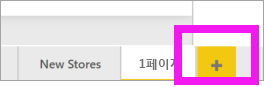

1. **시각화** 창에서 누적 세로 막대형 차트 아이콘을 선택합니다. 그러면 빈 템플릿이 보고서 캔버스에 추가됩니다.

    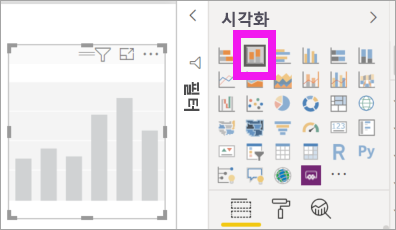

1. X축 값을 설정하려면 **필드** 창에서 **시간** > **FiscalMonth**를 차례로 선택합니다.

1. Y축 값을 설정하려면 **필드** 창에서 **판매** > **작년 매출** 및 **판매** > **금년 매출** > **값**을 차례로 선택합니다.

    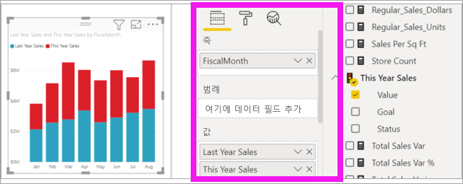

    이제 X축을 사용자 지정할 수 있습니다. Power BI는 시각화 서식을 지정할 수 있는 거의 무제한의 옵션을 제공합니다. 

## X축 사용자 지정
X축에 대해 사용자 지정할 수 있는 다양한 기능이 있습니다. 데이터 레이블 및 X축 제목을 추가하고 수정할 수 있습니다. 범주의 경우 막대, 세로 막대, 선 및 영역의 너비, 크기 및 안쪽 여백을 수정할 수 있습니다. 그리고 값의 경우 표시 단위, 소수 자릿수 및 눈금선을 수정할 수 있습니다. 다음 예에서는 세로 막대형 차트에 대한 사용자 지정을 보여 줍니다. 몇 가지 사용자 지정을 추가하여 옵션에 익숙해진 다음, 나머지 항목을 직접 살펴볼 수 있습니다.

### X축 레이블 사용자 지정
X축 레이블은 차트의 세로 막대 아래에 표시됩니다. 현재는 밝은 회색이고, 작고, 읽기가 어렵습니다. 이제 변경해 보겠습니다.

1. **시각화** 창에서 **서식**(페인트 롤러 아이콘 )을 선택합니다. 사용자 지정 옵션을 표시합니다.

2. X축 옵션을 펼칩니다.

   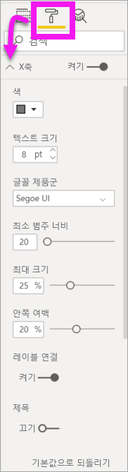

3. **X축** 슬라이더를 **켜기**로 이동합니다.

    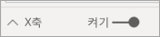

    X축을 **끄기**로 설정해야 하는 몇 가지 이유는 시각화에 레이블 없이 별도의 설명이 필요하지 않거나 보고서 페이지가 복잡하고 더 많은 데이터를 표시할 공간을 만들어야 하기 때문입니다.

4. 텍스트 색, 크기 및 글꼴의 서식을 지정합니다.

    - **색**: 검정 선택

    - **텍스트 크기**: *14* 입력

    - **글꼴 제품군**: **Arial Black** 선택

    - **안쪽 여백**: *40%* 입력

        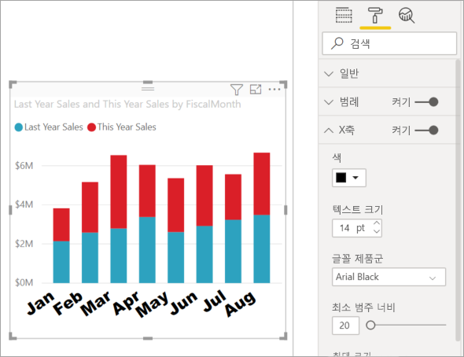
    
5. X축 텍스트가 대각선으로 표시되는 방식이 마음에 들지 않을 수도 있습니다. 이 경우 몇 가지 옵션이 있습니다. 
    - 텍스트 크기를 14보다 작은 값으로 변경합니다.
    - 시각화를 더 크게 만듭니다. 
    - **최소 범주 너비**를 늘려 더 작은 수의 열을 표시하고 스크롤 막대를 추가합니다. 
    
    여기서는 두 번째 옵션을 선택하고, 크기 조정 막대 중 하나를 사용하여 시각화를 더 넓게 만들었습니다. 이제 비스듬히 표시할 필요 없이 스크롤 막대를 사용하여 14포인트 텍스트를 수용할 수 있습니다. 

   

### X축 제목 사용자 지정
X축 제목이 **켜기**이면 X축 제목이 X축 레이블 아래에 표시됩니다. 

1. 먼저 X축 제목을 **켜기**로 설정합니다.  

    

    이제 시각화에 기본 X 축 제목이 있다는 것을 가장 먼저 알 수 있습니다.  이 경우에는 **FiscalMonth**입니다.

   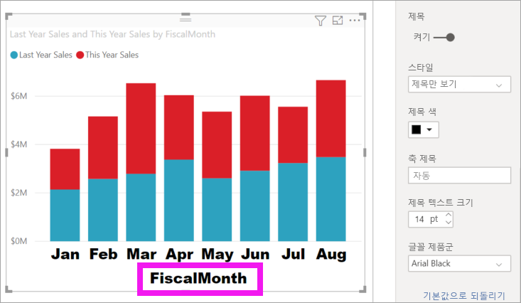

1. 제목 텍스트 색, 크기 및 글꼴의 서식을 지정합니다.

    - **제목 색**: 주황색 선택

    - **축 제목**: *회계 월*(공백 포함) 입력

    - **제목 텍스트 크기**: *18* 입력

    사용자 지정이 완료되면 누적 세로 막대형 차트가 다음과 같습니다.

    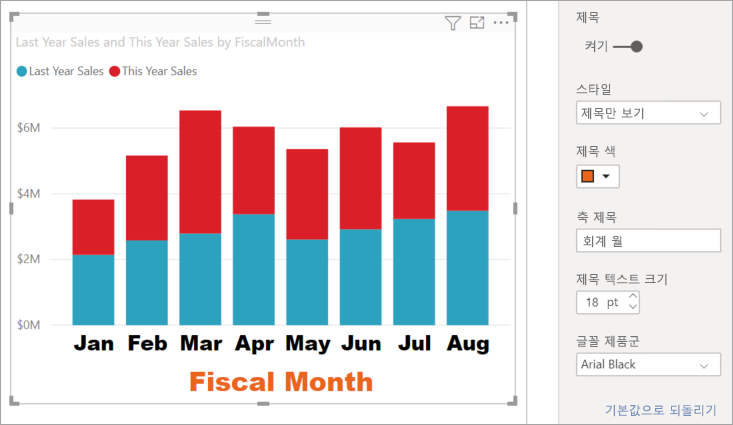

1. 변경 내용을 저장하고 다음 섹션으로 이동합니다. 모든 변경 내용을 되돌려야 하는 경우 **X축** 사용자 지정 창 맨 아래에 있는 **기본값으로 되돌리기**를 선택합니다. 다음으로, Y축을 사용자 지정합니다.

## Y축 사용자 지정
Y축에 대해 사용자 지정할 수 있는 다양한 기능이 있습니다. 데이터 레이블, Y축 제목 및 눈금선을 추가하고 수정할 수 있습니다. 값의 경우 표시 단위, 소수 자릿수, 시작점 및 엔드포인트를 수정할 수 있습니다. 그리고 범주의 경우 막대, 세로 막대, 선 및 영역의 너비, 크기 및 안쪽 여백을 수정할 수 있습니다. 

다음 예에서는 세로 막대형 차트를 계속 사용자 지정합니다. 몇 가지 항목을 변경하여 옵션에 익숙해진 다음, 나머지 항목을 직접 살펴볼 수 있습니다.

### Y축 레이블 사용자 지정
Y축 레이블은 기본적으로 왼쪽에 표시됩니다. 현재는 밝은 회색이고, 작고, 읽기가 어렵습니다. 이제 변경해 보겠습니다.

1. Y축 옵션을 확장합니다.

   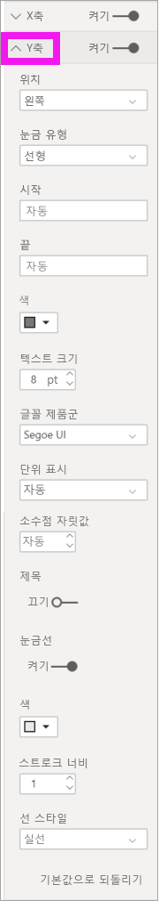

1. **Y축** 슬라이더를 **켜기**로 이동합니다.  

    

    Y축 옵션을 해제하는 한 가지 이유는 더 많은 데이터를 위해 공간을 절약하는 것입니다.

1. 텍스트 색, 크기 및 글꼴의 서식을 지정합니다.

    - **색**: 검정 선택

    - **텍스트 크기**: *10* 입력

    - **표시 단위**: **백만**을 선택합니다.

    

### Y축 제목 사용자 지정
Y축 제목이 **켜기**이면 Y축 제목이 Y축 레이블 옆에 표시됩니다. 이 시각화의 경우 Y축 제목이 있더라도 시각적 개체가 달라지지 않으므로 **제목**을 **해제**한 채로 둡니다. Y축 제목은 이 자습서의 뒷부분에서 이중 축 시각적 개체에 추가합니다. 

### 눈금선 사용자 지정
색을 변경하고 스트로크를 증가시켜 눈금선을 강조하겠습니다.

- **색**: 주황색 선택

- **스트로크 너비**: *2* 입력

이러한 사용자 지정 후 세로 막대형 차트는 이렇게 보여야 합니다.

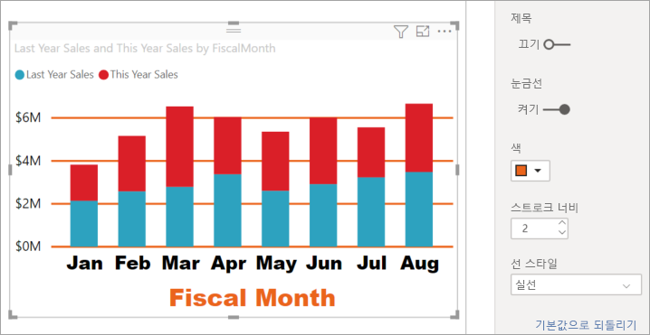

## 이중 Y축을 사용하여 시각화 사용자 지정

일부 시각화에서 두 개의 Y축을 사용하면 이점을 얻을 수 있습니다. 콤보 차트가 좋은 예입니다. 이중 Y축의 서식을 지정하기 전에 판매 추세와 매출 총이익률을 비교하는 콤보 차트를 만들어 보겠습니다.  

### Y축 두 개로 차트 만들기

1. 세로 막대형 차트를 선택하고, *꺾은선형 및 누적 세로 막대형* 차트로 변경합니다. 이 형식의 시각적 개체는 단일 꺾은선형 차트 값과 여러 개의 스택형 열 값을 지원합니다. 

    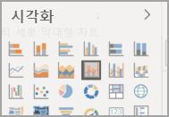
   

2. **판매** > **작년 매출 총이익률(%)** 을 [필드] 창에서 **꺾은선형 값** 버킷으로 끕니다.

    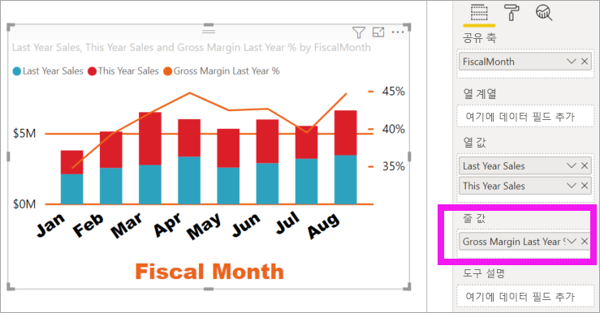

    
3. 시각화의 서식을 다시 지정하여 비스듬한 X축 레이블을 제거합니다. 

   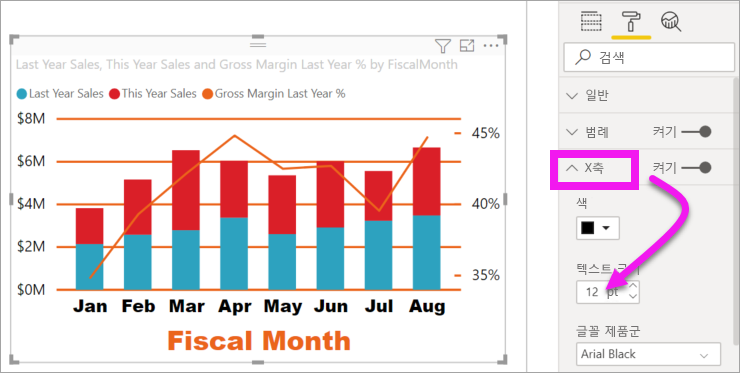

   Power BI에서 서로 다르게 크기 조정할 수 있는 값을 허용하는 두 개의 Y축을 만듭니다. 왼쪽 축은 매출(달러)을 측정하고 오른쪽 축은 매출 총이익률을 측정합니다.

### 두 번째 Y축 서식 지정
서식 지정된 하나의 Y축을 사용하여 시각화를 시작했으므로 Power BI에서 동일한 설정을 사용하여 두 번째 Y축을 만들었습니다. 그러나 이를 변경할 수 있습니다. 

1. **시각화** 창에서 페인트 롤러 아이콘을 선택하여 서식 옵션을 표시합니다.

1. Y축 옵션을 확장합니다.

1. **보조 표시** 옵션을 찾을 때까지 아래로 스크롤합니다. **켜기**로 설정되어 있는지 확인합니다. 두 번째 Y축은 꺾은선형 차트를 나타냅니다.

   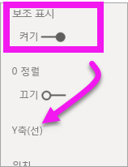

1. (선택 사항) 두 축의 글꼴 색, 크기 및 표시 단위를 사용자 지정합니다. 열 축 또는 행 축에 대한 **위치**를 전환하면 두 축은 서로의 위치를 전환합니다.

### 두 축에 제목 추가

복잡한 시각화를 사용하면 축 제목을 추가하는 데 도움이 됩니다.  제목은 동료들이 시각화의 내용을 이해하는 데 도움이 됩니다.

1. **제목**을 **Y축 (열)** 과 **Y축 (선)** 에 대해 **켜기**를 설정합니다.

1. 두 축 모두에 대해 **스타일**을 **제목만 표시**로 설정합니다.

   

1. 이제 콤보 차트에 제목과 함께 이중 축이 표시됩니다.

   

1. 제목의 서식을 지정합니다. 이 예에서는 제목 중 하나를 짧게 만들고, 두 제목의 글꼴 크기를 모두 줄였습니다. 
    - 글꼴 크기: **9**
    - 첫 번째 Y 축(세로 막대형 차트)의 **축 제목**을 줄입니다. 금년 및 작년 판매

    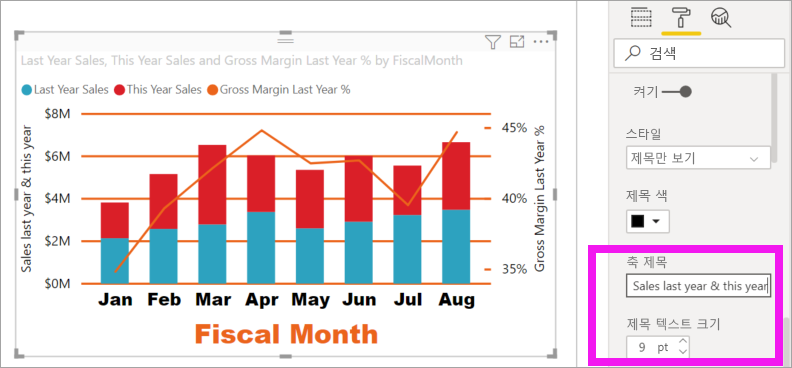

자세한 내용은 [Power BI의 색 서식을 위한 팁과 힌트](service-tips-and-tricks-for-color-formatting.md) 및 [시각화 제목, 범례 및 배경 사용자 지정](power-bi-visualization-customize-title-background-and-legend.md)을 참조하세요. 그리고 곧 제공될 제목 서식 지정에 대한 새 업데이트를 찾아보세요. 

## 다음 단계

- [Power BI 보고서의 시각화](power-bi-report-visualizations.md)

궁금한 점이 더 있나요? [Power BI 커뮤니티를 이용하세요.](https://community.powerbi.com/)
