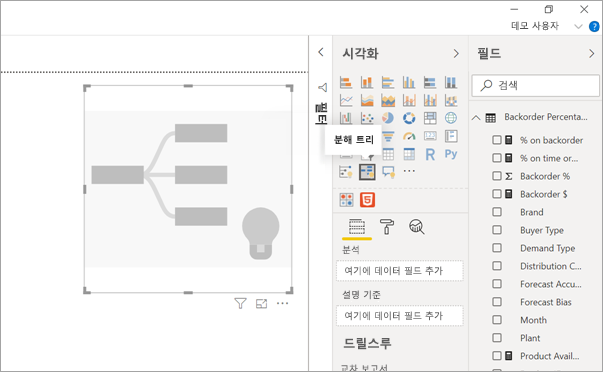
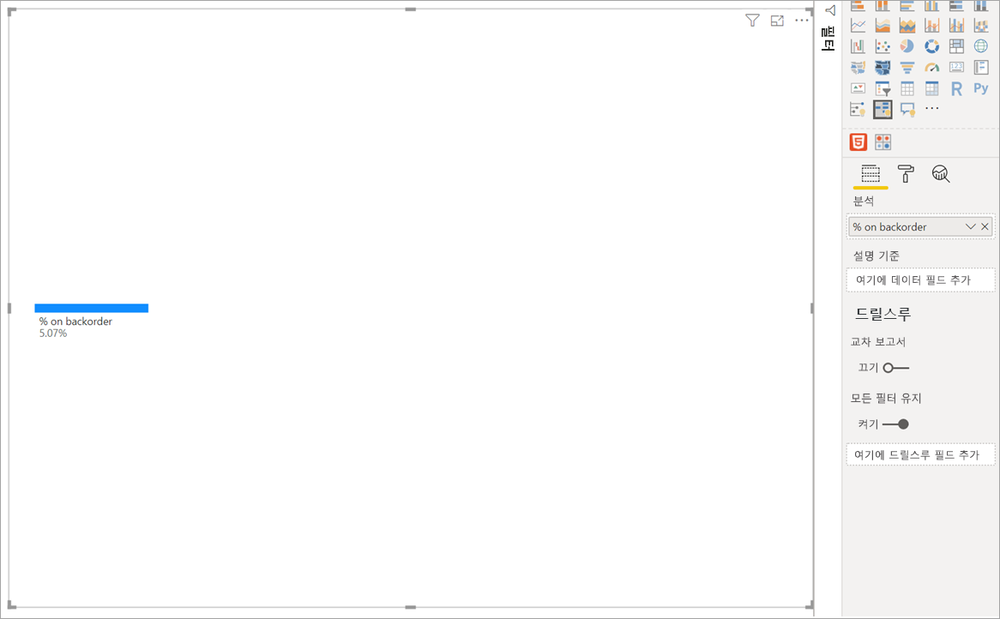
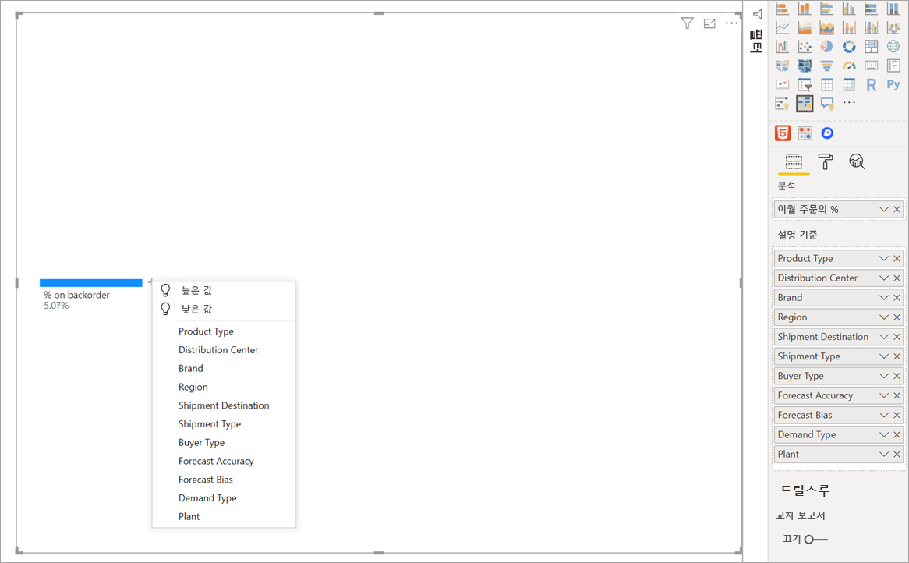
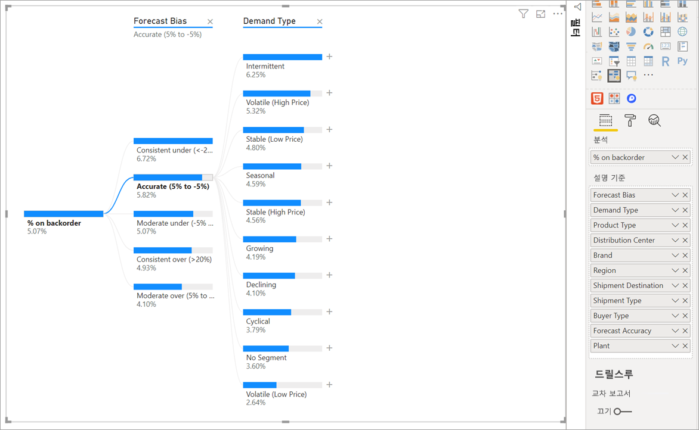
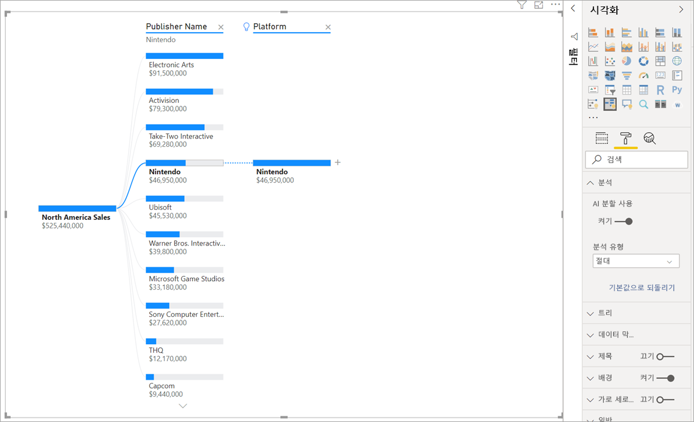
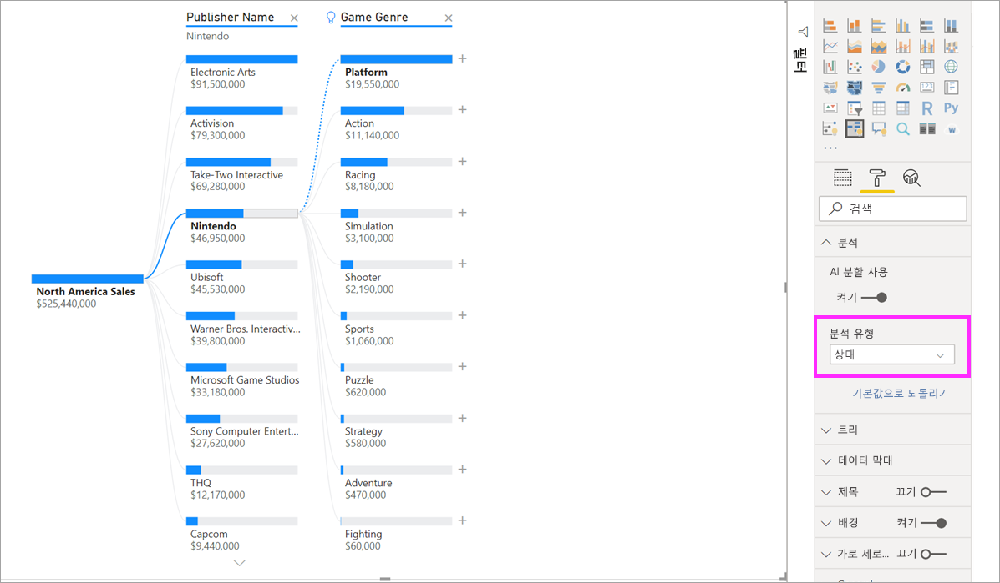
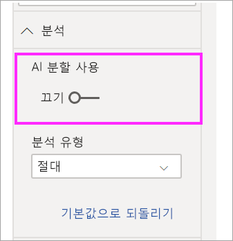

# Power BI에서 분해 트리 시각적 개체 만들기 및 보기(미리 보기)
[!INCLUDE [power-bi-visuals-desktop-banner](../includes/power-bi-visuals-desktop-banner.md)]

Power BI의 분해 트리 시각적 개체를 사용하여 여러 차원에서 데이터를 시각화할 수 있습니다. 자동으로 데이터를 집계하며 임의 순서로 차원을 드릴다운할 수 있게 해줍니다. AI(인공 지능) 시각화이기도 하므로 특정 기준에 따라 드릴다운할 다음 차원을 찾도록 요청할 수 있습니다. 그러므로 임시 탐색 및 근본 원인 분석을 수행하는 데 유용한 도구입니다.

이 자습서에서는 두 가지 예제를 사용합니다.

- 회사가 보유한 이월 주문(재고 부족) 제품의 비율을 분석하는 공급망 시나리오.  
- 게임 장르 및 제작사와 같은 다양한 요소에 따라 비디오 게임 판매를 분류하는 판매 시나리오.

## 시작
시각화 창에서 분해 트리 아이콘을 선택합니다.

시각화에는 두 가지 유형의 입력이 필요합니다.

**분석** – 분석할 메트릭입니다. 측정값 또는 집계여야 합니다.  
**설명 기준** - 드릴다운할 하나 이상의 차원입니다.

측정값을 필드로 끌면 시각적 개체가 업데이트되어 집계된 측정값을 보여줍니다. 아래 예제에서는 이월 주문 제품 평균 백분율(5.07%)을 시각화합니다, 

다음 단계는 드릴다운할 차원을 하나 이상 가져오는 것입니다. **설명 기준** 버킷에 이러한 필드를 추가합니다. 루트 노드 옆에 더하기 기호가 표시됩니다. +를 선택하면 드릴하려는 필드를 선택할 수 있습니다. 원하는 순서로 필드를 드릴할 수 있습니다.

**Forecast bias스**를 선택하면 트리가 확장되고 측정값이 열의 값을 기준으로 분류됩니다. 드릴할 다른 노드를 선택하여 이 프로세스를 반복할 수 있습니다.

마지막 수준에서 노드를 선택하면 데이터가 교차 필터링됩니다. 이전 수준에서 노드를 선택하면 경로가 변경됩니다.

다른 시각적 개체와 상호 작용하면 분해 트리가 교차 필터링됩니다. 그 결과로 수준 내의 노드 순서가 변경될 수 있습니다.
아래 예제에서는 Ubisoft를 기준으로 트리를 교차 필터링했습니다. 경로가 업데이트되고 Xbox 판매가 첫 번째 위치에서 두 번째 위치로 이동합니다(PlayStation이 추월함). 

그런 다음 Nintendo를 기준으로 트리를 교차 필터링하면 Xbox용으로 개발된 Nintendo 게임이 없으므로 Xbox 판매는 비어 있습니다. Xbox는 후속 경로와 함께 보기에서 필터링됩니다.

경로가 사라지더라도 기존 수준(이 경우 게임 장르)은 트리에 고정된 상태로 유지됩니다. 따라서 Nintendo 노드를 선택하면 자동으로 트리가 게임 장르로 확장됩니다.

## AI 분할

"AI 분할"을 사용하여 데이터에서 다음에 확인해야 할 위치를 파악할 수 있습니다. 이러한 분할은 목록의 맨 위에 나타나고 전구로 표시됩니다. 분할은 데이터에서 자동으로 높은 값과 낮은 값을 찾는 데 도움이 됩니다.

분석은 기본 설정에 따라 두 가지 방법으로 작동할 수 있습니다. 기본 동작은 다음과 같습니다.

**높은 값** 사용 가능한 모든 필드를 고려하고 분석할 측정값에서 가장 높은 값을 얻기 위해 드릴할 필드를 결정합니다.  
**낮은 값** 사용 가능한 모든 필드를 고려하고 분석할 측정값에서 가장 낮은 값을 얻기 위해 드릴할 필드를 결정합니다.  

이월 주문 예제에서 **높은 값**을 선택하면 다음과 같은 결과가 나타납니다. 

**Product Type** 옆에 전구가 나타나 ‘AI 분할’을 표시합니다. 또한 트리는 이월 주문 최대값으로 **Patient Monitoring** 노드(9.2%)를 제안하는 점선을 제공합니다. 

전구 위로 마우스를 가져가면 도구 설명이 표시됩니다. 이 예제에서 도구 설명은 "제품 유형이 환자 모니터링일 때 이월 주문 %가 최대값"입니다.

**절대**와는 반대로 **상대** AI 분할을 찾도록 시각적 개체를 구성할 수 있습니다. 

상대 모드는 두드러지는 높은 값을 찾습니다(열의 나머지 데이터와 비교). 이를 설명하기 위해 예제를 살펴보겠습니다. 

위의 스크린샷에는 북아메리카 지역 비디오 게임 판매가 나와 있습니다. 먼저 **Publisher Name**을 기준으로 트리를 분할한 다음 Nintendo로 드릴합니다. **높은 값**을 선택하면 **Platform이 Nintendo**가 확장됩니다. Nintendo(제작사)만 Nintendo 콘솔 게임을 개발하므로 값은 하나뿐이고 당연히 이것이 최대값입니다.

그럼에도 더 흥미로운 분할은 같은 열에 있는 다른 값을 기준으로 하는 상위 값을 확인하는 것입니다. 분석 유형을 **절대**에서 **상대**로 변경하면 Nintendo에 대해 다음과 같은 결과를 얻을 수 있습니다. 

이번에는 제안된 값이 **Game Genre 내 Platform**입니다.  Platform에는 Nintendo보다 큰 절대값이 없습니다($19,950,000와 $46,950,000). 그럼에도 불구하고 이것은 두드러지는 값입니다.

보다 정확하게는 10개의 게임 장르 값이 있으므로 균일하게 분할할 경우 Platform에서 예상되는 값은 $4.6M이 됩니다. Platform은 값이 거의 $20M이기 때문에 예상 결과보다 4배 더 높은 흥미로운 결과를 얻을 수 있습니다.

계산은 다음과 같습니다.

Platform 북아메리카 판매/Abs(Avg(게임 장르 북아메리카 판매))  
vs.  
Nintendo 북아메리카 판매/Abs(Avg(플랫폼 북아메리카 판매))  

따라서

19,550,000 / (19,550,000 + 11,140,000 + ... + 470,000 + 60,000 /10) = 4.25x  
vs.  
46,950,000/ (46,950,000/1) = 1x  

트리에서 AI 분할을 사용하지 않으려는 경우 **분석** 서식 옵션을 사용하여 해제할 수도 있습니다.  

## AI 분할을 사용한 트리 상호 작용

후속 AI 수준이 여러 개 있을 수 있습니다. 다양한 종류의 AI 수준을 혼합할 수도 있습니다(높은 값에서 낮은 값으로 이동하다가 다시 높은 값으로 이동). 

트리에서 다른 노드를 선택하면 AI는 처음부터 다시 계산합니다. 아래 예제에서는 **Forecast bias** 수준에서 선택한 노드를 변경했습니다. 이후 수준을 변경하면 올바른 높은 값과 낮은 값이 생성됩니다. 

다른 시각적 개체를 통해 분해 트리를 교차 필터링하는 경우 AI 수준도 다시 계산됩니다. 아래 예제에서는 공장 #0477에 대한 이월 주문 %가 가장 높은 것을 볼 수 있습니다.

그러나 가로 막대형 차트에서 **4월**을 선택하면 최대값이 **Product Type 이 Advanced Surgical**로 바뀝니다. 이 경우 노드가 다시 정렬되었을 뿐만 아니라 완전히 다른 열이 선택되었습니다. 

AI 수준이 비 AI 수준처럼 동작하게 하려면 전구를 선택하여 동작을 기본값으로 되돌립니다. 

여러 AI 수준을 함께 연결할 수 있지만 비 AI 수준은 AI 수준을 따를 수 없습니다. AI 분할 후 수동 분할을 수행하는 경우 AI 수준에서 전구가 사라지고 수준이 일반 수준으로 변환됩니다. 

## 잠금

콘텐츠 작성자는 보고서 소비자에 대해 수준을 잠글 수 있습니다. 잠긴 수준은 제거하거나 변경할 수 없습니다. 소비자는 잠긴 수준 내에서 서로 다른 경로를 탐색할 수 있지만 수준 자체를 변경할 수는 없습니다. 보고서 작성자는 기존 수준을 마우스로 가리켜 잠금 아이콘을 볼 수 있습니다. 원하는 만큼 수준을 잠글 수 있지만 잠긴 수준 이전에는 잠금 해제된 수준을 지정할 수 없습니다.

아래 예제에서는 처음 두 수준이 잠겨 있습니다. 즉, 보고서 소비자가 수준 3과 4를 변경하고 나중에 새 수준을 추가할 수도 있습니다. 그러나 처음 두 수준은 변경할 수 없습니다.

## 알려진 제한 사항

트리의 최대 수준 수는 50입니다. 트리에서 한 번에 시각화할 수 있는 최대 데이터 요소 수는 5000개입니다. 상위 n 개를 표시하도록 수준을 자릅니다. 현재 수준별 상위 n개는 10으로 설정되어 있습니다. 

분해 트리는 다음과 같은 시나리오에서 지원되지 않습니다.  
-   온-프레미스 Analysis Services

AI 분할은 다음과 같은 시나리오에서 지원되지 않습니다.  
-   Azure Analysis Services
-   DirectQuery
-   Power BI Report Server
-   웹에 게시
-   복잡한 측정값과 '분석' 내 확장 스키마의 측정값

기타 미리 보기 제한 사항:
- Power BI Mobile  
- 대시보드에 고정
- 데이터 기능 표시
- Q&A 내에서 지원

## 다음 단계

[Power BI 도넛형 차트](power-bi-visualization-doughnut-charts.md)

[Power BI 시각화](power-bi-report-visualizations.md)

