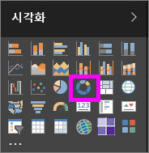
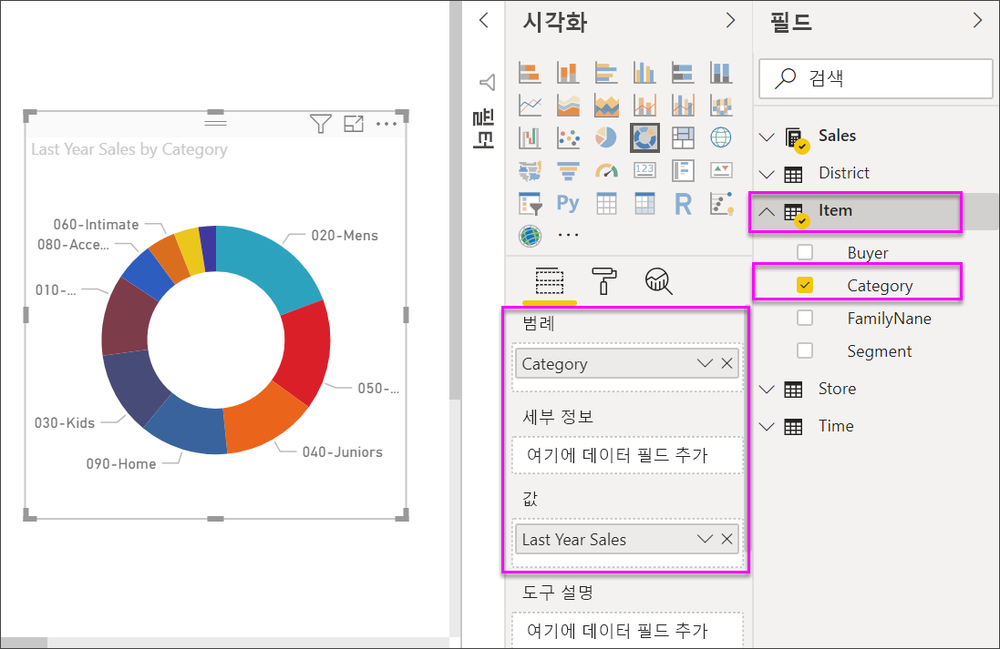

# Power BI의 도넛형 차트

[!INCLUDE [power-bi-visuals-desktop-banner](../includes/power-bi-visuals-desktop-banner.md)]

도넛형 차트는 전체에 대한 부분의 관계를 표시한다는 점에서 원형 차트와 비슷합니다. 가운데가 비어 있고 레이블 또는 아이콘이 들어갈 공간이 있다는 점만 다릅니다.

## 필수 조건

이 자습서는 [소매점 분석 샘플 PBIX 파일](http://download.microsoft.com/download/9/6/D/96DDC2FF-2568-491D-AAFA-AFDD6F763AE3/Retail%20Analysis%20Sample%20PBIX.pbix)을 사용합니다.

1. 메뉴 모음의 왼쪽 위 섹션에서 **파일** > **열기**를 선택합니다.
   
2. **소매점 분석 샘플 PBIX 파일**을 찾습니다.

1. **소매점 분석 샘플 PBIX 파일**을 보고서 보기 으로 엽니다.

1. 선택  탭을 선택합니다.

## 도넛형 차트 만들기

1. 빈 보고서 페이지에서 시작하고 필드 창에서 **판매액** \> **지난해 판매액**을 선택합니다.  
   
3. 시각화 창에서 도넛형 차트 아이콘 을 선택하여 가로 막대형 차트를 도넛형 차트로 변환합니다. **Values** 영역에 **Last Year Sales**가 없을 경우 끌어다 놓습니다.
     
   

4. **항목**\>**범주**를 선택하여 **범례** 영역에 추가합니다. 
     
    

5. 필요에 따라 [차트 텍스트의 크기와 색을 조정](power-bi-visualization-customize-title-background-and-legend.md)합니다. 

## 고려 사항 및 문제 해결
* 도넛형 차트 값을 더한 총합은 100%를 넘지 않아야 합니다.
* 범주가 너무 많으면 읽고 해석하기 어렵습니다.
* 도넛형 차트는 개별 섹션을 서로 비교하는 것보다는 특정 섹션을 전체와 비교하는 데 사용하는 것이 가장 좋습니다. 

## 다음 단계
[Power BI의 깔때기형 차트](power-bi-visualization-funnel-charts.md)

[Power BI의 시각화 유형](power-bi-visualization-types-for-reports-and-q-and-a.md)

