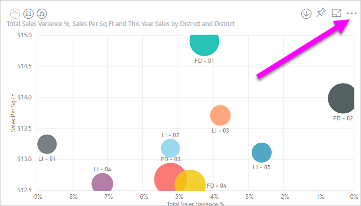
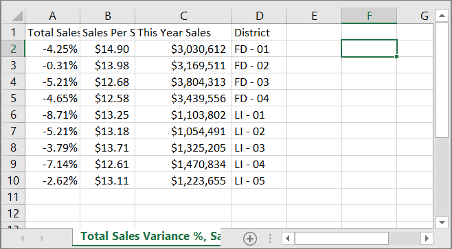
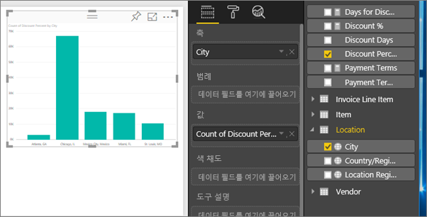
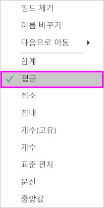
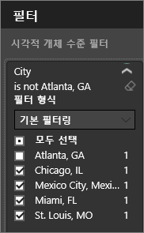
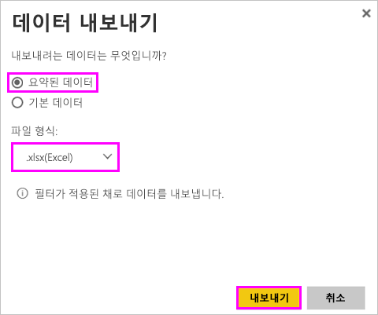
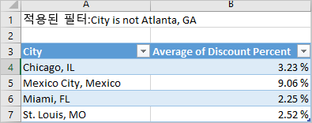
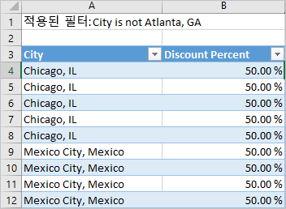
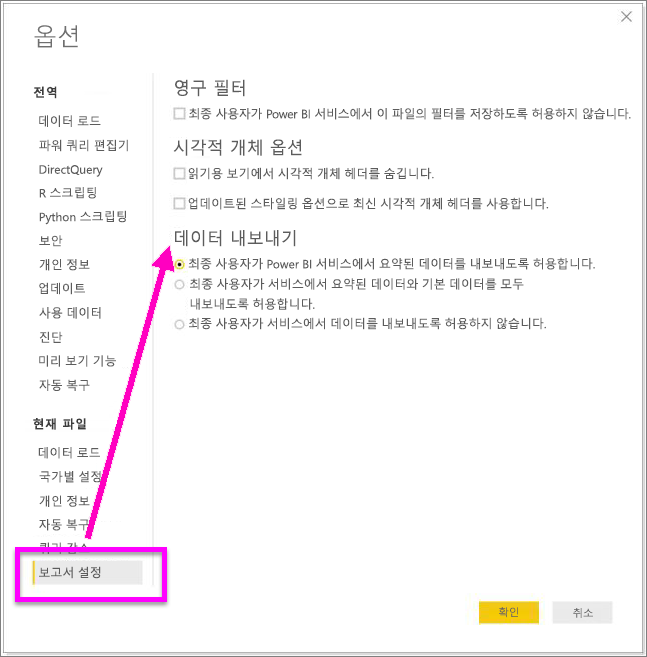

# 시각화에서 데이터 내보내기
시각화를 만드는 데 사용되는 데이터를 보려는 경우 [Power BI에서 해당 데이터를 표시](service-reports-show-data.md)하거나 해당 데이터를 .xlsx 또는 .csv 파일로 Excel에 내보낼 수 있습니다. 데이터를 내보내는 옵션에는 Pro 또는 Premium 라이선스가 필요하며 데이터 세트 및 보고서에 대한 편집 권한이 필요합니다. 

Will이 보고서의 시각화 중 하나에서 데이터를 내보내고 .xlsx 파일로 저장하고 Excel에서 여는 것을 지켜봅니다. 그런 다음 비디오 아래에 있는 단계별 지침을 따라서 직접 시도해 볼 수 있습니다.

<iframe width="560" height="315" src="https://www.youtube.com/embed/KjheMTGjDXw" frameborder="0" allowfullscreen></iframe>

## Power BI 대시보드의 시각화에서
1. 시각화의 오른쪽 위 모서리에 있는 줄임표를 선택합니다.

    
2. **데이터 내보내기** 아이콘을 선택합니다.

    
3. 데이터가 .csv 파일로 내보내집니다. 시각적 개체를 필터링하는 경우 다운로드한 데이터도 필터링됩니다.    
4. 브라우저가 파일을 저장할 것인지 묻습니다.  저장한 후 Excel에서 .csv 파일을 엽니다.

    

## 보고서의 시각화에서
과정을 따르려면 편집용 보기에서 [조달 분석 샘플 보고서](../sample-procurement.md)를 엽니다. 빈 보고서 페이지를 새로 추가합니다. 그런 다음 집계와 시각화 수준 필터를 추가하려면 다음 단계를 따릅니다.

1. 새 막대형 차트를 만듭니다.  필드 창에서 **위치 > 도시** 및 **송장 > 할인율**을 선택합니다.  **할인율**을 값 웰로 옮겨야 할 수도 있습니다. 

    
2. **할인율**에 대한 집계를 **개수**에서 **평균**으로 변경합니다. 값 웰에서 **할인율**(**할인율 개수**라고 할 수도 있음) 오른쪽에 있는 화살표를 선택하고 **평균**을 선택합니다.

    
3. **도시**에 필터를 추가하여 **애틀랜타**를 제거합니다.

   

   이제 데이터를 내보내기 위한 옵션을 모두 사용할 준비가 되었습니다. 

4. 시각화의 오른쪽 위 모서리에 있는 줄임표를 선택합니다. **데이터 내보내기**를 선택합니다.

   
5. Power BI 온라인에서 시각화에 집계가 있는 경우(한 예로, **개수**를 *평균*, *합계* 또는 *최소*로 변경한 경우) 다음 두 가지 옵션이 있습니다. **요약된 데이터** 및 **기본 데이터**. Power BI Desktop에서는 **요약된 데이터**에 대한 옵션만 사용할 수 있습니다. 집계 이해를 위한 도움은 [Power BI의 집계](../service-aggregates.md)를 참조하세요.
    
6. **요약된 데이터** > **내보내기**를 선택하고 .xlsx 또는.csv 중 하나를 선택합니다. Power BI 데이터를 내보냅니다.  시각화에 필터를 적용한 경우 내보낸 데이터는 필터링으로 내보냅니다. **내보내기**를 선택하면 브라우저에서 파일을 저장할 것인지 묻는 메시지를 표시 합니다. 저장한 후 Excel에서 파일을 엽니다.

   **요약된 데이터**: 해당 시각적 개체에 표시되는 내용에 대한 데이터를 내보내려면 이 옵션을 선택합니다.  이 형식의 내보내기에서는 시각적 개체를 만들도록 선택한 데이터(열 및 측정값)만을 보여줍니다.  시각적 개체에 집계가 있는 경우 집계된 데이터를 내보냅니다. 예를 들어 4개의 모음을 보여 주는 가로 막대형 차트를 사용하도록 설정한 경우 4개의 데이터 행을 받습니다. 요약된 데이터는 .xlsx 및 .csv로 사용할 수 있습니다.

   이 예에서 Excel 내보내기는 도시별로 하나의 합계를 보여 줍니다. 애틀랜타를 필터링했기 때문에 결과에는 포함되지 않습니다.  스프레드시트의 첫 번째 행에는 Power BI에서 데이터를 추출할 때 사용된 필터를 보여 줍니다.

   
7. 이제 **내부 데이터** > **내보내기**와 .xlsx를 차례로 선택합니다. Power BI 데이터를 내보냅니다. 시각화에 필터를 적용한 경우 내보낸 데이터는 필터링으로 내보냅니다. **내보내기**를 선택하면 브라우저에서 파일을 저장할 것인지 묻는 메시지를 표시 합니다. 저장한 후 Excel에서 파일을 엽니다.

   >[!WARNING]
   >기본 데이터 내보내기를 사용하면 사용자가 모든 세부 데이터 즉, 데이터의 모든 열을 확인할 수 있습니다. Power BI 서비스 관리자는 조직에 대해 이 기능을 해제할 수 있습니다. 데이터 세트 소유자인 경우 데스크톱 또는 Power BI 서비스에서 필드 목록에 표시되지 않도록 전용 열을 “숨김”으로 설정할 수 있습니다.

   **내부 데이터**: 모델의 시각적 개체 ***및*** 추가 데이터에서 데이터를 확인하려면 이 옵션을 선택합니다(자세한 내용은 아래 차트 참조).  시각화에 집계가 있으면 *기본 데이터*를 선택하여 집계를 제거합니다. **내보내기**를 선택하면 데이터는 .xlsx 파일로 내보내지고 브라우저는 파일을 저장할 것인지 묻는 메시지를 표시합니다. 저장한 후 Excel에서 파일을 엽니다.

   이 예에서 Excel 내보내기는 데이터 세트의 모든 단일 도시 행에 대해 한 행 및 해당 단일 항목에 대한 할인율을 보여 줍니다. 즉, 데이터는 결합 및 집계되지 않습니다. 스프레드시트의 첫 번째 행에는 Power BI에서 데이터를 추출할 때 사용된 필터를 보여 줍니다.  

   

## 기본 데이터 세부 정보 내보내기
**기본 데이터**를 선택하면 표시되는 내용은 달라질 수 있습니다. 이러한 세부 정보를 이해하려면 관리자 또는 IT 부서의 도움이 필요합니다. Power BI Desktop 또는 서비스의 보고 보기에서 *측정값*은 계산기 아이콘 과 함께 필드 목록에 표시됩니다. 측정값은 Power BI 서비스가 아닌 Power BI Desktop에서 생성됩니다.

| 시각적 개체 포함 |                                                                              내보내기에서 표시되는 내용                                                                              |
|-----------------|-------------------------------------------------------------------------------------------------------------------------------------------------------------------------------------|
|   집계    |                                                 *첫 번째* 집계 및 해당 집계에 대한 전체 테이블에서 숨겨지지 않은 데이터                                                  |
|   집계    | 관련된 데이터 - 시각적 개체가 집계를 포함하는 데이터 테이블에*\*\*관련된*\* 다른 데이터 테이블의 데이터를 사용하는 경우(관계가 \*: 1 또는 1:1인 경우) |
|    측정값     |                                      시각적 개체의 모든 측정값 *및* 시각적 개체에서 사용되는 측정값을 포함하는 데이터 테이블의 모든 측정값                                      |
|    측정값     |                                       해당 측정값을 포함하는 테이블에서 숨겨지지 않은 모든 데이터(관계가 \*: 1 또는 1:1인 경우)                                       |
|    측정값     |                                      체인을 통한 측정값을 포함하는 테이블에 관련된 모든 테이블의 모든 데이터(\*:1 또는 1:1인 경우)                                      |
|  측정값만 해당  |                                                   모든 관련된 테이블에서 숨겨지지 않은 모든 열(측정값을 확장하기 위해)                                                   |
|  측정값만 해당  |                                                             모델 측정값의 중복 행에 대해 요약된 데이터입니다.                                                              |

### 내보내기 옵션 설정
Power BI 보고서 디자이너는 소비자가 사용할 수 있는 데이터 내보내기 옵션의 유형을 제어합니다. 선택 항목은 다음과 같습니다.
- 요약된 데이터만 내보내기 허용(새 보고서의 경우 기본값) 
- 요약된 데이터와 기본 데이터 내보내기 허용(2018년 10월 전 이전 기본값) 
- 데이터 내보내기 허용 안 함  

    > [!IMPORTANT]
    > 보고서 디자이너는 이전 보고서를 다시 방문하여 필요에 따라 내보내기 옵션을 수동으로 재설정하는 것이 좋습니다.

1. 이러한 옵션을 설정하려면 Power BI Desktop에서 시작합니다.

2. 왼쪽 위 모서리에서 **파일** > **옵션 및 설정** > **옵션**을 선택합니다. 

3. **현재 파일**에서 **보고서 설정**을 선택합니다.

    

4. **데이터 내보내기** 드롭다운에서 선택합니다.

Power BI 서비스에서 이 설정을 업데이트할 수도 있습니다.  

Power BI 관리 포털 설정이 데이터 내보내기에 대한 보고서 설정과 충돌하는 경우 관리 설정이 데이터 내보내기 설정을 재정의한다는 점에 유의해야 합니다. 

## 제한 사항 및 고려 사항
* **Power BI Desktop** 및 **Power BI 서비스**에서 .csv로 내보낼 수 있는 최대 행 수는 30,000개입니다.
* .xlsx로 내보낼 수 있는 최대 행 수는 150,000개입니다.
* 데이터 원본이 Analysis Services 라이브 연결이고 버전이 2016 미만이고 모델의 테이블에 고유 키가 없는 경우 *내부 데이터*를 사용한 내보내기가 작동하지 않습니다.  
* 내보내는 시각화에 대해 *데이터가 없는 항목 표시* 옵션이 설정된 경우 *내부 데이터*를 사용한 내보내기가 작동하지 않습니다.
* DirectQuery를 사용하는 경우 내보낼 수 있는 데이터의 최대 크기는 16MB입니다. 그러면 행의 최대 수보다 적은 데이터를 내보내게 될 수 있습니다. 특히 열이 많은 경우 압축하기 어려운 데이터 및 파일 크기를 증가시키고 행 수를 감소시키는 기타 요인을 내보냅니다.
* 시각적 개체가 둘 이상의 데이터 테이블의 데이터를 사용하고 데이터 모델에 해당 테이블에 대한 관계가 없는 경우 첫 번째 테이블에 대한 데이터만 내보내집니다. 
* 사용자 지정 시각적 개체 및 R 시각적 개체는 현재 지원되지 않습니다.
* 공유된 대시보드를 사용하는 조직 외부의 사용자는 데이터 내보내기를 사용할 수 없습니다. 
* Power BI에서 필드를 두 번 클릭하고 새 이름을 입력하여 필드(열)의 이름을 바꿀 수 있습니다.  새 이름은 *별칭*으로 참조됩니다. Power BI 보고서가 중복 필드 이름으로 끝나지만 Excel이 중복을 허용하지 않을 수 있습니다.  따라서 데이터를 Excel로 내보낼 때 필드 별칭은 원래 필드(열) 이름으로 되돌립니다.  
* .csv 파일에 유니코드 문자가 있는 경우 Excel의 텍스트가 제대로 표시되지 않을 수 있습니다. 하지만 메모장에서 열면 제대로 작동합니다. 유니코드 문자의 예로 통화 기호 및 외국어 단어가 있습니다. 이에 대한 해결 방법은 csv를 직접 여는 대신 Excel에 csv를 가져오는 것입니다. 수행할 작업:

  1. Excel 열기
  2. **데이터** 탭에서 **외부 데이터 가져오기** > **텍스트에서**를 선택합니다.
* Power BI 관리자는 데이터 내보내기를 사용하지 않도록 설정할 수 있습니다.

궁금한 점이 더 있나요? [Power BI 커뮤니티에 질문합니다.](http://community.powerbi.com/)

