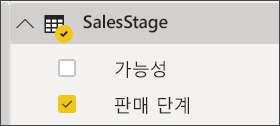
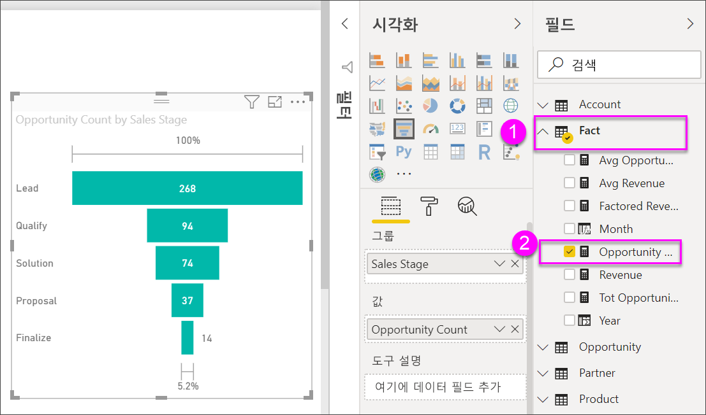

# 깔때기형 차트 만들기 및 사용

[!INCLUDE [power-bi-visuals-desktop-banner](../includes/power-bi-visuals-desktop-banner.md)]

깔때기형 차트는 순차적으로 연결된 단계가 있는 선형 프로세스를 시각화하는 데 도움이 됩니다. 예를 들어 다음 단계를 통해 고객을 추적하는 영업 깔때기가 있습니다. 잠재 고객 \> 적격 잠재 고객 \> 예측 \> 계약 \> 닫기.  깔때기의 모양은 추적 중인 프로세스의 상태를 한눈에 보여줍니다.

각 깔때기 단계는 합계의 백분율을 나타냅니다. 따라서 대부분의 경우 깔때기형 차트는 깔때기 모양으로, 첫 단계가 가장 크고 뒤로 갈수록 점점 작아집니다.  서양배 모양의 깔때기도 유용합니다. 프로세스의 문제를 식별할 수 있기 때문입니다.  하지만 일반적으로 첫 번째 단계인 "유입" 단계가 가장 큽니다.

## 깔때기형 차트를 사용하는 경우
다음과 같은 경우 깔때기형 차트를 사용하는 것이 좋습니다.

* 데이터가 순차적이고 4단계 이상을 통과하는 경우
* 첫 번째 단계의 "항목" 수가 최종 단계의 숫자보다 클 것으로 예상되는 경우
* 단계별 잠재적 수익/판매액/거래 등을 계산하려는 경우
* 변환 및 보존 비율을 계산하고 추적하려는 경우
* 선형 프로세스의 병목 상태를 표시하려는 경우
* 장바구니 워크플로를 추적하려는 경우
* 클릭 광고/마케팅 캠페인의 진행률 및 성공 여부를 추적하려는 경우

## 깔때기형 차트 작업
깔대기형 차트:

* 정렬할 수 있습니다.
* 여러 개의 차트를 지원합니다.
* 동일한 보고서 페이지에서 강조 표시하고 다른 시각화로 교차 필터링할 수 있습니다.
* 동일한 보고서 페이지에서 강조 표시하고 다른 시각화로 교차 필터링하는 데 사용할 수 있습니다.
   > [!NOTE]
   > 이 비디오에서 Will이 판매 및 마케팅 샘플을 사용하여 깔때기형 차트를 만드는 과정을 살펴보세요. 그런 다음 동영상 아래에 있는 단계에 따라 기회 분석 PBIX 샘플 파일로 직접 시도해 보세요.
   > 
   > 
## 필수 조건

이 자습서는 [기회 분석 샘플 PBIX 파일](https://download.microsoft.com/download/9/1/5/915ABCFA-7125-4D85-A7BD-05645BD95BD8/Opportunity%20Analysis%20Sample%20PBIX.pbix
)을 사용합니다.

1. 메뉴 모음의 왼쪽 위 섹션에서 **파일** > **열기**를 선택합니다.
   
2. **기회 분석 샘플 PBIX 파일**을 찾습니다.

1. **기회 분석 샘플 PBIX 파일**을 보고서 보기 으로 엽니다.

1. 선택  탭을 선택합니다.

## 기본 깔때기형 차트 만들기
이 비디오에서 Will이 판매 및 마케팅 샘플을 사용하여 깔때기형 차트를 만드는 과정을 살펴보세요.

<iframe width="560" height="315" src="https://www.youtube.com/embed/qKRZPBnaUXM" frameborder="0" allow="autoplay; encrypted-media" allowfullscreen></iframe>

이제 영업 단계 각각에 있는 기회의 수를 보여 주는 고유한 깔때기형 차트를 만듭니다.

1. 빈 보고서 페이지에서 시작하고 **SalesStage** \> **Sales Stage** 필드를 선택합니다.
   
    

1. 깔때기 아이콘  을 선택하여 세로 막대형 차트를 깔때기형 차트로 변환합니다.

2. **필드** 창에서 **Fact** \> **Opportunity Count**를 선택합니다.
   
    
4. 막대를 마우스로 가리키면 다양한 정보가 표시됩니다.
   
   * 단계의 이름
   * 현재 이 단계에 있는 기회의 수
   * 전반적인 변환율(잠재 고객의 %) 
   * 이전 단계(이 경우에는 제안 단계/해결 단계)의 %인 단계-단계(즉, 중단율)
     
     

6. [보고서를 저장합니다](../service-report-save.md).

## 강조 표시 및 교차 필터링
필터 창 사용 방법에 대한 자세한 내용은 [보고서에 필터 추가](../power-bi-report-add-filter.md)를 참조하세요.

깔때기에서 막대를 강조 표시하면 보고서 페이지의 다른 시각화 요소를 교차 필터링하며 그 반대의 경우도 마찬가지입니다. 계속 수행하려면 깔때기형 차트를 포함하는 보고서 페이지에 몇 가지 시각적 개체를 추가합니다.

1. 깔때기에서 **Proposal** 막대를 선택합니다. 이는 페이지의 다른 시각화 요소를 상호 간에 강조 표시합니다. Ctrl 키를 사용하면 여러 개를 선택할 수 있습니다.
   
   
2. 시각적 개체를 상호 간에 강조 표시하고 필터링하는 방법에 대한 기본 설정을 설정하려면 [Power BI에서 시각적 상호 작용](../service-reports-visual-interactions.md)을 참조하세요.

## 다음 단계

[Power BI의 계기](power-bi-visualization-radial-gauge-charts.md)

[Power BI의 시각화 유형](power-bi-visualization-types-for-reports-and-q-and-a.md)
