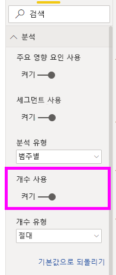
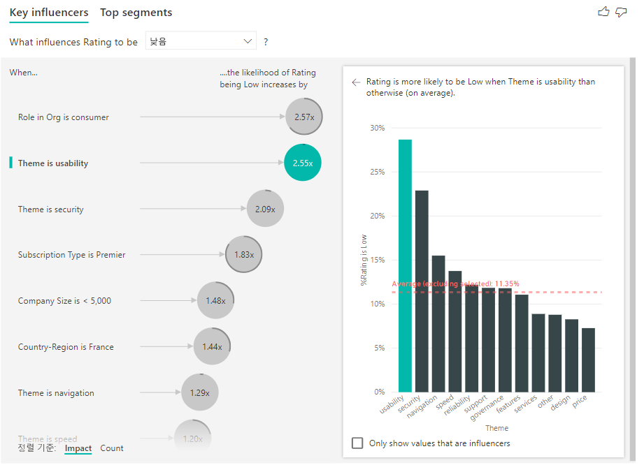
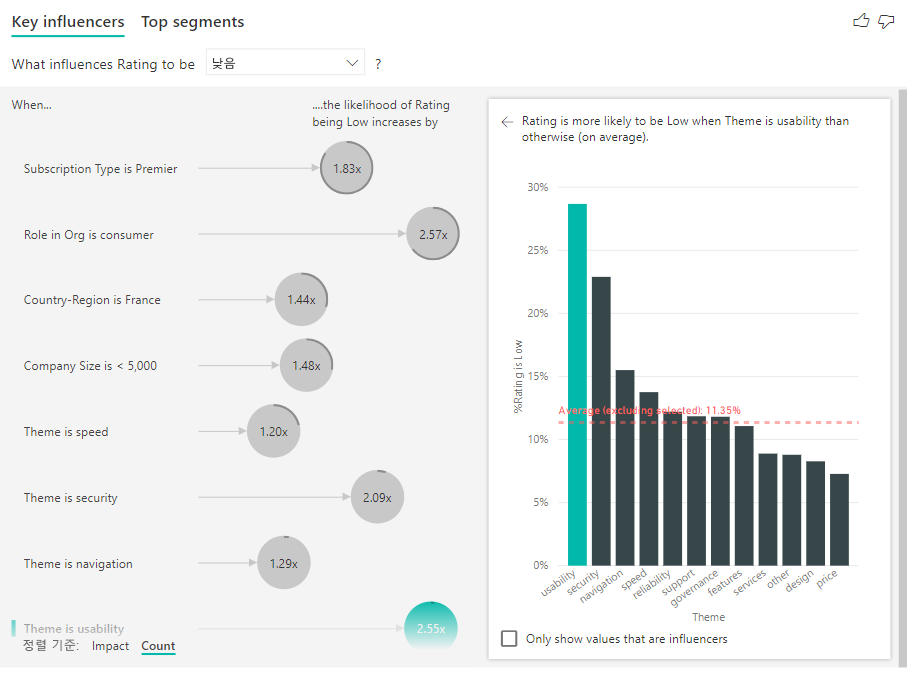
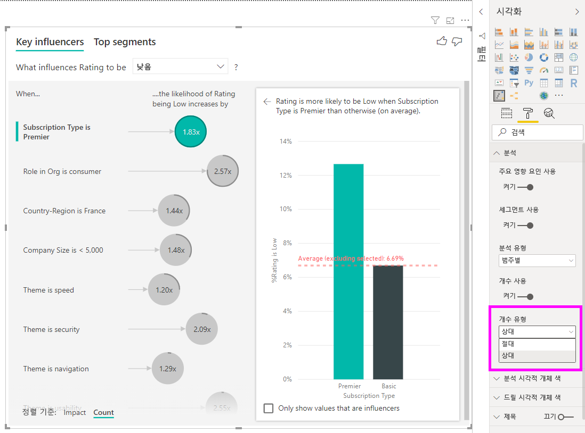
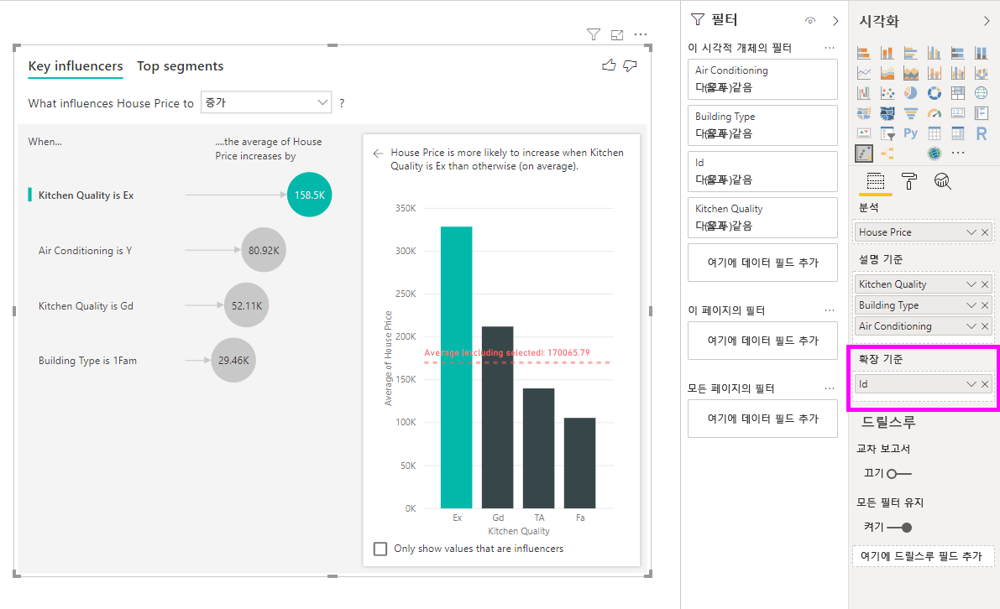

# 주요 영향 요인 시각화

[!INCLUDE [power-bi-visuals-desktop-banner](../includes/power-bi-visuals-desktop-banner.md)]

주요 영향 요인 시각적 개체는 관심 있는 메트릭을 유도하는 요소를 이해하는 데 도움이 됩니다. 데이터를 분석하고 중요한 요소의 순위를 정하며 이를 주요 요인으로 표시합니다. 예를 들어 이직률이라고도 하는 직원 전직률에 영향을 주는 요소를 파악하려고 한다고 가정해 보세요. 한 가지 요소는 고용 계약 기간일 수도 있고, 또 다른 요소는 직원의 연령일 수도 있습니다. 
 
## 주요 영향 요인을 사용하는 경우 
주요 영향 요인 시각적 개체는 다음과 같은 경우에 선택하는 것이 좋습니다. 
- 분석하는 메트릭에 영향을 주는 요소를 확인합니다.
- 이러한 요소의 상대적 중요도를 비교합니다. 예를 들어 단기 계약은 장기 계약보다 변동에 더 큰 영향을 주나요? 

## 주요 영향 요인 시각적 개체의 기능

1. **탭**: 보기 간에 전환할 탭을 선택합니다. **주요 영향 요인**은 선택한 메트릭 값에 대한 상위 기여자를 보여 줍니다. **상위 세그먼트**는 선택한 메트릭 값에 기여하는 상위 세그먼트를 보여 줍니다. *세그먼트*는 값의 조합으로 구성되어 있습니다. 예를 들어 한 세그먼트는 적어도 20년 동안 고객이었고 서부 지역에 거주하는 소비자일 수 있습니다. 

2. **드롭다운 상자**: 조사 중인 메트릭의 값입니다. 이 예에서는 메트릭 **등급**을 조사합니다. 선택한 값은 **낮음**입니다.

3. **재확인**: 왼쪽 창의 시각적 개체를 해석하는 데 도움이 됩니다.

4. **왼쪽 창**: 왼쪽 창에는 하나의 시각적 개체가 있습니다. 이 경우 왼쪽 창에는 상위 주요 영향 요인의 목록이 표시됩니다.

5. **재확인**: 오른쪽 창의 시각적 개체를 해석하는 데 도움이 됩니다.

6. **오른쪽 창**: 오른쪽 창에는 하나의 시각적 개체가 있습니다. 이 경우 세로 막대형 차트는 왼쪽 창에서 선택한 **테마** 주요 영향 요인의 모든 값을 표시합니다. 왼쪽 창에 있는 **유효성**의 특정 값이 녹색으로 표시됩니다. **테마**의 다른 모든 값은 검은색으로 표시됩니다.

7. **평균 선**: 선택된 영향 요인인 **유효성**을 제외한 **테마**의 모든 가능한 값에 대한 평균이 계산됩니다. 따라서 계산은 검정색의 모든 값에 적용됩니다. 다른 **테마** 중에서 낮음 등급이 부여된 백분율을 알려줍니다. 이 경우에는 11.35%에 낮은 등급이 부여되었습니다(점선으로 표시됨).

8. **확인란**: 오른쪽 창에서 시각적 개체를 필터링하여 해당 필드의 인플루언서인 값만 표시합니다. 이 예제에서는 시각적 개체를 유용성, 보안 및 탐색으로 필터링합니다.

## 범주 메트릭 분석
 
먼저 이 동영상을 시청하여 범주 메트릭으로 주요 영향 요인 시각적 개체를 만드는 방법을 알아본 후에 다음 단계를 수행하여 만들어 보세요. 

   > [!NOTE]
   > 이 비디오에서는 이전 버전의 Power BI Desktop을 사용합니다.
   > 
   > 
<iframe width="560" height="315" src="https://www.youtube.com/embed/fDb5zZ3xmxU" frameborder="0" allow="accelerometer; autoplay; encrypted-media; gyroscope; picture-in-picture" allowfullscreen></iframe>

제품 관리자는 잠재 고객이 클라우드 서비스에 대해 부정적인 리뷰를 남길 수 있는 요소를 파악하려고 합니다. 계속 진행하려면 Power BI Desktop에서 [custom feedback.PBIX 파일](https://github.com/Microsoft/powerbi-desktop-samples/blob/master/2019/customerfeedback.pbix)을 엽니다. [Power BI 서비스 또는 Power BI Desktop에 대한 고객 피드백 Excel 파일](https://github.com/Microsoft/powerbi-desktop-samples/blob/master/2019/customerfeedback.xlsx)을 다운로드할 수도 있습니다. 

> [!NOTE]
> 고객 피드백 데이터 세트는 [Moro et al., 2014] S. Moro, P. Cortez 및 P. Rita, "은행 텔레마케팅의 성공 여부를 예측하는 데이터 기반 방법", *의사 결정 지원 시스템*, Elsevier, 62:22-31, 2014년 6월을 기반으로 합니다. 

1. 보고서를 열고, **주요 영향 요인** 아이콘을 선택합니다. 

    

2. 조사하려는 메트릭을 **분석** 필드로 이동합니다. 서비스의 고객 등급을 낮추는 요소를 확인하려면 **고객 테이블** > **등급**을 차례로 선택합니다.

3. **등급**에 영향을 줄 수 있다고 생각되는 필드를 **설명 기준** 필드로 이동합니다. 필드는 원하는 만큼 이동할 수 있습니다. 이 경우 다음 항목으로 시작합니다.
    - 국가-지역 
    - 조직 내 역할 
    - 구독 유형 
    - 회사 규모 
    - 테마
    
4. **확장 기준** 필드를 비워 둡니다. 이 필드는 측정값이나 요약된 필드를 분석하는 경우에만 사용됩니다. 

5. 부정적인 등급에 초점을 맞추기 위해 **등급에 영향을 주는 요소** 드롭다운 상자에서 **낮음**을 선택합니다.  

    

분석은 분석되는 필드의 테이블 수준에서 실행됩니다. 이 경우 **등급** 메트릭입니다. 이 메트릭은 고객 수준에서 정의됩니다. 각 고객이 높거나 낮은 점수를 부여했습니다. 시각적 개체에서 사용할 모든 설명 요소는 고객 수준에서 정의해야 합니다. 

앞의 예에서 모든 설명 요소에는 메트릭과 일대일 또는 다대일 관계가 있습니다. 이 경우에는 각 고객이 자신의 등급에 단일 테마를 할당했습니다. 마찬가지로 고객은 한 국가 출신이며, 하나의 멤버 자격 유형을 가지고 있으며, 조직에서 하나의 역할을 수행합니다. 설명 요소는 이미 고객의 특성이며 변환이 필요하지 않습니다. 시각적 개체는 이러한 요소를 즉시 사용할 수 있습니다. 

자습서의 뒷부분에서 일대다 관계가 있는 더 복잡한 예를 살펴볼 것입니다. 이러한 경우 분석을 실행하려면 먼저 열을 고객 수준까지 집계해야 합니다. 

설명 요소로 사용되는 측정값과 집계도 **분석** 메트릭의 테이블 수준에서 평가됩니다. 몇 가지 예가 이 문서의 뒷부분에 나와 있습니다. 

## 범주별 주요 영향 요인 해석 
낮음 등급에 대한 주요 영향 요인을 살펴보겠습니다. 

### 낮음 등급의 가능성에 영향을 주는 최상위 단일 요소

이 예제의 고객에게는 소비자, 관리자, 게시자의 세 가지 역할이 있을 수 있습니다. 소비자가 되는 것이 낮음 등급에 기여하는 가장 중요한 요소입니다. 

더 정확히 말하면, 소비자가 서비스에 부정적인 점수를 부여할 가능성이 2.57배 더 높습니다. 주요 영향 요인 차트는 왼쪽의 목록에서 **조직 내 역할이 소비자입니다**를 먼저 나열합니다. **조직 내 역할이 소비자입니다**를 선택하면 Power BI에서 추가 세부 정보를 오른쪽 창에 표시합니다. 낮음 등급의 가능성에 대한 각 역할의 비교 효과가 표시됩니다.
  
- 소비자의 14.93%는 낮은 점수를 부여합니다. 
- 평균적으로 다른 모든 역할의 5.78%는 해당 시점에서 낮은 점수를 부여합니다.
- 소비자는 다른 모든 역할에 비해 낮은 점수를 부여할 가능성이 2.57배 더 높습니다. 녹색 막대를 빨간색 점선으로 나누면 이를 확인할 수 있습니다. 

### 낮음 등급의 가능성에 영향을 주는 두 번째 단일 요소

주요 영향 요인 시각적 개체는 다양한 변수의 요소를 비교하여 순위를 매깁니다. 두 번째 영향 요인은 **조직 내 역할**과 아무런 관련이 없습니다. 목록에서 두 번째 영향 요인(**테마가 유효성입니다**)을 선택합니다. 

두 번째로 중요한 요소는 고객 리뷰의 테마와 관련이 있습니다. 제품의 유용성에 대해 의견을 제시한 고객은 안정성, 디자인 또는 속도와 같은 다른 테마에 대해 의견을 제시한 고객에 비해 낮은 점수를 부여할 가능성이 2.55배 더 높습니다. 

빨간색 점선으로 표시된 시각적 개체 간의 평균이 5.78%에서 11.34%로 변경되었습니다. 평균은 다른 모든 값의 평균을 기반으로 하므로 동적입니다. 첫 번째 영향 요인의 경우 평균에서 고객 역할이 제외되었습니다. 두 번째 영향 요인의 경우 유효성 테마가 제외되었습니다. 
 
영향력 있는 값만 사용하여 필터링하려면 **영향 요인인 값만 표시합니다.** 확인란을 선택합니다. 이 경우 이러한 영향 요인은 낮은 점수를 유도합니다. 12개의 테마가 Power BI에서 낮음 등급을 유도하는 테마로 식별한 4개의 테마로 줄어듭니다. 

## 다른 시각적 개체와 상호 작용 
 
캔버스에서 슬라이서, 필터 또는 다른 시각적 개체를 선택할 때마다 주요 영향 요인 시각화 개체에서 데이터의 새 부분에 대한 분석을 다시 실행합니다. 예를 들어 **회사 규모**를 보고서로 이동하여 슬라이서로 사용할 수 있습니다. 이 슬라이서를 사용하여 엔터프라이즈 고객에 대한 주요 영향 요인이 일반적인 모집단과 다른지 확인합니다. 엔터프라이즈 회사의 규모는 50,000명의 직원보다 큽니다.
 
**50,000명 초과**를 선택하면 분석이 다시 실행되며 영향 요인이 변경된 것을 확인할 수 있습니다. 대기업 고객의 경우 낮음 등급에 대한 상위 영향 요인에는 보안과 관련된 테마가 있습니다. 많은 고객이 불만을 갖고 있는 특정 보안 기능이 있는지 자세히 조사하려고 할 수도 있습니다. 

## 연속적 주요 영향 요인 해석 
 
지금까지 시각적 개체를 사용하여 다양한 범주별 필드가 낮음 등급에 미치는 영향을 살펴보는 방법을 알아보았습니다. **설명 기준** 필드에 연령, 키 및 가격과 같은 연속적인 요소가 있을 수도 있습니다. **가입 기간**을 고객 테이블에서 **설명 기준**으로 이동하면 발생하는 상황에 대해 살펴보겠습니다. 가입 기간은 고객이 서비스를 사용한 기간을 나타냅니다. 
 
가입 기간이 늘어남에 따라 낮음 등급을 받을 가능성도 높아집니다. 이 추세는 더 오래된 장기 고객일수록 부정적인 점수를 부여할 가능성이 높다는 것을 나타냅니다. 이 인사이트는 흥미로우며, 나중에 후속 조치를 취할 수도 있습니다. 
 
시각화에 따르면 가입 기간이 13.44개월 증가할 때마다 낮음 등급의 가능성이 평균적으로 1.23배 더 높아집니다. 이 경우 13.44개월은 재직 기간의 표준 편차를 나타냅니다. 따라서 수신한 인사이트는 가입 기간을 표준 크기(가입 기간의 표준 편차)만큼 늘리는 경우 낮음 등급을 받을 가능성에 미치는 영향을 조사합니다. 
 
오른쪽 창의 산점도에는 각 가입 기간 값에 대한 낮음 등급의 평균 백분율이 표시됩니다. 추세 선을 사용하여 기울기를 강조 표시합니다.

## 범주화된 연속형 주요 영향 요인

경우에 따라 연속형 요소가 자동으로 범주 요소로 바뀐 것을 발견할 수도 있습니다. 변수 간의 관계가 선형이 아님을 알게 되었기 때문입니다. 따라서 위의 예제와 같이 관계가 단순히 증가 또는 감소한다고 설명할 수는 없습니다.

상관 관계 테스트를 실행하여 영향 요인이 대상과 관련해서 얼마나 선형인지를 확인합니다. 대상이 연속형이면 Pearson 상관 관계를 실행하고, 대상이 범주이면 Point Biserial 상관 관계 테스트를 실행합니다. 관계가 충분히 선형이 아님을 발견하면 감독된 범주화를 수행하고 최대 5개의 bin을 생성합니다. 가장 적합한 bin을 파악하기 위해 분석되는 대상과 설명 요소 간의 관계를 확인하는 감독된 범주화 방법을 사용합니다.

## 측정값 및 집계를 주요 영향 요인으로 해석 
 
측정값 및 집계는 분석 내에서 설명 요소로 사용할 수 있습니다. 예를 들어 고객 지원 티켓의 수 또는 열린 티켓의 평균 기간이 받은 점수에 미친 영향을 확인하려고 할 수도 있습니다. 
 
이 경우 고객이 보유한 지원 티켓의 수가 고객이 부여하는 점수에 영향을 미치는지 확인해야 합니다. 이제 지원 티켓 테이블에서 **지원 티켓 ID**를 가져옵니다. 고객에게 여러 개의 지원 티켓이 있을 수 있으므로 고객 수준에서 ID를 집계합니다. 분석이 고객 수준에서 실행되어 모든 동인을 해당 세분화 수준에서 정의해야 하므로 집계가 중요합니다. 
 
이제 ID 수를 살펴보겠습니다. 각 고객 행에는 이와 연결된 지원 티켓 수가 있습니다. 이 경우 지원 티켓 수가 늘어남에 따라 등급이 낮을 가능성이 5.51배 더 높아집니다. 오른쪽의 시각적 개체는 고객 수준에서 평가된 다양한 **등급** 값별 지원 티켓의 평균 수를 보여 줍니다. 

## 결과 해석: 상위 세그먼트 
 
**주요 영향 요인** 탭을 사용하여 각 요소를 개별적으로 평가할 수 있습니다. 또한 **상위 세그먼트** 탭을 사용하여 요소의 조합이 분석하는 메트릭에 미치는 영향을 주는지 확인할 수도 있습니다. 
 
상위 세그먼트는 처음에 Power BI에서 검색된 모든 세그먼트의 개요를 보여 줍니다. 다음 예에서는 6개의 세그먼트가 있음을 보여 줍니다. 이러한 세그먼트는 세그먼트 내에서 낮음 등급의 백분율로 순위가 지정됩니다. 예를 들어 세그먼트 1에서 고객 등급의 74.3%가 낮음입니다. 거품이 클수록 낮은 등급 비율이 높습니다. 거품형의 크기는 세그먼트 내에 포함된 고객의 수를 나타냅니다. 

거품을 선택하면 해당 세그먼트의 세부 정보가 표시됩니다. 예를 들어 세그먼트 1을 선택하면 상대적으로 인정된 고객으로 구성되어 있습니다. 29개월이 넘는 고객이었으며, 5개 이상의 지원 티켓을 갖고 있습니다. 마지막으로 게시자가 아니므로 소비자 또는 관리자입니다. 
 
이 그룹에서는 고객의 74.3%가 낮음 등급을 부여했습니다. 해당 시점에서 고객의 11.7%는 평균적으로 낮음 등급을 부여하므로 이 세그먼트는 낮음 등급의 비율이 상당히 높습니다. 즉 63% 더 높습니다. 또한 세그먼트 1에는 데이터의 약 2.2%가 포함되어 있어 모집단 중에서 주소 지정이 가능한 부분을 나타냅니다. 

## 개수 추가

인플루언서가 큰 영향을 주지만 데이터를 거의 나타내지 않는 경우도 있습니다. 예를 들어 **유용성** **테마**는 낮은 등급에서 두 번째 가장 큰 인플루언서입니다. 그러나 유용성에 대해 불만을 표시한 고객이 적을 수 있습니다. 개수는 중점을 두려는 인플루언서에 우선 순위를 지정하는 데 도움이 됩니다.

서식 창의 **분석 카드**를 통해 개수를 켤 수 있습니다.

개수를 켜면, 인플루언서에 포함된 데이터의 대략적인 백분율을 나타내는 링이 각 인플루언서 거품 주위에 표시됩니다. 링이 둘러싼 거품 부분이 클수록, 포함된 데이터가 많습니다. **유용성** **테마**에 포함된 데이터 비율이 매우 작은 것을 확인할 수 있습니다.

시각적 개체의 왼쪽 아래에 있는 정렬 기준 토글을 사용하여 영향 대신 개수별로 거품을 먼저 정렬할 수도 있습니다. **프리미어** **구독 유형**은 개수를 기반으로 하는 상위 영향 요인입니다.

전체 링이 원을 이루면, 인플루언서가 데이터를 100% 포함하는 것입니다. 서식 창의 **분석 카드**에서 **개수 유형** 드롭다운을 사용하여 개수 유형을 최대 인플루언서의 상대 개수로 변경할 수 있습니다. 이제 데이터 양이 가장 많은 인플루언서가 전체 링으로 표시되고 다른 모든 개수는 상대 개수로 표시됩니다.

## 숫자 메트릭 분석

요약되지 않은 숫자 필드를 **분석** 필드로 이동하는 경우, 해당 시나리오를 처리하는 방법을 선택할 수 있습니다. **서식** 창으로 이동하고 **범주별 분석 유형**과 **연속 분석 유형** 간에 전환하여 시각적 개체의 동작을 변경할 수 있습니다.

**범주별 분석 유형**은 위에서 설명한 대로 작동합니다. 예를 들어 1부터 10까지의 설문 점수를 보고 있으면 '설문 점수가 1이 되도록 영향을 주는 요소는 무엇입니까?'라고 질문할 수 있습니다.

**연속 분석 유형**은 질문을 연속적으로 변경합니다. 위의 예에서 새 질문은 '설문 점수의 증감에 영향을 주는 요소는 무엇입니까?'입니다.

이러한 구분은 분석하는 필드에 고유 값이 많이 있는 경우에 매우 유용합니다. 아래 예에서는 주택 가격을 조사하고 있습니다. '주택 가격이 156,214가 되도록 영향을 주는 요소는 무엇입니까?'라고 질문하는 것은 별로 의미가 없습니다. 이 질문은 매우 구체적이며 패턴을 유추하는 데 충분한 데이터가 없을 가능성이 높습니다.

대신 '주택 가격 상승에 영향을 주는 요소는 무엇입니까?'라고 질문하는 좋습니다. 이렇게 하면 주택 가격을 명확한 값이 아닌 하나의 범위로 처리할 수 있습니다.

## 결과 해석: 주요 영향 요인 

이 시나리오에서는 '주택 가격 상승에 영향을 주는 요소'를 살펴봅니다. **Year Built**(주택 건립 연도), **KitchenQual**(주방 품질) 및 **YearRemodAdd**(주택 리모델링 연도)와 같은 주택 가격에 영향을 줄 수 있는 다양한 설명 요소를 살펴보고 있습니다. 

아래 예에서는 우수 주방 품질에 대한 상위 영향 요인을 조사하고 있습니다. 몇 가지 중요한 차이점이 있는 범주별 메트릭을 분석할 때 살펴본 결과와 매우 비슷합니다.

- 오른쪽의 세로 막대형 차트는 백분율이 아닌 평균을 조사하고 있습니다. 따라서 우수한 주방을 갖추지 않은 주택의 평균 주택 가격(점선)과 우수한 주방을 갖춘 주택의 평균 주택 가격(녹색 막대)을 비교한 결과를 보여 줍니다.
- 거품형의 숫자는 빨간색 점선과 녹색 막대의 차이점이기도 하지만 가능성(1.93배)이 아닌 숫자(158,490달러)로 표시됩니다. 따라서 우수한 주방을 갖춘 주택은 평균적으로 우수한 주방을 갖추지 않은 주택보다 거의 160,000달러 이상 더 비쌉니다.

아래 예에서는 연속 요소(주택 리모델링 연도)가 주택 가격에 미치는 영향을 조사하고 있습니다. 범주별 메트릭에 대한 연속 영향 요인을 분석하는 방법과 비교한 차이점은 다음과 같습니다.

-   오른쪽 창의 산점도에는 리모델링 연도의 각 고유 값에 대한 평균 주택 가격이 표시됩니다. 
-   거품형의 값은 주택 리모델링 연도가 해당 표준 편차(이 경우 20년)만큼 증가하면 상승되는 평균 주택 가격(이 경우 2,870달러)을 보여 줍니다.

마지막으로, 측정값의 경우 주택이 건립된 평균 연도를 조사하고 있습니다. 여기서 분석은 다음과 같습니다.

-   오른쪽 창의 산점도에는 테이블의 각 고유 값에 대한 평균 주택 가격이 표시됩니다.
-   거품형의 값은 평균 연도가 해당 표준 편차(이 경우 30년)만큼 증가하면 상승되는 평균 주택 가격(이 경우 1,350달러)을 보여 줍니다.

## 결과 해석: 상위 세그먼트

숫자 표적의 상위 세그먼트는 평균적으로 주택 가격이 전체 데이터 세트보다 높은 그룹을 보여 줍니다. 예를 들어 아래에서 **세그먼트 1**은 **GarageCars**(차고에서 수용할 수 있는 자동차 수)가 2보다 크고 **RoofStyle**이 Hip(추녀마루)인 주택으로 구성되어 있음을 확인할 수 있습니다. 이러한 특성이 있는 주택의 평균 가격은 데이터 전체의 평균인 180,000달러와 비교하여 355,000달러입니다.

## 측정값 또는 요약된 열 메트릭 분석

측정값 또는 요약된 열의 경우, 분석은 기본적으로 [위](https://docs.microsoft.com/en-us/power-bi/visuals/power-bi-visualization-influencers#analyze-a-metric-that-is-numeric)에서 설명한 **연속 분석 유형**으로 설정됩니다. 이 설정은 변경할 수 없습니다. 측정값/요약 열과 요약되지 않은 숫자 열 분석의 가장 큰 차이점은 분석이 실행되는 수준입니다.

요약되지 않은 열의 경우, 분석은 항상 테이블 수준에서 실행됩니다. 위의 주택 가격 예제에서는 **주택 가격** 메트릭을 분석하여 주택 가격의 상승/하락에 영향을 주는 요인을 확인했습니다. 분석은 자동으로 테이블 수준에서 실행됩니다. 테이블에 각 주택의 고유 ID가 있으므로, 분석은 주택 수준에서 실행됩니다.

측정값과 요약된 열의 경우 분석할 수준을 즉시 알 수 없습니다. **주택 가격**이 **평균**으로 요약된 경우 이 평균 주택 가격을 계산하려는 수준을 고려해야 합니다. 동네 수준의 평균 주택 가격인가요? 또는 지역 수준인가요?

측정값 및 요약된 열은 사용된 **설명 기준** 필드 수준에서 자동으로 분석됩니다. **설명 기준**에 관련 필드 3개(**Kitchen Quality**, **Building Type**, **Air Conditioning**)가 있다고 가정해 보겠습니다. **평균 주택 가격**은 이러한 세 필드의 고유한 조합에 대해 계산됩니다. 테이블 뷰로 전환하여 평가할 데이터의 모양을 살펴보면 도움이 되는 경우가 많습니다.

이 분석은 매우 요약되어 있으므로, 회귀 모델이 학습할 수 있는 데이터 패턴을 찾기 어렵습니다. 더 나은 결과를 얻으려면 자세한 수준에서 분석을 실행해야 합니다. 주택 수준에서 주택 가격을 분석하려면 **ID** 필드를 분석에 명시적으로 추가해야 합니다. 하지만 주택 ID를 영향 요인으로 간주하지는 않으려고 합니다. 주택 ID가 증가함에 따라 주택 가격이 상승함을 아는 것은 유용하지 않습니다. 이 경우에는 **확장 기준** 필드 웰 옵션이 유용합니다. **확장 기준**을 사용하여 새 인플루언서를 찾지 않고 분석 수준을 설정하는 데 사용할 필드를 추가할 수 있습니다.

**확장 기준**에 **ID**를 추가하면 시각화가 어떻게 표시되는지 살펴보겠습니다. 측정값을 평가할 수준을 정의한 후의 영향 요인 해석은 [요약되지 않은 숫자 열](https://docs.microsoft.com/en-us/power-bi/visuals/power-bi-visualization-influencers#analyze-a-metric-that-is-numeric)의 경우와 동일합니다.

주요 인플루언서 시각화를 사용하여 측정값을 분석하는 방법을 자세히 알아보려면 다음 자습서를 시청하세요.

<iframe width="1167" height="631" src="https://www.youtube.com/embed/2X1cW8oPtc8" frameborder="0" allow="accelerometer; autoplay; encrypted-media; gyroscope; picture-in-picture" allowfullscreen></iframe>

## 고려 사항 및 문제 해결 
 
**시각적 개체의 제한 사항** 
 
주요 영향 요인 시각적 개체에는 다음과 같은 몇 가지 제한 사항이 있습니다.

- 직접 쿼리가 지원되지 않습니다.
- Azure Analysis Services와 SQL Server Analysis Services에 대한 라이브 연결이 지원되지 않습니다.
- 웹에 게시 기능이 지원되지 않습니다.
- .NET Framework 4.6 이상이 필요합니다.

**영향 요인 또는 세그먼트를 찾을 수 없다는 오류가 표시됩니다. 왜 그런가요?** 

이 오류는 **설명 기준**에 필드를 포함했지만 영향 요인을 찾지 못한 경우에 발생합니다. 
- 분석하는 메트릭을 **분석** 및 **설명 기준**에 모두 포함했습니다. **설명 기준**에서 해당 메트릭을 제거합니다. 
- 설명 필드에는 관찰이 거의 없는 너무 많은 범주가 있습니다. 이 상황으로 인해 시각화에서 영향을 주는 요소를 확인하기가 어렵습니다. 몇 가지 관측값만으로는 일반화하기가 어렵습니다. 숫자 필드를 분석하는 경우 **서식** 창의 **분석** 카드 아래에서 **범주별 분석**에서 **연속 분석**으로 전환할 수 있습니다.
- 설명 요소에는 일반화하는 데 충분한 관측값이 있지만, 시각화에서는 보고할 의미 있는 상관 관계를 찾지 못했습니다.
 
**분석하는 메트릭에 분석을 실행하는 데 충분한 데이터가 없다는 오류가 표시됩니다. 왜 그런가요?** 

시각화는 한 그룹에 대한 데이터의 패턴을 다른 그룹과 비교하여 조사하는 방식으로 작동합니다. 예를 들어 높음 등급을 부여한 고객과 비교하여 낮음 등급을 부여한 고객을 찾습니다. 모델의 데이터에 관측값이 거의 없는 경우 패턴을 찾기가 어렵습니다. 의미 있는 영향 요인을 찾는 데 충분한 데이터가 시각화에 없는 경우 분석을 실행하려면 더 많은 데이터가 필요함을 나타냅니다. 

선택한 상태에 대해 100개 이상의 관측값이 있는 것이 좋습니다. 이 경우 상태는 이탈하는 고객입니다. 또한 비교에 사용하는 상태에 대해 10개 이상의 관측값이 필요합니다. 이 경우 비교 상태는 이탈하지 않는 고객입니다.

숫자 필드를 분석하는 경우 **서식** 창의 **분석** 카드 아래에서 **범주별 분석**에서 **연속 분석**으로 전환할 수 있습니다.

**‘분석’이 요약되지 않은 경우 분석은 항상 부모 테이블의 행 수준에서 실행된다는 오류가 표시됩니다. ‘확장 기준’ 필드를 통해 이 수준을 변경할 수 없습니다. 왜 그런가요?**

숫자 또는 범주 열을 분석하는 경우 분석은 항상 테이블 수준에서 실행됩니다. 예를 들어 주택 가격을 분석하는 경우, 테이블에 ID 열이 있으면 분석은 자동으로 주택 ID 수준에서 실행됩니다. 

측정값이나 요약된 열을 분석하는 경우에는 분석을 실행할 수준을 명시적으로 지정해야 합니다. **확장 기준**을 사용하면 새 영향 요인을 추가하지 않고 측정값과 요약된 열의 분석 수준을 변경할 수 있습니다. **주택 가격**이 측정값으로 정의된 경우에는 **확장 기준**에 주택 ID 열을 추가하여 분석 수준을 변경할 수 있습니다.

*설명 기준* 의 필드가 분석하는 메트릭이 포함된 테이블과 고유한 관련이 없다는 오류가 표시됩니다.  **왜 그런가요?**
 
분석은 분석되는 필드의 테이블 수준에서 실행됩니다. 예를 들어 서비스에 대한 고객 피드백을 분석하는 경우 고객이 높음 등급 또는 낮음 등급을 부여했는지 여부를 알려주는 테이블이 있을 수 있습니다. 이 경우 분석은 고객 테이블 수준에서 실행됩니다. 

메트릭이 포함된 테이블보다 더 세부적인 수준에서 정의된 관련 테이블이 있는 경우에 이 오류가 발생합니다. 예는 다음과 같습니다. 
 
- 고객이 서비스에 대해 낮음 등급을 부여하도록 유도하는 요소를 분석합니다.
- 고객이 서비스를 사용하는 디바이스에서 고객이 제공하는 리뷰에 영향을 주는지 확인하려고 합니다.
- 고객이 다양한 방법으로 서비스를 사용할 수 있습니다.
- 다음 예에서 10,000,000명의 고객이 브라우저와 태블릿을 모두 사용하여 서비스와 상호 작용합니다.

디바이스 열을 설명 요소로 사용하려는 경우 다음 오류가 표시됩니다. 

이 오류는 디바이스가 고객 수준에서 정의되어 있지 않기 때문에 나타납니다. 한 고객은 여러 디바이스에서 서비스를 사용할 수 있습니다. 시각화를 통해 패턴을 찾으려면 디바이스가 고객의 특성이어야 합니다. 비즈니스에 대한 이해도에 따라 다음과 같은 몇 가지 해결 방법이 있습니다. 
 
- 개수할 디바이스의 요약을 변경할 수 있습니다. 예를 들어 디바이스 수가 고객이 부여한 점수에 영향을 줄 수 있으면 개수를 사용합니다. 
- 디바이스 열을 피벗하여 특정 디바이스에서 서비스를 사용하는 것이 고객의 등급에 영향을 주는지 확인할 수 있습니다.
 
이 예제에서는 데이터를 피벗하여 브라우저, 모바일 및 태블릿의 새 열을 만들었습니다(데이터를 피벗한 후 모델링 뷰에서 관계를 삭제하고 다시 만들어야 함). 이제 **설명 기준**에서 이러한 특정 디바이스를 사용할 수 있습니다. 모든 디바이스가 영향 요인임이 밝혀졌으며, 브라우저는 고객 점수에 가장 큰 영향을 줍니다.

더 정확히 말하면, 브라우저를 통해 서비스를 사용하는 고객은 그렇지 않은 고객보다 낮은 점수를 부여할 가능성이 3.79배 더 높습니다. 목록의 아래쪽으로 이동하면 모바일에 대한 역이 참입니다. 모바일 앱을 사용하는 고객은 그렇지 않은 고객보다 낮은 점수를 부여할 가능성이 높습니다. 

**내 분석에 측정값이 포함되어 있지 않다는 경고가 표시됩니다. 왜 그런가요?** 

분석은 분석되는 필드의 테이블 수준에서 실행됩니다. 고객 이탈을 분석하는 경우 고객이 이탈했는지 여부를 알려주는 테이블이 있을 수 있습니다. 이 경우 분석은 고객 테이블 수준에서 실행됩니다.
 
측정값 및 집계는 기본적으로 테이블 수준에서 분석됩니다. 월 평균 지출에 대한 측정값이 있으면 고객 테이블 수준에서 분석됩니다. 

고객 테이블에 고유 식별자가 없으면 측정값을 계산할 수 없으며 분석에서 무시됩니다. 이 상황을 방지하려면 메트릭이 있는 테이블에 고유 식별자가 있어야 합니다. 이 경우 고객 테이블이며, 고유 식별자는 고객 ID입니다. 또한 파워 쿼리를 사용하여 인덱스 열을 추가하는 것도 쉽습니다.
 
**분석하는 메트릭에 10개가 넘는 고유 값이 있고 이 메트릭이 분석 품질에 영향을 줄 수 있다는 경고가 표시됩니다. 왜 그런가요?** 

AI 시각화는 범주별 필드와 숫자 필드를 분석할 수 있습니다. 예를 들어 범주별 필드의 경우 이탈은 "예" 또는 "아니요"일 수 있으며, 고객 만족도는 높음, 중간 또는 낮음입니다. 분석할 범주 수를 늘리면 범주별 관측값이 더 적습니다. 이 경우 시각화에서 데이터의 패턴을 찾기가 더 어려워집니다. 

숫자 필드를 분석할 때 숫자 필드를 텍스트처럼 처리하도록 선택할 수 있습니다. 이 경우 범주별 데이터에 대해 실행하는 것(**범주별 분석**)과 동일한 분석을 실행합니다. 고유 값이 많은 경우 분석을 **연속 분석**으로 전환하는 것이 좋습니다. 이는 숫자를 고유 값으로 처리하는 대신 늘리거나 줄일 때 패턴을 유추할 수 있기 때문입니다. **서식 지정 창**의 **분석** 카드 아래에서 **범주별 분석**에서 **연속 분석**으로 전환할 수 있습니다.

강력한 영향 요인을 찾으려면 비슷한 값을 단일 단위로 그룹화하는 것이 좋습니다. 예를 들어 가격에 대한 메트릭이 있는 경우 개별 가격 포인트를 사용하는 것보다 비슷한 가격을 높음, 중간 및 낮음 범주로 그룹화하여 더 나은 결과를 얻을 수 있습니다. 

**데이터에는 주요 영향 요인인 것처럼 보이는 요소가 있어야 하지만 그렇지 않습니다. 어떻게 그런 일이 발생하나요?**

다음 예에서는 소비자인 고객이 낮음 등급을 유도하고, 등급의 14.93%가 낮음 등급입니다. 관리자 역할도 낮음 등급의 비율(13.42%)이 높지만 영향 요인으로 간주되지 않습니다. 

이 결정의 이유는 시각화에서 영향 요인을 찾을 때 데이터 요소의 수도 고려하기 때문입니다. 다음 예에서 소비자는 29,000명이 넘고, 관리자는 10배 더 적은 약 2,900명입니다. 이들 중 390명만이 낮음 등급을 부여했습니다. 시각적 개체에는 관리자 등급의 패턴을 찾았는지, 아니면 찾는 기회일 뿐인지를 확인하는 데 충분한 데이터가 없습니다. 

**범주별 분석에 대한 주요 영향 요인은 어떻게 계산할까요?**

AI 시각화는 내부적으로 [ML.NET](https://dotnet.microsoft.com/apps/machinelearning-ai/ml-dotnet)을 사용하여 주요 영향 요인을 계산하는 로지스틱 회귀 분석을 실행합니다. 로지스틱 회귀 분석은 서로 다른 그룹을 비교하는 통계 모델입니다. 

낮음 등급을 유도하는 요소를 확인하려면 로지스틱 회귀 분석에서 낮은 점수를 부여한 고객과 높은 점수를 부여한 고객의 차이점을 조사합니다. 높음, 중간 및 낮음 점수와 같은 여러 범주가 있는 경우 낮음 등급을 부여한 고객과 낮음 등급을 부여하지 않은 고객의 차이점을 살펴봅니다. 이 경우 낮은 점수를 부여한 고객은 높음 등급 또는 중간 등급을 부여한 고객과 어떻게 다를까요? 
 
로지스틱 회귀 분석은 데이터의 패턴을 검색하여 낮음 등급을 부여한 고객과 높음 등급을 부여한 고객의 차이점을 찾습니다. 예를 들어 지원 티켓이 많은 고객은 지원 티켓이 없거나 거의 없는 고객보다 낮음 등급의 백분율이 더 높습니다.
 
또한 로지스틱 회귀 분석은 존재하는 데이터 요소의 수도 고려합니다. 예를 들어 관리자 역할을 수행하는 고객이 부정적인 점수를 비례적으로 더 많이 부여하지만, 적은 수의 관리자만 있는 경우 이 요소는 영향 요인으로 간주되지 않습니다. 패턴을 유추하는 데 사용할 수 있는 데이터 요소가 충분하지 않으므로 이 결정을 내릴 수 있습니다. Wald 테스트라고 하는 통계 테스트는 요소가 영향 요인으로 간주되는지 여부를 결정하는 데 사용됩니다. 시각적 개체는 0.05의 p-값을 사용하여 임계값을 결정합니다. 

**숫자 분석에 대한 주요 영향 요인은 어떻게 계산할까요?**

AI 시각화는 내부적으로 [ML.NET](https://dotnet.microsoft.com/apps/machinelearning-ai/ml-dotnet)을 사용하여 주요 영향 요인을 계산하는 선형 회귀 분석을 실행합니다. 선형 회귀 분석은 분석하는 필드의 결과가 설명 요소에 따라 변경되는 상태를 조사하는 통계 모델입니다.

예를 들어 주택 가격을 분석하는 경우 선형 회귀 분석은 우수한 주방이 주택 가격에 미치는 영향을 조사합니다. 우수한 주방을 갖춘 주택은 일반적으로 우수한 주방을 갖추지 않은 주택에 비해 주택 가격이 더 낮을까요, 아니면 더 높을까요?

또한 선형 회귀 분석은 데이터 요소의 수도 고려합니다. 예를 들어 테니스 코트가 있는 주택이 더 비싸지만, 테니스 코트가 있는 주택이 거의 없는 경우 이 요소는 인플루언서로 간주되지 않습니다. 패턴을 유추하는 데 사용할 수 있는 데이터 요소가 충분하지 않으므로 이 결정을 내릴 수 있습니다. Wald 테스트라고 하는 통계 테스트는 요소가 영향 요인으로 간주되는지 여부를 결정하는 데 사용됩니다. 시각적 개체는 0.05의 p-값을 사용하여 임계값을 결정합니다. 

**세그먼트는 어떻게 계산하나요?**

AI 시각화는 내부적으로 [ML.NET](https://dotnet.microsoft.com/apps/machinelearning-ai/ml-dotnet)을 사용하여 흥미로운 하위 그룹을 찾기 위해 의사 결정 트리를 실행합니다. 의사 결정 트리의 목표는 관심 있는 메트릭에서 상대적으로 높은 데이터 요소의 하위 그룹으로 끝나는 것입니다. 이는 낮음 등급의 고객이거나 높음 가격의 주택일 수 있습니다.

의사 결정 트리는 각각의 설명 요소를 사용하여 최상의 *분할*을 제공하는 요소를 유추하려고 시도합니다. 예를 들어 대기업 고객만 포함하도록 데이터를 필터링하면 높음 등급과 낮음 등급을 부여한 고객을 분리할 수 있을까요? 또는 보안에 대해 의견을 제시한 고객만 포함하도록 필터링하는 것이 더 나을까요? 

의사 결정 트리에서 분할이 수행되면 데이터의 하위 그룹을 사용하여 해당 데이터에 대한 최상의 다음 분할을 결정합니다. 이 경우 하위 그룹은 보안에 대한 의견을 제시한 고객입니다. 각 분할 후에도 이 그룹이 패턴을 유추하는 데 충분히 대표할 수 있을 만큼 충분한 데이터 요소를 가지고 있는지, 아니면 실제 세그먼트가 아닌 데이터의 변칙인지 여부를 고려합니다. p 값이 0.05인 분할 조건의 통계적 유의성을 확인하기 위해 다른 통계 테스트가 적용됩니다. 

의사 결정 트리의 실행이 완료되면 모든 분할(예: 보안 설명, 대기업)을 사용하여 Power BI 필터를 만듭니다. 이 필터의 조합은 시각적 개체에서 하나의 세그먼트로 패키지됩니다. 
 
**더 많은 필드를 *설명 기준*으로 이동하면 특정 요소가 영향 요인이 되거나 영향 요인이 되는 것을 중지하는 이유는 무엇인가요?**

시각화는 모든 설명 요소를 함께 평가합니다. 요소는 자체적으로 영향 요인일 수 있지만, 다른 요소와 함께 고려하는 경우 그렇지 않을 수도 있습니다. 침실과 주택 크기를 설명 요소로 사용하여 높은 주택 가격으로 유도하는 요소를 분석한다고 가정해 보세요.

- 자체적으로 침실이 많으면 주택 가격을 높이는 동인이 될 수 있습니다.
- 주택 크기를 분석에 포함시키면 이제 주택 크기를 일정하게 유지하면서 침실에 발생하는 상황을 조사할 수 있습니다.
- 주택 크기가 1,500 평방 피트로 고정되는 경우 침실 수의 연속 증가에 따라 주택 가격이 크게 증가할 가능성은 없습니다. 
- 침실은 주택 크기를 고려하기 전만큼 중요하지 않을 수 있습니다. 

## 다음 단계
- [Power BI의 콤보 차트](power-bi-visualization-combo-chart.md)
- [Power BI의 시각화 유형](power-bi-visualization-types-for-reports-and-q-and-a.md)
